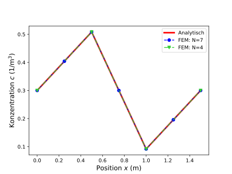

<h2 class='chapterHead'>Übungsblatt 2 Grundlagen der Methode der finiten Elemente</h2>

<!-- l. 14 -->
Anmerkung: Die Abgabe von Arbeitsblatt 1 bis 4 ist verpflichtend und
konstituiert die Studienleistung der Veranstaltung Simulationstechniken.
Die Arbeitsblätter führen von der mathematischen Formulierung eines
Modellproblems hin zur numerischen Lösung dieses Problems und bauen
aufeinander auf. Zum Bestehen der Veranstaltung müssen auf jedem Blatt
mindestens 50% der erzielbaren Punkte erreicht werden.

<!-- l. 22 -->
 Geben Sie bei allen Aufgaben die Lösungswege und Zwischenergebnisse mit
an. Das Endergebnis alleine ist nicht ausreichend! Wir empfehlen Ihnen die
Nutzung von Python und Jupyter-Notebooks. Sollten Sie ein Jupyter-Notebook
verwenden, dann können Sie dieses einfach direkt als Lösung bei uns einreichen.
In allen anderen Fällen erzeugen Sie bitte ein PDF und legen die numerischen
Codes als separate Datei dazu.

<!-- l. 29 -->
 Sie werden durch die einzelnen Schritte der Modellimplementierung geleitet,
und wir geben Hinweise zur Implementierung. Es ist nicht zwingend notwendig,
diese 1-zu-1 zu verfolgen. Im Rahmen dieser Hinweise finden Sie Codeabschnitte,
die Sie verwenden können. Sie dürfen natürlich auch die Codebeispiele aus
dem Vorlesungsmaterial hier verwenden. 

<!-- l. 37 -->
Anmerkung: Hinweise zu den numerischen Aufgaben: 

<ul class='itemize1'>
<li class='itemize'>Codes sollten immer möglichst übersichtlich und leicht lesbar sein.
Beachten Sie insbesondere:
<ul class='itemize2'>
<li class='itemize'>Verwenden Sie Namen anstelle von Symbolen um Ihre Variablen
zu benennen, also z.Bsp. concentration oder Konzentration
anstelle von c
</li>
<li class='itemize'>Nutzen Sie Suffixe, um die Dimensionen von Matrizen
und Vektoren zu beschreiben. concentration_x bedeutet
beispielsweise, dass die Einträge im Vektor concentration von
der Raumrichtung x abhängen.
</li>
<li class='itemize'>Kommentieren Sie Ihren Code ausreichend!</li></ul>
</li>
<li class='itemize'>Verwenden Sie die numpy-interne Funktion <a href='https://numpy.org/doc/stable/reference/generated/numpy.linalg.solve.html'>numpy.linalg.solve</a> zum
Lösen von linearen Gleichungssystemen. Ein eigener Algorithmus zum

Lösen von Gleichungssystemen ist NICHT Teil dieses Übungsblatts.
</li>
<li class='itemize'>Folgende numpy-Funktionen können (aber müssen nicht) hilfreich sein:
<a href='https://numpy.org/doc/stable/reference/generated/numpy.full.html'>full</a>, <a href='https://numpy.org/doc/stable/reference/generated/numpy.linspace.html'>linspace</a>, <a href='https://numpy.org/doc/stable/reference/generated/numpy.zeros.html'>zeros</a>, <a href='https://numpy.org/doc/stable/reference/generated/numpy.eye.html'>eye</a>, <a href='https://numpy.org/doc/stable/reference/generated/numpy.diag.html'>diag</a>, <a href='https://numpy.org/doc/stable/reference/generated/numpy.maximum.html'>maximum</a>.
</li>
<li class='itemize'>Eine vollständige Dokumentation der numpy-Funktionen finden Sie auf
<a href='https://numpy.org/doc/stable/' class='url'>https://numpy.org/doc/stable/</a>.
</li>
<li class='itemize'>Für die Erstellung der Plots können Sie beispielsweise <a href='https://matplotlib.org/stable/api/_as_gen/matplotlib.pyplot.html'>matplotlib.pyplot</a>
verwenden. Die Dokumentation von matplotlib und Anwendungsbeispiele
finden Sie auf <a href='https://matplotlib.org/index.html' class='url'>https://matplotlib.org/index.html</a>.
</li>
<li class='itemize'>Um eine Stufenfunktion zu plotten empfiehlt sich beispielsweise die Funktion
<a href='https://matplotlib.org/gallery/lines_bars_and_markers/step_demo.html#sphx-glr-gallery-lines-bars-and-markers-step-demo-py'>matplotlib.pyplot.step</a>.
</li>
<li class='itemize'>Beachten Sie bitte die <a href='https://imtek-simulation.github.io/Simulationstechniken/_notes/abbildungen.html'>Regeln zur Erstellung von Graphiken</a>!</li></ul>

<h3 class='sectionHead'>2.1  Fourier-Basisfunktionen</h3>
<!-- l. 86 -->

<h4 class='subsectionHead'>2.1.1  Orthogonalität der 1D-Fourier-Basisfunktionen</h4>
<!-- l. 87 -->
3 Punkte Auf Übungsblatt 1 haben Sie eine analytische Lösung der Diffusionsgleichung
mithilfe der eindimensionalen Fourier-Reihe bestimmt. Weisen Sie nach, dass
die Basisfunktionen dieser Fourier-Reihe eine orthogonale Basis bilden.
Das Skalarprodukt zweier \(L\)-periodischen Funktion sei dabei definiert als:
\begin {equation} \left ( f, g \right ) = \frac {1}{L} \int _0^L \dif x \, \left ( f^*(x) g(x) \right ) \end {equation}
wobei \(f^*(x)\) für das komplex-konjugierte von \(f(x)\) steht.

<!-- l. 129 -->
Lösung: Die Basisfunktionen der Fourier-Reihe sind gegeben durch: \(\varphi _k(x) = \exp {\left (\frac {2\pi i}{L}kx\right )}\) für alle \(k\in \mathbb {Z}\).
Betrachten wir zunächst das Skalarprodukt zweier Funktionen für den Fall, dass
\(k \neq k'\):

<!-- l. 129 -->
 \begin {equation} \begin {aligned} \left (\varphi _k, \varphi _{k'} \right ) &amp;= \frac {1}{L} \int _0^L \dif x\, \left (\exp {\left (\frac {2\pi i}{L}kx\right )}\right )^*\exp {\left (\frac {2\pi i}{L}k'x\right )} \\ &amp;= \frac {1}{L}\int _0^L \dif x\, \exp {\left (-\frac {2\pi i}{L}kx\right )}\exp {\left (\frac {2\pi i}{L}k'x\right )} \\ &amp;= \frac {1}{L}\int _0^L \dif x\, \exp {\left (\frac {2\pi i}{L}(k'-k)x\right )} \\ &amp;= \frac {1}{L}\frac {L}{2\pi i (k'-k)} \left [ \exp {\left (\frac {2\pi i}{L}(k'-k)x\right )} \right ]_0^L&amp; \text {da } k'-k \neq 0 \\ &amp;= \frac {1}{2\pi i (k'-k)} \left ( e^{\left (2\pi i(k'-k)\right )} - 1 \right ) \\ &amp;= 0 &amp; \text {da } k'-k \in \mathbb {Z} \end {aligned} \label {eq:A1_1D_unterschiedliche_f} \end {equation}
Für den Fall, dass \(k=k'\) folgt: \begin {equation} \begin {aligned} \left (\varphi _k, \varphi _{k'} \right ) &amp;= \frac {1}{L}\int _0^L \dif x\, \left (\exp {\left (\frac {2\pi i}{L}kx\right )}\right )^*\exp {\left (\frac {2\pi i}{L}k'x\right )} \\ &amp;= \frac {1}{L}\int _0^L \dif x\, \exp {\left (-\frac {2\pi i}{L}kx\right )}\exp {\left (\frac {2\pi i}{L}k'x\right )} \\ &amp;= \frac {1}{L}\int _0^L \dif x\, 1 &amp; \text {für } k=k'\\ &amp;= 1 \neq 0 \end {aligned} \label {eq:A1_1D_gleiche_f} \end {equation}
Per Definition folgt, dass die Funktionen \(\varphi _k(x) = \exp {\left (\frac {2\pi i}{L}kx\right )}\) ein orthogonales Funktionensystem
bilden. 

<!-- l. 140 -->

<h4 class='subsectionHead'>2.1.2  Orthogonalität der 2D-Fourier-Basisfunktionen</h4>
<!-- l. 141 -->
3 Punkte Zeigen Sie, dass auch die Basisfunktionen der zweidimensionalen Fourier-Reihe
eine orthogonale Basis bilden. Das Skalarprodukt zweier Funktionen, die in
x-Richtung \(L_x\)-periodisch und in y-Richtung \(L_y\)-periodisch sind, sei dabei gegeben als \begin {equation} \left (f, g \right ) = \frac {1}{L_x L_y} \int _0^{L_y} \int _0^{L_x} \dif x \dif y \, \left ( f^*(x,y) g(x,y) \right ) \end {equation}

<!-- l. 173 -->
Lösung: Die Basisfunktionen der zweidimensionalen Fourier-Reihe sind gegeben
durch: \(\varphi _{k_x,k_y}(x) = \exp {\left (\frac {2\pi i}{L_x}k_x x + \frac {2\pi i}{L_y}k_y y\right )}\) für alle \(k_x, k_y \in \mathbb {Z}\). Das Skalarprodukt von zwei dieser Funktionen ist dann gegeben
durch:

<!-- l. 173 -->
 \begin {equation} \begin {aligned} \left (\varphi _{k_x,k_y}, \varphi _{k_x',k_y'} \right ) &amp;= \frac {1}{L_x L_y} \int _0^{L_y} \int _0^{L_x} \dif x \dif y \, \left (\exp {\left (\frac {2\pi i}{L_x}k_x x + \frac {2\pi i}{L_y}k_y y\right )}\right )^* \exp {\left (\frac {2\pi i}{L_x}k_x' x + \frac {2\pi i}{L_y}k_y' y \right )}\\ &amp;= \frac {1}{L_x L_y}\int _0^{L_y} \int _0^{L_x} \dif x \dif y \, \exp {\left (-\frac {2\pi i}{L_x}k_x x - \frac {2\pi i}{L_y}k_y y\right )} \exp {\left (\frac {2\pi i}{L_x}k_x' x + \frac {2\pi i}{L_y}k_y' y \right )} \\ &amp;= \frac {1}{L_x L_y}\int _0^{L_y} \dif y\, \exp {\left (\frac {2\pi i}{L_y}\left (k_y'-k_y \right ) y \right )} \int _0^{L_x} \dif x\, \exp {\left (\frac {2\pi i}{L_x}\left ( k_x' - k_x \right ) x \right )} \end {aligned} \end {equation}
Durch die Ergebnisse aus Aufgabe 1.1 (Glg. \eqref{eq:A1˙1D˙unterschiedliche˙f}
und Glg. \eqref{eq:A1˙1D˙gleiche˙f}) wissen wir, dass \(\frac {1}{L}\int _0^L \dif x\, \exp {\left (\frac {2\pi i}{L}(k'-k)x\right )} = 0\) wenn \(k \neq k'\) und \(\frac {1}{L}\int _0^L \dif x\, \exp {\left (\frac {2\pi i}{L}(k'-k)x\right )} = 1\) wenn \(k = k'\). Es folgt
direkt, dass: \begin {equation} \left (\varphi _{k_x,k_y}, \varphi _{k_x',k_y'} \right ) = \begin {cases} 1 \neq 0 \quad \text {wenn } k_x=k_x' \text { und } k_y = k_y' \\ 0 \quad \text {andernfalls} \end {cases} \end {equation}
was bedeutet, dass die Basisfunktionen der zweidimensionalen Fourier-Reihe ein
orthogonales Funktionensystem bilden. 

<!-- l. 183 -->

<h4 class='subsectionHead'>2.1.3  Fourier-Koeffizienten </h4>
<!-- l. 184 -->
2 Punkte Leiten Sie die Formel für die Koeffizienten der zweidimensionalen Fourierreihe
her, indem Sie die Funktion \(f(x,y)\) auf die Fourierreihen-Basis projizieren.

<!-- l. 209 -->
Lösung: Wir projizieren \(f(x,y)\) auf die zweidimensionale Fourierreihen-Basis:
\begin {equation} \begin {aligned} f(x,y) =&amp; \sum _{k=-\infty }^{\infty } \left ( \exp {\left (\frac {2\pi i}{L_x}k_x x + \frac {2\pi i}{L_y}k_y y\right )},f \right ) \left ( \exp {\left (\frac {2\pi i}{L_x}k_x x + \frac {2\pi i}{L_y}k_y y\right )},\exp {\left (\frac {2\pi i}{L_x}k_x x + \frac {2\pi i}{L_y}k_y y\right )} \right )^{-1} \exp {\left (\frac {2\pi i}{L_x}k_x x + \frac {2\pi i}{L_y}k_y y\right )} \\ =&amp; \sum _{k=-\infty }^{\infty } c_k \exp {\left (\frac {2\pi i}{L_x}k_x x + \frac {2\pi i}{L_y}k_y y\right )} \end {aligned} \end {equation}
Aus Aufgabe 1.2 folgt, dass \(\left ( \exp {\left (\frac {2\pi i}{L_x}k_x x + \frac {2\pi i}{L_y}k_y y\right )},\exp {\left (\frac {2\pi i}{L_x}k_x x + \frac {2\pi i}{L_y}k_y y\right )} \right ) = 1\). Die Koeffizienten der Fourier-Reihe sind also
gegeben durch: \begin {equation} \begin {aligned} c_k &amp;= \left ( \exp {\left (\frac {2\pi i}{L_x}k_x x + \frac {2\pi i}{L_y}k_y y\right )},f \right ) \\ &amp;= \frac {1}{L_x L_y}\int _0^{L_y}\int _0^{L_x} \dif x \dif y \, \left (\exp {\left (\frac {2\pi i}{L_x}k_x x + \frac {2\pi i}{L_y}k_y y\right )}\right )^* f(x,y) \\ &amp;= \frac {1}{L_x L_y}\int _0^{L_y}\int _0^{L_x} \dif x \dif y \, f(x,y) \exp {\left (-\frac {2\pi i}{L_x}k_x x - \frac {2\pi i}{L_y}k_y y\right )} \end {aligned} \end {equation}

<!-- l. 218 -->

<h3 class='sectionHead'>2.2  Finite-Elemente</h3>
<!-- l. 219 -->
In dieser Aufgabe betrachten wir die Grundlagen der Finite Elemente Methode.
Als Beispielproblem nehmen wir die stationäre Diffusionsgleichung in 1D (Vgl.
Übungsblatt 1, Aufgabe 4): \begin {equation} D \frac {\partial ^2 c}{\partial x^2} = f(x) \label {eq:Diffusion} \end {equation}
Wie in Übungsblatt 1 ist dabei \(D\) die Diffusionskonstante, \(c(x)\) eine Stoffmengenkonzentration
und \(f(x)\) ein Quellterm.

<!-- l. 229 -->

<h4 class='subsectionHead'>2.2.1  Schwache Form</h4>
<!-- l. 230 -->
2 Punkte Leiten Sie die schwache Form von Glg. \eqref{eq:Diffusion} her und verringern
Sie die Anforderung an die Differenzierbarkeit von \(c(x)\). Gehen Sie dabei von der
Annahme aus, dass die Diffusionsgleichung auf einem endlichen Gebiet \([0; L]\)
gilt.

<!-- l. 244 -->
Lösung: Seien \(v(x)\) die Testfunktionen. Dann folgt aus Glg. \eqref{eq:Diffusion}:
\begin {equation} \int _0^L \dif x \, v(x) D\frac {\partial ^2 c}{\partial x^2} = \int _0^L \dif x \, v(x) f(x) \end {equation}
Durch partielle Integration erhalten wir die schwache Form von
Glg. \eqref{eq:Diffusion}: \begin {equation} \left [ v(x) D\frac {\partial c}{\partial x} \right ]_0^L - \int _0^L \dif x \, \frac {\partial v}{\partial x} D\frac {\partial c}{\partial x} = \int _0^L \dif x \, v(x) f(x) \label {eq:Diffusion_schwache_Form} \end {equation}

<!-- l. 253 -->

<h4 class='subsectionHead'>2.2.2  Galerkin-Methode</h4>
<!-- l. 254 -->
1 Punkte Jetzt wird \(c(x)\) in einem Funktionensystem mit den linear unabhängigen
Basisfunktionen \(\varphi _i\) dargestellt: \begin {equation} c(x) = \sum a_i \varphi _i(x) \label {eq:c_in_Funktionensys} \end {equation}
Verwenden Sie die Galerkin-Methode, um ein System von Gleichungen für die
Koeffizienten \(a_i\) zu bekommen.

<!-- l. 274 -->
Lösung: In der Galerkin-Methode werden die Basisfunktionen \(\varphi _j\) als Testfunktionen
verwendet. Zusammen mit der Darstellung der gesuchten Funktion \(c(x)\) im orthogonalen
Funktionensystem (Glg. \eqref{eq:c˙in˙Funktionensys}) werden sie in die schwache
Form der Differentialgleichung (Glg. \eqref{eq:Diffusion˙schwache˙Form})
eingesetzt. Dadurch ergibt sich:

<!-- l. 274 -->
 \begin {equation} \forall j : \qquad D \sum _i a_i \left [ \varphi _j(x) \frac {\partial \varphi _i(x)}{\partial x} \right ]_0^L - D \sum _i a_i \int _0^L \dif x \, \frac {\partial \varphi _j(x)}{\partial x}\frac {\partial \varphi _i(x)}{\partial x} = \int _0^L \dif x \, \varphi _j(x) f(x) \label {eq:Diffusion_Galerkin} \end {equation}

<!-- l. 283 -->

<h4 class='subsectionHead'>2.2.3  Diskretisierung und Basis-Funktionen</h4>
<!-- l. 284 -->
5 Punkte Als Diskretisierung wollen wir \(N\) gleichmäßig verteilte Gitterpunkte verwenden.
Als Basisfunktionen wählen wir die stückweise linearen Zeltfunktionen, wie sie
in Abb. <a href='#x1-9001r1'>2.1<!-- tex4ht:ref: fig:hat_functions --></a> dargestellt sind.

<figure class='figure'>

<!-- l. 291 -->
 

<figcaption class='caption'>Abbildung 2.1: Hutfunktionen für \(N=4\) Gitterpunkte </figcaption><!-- tex4ht:label?: x1-9001r2.2 -->

</figure>
<!-- l. 296 -->
 Berechnen Sie die diskretisierten Gleichungen, d.h. \(\left ( \varphi _j, R\right )=0\), für die inneren
Testfunktionen \(\varphi _j\) für \(j \in \{1; 2; ...; N-2\}\) für die Quellterme:

<ol class='enumerate1'>
<li id='x1-9004x1' class='enumerate'>\(f(x) = -\delta \left (x - \frac {L}{3} \right ) + \delta \left (x - \frac {2L}{3} \right )\)
</li>
<li id='x1-9006x2' class='enumerate'>\(f(x) = f_0\)</li></ol>

<!-- l. 304 -->
Anmerkung: Bitte beachten Sie bei Berechnung mit \(\delta \)-Distributionen als
Quellterm folgendes: 

<ul class='itemize1'>
<li class='itemize'>Um die Berechnung der diskretisierten Terme zu erleichtern, können
Sie die Anzahl an Gitterpunkte \(N\) immer so wählen, dass die dirac
Quellterme auf einem Knoten liegen, also \(N=3N'+1\) mit \(N' \in \mathbb {N}\).
</li>
<li class='itemize'>Die Delta-Distribution ist durch ihre Filter-Eigenschaft definiert: \(\int _0^L \dif x \, \delta (x-a) f(x) = f(a)\)</li></ul>

<!-- l. 394 -->
Lösung: Wir betrachten die Glg. \eqref{eq:Diffusion˙Galerkin} für \(j \in {1; N-2}\). Dann ist \(\varphi (0) = \varphi (L) = 0\),
so dass der Randterm wegfällt. Außerdem ist das Integral \(\int _0^L \dif x\, \frac {\partial \varphi _j(x)}{\partial x}\frac {\partial \varphi _i(x)}{\partial x} = 0\), außer wenn \(i=j-1\), \(i=j\) oder \(i=j+1\).
Es bleibt also: \begin {equation} - a_{j-1}D\int _0^L \dif x \, \left (\frac {\partial \varphi _j(x)}{\partial x}\frac {\partial \varphi _{j-1}(x)}{\partial x}\right ) - a_j D\int _0^L \dif x \, \left (\frac {\partial \varphi _j(x)}{\partial x}\frac {\partial \varphi _j(x)}{\partial x}\right ) - a_{j+1}D\int _0^L \dif x \, \frac {\partial \varphi _j(x)}{\partial x}\frac {\partial \varphi _{j+1}(x)}{\partial x} = \int _0^L \dif x \, \varphi _j(x) f(x) \label {eq:A2_Diffusion_Galerkin_innen} \end {equation}
Sei \(\Delta x=\frac {L}{N-1}\) der Abstand zwischen zwei Gitterpunkten. Dann sind die Hutfunktionen und
ihre Ableitungen gegeben durch: \begin {equation} \begin {aligned} \varphi _j = \begin {cases} \frac {1}{\Delta x}x - \frac {x_{j-1}}{\Delta x}\quad x \in [x_{j-1}; x_j] \\ -\frac {1}{\Delta x}x + \frac {x_{j+1}}{\Delta x}\quad x \in [x_{j}; x_{j+1}] \\ 0 \quad x \notin [x_{j-1}; x_{j+1}] \end {cases} \qquad \frac {\partial \varphi _j}{\partial x} = \begin {cases} \frac {1}{\Delta x} \quad x \in (x_{j-1}; x_j) \\ -\frac {1}{\Delta x} \quad x \in (x_{j}; x_{j+1}) \\ 0 \quad x \notin (x_{j-1}; x_{j+1}) \end {cases} \end {aligned} \end {equation}
Die Integrale auf der linken Seite von Glg. \eqref{eq:A2˙Diffusion˙Galerkin˙innen}
sind also: \begin {equation} \begin {aligned} &amp;\int _0^L \dif x \, \frac {\partial \varphi _j(x)}{\partial x}\frac {\partial \varphi _{j-1}(x)}{\partial x} = \int _{x_{j-1}}^{x_j} \dif x \, \frac {1}{\Delta x}\frac {-1}{\Delta x} = -\frac {1}{\Delta x^2} \left (x_j - x_{j-1} \right ) = -\frac {1}{\Delta x} \\ &amp;\int _0^L \dif x \, \frac {\partial \varphi _j(x)}{\partial x}\frac {\partial \varphi _{j}(x)}{\partial x} = \int _{x_{j-1}}^{x_{j}} \dif x \, \frac {1}{\Delta x}\frac {1}{\Delta x} + \int _{x_{j}}^{x_{j+1}} \dif x \, \frac {-1}{\Delta x}\frac {-1}{\Delta x} = \frac {1}{\Delta x^2} \left (x_{j+1} - x_{j-1} \right ) = \frac {2}{\Delta x} \\ &amp;\int _0^L \dif x \, \frac {\partial \varphi _j(x)}{\partial x}\frac {\partial \varphi _{j+1}(x)}{\partial x} = \int _{x_{j}}^{x_{j+1}} \dif x \, \frac {-1}{\Delta x}\frac {1}{\Delta x} = -\frac {1}{\Delta x^2} \left (x_{j+1} - x_{j} \right ) = -\frac {1}{\Delta x} \end {aligned} \end {equation}
woraus folgt, dass: \begin {equation} \frac {D}{\Delta x} a_{j-1} - \frac {2D}{\Delta x} a_j + \frac {D}{\Delta x} a_{j+1} = \int _0^L \dif x \, \varphi _j(x) f(x) \label {eq:A2_Diffusion_Diskret} \end {equation}

<!-- l. 394 -->
 1. Quellterm: \(f(x) = -\delta \left (x - \frac {L}{3} \right ) + \delta \left (x - \frac {2L}{3} \right )\) Die rechte Seite von Glg. \(\ref {eq:A2_Diffusion_Diskret}\) ist: \begin {equation} \begin {aligned} \int _0^L \dif x \, \varphi _j(x) f(x) &amp;= \int _0^L \dif x \, \left (-\varphi _j(x) \delta \left (x-\frac {L}{3}\right ) \right ) + \int _0^L \dif x \, \left (\varphi _j(x) \delta (x-\frac {2L}{3}) \right ) \\ &amp;= -\varphi _j\left (\frac {L}{3}\right ) + \varphi _j\left (\frac {2L}{3}\right ) \\ &amp;= \begin {cases} -1 \qquad j=N'=\frac {1}{3}(N-1) \\ +1 \qquad j=2N'=\frac {2}{3}(N-1) \\ 0 \qquad j \in \{1; 2; ...; N-2\} \backslash \{ N'; 2N'\} \end {cases} \end {aligned} \end {equation}
Zusammengesetzt ergibt sich: \begin {equation} \frac {D}{\Delta x} a_{j-1} - \frac {2D}{\Delta x} a_j + \frac {D}{\Delta x} a_{j+1} = \begin {cases} -1 \qquad j=N' \\ +1 \qquad j=2N' \\ 0 \qquad j \in \{1; 2; ...; N-2\} \backslash \{ N'; 2N'\} \end {cases} \end {equation}
\begin {equation} \label {eq:A2_Diffusion_Diskret_delta} \Leftrightarrow \frac {1}{\Delta x} a_{j-1} - \frac {2}{\Delta x} a_j + \frac {1}{\Delta x} a_{j+1} = \begin {cases} -\frac {1}{D} \qquad j=N' \\ +\frac {1}{D} \qquad j=2N' \\ 0 \qquad j \in \{1; 2; ...; N-2\} \backslash \{ N'; 2N'\} \end {cases} \end {equation}

<!-- l. 394 -->
 2. Quellterm: \(f(x) = f_0\) Die rechte Seite von Glg. \(\ref {eq:A2_Diffusion_Diskret}\) ist: \begin {equation} \begin {aligned} \int _0^L \dif x \, \varphi _j(x) f(x) &amp;= \int _0^L \dif x \, \varphi _j(x) f_0 \\ &amp;= f_0 \int _{x_{j-1}}^{x_j} \dif x \, \left ( \frac {1}{\Delta x}x - \frac {x_{j-1}}{\Delta x} \right ) + f_0 \int _{x_{j}}^{x_{j+1}} \dif x \, \left (-\frac {1}{\Delta x}x + \frac {x_{j+1}}{\Delta x}\right ) \\ &amp;= \frac {f_0}{\Delta x} \left ( x_j^2 + \frac {1}{2}x_{j-1}^2 + \frac {1}{2}x_{j+1}^2 - x_j x_{j-1} - x_j x_{j+1}\right ) \\ &amp;= f_0 \Delta x \end {aligned} \end {equation}
Zusammengesetzt ergibt sich: \begin {equation} \frac {D}{\Delta x} a_{j-1} - \frac {2D}{\Delta x} a_j + \frac {D}{\Delta x} a_{j+1} = f_0 \Delta x \end {equation}
\begin {equation} \label {eq:A2_Diffusion_Diskret_Constant} \Leftrightarrow \frac {1}{\Delta x} a_{j-1} - \frac {2}{\Delta x} a_j + \frac {1}{\Delta x} a_{j+1} = \frac {f_0 \Delta x}{D} \end {equation}

<h3 class='sectionHead'>2.3  Finite-Element im periodischen Raum</h3>
<!-- l. 409 -->
In dieser Aufgabe wollen wir die Diffusionsgleichung mit periodischen
Randbedingungen auf dem Gebiet \([0;L]\), die in Übungsblatt 1, Aufgabe 4 analytisch
gelöst wurde mit Finiten Elementen lösen.

<!-- l. 413 -->
 Dabei wählen wir die gleiche Diskretisierung und die gleichen Basisfunktionen
wie in Aufgabe 2.3. Genau wie bei der analytischen Lösung ist der Quellterm
\(f(x) = -\delta \left (x - \frac {L}{3} \right ) + \delta \left (x - \frac {2L}{3} \right )\).

<!-- l. 418 -->

<h4 class='subsectionHead'>2.3.1  Mittelwertbedingung</h4>
<!-- l. 419 -->
1 Punkte Wie wir auf dem Übungsblatt 1 gesehen haben, ist der Mittelwert der
Lösungsfunktion nicht bestimmbar. Anders gesagt, wenn \(c_1(x)\) eine periodische
Lösung der Diffusionsgleichung ist, dann ist \(c_2(x) = c_1(x) + \text {konst.}\) ebenfalls eine periodische Lösung
der Diffusionsgleichung. Diese Unendlichkeit an Lösungen bedeutet, dass das
Gleichungssystem, das wir mit den Finiten Elementen aufstellen, nicht eindeutig
lösbar ist.

<!-- l. 428 -->
 Damit wir ein lösbares Gleichungssystem bekommen, brauchen wir
ein Problem mit einer eindeutigen Lösung. Wir müssen deshalb die
Forderung ‘periodische Randbedingungen’ mit einer weiteren Bedingung
ergänzen. Wir wählen dafür einen vorgegebenen Mittelwert von 0, d.h. \begin {equation} \frac {1}{L}\int _0^L \dif x \, c(x) = 0 \end {equation}

<!-- l. 434 -->
 Dadurch ergibt sich eine weitere Gleichung für die Koeffizienten \(a_i\). Stellen Sie
diese Gleichung auf.

<!-- l. 446 -->
Lösung: \begin {equation} \begin {aligned} 0 &amp;= \frac {1}{L}\int _0^L \dif x \, c(x) \\ &amp;= \frac {1}{L} \sum _i a_i \int _0^L \dif x \, \varphi _i(x) \\ &amp;= \frac {1}{L} a_0 \int _0^L \dif x \, \varphi _0(x) + \frac {1}{L} \sum _{i=1}^{N-2} a_i \int _0^L \dif x \, \varphi _i(x) + a_{N-1} \int _0^L \dif x \, \varphi _{N-1}(x) \\ &amp;= \frac {1}{N-1} \left ( \frac {a_0}{2} + \sum _{i=1}^{N-2} a_i + \frac {a_{N-1}}{2} \right ) \end {aligned} \end {equation}

<!-- l. 452 -->

<h4 class='subsectionHead'>2.3.2  Systemmatrix</h4>
<!-- l. 453 -->
1 Punkte Das Gleichungssystem aus diskretisierten Gleichungen für die Koeffizienten \(a_i\) wird
üblicherweise in Matrix-Form geschrieben: \begin {equation} \underline {K} \cdot \overrightarrow {a} = \overrightarrow {f} \end {equation}
\(\underline {K}\) nennt man dann die Systemmatrix.

<!-- l. 460 -->
 Stellen Sie die Systemmatrix für die Lösung der 1D-Diffusionsgleichung mit
periodischen Randbedingungen und einem vorgegebenen Mittelwert mithilfe von
lineare Finiten Elementen für 4 Gitterpunkte auf.

<!-- l. 517 -->
Lösung: Wir fordern periodische Randbedingungen, d.h. \(c(0) = c(L)\), woraus folgt dass \(a_0 = a_{N-1}\). Zusammen
mit der Mittelwertbedingung und Glg. \eqref{eq:A2˙Diffusion˙Diskret˙Constant}
ergibt sich ein System von 4 Gleichungen: \begin {equation} \begin {cases} a_0 - a_3 = 0 \\ \frac {1}{\Delta x} a_{0} - \frac {2}{\Delta x} a_1 + \frac {1}{\Delta x} a_{2} = -\frac {1}{D} \\ \frac {1}{l} a_{\Delta x} - \frac {2}{\Delta x} a_2 + \frac {1}{\Delta x} a_{3} = \frac {1}{D} \\ \frac {a_0}{2} + a_1 + a_2 + \frac {a_{3}}{2} = 0 \end {cases} \qquad \Leftrightarrow \qquad \frac {1}{\Delta x} \begin {pmatrix} \Delta x &amp; 0 &amp; 0 &amp; -\Delta x \\ 1 &amp; -2 &amp; 1 &amp; 0 \\ 0 &amp; 1 &amp; -2 &amp; 1 \\ \Delta x / 2 &amp; \Delta x &amp; \Delta x &amp; \Delta x / 2 \end {pmatrix} \cdot \begin {pmatrix} a_0 \\ a_1 \\ a_2 \\ a_3 \end {pmatrix} = \begin {pmatrix} 0 \\ -\frac {1}{D} \\ \frac {1}{D} \\ 0 \end {pmatrix} \end {equation}

<!-- l. 517 -->
 Die Systemmatrix ist also gegeben durch: \begin {equation} \underline {K} = \frac {1}{\Delta x} \begin {pmatrix} \Delta x &amp; 0 &amp; 0 &amp; -\Delta x \\ 1 &amp; -2 &amp; 1 &amp; 0 \\ 0 &amp; 1 &amp; -2 &amp; 1 \\ \Delta x / 2 &amp; \Delta x &amp; \Delta x &amp; \Delta x / 2 \end {pmatrix} \end {equation}

<!-- l. 517 -->
 Hier legitime alternative Schreibweisen zwecks schnellerer Korrektur:

<!-- l. 517 -->
 \[\underline {K} =\left ( \begin {array}{cccc} \frac {1}{2} &amp; 1 &amp; 1 &amp; \frac {1}{2} \\ 1 &amp; -2 &amp; 1 &amp; 0 \\ 0 &amp; 1 &amp; -2 &amp; 1 \\ 1 &amp; 0 &amp; 0 &amp; -1 \\ \end {array}\right )\], \[\vec {f}=\left (\begin {array}{c} 0 \\ -\frac {\Delta x}{D} \\ \frac {\Delta x}{D} \\ 0 \\ \end {array}\right )\]. 

<!-- l. 526 -->

<h4 class='subsectionHead'>2.3.3  Numerische Lösung</h4>
<!-- l. 527 -->
7 Punkte Schreiben Sie eine python-Funktion, um die Diffusionsgleichung im periodischen
Raum mit linearen Finiten Elementen zu lösen. Diese Funktion sollte als
Argumente die Anzahl der Gitterpunkte \(N\), den Abstand zwischen zwei
Gitterpunkten \(dx\) und einen Vektor mit der bereits diskretisierten rechten Seite des
Problems erwarten. Verwenden Sie also bitte die Schnittstelle:

<!-- l. 535 -->

1def fem_laplace_linear_1d_periodic(nb_grid_pts, dx, rhs_x)  2    """  3    Function to solve the 1D Laplace equation with periodic  4    boundary conditions and an imposed average using a  5    regular grid and linear finite elements.  6  7    Arguments  8    ---------  9    nb_grid_pts: int  10        Number of grid points  11    dx: float  12        Length between two adjacent grid points  13    rhs_x: numpy.ndarray(nb_grid_pts) of floats  14        Right-hand-side vector  15  16    Returns  17    -------  18    func_x: numpy.ndarray(nb_grid_pts) of floats  19        Solution of the discretized 1D Laplace equation at  20        each grid point  21    """

<!-- l. 559 -->
 Nutzen Sie Ihre Funktion, um einen Plot, zu erstellen, auf dem die
FEM-Lösung mit der analytischen Lösung verglichen wird. Auf dem Plot muss
zu sehen sein: 

<ul class='itemize1'>
<li class='itemize'>Analytische Lösung aus Übungsblatt 1, Aufgabe 4: \(c(x) = \frac {1}{D}(-\max (0, x-L/3)+\max (0, x-2L/3) + \frac {1}{3D} x\)
</li>
<li class='itemize'>Lösung mit FEM für N=4
</li>
<li class='itemize'>Lösung mit FEM für N=7</li></ul>
<!-- l. 567 -->
Kommentieren Sie kurz, was man auf dem Plot beobachten kann. Was würden Sie
erwarten, wenn der Dirac-Impuls nicht direkt auf einem Gitterpunkt liegt? (Eine
Berechnung ist nicht nötig, ein kurzer Kommentar genügt.)

<!-- l. 571 -->
 Verwenden Sie für den Plot folgende Werte für die Parameter: 

<ul class='itemize1'>
<li class='itemize'>\(D = 0.8\frac {\mathrm {m}^2}{\mathrm {s}}\)
</li>
<li class='itemize'>\(L = 1.5\mathrm {m}\)</li></ul>

<!-- l. 577 -->
Anmerkung: Beachten Sie bitte die Hinweise am Anfang des Übungsblattes! 

<!-- l. 596 -->
Lösung: Sie finden den Lösungcode hier: <a href='solution_233.py' class='url'>solution_233.py</a>. Dieser erzeugt
folgende Grafik, welche die numerische Lösung für Konzentration als Funktion
der Position mit der analytischen Lösung vergleicht:

<!-- l. 596 -->
 

<!-- l. 596 -->
 Es fällt auf, dass die analytische Lösung und die zwei FEM Lösungen für
unterschiedliche Diskretisierungen übereinstimmen. Das liegt zum einen daran,
dass die analytische Lösung linear ist und wir lineare Basisfunktionen gewählt
haben. Zum anderen liegt es an der Wahl \(N=3N'+1\), die bewirkt, dass die Knicke in der
Lösungsfunktion richtig dargestellt werden können. Wenn die Dirac-Impulse
nicht genau auf den Knotenpunkten liegen würden, dann würde man erwarten,
dass die Spitzen der Knicke abgeschnitten werden. Wenn man dann die
Diskretisierung verfeinert, dann wird der abgeschnittene Bereich immer kleiner, so
dass sich auch dann die FEM-Lösungen der analytischen Lösung annähern

werden. 

<!-- l. 609 -->

<h3 class='sectionHead'>2.4  Finite-Elemente mit Dirichlet- und Neumann-Randbedingungen</h3>
<!-- l. 611 -->
In dieser Aufgabe betrachten wir die Diffusionsgleichung mit einer
Dirichlet-Randbedingung bei \(x=0\) und einer Neumann-Randbedingung bei \(x=L\): \begin {align} c(x=0) &amp;= c_0 \quad \text {(Dirichlet)}\\ \left .\frac {\partial c}{\partial x}\right \vert _{x=L} &amp;= c'_L \quad \text {(Neumann)} \end {align}

<figure class='figure'>

<!-- l. 620 -->
 

<figcaption class='caption'>Abbildung 2.2: openHalfspaceDiffusion1d </figcaption><!-- tex4ht:label?: x1-14001r2.4 -->

</figure>
<!-- l. 625 -->
 Physikalisch entspricht dies einem System, dass auf der einen Seite an ein
unendliches Reservoir, in dem die Konzentration immer gleich bleibt,
angeschlossen ist, während auf der anderen Seite ein konstanter Teilchenstrom in
bzw. aus dem System fließt (vgl. Abb. <a href='#x1-14001r2'>2.2<!-- tex4ht:ref: fig:open_halfspace_diff --></a>).

<!-- l. 630 -->
 Zur Lösung mit Finiten Elementen wählen wir die gleiche Diskretisierung
und die gleichen Basisfunktionen wie in Aufgabe 2.3.

<h4 class='subsectionHead'>2.4.1  Randbedingungen</h4>
<!-- l. 634 -->
2 Punkte Stellen Sie die Gleichungen für die Koeffizienten \(a_i\) auf, die die Dirichlet und die
Neumann Randbedingungen beschreiben. Setzen Sie dabei für den Quellterm:
 1. \(f(x) = -\delta \left (x - \frac {L}{3} \right ) + \delta \left (x - \frac {2L}{3} \right )\)  2. \(f(x) = f_0\)

<!-- l. 686 -->
Lösung: Dirichlet Randbedingung: \begin {equation} c(0) = a_0 = c_0 \end {equation}

<!-- l. 686 -->
 Neumann Randbedingung: Wir betrachten die Glg. \eqref{eq:Diffusion˙Galerkin}
für \(\varphi _{N-1}\): \begin {equation} D \left ( \varphi _{N-1}(L) \sum _i a_i \left . \frac {\partial \varphi _i(x)}{\partial x}\right \vert _{x=L} - \varphi _{N-1}(0) \sum _i a_i \left . \frac {\partial \varphi _i(x)}{\partial x}\right \vert _{x=0}\right ) - D\sum _i a_i \int _0^L \dif x \, \frac {\partial \varphi _{N-1}(x)}{\partial x}\frac {\partial \varphi _i(x)}{\partial x} = \int _0^L \dif x \, \varphi _{N-1}(x) f(x) \end {equation}

<!-- l. 686 -->
 \begin {equation} \Leftrightarrow D c'_L - Da_{N-2} \int _0^L \dif x \, \left (\frac {\partial \varphi _{N-1}(x)}{\partial x}\frac {\partial \varphi _{N-2}(x)}{\partial x}\right ) - Da_{N-1} \int _0^L \dif x \, \frac {\partial \varphi _{N-1}(x)}{\partial x}\frac {\partial \varphi _{N-1}(x)}{\partial x} = \int _0^L \dif x \, \varphi _{N-1}(x) f(x) \end {equation}

<!-- l. 686 -->
 \begin {equation} \Leftrightarrow \frac {D}{\Delta x} a_{N-2} - \frac {D}{\Delta x} a_{N-1} = - Dc_L' + \int _0^L \dif x \, \varphi _{N-1}(x) f(x) \end {equation}

<!-- l. 686 -->
 1. Quellterm: Für zwei Delta-Distributionen als Quellterm ist die rechte Seite
dieser Gleichung: \begin {equation} \begin {aligned} - Dc_L' + \int _0^L \dif x\, \varphi _{N-1}(x) f(x) &amp;= \int _0^L \dif x \, \left (-\varphi _{N-1}(x) \delta \left (x+\frac {L}{3}\right ) \right ) + \int _0^L \dif x \, \left (\varphi _{N-1}(x) \delta (x+\frac {2L}{3}) \right ) \\ &amp;= - Dc_L' -\varphi _{N-1}\left (\frac {L}{3}\right ) + \varphi _{N-1}\left (\frac {2L}{3}\right ) \\ &amp;= - Dc_L' \qquad \text {für } N \geq 4 \end {aligned} \end {equation}
Die vollständig diskretisierte Neumann Randbedingung ist also: \begin {equation} \frac {D}{\Delta x} a_{N-2} - \frac {D}{\Delta x} a_{N-1} = - Dc_L' \end {equation}
\begin {equation} \Leftrightarrow \qquad \frac {1}{\Delta x} a_{N-2} - \frac {1}{\Delta x} a_{N-1} = - c_L' \end {equation}

<!-- l. 686 -->
 2. Quellterm: Für einen konstanten Quellterm ist die rechte Seite der
diskretisierten Neumann-Randbedingung: \begin {equation} \begin {aligned} - Dc_L' + \int _0^L \dif x\, \varphi _{N-1}(x) f(x) &amp;= - Dc_L' + f_0\int _0^L \dif x \, \varphi _{N-1}(x) = - Dc_L' + \frac {f_0 \Delta x}{2} \end {aligned} \end {equation}
Die vollständig diskretisierte Neumann Randbedingung ist also: \begin {equation} \frac {D}{\Delta x} a_{N-2} - \frac {D}{\Delta x} a_{N-1} = - Dc_L' + \frac {f_0 \Delta x}{2} \end {equation}
\begin {equation} \Leftrightarrow \qquad \frac {1}{\Delta x} a_{N-2} - \frac {1}{\Delta x} a_{N-1} = - c_L' + \frac {f_0 \Delta x}{2D} \end {equation}

<!-- l. 699 -->

<h4 class='subsectionHead'>2.4.2  Numerische Lösung</h4>
<!-- l. 700 -->
14 Punkte Schreiben Sie eine python-Funktion, um die Diffusionsgleichung mit einer
Dirichlet- und einer Neumann-Randbedingung mit linearen Finiten Elementen zu
lösen. Diese Funktion sollte als Argumente die Anzahl der Gitterpunkte \(N\), den
Abstand zwischen zwei Gitterpunkten \(dx\) und einen Vektor mit der bereits
diskretisierten rechten Seite des Problems erwarten. Ein zusätzliches Argument
sollte angeben, ob die Systemmatrix zurückgegeben wird oder nicht. Verwenden
Sie also bitte die Schittstelle:

<!-- l. 709 -->

1def FEM_Laplace_Linear_1D(nb_grid_pts, dx, rhs_x,  2                          return_system_matrix=False):  3    """  4    Function to solve the 1D Laplace equation with a  5    Dirichlet boundary condition and a Neumann boundary  6    condition using a regular grid and linear finite  7    elements.  8  9    Arguments  10    ---------  11    nb_grid_pts : int  12        Number of grid points  13    dx : float  14        Length between two adjacent grid points  15    rhs_x : numpy.ndarray(nb_grid_pts) of floats  16        Right-hand-side vector  17    return_system_matrix : bool, optional  18        True if the system matrix should be returned.  19        (Default: False)  20  21    Returns  22    -------  23    func_x : numpy.ndarray(nb_grid_pts) of floats  24        Solution of the discretized problem at each grid  25        point  26    system_matrix_xx : numpy.ndarray((nb_grid_pts, nb_grid_pts)) of floats  27        System matrix of the discretized problem. Is only  28        returned if the argument return_system_matrix is  29        True.  30    """

<!-- l. 742 -->
 Nutzen Sie Ihre Funktion, um 4 Plots zu erstellen, auf denen Folgendes
dargestellt wird: 

<ul class='itemize1'>
<li class='itemize'>Lösung der Diffusionsgleichung mit zwei Delta-Distributionen als
Quellterm: FEM-Lösung für \(N=4\), \(N=7\) und \(N=10\) darstellen.
</li>
<li class='itemize'>Lösung der Diffusionsgleichung mit konstantem Quellterm:
FEM-Lösung für \(N=4\), \(N=7\) und \(N=10\) sowie die analytische Lösung
</li>
<li class='itemize'>Struktur der Systemmatrix für N=4, N=7 und N=10. Verwenden Sie
dafür die Funktion <a href='https://matplotlib.org/stable/api/_as_gen/matplotlib.pyplot.spy.html'>matplotlib.pyplot.spy</a>.
</li>
<li class='itemize'>Ableitung der Konzentration nach \(x\) für einen konstanten Quellterm:
Ableitung der FEM-Lösungen für N=4, N=7 und N=10 sowie die
Ableitung der analytischen Lösung.</li></ul>
<!-- l. 757 -->
Kommentieren Sie jeweils kurz, was auf den Plots zu beobachten ist.

<!-- l. 759 -->
 Verwenden Sie folgende Werte für die Parameter: 

<ul class='itemize1'>
<li class='itemize'>\(D = 0.8\frac {\mathrm {m}^2}{\mathrm {s}}\)
</li>
<li class='itemize'>\(L = 3\mathrm {m}\)
</li>
<li class='itemize'>\(c_0 = 2\mathrm {m}^{-3}\)
</li>
<li class='itemize'>\(c'_L = 0.7\mathrm {m}^{-4}\)
</li>
<li class='itemize'>\(f_0 = 0.5\mathrm {m}^{-3}\mathrm {s}^{-1}\)</li></ul>

<!-- l. 768 -->
Anmerkung: Die analytische Lösung können Sie durch Integration
bestimmen. 

<!-- l. 804 -->
Lösung: Sie finden den Lösungscode hier: <a href='solution_242.py' class='url'>solution_242.py</a>. Dieser Code
produziert folgende Grafiken:

<!-- l. 804 -->
 

<!-- l. 804 -->
 Die Lösung mit Delta-Distributionen als Quellterm ist wie im periodischen
Raum stückweise linear. Da wir lineare Basisfunktionen gewählt haben, ist
schon eine sehr grobe Diskretisierung ausreichend, um die Lösung korrekt
darzustellen und eine Verfeinerung der Diskretisierung bringt keine weiteren
Informationen. Anders sieht es aus, wenn wir den Fall mit einem konstanten
Quellterm betrachten: Dann ist die Lösung nichtlinear und deshalb können die
linearen Basisfunktionen die Lösungsfunktion nicht genau wiedergeben. Hier
bringt eine Verfeinerung der Diskretisierung, dass die FEM-Lösung allmählich
zu der analytischen Lösung konvergiert.

<!-- l. 804 -->
 

<!-- l. 804 -->
 Dieser Plot zeigt die Struktur der Systemmatrix. Man erkennt, dass diese eine
dünnbesetzte Matrix ist: Nur ein kleiner Teil der Einträge ist nicht 0. Je feiner
die Diskretisierung, desto größer der Anteil an 0-Einträgen. Außerdem ist die
Systemmatrix eine Dreibandmatrix, da nur auf der Hauptdiagonale und
den beiden ersten Nebendiagonalen Einträge auftreten, die nicht null
sind.

<!-- l. 804 -->
 

<!-- l. 804 -->
 Auf diesem dritten Plot kann man beobachten, dass die FEM-Lösung zwar
die Werte der Ableitung der analytischen Lösung relativ gut annähert, aber
nicht die Form der analytischen Ableitung: Da wir lineare Basisfunktionen
gewählt haben, ist die Ableitung der FEM-Lösung eine Stufenfunktion und
also immer nur stückweise stetig, während die analytische Ableitung
eine stetige Funktion, in diesem Fall eine Gerade, ist. Daran ändert
sich auch nichts, wenn die Anzahl der Finiten Elemente erhöht wird. 

<!-- l. 826 -->

<h3 class='sectionHead'>2.5  Finite-Elemente Lösung der linearisierten Poisson-Boltzmann
Gleichung</h3>
<!-- l. 828 -->
Nachdem wir die Grundlagen der FEM betrachtet haben, wollen wir
jetzt zu unserem Modell-Problem zurückkehren und die linearisierte
Poisson-Boltzmann-Gleichung für den symmetrischen Elektrolyten in 1D
lösen, die in Übungsblatt 1, Aufgabe 7 hergeleitet wurde. In 1D lautet sie
\begin {equation} \frac {\partial ^2 \Phi (x)}{\partial x^2} = \frac {2 c^{\infty } q^2}{\varepsilon k_B T} \Phi (x) = \lambda ^{-2} \Phi (x) \, \text {,} \label {eq:A5_Poisson_Boltzmann} \end {equation}
wobei \(\Phi (x)\) das elektrostatische Potential, \(\varepsilon \) die Permittivität, \(k_B\) die Boltzmann-Konstante,
\(q\) der Ladungsbetrag der betrachteten Ionen, \(T\) die Temperatur, \(c^{\infty }\) die
Referenzkonzentration der Ionen und \(\lambda \) die Debye-Länge ist.

<!-- l. 841 -->
 Wir betrachten die Gleichung auf einem endlichen Gebiet \([0; L]\). An den
Rändern von diesem Gebiet befinden sich zwei inerte Elektroden mit
elektrostatischem Potential \(\Phi _0\) und \(\Phi _1\), bei dem System könnte es sich also um einen
Plattenkondensator handeln (vgl.

<figure class='figure'>

<!-- l. 848 -->
 

<figcaption class='caption'>Abbildung 2.3: Modell eines Plattenkondensators </figcaption><!-- tex4ht:label?: x1-17001r2.5 -->

</figure>
<h4 class='subsectionHead'>2.5.1  Schwache Formulierung</h4>
<!-- l. 854 -->
2 Punkte Leiten Sie die schwache Formulierung von Glg. \eqref{eq:A5˙Poisson˙Boltzmann}
her und verringern Sie die Anforderung an die Differenzierbarkeit von
\(\Phi (x)\).

<!-- l. 869 -->
Lösung: Seien \(v(x)\) die Testfunktionen. Dann folgt aus Glg. \eqref{eq:A5˙Poisson˙Boltzmann}:
\[ \int _0^L \dif x \, v(x) \left ( \frac {\partial ^2 \Phi (x)}{\partial x^2} - \frac {1}{\lambda ^2}\Phi \right ) = \int _0^L \dif x \, v(x) \cdot 0 = 0 \] Mit partieller Integration folgt die schwache Formulierung: \begin {equation} \begin {aligned} \left [ v(x) \frac {\partial \Phi (x)}{\partial x}\right ]_0^L - \int _0^L \dif x\, \left ( \frac {\partial v(x)}{\partial x}\frac {\partial \Phi (x)}{\partial x} + \frac {1}{\lambda ^2}\Phi (x)v(x)\right ) = 0 \end {aligned} \label {eq:A5_schwache_Form} \end {equation}

<!-- l. 878 -->

<h4 class='subsectionHead'>2.5.2  Galerkin - Methode</h4>
<!-- l. 879 -->
1 Punkte Nutzen Sie die Galerkin Methode, um ein System von Gleichungen für die
Koeffizienten \(a_i\) herzuleiten, wenn \(\Phi (x) = \sum _i a_i \varphi _i(x)\) in einem Funktionensystem mit Basisfunktionen \(\varphi _i\)
dargestellt wird.

<!-- l. 894 -->
Lösung: In Glg. \eqref{eq:A5˙schwache˙Form} werden \(\Phi (x) = \sum _i a_i \varphi _i(x)\) und die Testfunktionen \(v(x) = \varphi _j(x)\)
eingesetzt: \begin {equation} \begin {aligned} \left [ \varphi _j(x) \frac {\partial \Phi (x)}{\partial x}\right ]_0^L - \sum _i a_i \int _0^L \dif x\, \left ( \frac {\partial \varphi _j(x)}{\partial x}\frac {\partial \varphi _i(x)}{\partial x} + \frac {1}{\lambda ^2}\varphi _i(x)\varphi _j(x)\right ) = 0 \qquad \forall j \end {aligned} \end {equation}

<!-- l. 899 -->

<h4 class='subsectionHead'>2.5.3  Diskretisierung</h4>
<!-- l. 900 -->
3 Punkte Als Diskretisierung wollen wir \(N\) gleichmäßig verteilte Gitterpunkte verwenden.
Als Basisfunktionen wählen wir die stückweise linearen Hutfunktionen aus
Aufgabe 2.3 Stellen Sie die diskretisierten Gleichungen für die inneren
Testfunktionen auf.

<!-- l. 925 -->
Lösung: Für \(j \in \{1; 2; ...; N-2\}\) sind die Testfunktionen am Rand null, so dass der Randterm aus
Glg. wegfällt. Außerdem ist \(\varphi _i(x)\varphi _j(x)=0\) und \(\frac {\partial \varphi _j(x)}{\partial x}\frac {\partial \varphi _i(x)}{\partial x}=0\), außer wenn \(i=j-1\), \(i=j\) oder \(i=j+1\). Es bleibt also:
\begin {equation} \begin {aligned} 0 &amp;=&amp;&amp; - a_{j-1} \int _0^L \dif x\, \left ( \frac {\partial \varphi _j(x)}{\partial x}\frac {\partial \varphi _{j-1}(x)}{\partial x} + \frac {1}{\lambda ^2}\varphi _{j-1}(x)\varphi _j(x)\right ) - a_j \int _0^L \dif x\, \left ( \frac {\partial \varphi _j(x)}{\partial x}\frac {\partial \varphi _j(x)}{\partial x} + \frac {1}{\lambda ^2}\varphi _j(x)\varphi _j(x)\right ) \\ &amp;&amp;&amp; - a_{j+1} \int _0^L \dif x\, \left ( \frac {\partial \varphi _j(x)}{\partial x}\frac {\partial \varphi _{j+1}(x)}{\partial x} + \frac {1}{\lambda ^2}\varphi _{j+1}(x)\varphi _j(x)\right ) \\ &amp;=&amp;&amp; - a_{j-1} \int _{x_{j-1}}^{x_j} \dif x\, \left ( \frac {\partial \varphi _j(x)}{\partial x}\frac {\partial \varphi _{j-1}(x)}{\partial x} + \frac {1}{\lambda ^2}\varphi _{j-1}(x)\varphi _j(x)\right ) - a_j \int _{x_{j-1}}^{x_j} \dif x\, \left ( \frac {\partial \varphi _j(x)}{\partial x}\frac {\partial \varphi _j(x)}{\partial x} + \frac {1}{\lambda ^2}\varphi _j(x)\varphi _j(x)\right ) \\ &amp;&amp;&amp; - a_j \int _{x_{j}}^{x_{j+1}} \dif x\, \left ( \frac {\partial \varphi _j(x)}{\partial x}\frac {\partial \varphi _j(x)}{\partial x} + \frac {1}{\lambda ^2}\varphi _j(x)\varphi _j(x)\right ) - a_{j+1} \int _{x_{j}}^{x_{j+1}} \dif x\, \left ( \frac {\partial \varphi _j(x)}{\partial x}\frac {\partial \varphi _{j+1}(x)}{\partial x} + \frac {1}{\lambda ^2}\varphi _{j+1}(x)\varphi _j(x)\right ) \\ &amp;=&amp;&amp; -a_{j-1}\left ( \frac {1}{\Delta x^2} \left ( -x_j + x_{j-1}\right ) + \frac {1}{\lambda ^2}\frac {1}{\Delta x^2} \left ( \frac {1}{6}x_{j}^3 - \frac {1}{2}x_j^2 x_{j-1} - \frac {1}{6}x_{j-1}^3 + \frac {1}{2}x_j x_{j-1}^2\right )\right ) \\ &amp;&amp;&amp; -a_{j}\left ( \frac {1}{\Delta x^2} \left ( -x_{j+1} + x_{j-1}\right ) + \frac {1}{\lambda ^2}\frac {1}{\Delta x^2} \left ( x_j^2 x_{j+1} - x_j^2 x_{j-1} - x_j x_{j+1}^2 + x_j x_{j-1}^2 + \frac {1}{3}x_{j+1}^3 - \frac {1}{3}x_{j-1}^3\right )\right ) \\ &amp;&amp;&amp; -a_{j+1}\left ( \frac {1}{\Delta x^2} \left ( x_j - x_{j+1}\right ) + \frac {1}{\lambda ^2}\frac {1}{\Delta x^2} \left ( \frac {1}{6}x_{j+1}^3 - \frac {1}{2}x_{j+1}^2 x_{j} - \frac {1}{6}x_{j}^3 + \frac {1}{2}x_{j+1} x_{j}^2\right )\right ) \\ &amp;=&amp;&amp; a_{j-1}\left ( \frac {1}{\Delta x} - \frac {1}{6}\frac {\Delta x}{\lambda ^2}\right ) - a_{j}\left ( \frac {2}{\Delta x} + \frac {2}{3}\frac {\Delta x}{\lambda ^2}\right ) + a_{j+1}\left ( \frac {1}{\Delta x} - \frac {1}{6}\frac {\Delta x}{\lambda ^2}\right ) \end {aligned} \end {equation}
Dabei ist \(\Delta x=\frac {L}{N-1}\) der Abstand zwischen zwei Gitterpunkten. 

<!-- l. 927 -->

<h4 class='subsectionHead'>2.5.4  Randbedingungen</h4>
<!-- l. 928 -->
1 Punkte Um welche Art von Randbedingungen handelt es sich? Stellen Sie die Gleichungen
für die Koeffizienten \(a_i\) auf, die die Randbedingungen beschreiben.

<!-- l. 941 -->
Lösung: An Plattenkondensatoren ist das elektrostatische Potential fest
vorgegeben. An beiden Rändern liegt also eine Dirichlet Randbedingung vor: \[ \Phi (0) = a_0 = \Phi _0 \] \[ \Phi (L) = a_{N-1} = \Phi _1 \] 

<!-- l. 943 -->

<h4 class='subsectionHead'>2.5.5  Numerische Lösung</h4>
<!-- l. 944 -->
6 Punkte Schreiben Sie eine python-Funktion, um die 1D-Poisson-Boltzmann Gleichung mit
zwei Dirichlet-Randbedingungen mit linearen Finiten Elementen zu lösen. Diese
Funktion sollte als Argumente die Anzahl der Gitterpunkte \(N\), den Abstand
zwischen zwei Gitterpunkten \(l\), die Debye-Länge \(\lambda = \sqrt \frac {\varepsilon k_B T}{2 c^\infty q^2}\) und einen Vektor mit der
bereits diskretisierten rechten Seite des Problems nehmen. Verwenden Sie also die

Schnittstelle:

<!-- l. 953 -->

1def FEM_Poisson_Boltzmann_1D(nb_grid_pts, dx, debye_length,  2                             rhs_x):  3    """  4    Function to solve the 1D Poisson Boltzmann equation with  5    two Dirichlet boundary conditions using a regular grid  6    and linear finite elements.  7  8    Arguments  9    ---------  10    nb_grid_pts : int  11        Number of grid points  12    dx : float  13        Length between two adjacent grid points  14    debye_length : float  15        Debye length  16    rhs_x : numpy.ndarray(nb_grid_pts) of floats  17        Right-hand-side vector  18  19    Returns  20    -------  21    func_x : numpy.ndarray(nb_grid_pts) of floats  22        Solution of the discretized problem at each grid point  23    """

<!-- l. 979 -->
 Nutzen Sie Ihre Funktion, um einen Plot mit der Lösung der
1D-Poisson-Boltzmann Gleichung zu erstellen. Der Plot sollte enthalten:

<ul class='itemize1'>
<li class='itemize'>Analytische Lösung aus Übungsblatt 1, Aufgabe 7: \begin {equation} \Phi (x) = K_1 \exp {\left ( \frac {1}{\lambda }x\right )} + K_2\exp {\left ( -\frac {1}{\lambda }x\right )} \end {equation}
mit \(K_1 = \left ( \Phi _1 - \Phi _0 \exp {\left ( -\frac {L}{\lambda }\right )}\right )\left ( \exp {\left ( \frac {L}{\lambda }\right )} - \exp {\left ( -\frac {L}{\lambda }\right )} \right )^{-1}\) und \(K_2 = \Phi _0 - K_1\)
</li>
<li class='itemize'>FEM Lösung für N=4
</li>
<li class='itemize'>FEM Lösung für N=8
</li>
<li class='itemize'>FEM Lösung für N=16</li></ul>
<!-- l. 992 -->
 Verwenden Sie folgende Werte für die Parameter: 

<ul class='itemize1'>
<li class='itemize'>\(L = 3 \mathrm {nm}\)
</li>
<li class='itemize'>\(\Phi _0 = -0.01 \mathrm {V}\)
</li>
<li class='itemize'>\(\Phi _1 = 0.04 \mathrm {V}\)
</li>
<li class='itemize'>\(c^{\infty } = 10^{3}\mathrm {mol}\, \mathrm {m}^{-3}\)
</li>
<li class='itemize'>\(q = e = 1.602\cdot 10^{-19}\mathrm {A} \mathrm {s}\)
</li>
<li class='itemize'>\(\varepsilon = 80 \cdot 8.85\cdot 10^{-12}\mathrm {A} \, \mathrm {s} \, \mathrm {V}^{-1} \, \mathrm {m}^{-1}\)
</li>
<li class='itemize'>\(k_B = 1.380649\cdot 10^{-23} \mathrm {J} \, \mathrm {K}^{-1}\)

</li>
<li class='itemize'>\(T = 293.15 \mathrm {K}\)
</li>
<li class='itemize'>Avogrado-Zahl \(N_A = 6.022\cdot 10^{23}\)</li></ul>

<!-- l. 1011 -->
Lösung: Sie finden den Lösungcode hier: <a href='solution_255.py' class='url'>solution_255.py</a>. Dieser erzeugt
folgende Grafik:

<!-- l. 1011 -->
  Diese Grafik zeigt die numerische Lösung der 1D-Poisson-Boltzmann
Gleichung mit zwei Dirichlet-Randbedingungen. 

