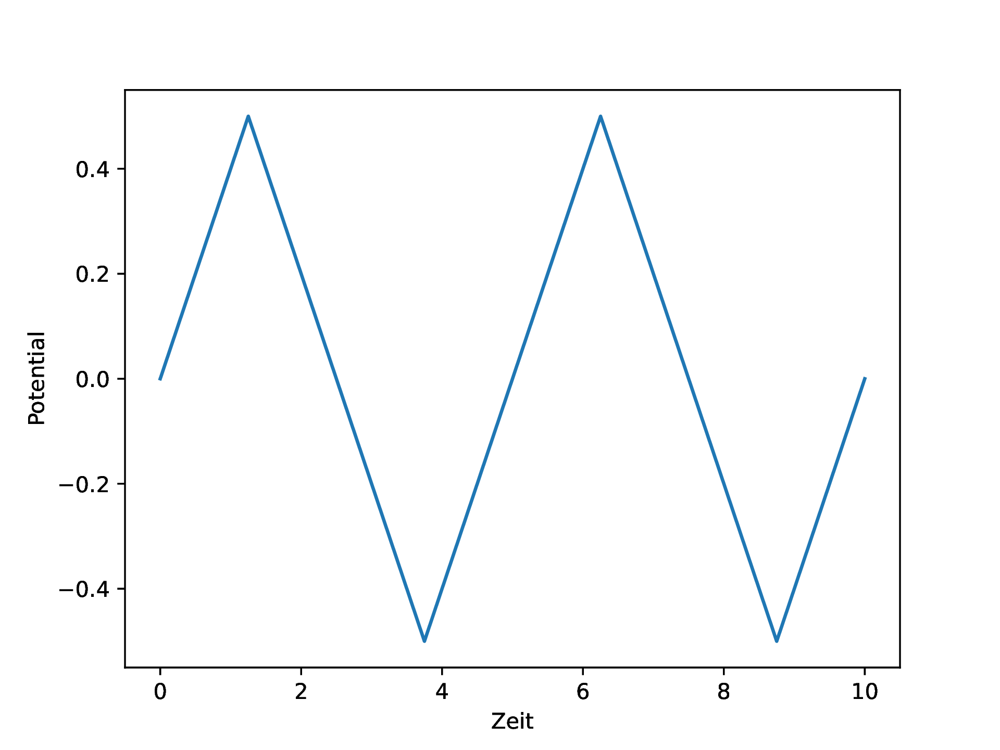

<h2 class='chapterHead'>Übungsblatt 4 Zeitpropagation</h2>

<!-- l. 12 -->
Anmerkung: Die Abgabe von Arbeitsblatt 1 bis 4 ist verpflichtend und
konstituiert die Studienleistung der Veranstaltung Simulationstechniken.
Die Arbeitsblätter führen von der mathematischen Formulierung eines
Modellproblems hin zur numerischen Lösung dieses Problems und bauen
aufeinander auf. Zum Bestehen der Veranstaltung müssen auf jedem Blatt
mindestens 50% der erzielbaren Punkte erreicht werden.

<!-- l. 20 -->
 Geben Sie bei allen Aufgaben die Lösungswege und Zwischenergebnisse mit
an. Das Endergebnis alleine ist nicht ausreichend! Wir empfehlen Ihnen die
Nutzung von Python. Sollten Sie ein Jupyter-Notebook verwenden, dann können
Sie dieses einfach direkt als Lösung bei uns einreichen. In allen anderen Fällen
erzeugen Sie bitte ein PDF und legen die numerischen Codes als separate Datei
dazu.

<!-- l. 22 -->
 Sie werden durch die einzelnen Schritte der Modellimplementierung geleitet,
und wir geben Hinweise zur Implementierung. Es ist nicht zwingend notwendig,
diese 1-zu-1 zu verfolgen. Im Rahmen dieser Hinweise finden Sie Codeabschnitte,
die Sie verwenden können. Sie dürfen natürlich auch die Codebeispiele aus
dem Vorlesungsmaterial hier verwenden. 

<h3 class='sectionHead'>4.1  Zeitpropagation der Poisson-Nernst-Planck-Gleichung: Einführung</h3>
<!-- l. 32 -->
0 Punkte 

<!-- l. 34 -->
 Die (nichtlineare) Poisson-Boltzmann-Gleichung entspricht der
Poisson-Nernst-Planck (PNP) Gleichungen im thermodynamischen
Gleichgewicht. Falls die Ionenstromdichte nicht verschwindet, müssen wir die
Poisson-Nernst-Planck-Gleichungen betrachten. Wir betrachten hier die in
Übungsblatt 3, Aufgabe 1 hergeleitete entdimensionalisierte Variante dieser
Gleichung. Nutzen Sie im folgenden zwei Ionenspezies \(\alpha =+\) und \(\alpha =-\), mit den
(entdimensionalisierten) Ladungen \(q_+=+1\) und \(q_-=-1\).

<!-- l. 36 -->
 In dieser Aufgabe wollen wir uns für ein eindimensionales Problem die
zeitliche Entwicklung der Ionenkonzentrationen nach einem gegebenen
Anfangszustand anschauen. Die Anwendung, welche wir hier diskutieren, ist ein
elektrochemischer Kondensator mit zwei parallelen Platten. Durch die Lösung
der PNP Gleichungen erhalten wir hier die Ladung als eine Funktion des
Potentials. Da diese Lösung die komplette zeitliche Entwicklung der
Ionenkonzentration beschreibt, können wir nun auch schauen, wir sich das

System bei einer Anregung verhält, die sich zeitlich ändert. Hiermit werden wir
in der Lage sein, Strom-Spannungskennlinien zu berechnen. In der Elektrochemie
werden solche Kennlinien oft in Form von <a href='https://de.wikipedia.org/wiki/Cyclovoltammetrie'>Cylcovoltammogrammen</a> aufgenommen.
Die hier berechneten Cyclovoltammogramme werden keine Faradayschen Prozesse,
also chemische Reaktion an der Elektrode, berücksichtigen, beschreiben aber die
Dynamik der Ladungsumordnung.

<!-- l. 38 -->
 Für gegebene Randbedingungen und Anfangskonzentrationen \(c_s(x, t=0)\) wollen wir die
Konzentrationen \(c_s(x, t)\) berechnen. Dafür werden wir die Nernst-Planck Gleichung
mithilfe des Runge-Kutta-Verfahrens zeitlich integrieren. Aber zunächst wollen
wir uns mit der räumlichen Diskretisierung mittels der Finite-Elemente-Methode
(FEM) beschäftigen.

<!-- l. 41 -->

<h3 class='sectionHead'>4.2  Diskretisierung mit Hilfe der finite-Elemente Methode</h3>
<!-- l. 42 -->
6 Punkte 

<!-- l. 44 -->
 Benutzen Sie die FEM um die PNP Gleichungen in ein Gleichungssystem in \(\dot c_{\alpha i}\), \(c_{\alpha i}\)
und \(\Phi _{j}\) zu Überführen. Benutzen Sie hierfür eindimensionale lineare Basisfunktionen.
Die Ansatzfunktionen haben nun zeitabhängige Entwicklungskoeffizienten, \begin {align} c_\alpha (x, t) &amp;= \sum _i c_{\alpha i}(t) \varphi _i(x) \\ \Phi (x, t) &amp;= \sum _j \Phi _j(t) \varphi _j(x), \end {align}

<!-- l. 49 -->
 und wir nutzen die gleiche Basis für alle drei Felder.

<!-- l. 51 -->
 Diese drei konstituierenden Gleichungen können einzeln diskretisiert
werden. Sie koppeln über das elektrostatische Potential \(\Phi \). An den Rändern
mit Neumann-Randbedingungen werden Gradienten oder Flüße in den
hier betrachteten Beispielen immer verschwinden, d.h. Sie können die
entsprechenden Terme frühzeitig auslassen. Bitte arbeiten Sie ab hier
mit der eindimensionalen Variante der PNP-Gleichungen. Rechnen Sie
die Integrale zunächst nicht explizit aus, aber ersetzen Sie diese durch
Symbole.

<!-- l. 53 -->
 Sie sollten ein System der Form \begin {align} \label {eq:pnp-discrete-system-1-p} \sum _j L_{ij} \Phi _j &amp;= \frac {1}{2} \sum _j M_{ij}\left (q_+c_{+j} + q_-c_{-j}\right ) \\ \sum _j M_{ij} \dot c_{\alpha j} &amp;= -\sum _j L_{ij} c_{\alpha j} - q_\alpha \sum _{jk} C_{ijk} c_{\alpha j} \Phi _k \label {eq:pnp-discrete-system-1-np} \end {align}

<!-- l. 60 -->
 erhalten. Wir haben hier die homogenen Neumann-Terme weggelassen. Welche
Schwierigkeiten erwarten Sie?

<!-- l. 154 -->

<h3 class='sectionHead'>4.3  Berechnung der Basisfunktionsintegrale</h3>
<!-- l. 155 -->
6 Punkte 

<!-- l. 157 -->
 Bitte verwenden Sie nun ein reguläres Gitter (konstanter Abstand \(\Delta x\)) mit
linearen finiten Elementen wie in der Vorlesung vorgestellt. Rechnen Sie nun die
Integrale \(L_{ij}\), \(M_{ij}\) und \(C_{ijk}\) explizit aus. Einige dieser Integrale sind schon in der Vorlesung
und auf vorherigen Übungsblättern aufgetaucht. Zum Berechnen der Integrale
können Sie natürlich ein Computeralgebrasystem (wie z.B. Mathematica oder
<a href='https://sympy.org'>sympy</a>) benutzen.

<!-- l. 160 -->
 Achtung: Beachten Sie, dass die Integrale am Rand des Gebiets anders
aussehen als in der Mitte.

<!-- l. 226 -->

<h3 class='sectionHead'>4.4  Implementierung der Gleichungssysteme</h3>
<!-- l. 227 -->
0 Punkte 

<!-- l. 229 -->
 Implementieren Sie nun die linken und rechten Seiten der Gleichungen
\eqref{eq:pnp-discrete-system-1-p} und \eqref{eq:pnp-discrete-system-1-np}. Wir
schlagen die unten genannten Funktionsnamen und Funktionssignaturen
vor.

<!-- l. 231 -->
Anmerkung: Sie brauchen einige der auftretenden Matrizen nicht explizit
berechnen. Beispielsweise können Sie anstelle \(\underline {C}\) konkret aufzustellen, auch nur die
Auswirkung von \(\underline {C}\) auf einen Vektor implementieren. Dies führt zu erheblich
kompakterem Code. Der Grund dafür ist, dass wir bei der expliziten
Zeitpropagation im Gegensatz zu den vorher behandelten ˙impliziten˙ Methoden
nicht explizit ein lineares Gleichungssystem lösen müssen. (Achtung: \(\underline {M}\) müssen
Sie explizit als Matrix berechnen! Für die Lösung der Poisson-Gleichung
brauchen Sie auch \(\underline {L}\) explizit als Matrix!) 

<!-- l. 235 -->

1def laplacian(nb_nodes, dx):  
2    """  
3    Return the Laplace operator L_{ij}  
4  
5    Parameters  
6    ----------  
7    nb_nodes : int  
8        Number of nodes  
9    dx : float  
10        Grid spacing  
11  
12    Returns  
13    -------  
14    laplacian_gg : np.ndarray of shape (nb_nodes, nb_nodes)  
15        Matrix containing the laplacian matrix  
16    """  
17    pass  
18  
19def massian(nb_nodes, dx):  
20    """  
21    Return the mass matrix M_{ij}  
22  
23    Parameters  
24    ----------  
25    nb_nodes : int  
26        Number of nodes  
27    dx : float  
28        Grid spacing  
29  
30    Returns  
31    -------  
32    massian_gg : np.ndarray of shape (nb_nodes, nb_nodes)  
33        Matrix containing the mass matrix  
34    """  
35    pass  
36  
37def apply_C(concentration_g, potential_g, dx):  
38    r"""  
39    Implements the term  
40  
41    C_{ijk} c_{\alpha j} \Phi_k  
42  
43    Parameters  
44    ----------  
45    concentration_g : np.ndarray of shape (nb_nodes,)  
46        Concentration  
47    potential_g : ndarray of shape (nb_nodes,)  
48        Electrostatic potential  
49    dx : float  
50        Grid spacing  
51  
52    Returns  
53    -------  
54    C_g : np.ndarray of shape (nb_nodes,)  
55        Drift term of the drift diffusion equation  
56    """  
57    pass  
58  
59def compute_potential(charge_density_g, dx, potential_left=0, potential_right=0,  
60                      massian_gg=None):  
61    """  
62    Solve the Poisson equation to compute the electrostatic potential  
63  
64    Parameters  
65    ----------  
66    charge_density_g : np.ndarray of shape (nb_nodes,)  
67        Charge density  
68    dx : float  
69        Grid spacing  
70    potential_left : float, optional  
71        Potential of the left electrode  
72        (Default: 0)  
73    potential_right : float, optional  
74        Potential of the right electrode  
75        (Default: 0)  
76    massian_gg : np.ndarray of shape (nb_nodes, nb_nodes)  
77        Matrix containing the Massian. Recompute if None  
78        (Default: None)  
79  
80    Returns  
81    -------  
82    potential_g : np.ndarray of shape (nb_nodes,)  
83        Electric potential on the nodes  
84    """  
85    pass  
86  
87def drift_diffusion_rhs(concentration_g, potential_g, charge, dx,  
88                        laplacian_gg=None):  
89    r"""  
90    Implements the term  
91  
92    L_{ij} c_{\alpha j} + q_\alpha C_{ijk} c_{\alpha j} \Phi_k  
93  
94    Parameters  
95    ----------  
96    concentration_g : np.ndarray of shape (nb_nodes,)  
97        Concentration of the species  
98    potential_g : ndarray of shape (nb_nodes,)  
99        Electrostatic potential  
100    charge : float  
101        Charge of the species  
102    dx : float  
103        Grid spacing  
104    laplacian_gg : np.ndarray of shape (nb_nodes, nb_nodes)  
105        Matrix containing the Laplace operator. Recompute if None  
106        (Default: None)  
107  
108    Returns  
109    -------  
110    rhs_g : np.ndarray of shape (nb_nodes,)  
111        Right hand side (source term) for the Drift-Diffusion equation  
112    """  
113    pass

<!-- l. 352 -->

<h3 class='sectionHead'>4.5  Zeitliche Integration</h3>
<!-- l. 353 -->
2 Punkte Die diskretisierten Nernst-Planck-Gleichungen bilden ein System gewöhnlicher
Differenzialgleichungen erster Ordnung in \(c\), wobei \(\Phi _k\) die Lösung der
Poisson-Gleichung ist, die in jedem Zeitschritt neu berechnet werden muss.
Benutzen Sie <a href='https://docs.scipy.org/doc/scipy/reference/generated/scipy.integrate.solve_ivp.html'>scipy.integrate.solve_ivp</a> um die PNP-Gleichungen zeitlich zu
integrieren. solve_ivp löst das System von GDGLs mit unterschiedlichen
Verfahren, die mit dem Parameter method ausgewählt werden können. Die
Standardintegrationsmethode ist ein Runge-Kutta-Verfahren mit adaptivem
Zeitschritt (RK45), die gut funktionieren sollte.

<!-- l. 357 -->
 solve_ivp benötigt eine Funktion pnp_dcdt(time, concentration_flat),
die die zeitliche Ableitung \(\frac {\mathrm {d}c}{\mathrm {d}t}\) berechnet. Beachten Sie, dass diese Funktion einen
”flachenÄrray als Input benötigt.

<!-- l. 359 -->
 solve_ivp entscheidet selbst, welcher Zeitschritt für eine stabile
Zeitintegration nötig ist. Dafür muss angegeben werden, an welchen
Zeitpunkten die Konzentration ausgewertet werden soll. Die Zeitschritte, bei
denen die Konzentration ausgegeben werden sollen, werden durch t_eval
festgelegt.

<!-- l. 361 -->
 Im folgenden finden Sie einen Vorschlag, wie die Signatur einer Funktion, die
Ihre PNP-Gleichung propagiert, aussehen könnte.

<!-- l. 363 -->

1def integrate_pnp(initial_concentration_p_g,  
2                  initial_concentration_n_g,  
3                  dx,  
4                  maximum_time,  
5                  nb_output=2,  
6                  potential_left=0,  
7                  potential_right=0,  
8                  positive_charge=1,  
9                  negative_charge=-1,  
10                  **kwargs):  
11    """  
12    Integrate the Poisson-Nernst-Planck equation forward in time from a starting  
13    configuration.  
14  
15    Parameters  
16    ----------  
17    initial_concentration_p_g : numpy.ndarray of shape (nb_nodes,)  
18        Initial concentration of the positively charges species  
19    initial_concentration_n_g : numpy.ndarray of shape (nb_nodes,)  
20        Initial concentration of the negatively charges species  
21    dx : float  
22        Grid spacing  
23    maximum_time : float  
24        Integrate from time 0 up to this time  
25    nb_output : int, optional  
26        Frequency of output time steps  
27        (Default: 2)  
28    potential_left : float, optional  
29        Potential of the left electrode  
30        (Default: 0)  
31    potential_right : float, optional  
32        Potential of the right electrode  
33        (Default: 0)  
34    positive_charge : float, optional  
35        Charge of positive species  
36        (Default: +1)  
37    negative_charge : float, optional  
38        Charge of negative species  
39        (Default: -1)  
40  
41    Returns  
42    -------  
43    time_t : numpy.ndarray of shape (nb_nodes,)  
44        Times at which the output is reported  
45    concentration_p_tg : ndarray of shape (nb_output, nb_nodes)  
46        Concentration of the positive species at certain times  
47    concentration_n_tg : ndarray of shape (nb_output, nb_nodes)  
48        Concentration of the negative species at certain times  
49    """  
50    pass

<!-- l. 421 -->

<h3 class='sectionHead'>4.6  Systematische Tests der Implementierung</h3>
<!-- l. 422 -->
Um sicherzustellen, dass die Implementation korrekt ist, werden wir erstmal
einfache Sonderfälle betrachten. Dabei steigert sich die Komplexität Schritt
für Schritt. Sie können so schon einen Teil des Codes testen, bevor alles
implementiert ist.

<!-- l. 424 -->

<h4 class='subsectionHead'>4.6.1  Nernst-Planck-Gleichung mit \(q_\alpha =0\), die Diffusionsgleichung</h4>
<!-- l. 425 -->
2 Punkte Wir betrachten nur eine Spezies, die Ladungsneutral ist. Damit wird die
Poisson-Nernst-Planck-Gleichung zur altbekannten Diffusionsgleichung:

<!-- l. 428 -->

<!-- l. 430 -->
 Eine Spezies Durch die Ränder des Simulationsgebiets fließt kein Stoff, d.h. wir betrachten
homogene Neumann-Randbedingungen. Vergewissern Sie sich, dass \(c(x, t) = c^\infty + \Delta c \exp \left [-D\left (\frac {2\pi }{L}\right )^2 t \right ] \cos (2 \pi x /L)\) für
eine Initialverteilung \(c(x, 0) = c^\infty + \Delta c \cos (2 \pi x /L)\) und benannte Randbedingungen eine Lösung der
Diffusionsgleichung \(\dot c = D \frac {\partial ^2 c}{\partial x ^ 2}\) ist. Achten Sie darauf, dass \(\Delta c &lt; c^\infty \). (Warum ist das wichtig?)

<!-- l. 433 -->
 Zeigen Sie, dass Ihr Modell mit der analytischen Lösung der Diffusionsgleichung
übereinstimmt. Stellen Sie dafür die analytische Lösung und einen Schnitt der
numerischen Lösung bei den Zeitschritten \(t = 0.\), \(t=0.05\) und \(t=0.1\) dar. Verwenden Sie dabei einen
Plattenabstand von \(L=2\).

<!-- l. 435 -->
Anmerkung: Auf Grund der <a href='https://de.wikipedia.org/wiki/CFL-Zahl'>CFL</a>-Bedindung benötigen feinere Gitter kleinere
Zeitschritte und rechnen damit wesentlich länger. \(10\)-\(20\) Knoten reichen vollkommen. 

<!-- l. 439 -->
 Zwei Spezies Lösen Sie ganz einfach zwei entkoppelte Diffusionsleichungen. Es geht
nur darum, zu testen, ob die Implementation von zwei Spezies fehlerfrei

funktioniert.

<!-- l. 451 -->

<h4 class='subsectionHead'>4.6.2  Teilchen driften unter dem Einfluss eines elektrischen Feldes</h4>
<!-- l. 452 -->
2 Punkte Legen Sie einen Potenzialunterschied zwischen der linken und rechten
Platte an und überprüfen Sie, dass sich geladene Teilchen in die richtige
Richtung bewegen. Sie können eine Dirac-ähnliche Anfangskonzentration
verwenden und zeigen Sie, wie sich diese verschiebt. Es kann sein, dass Sie
die effektive Ladung ihrer Ionen erhöhen müssen, um diesen Effekt zu
sehen.

<!-- l. 463 -->

<h4 class='subsectionHead'>4.6.3  Spezies mit gleicher Ladung stoßen sich ab</h4>
<!-- l. 464 -->
2 Punkte Zeigen Sie, dass sich Spezies mit gleicher Ladung auch abstoßen. Nutzen Sie zwei
Dirac-ähnliche Funktionen als Anfangsbedingungen und kein angelegtes
elektrisches Feld.

<!-- l. 475 -->

<h4 class='subsectionHead'>4.6.4  Spezies mit Ladungen unterschiedlichen Vorzeichens ziehen sich
an</h4>
<!-- l. 476 -->
1 Punkte Zeigen Sie, dass zwei Spezies mit unterschiedlicher Ladung sich anziehen. Starten
Sie mit zwei Spezies mit unterschiedlicher Ladung und keinem angelegten
elektrischen Feld. Zwei versetzte Dirac-Peaks in der Konzentration sollten sich
anziehen.

<!-- l. 487 -->

<h4 class='subsectionHead'>4.6.5  Validieren Sie Ihren Code quantitativ gegen eine bekannte analytische
Lösung</h4>
<!-- l. 488 -->
2 Punkte Für diesen (um \(x=0\)) symmetrischen Fall lässt sich die nichtlineare
Poisson-Boltzmann-Gleichung über den Ansatz \begin {equation} \Phi (x) = \Phi _0 + \frac {k_B T}{ q_e} \ln {\cos ^2(K x)} \end {equation}
lösen, wobei \(\Phi _0\) und \(K\) noch zu bestimmen sind. Für das Erfüllen der
Differenzialgleichung muss \begin {equation} \Phi _0 = - \frac {k_B T}{q_e} \ln \Big ( \frac {2 k_B T \varepsilon }{q_e^2 c_{\infty }} K^2 \Big ) \end {equation}
gelten. Erfüllen der Potential-Randbedingungung \(\Phi (L/2) = \Phi _1\) liefert eine transzendente
Gleichung für \(K\), \begin {equation} \cos ^2 \Big (\frac {K L }{2}\Big ) - \exp \Big ( \frac {q_e}{k_B T} \Phi _1 \Big ) \frac {2 k_B T \varepsilon }{q_e^2 c_\infty } K^2 = 0, \end {equation}
die numerisch gelöst werden muss. (Unten finden Sie eine Funktion, die
<a href='https://docs.scipy.org/doc/scipy/reference/generated/scipy.optimize.root_scalar.html'>scipy.optimize.root_scalar</a> nutzt um diese Gleichung zu lösen.)

<!-- l. 503 -->
 \(c_{\infty }\) ist die Konzentration des Bades mit elektrischem Potential \(\Phi = 0\), das im
Gleichgewicht mit dem betrachteten Behälter steht. Da das elektrische Potential
am linken und am rechten Rand in unserer Simulation auch gleich Null ist, muss
dort die Gleichgewichtskonzentration gleich \(c_\infty \) sein. Messen Sie diese Konzentration
und setzen Sie \(c_\infty \) auf diesen Wert.

<!-- l. 506 -->
 Zeigen Sie, dass die numerische Lösung für große Zeitschritte mit der
analytischen Lösung übereinstimmt.

<!-- l. 508 -->

1def poisson_boltzmann_symmetric(x, wall_distance, potential_wall):  
2    """  
3    Solution of the Poisson-Boltzmann equation for 1 species  
4    between two plates with fixed potential.  
5  
6    The solution is connected with a bath with  
7    potential 0 and concentration ‘concentration_bath‘.  
8  
9    Parameters  
10    ----------  
11    x : array_like  
12        Position in units of the debye length  
13    wall_distance : float  
14        Wall distance in units of the debye length  
15    potential_wall : float  
16        Electric potential at the wall in units of the thermal voltage  
17  
18    Returns  
19    -------  
20    potential_g : numpy.ndarray  
21        The potential evaluated at x in units of the thermal voltage  
22    """  
23    from scipy.optimize import root_scalar  
24  
25    # solve the transcendental equation for K  
26    L = wall_distance  
27    sol = root_scalar(  
28        lambda K:  
29        np.cos(K * L / 2) ** 2  
30        - 4 * K ** 2 * np.exp(potential_wall),  
31        x0=np.pi / L * 0.9999,  
32        x1=np.pi / L * 0.0001,  
33    )  
34    assert sol.converged  
35  
36    _K = sol.root  
37  
38    return (- np.log(_K ** 2 * 4)  
39            + np.log(np.cos(_K * (x)) ** 2))

<!-- l. 559 -->

<h3 class='sectionHead'>4.7  Zyklische Anregung</h3>
<!-- l. 560 -->
Wir wollen uns jetzt der Modellierung eines Kondensators unter zyklischer
Anwendung widmen. Modifizieren Sie Ihren Code so, dass Sie das Potential auf
der rechten Seite des Kondensators zeitlich variieren können. Regen
Sie Ihr System nun mit einer Dreiecksanregung an. Mit der Funktion
<a href='https://docs.scipy.org/doc/scipy/reference/generated/scipy.signal.sawtooth.html'>scipy.signal.sawtooth</a> können Sie direkt ein solchen Signal erzeugen. Das
folgende Bild zeigt ein entsprechendes Anregungsprofil.

<!-- l. 562 -->
 

<!-- l. 564 -->
 Zeigen Sie nun die Ionenkonzentration und den Potentialverlauf über den
Kondensator als Funktion der Zeit. (Sie können hier auch gerne ein Video von
machen!) Nutzen Sie hierfür zunächst eine Länge von \(L=1\) (also dem \(1\)-fachen der

Debye-Länge) und eine Periode von \(T=1\). Die Anfangkonzentration darf konstant sein
und \(1\) betragen. Die Amplitude der Anregung sollte auch \(1\) sein. Achten Sie darauf,
dass zum Anfang der Simulation das Potential auf beiden Elektroden identisch
ist.

<!-- l. 566 -->
 Zeigen Sie die Fälle: 

<ul class='itemize1'>
<li class='itemize'>\(L=1\), \(T=1\)
</li>
<li class='itemize'>\(L=10\), \(T=1\)
</li>
<li class='itemize'>\(L=10\), \(T=10\)
</li>
<li class='itemize'>\(L=10\), \(T=100\)</li></ul>
<!-- l. 574 -->
 Wie unterscheiden sich diese Fälle und warum? Interessant sind insbesondere
die Ionenkonzentrationen und Potentialverläufe bei den maximalen und
minmialen Spannungen (Potentialdifferenzen).

<!-- l. 576 -->
Anmerkung: 

<ul class='itemize1'>
<li class='itemize'>Sie müssen die Referenzlänge \(1\), also die Debye-Länge, mit ein
paar Gitterpunkten diskretisieren. Dies ist nötig weil typische
Konzentrationsabfälle über diese Länge stattfinden und Sie diese
noch erfassen müssen.
</li>
<li class='itemize'>Die Rechnungen mit \(T=100\) werden vermutlich länger rechnen.</li></ul>

<!-- l. 594 -->

<h3 class='sectionHead'>4.8  Cyclovoltammogramm</h3>
<!-- l. 595 -->
5 Punkte Wir wollen uns nun in dieser letzten Aufgabe der Berechnung eines
Cyclovoltammogramms (CVs) widmen. Hierzu wird der Ladung als Funktion der
Spannung geplottet. Wie lautet der Ausdruck für die Ladung auf den
Kondensatorplatten? Implementieren Sie diesen in eine Hilfsfunktion.

<!-- l. 598 -->
Anmerkung: Ein CV ist eigentlich Strom als Funktion der Spannung,
wir schauen uns hier aber die Ladung an. Sie können den Strom
natürlich als zeitliche Veränderung der Ladung, also als Ableitung eines
Ladungs-Spannungs-Diagramms, bestimmen. 

<!-- l. 602 -->
 Implementieren Sie nun eine Funktion, die Ihnen ein Cyclovoltammogramm
für Ihren Kondensator ausrechnet.

<!-- l. 604 -->
 Berechnen Sie die CVs für die oben genannten Parameter. Es macht Sinn die
CVs über 5 Perioden aufzunehmen. Was sehen Sie und warum?

<!-- l. 626 -->

<h3 class='sectionHead'>4.9  Dünnbesetzte Algorithmik</h3>
<!-- l. 627 -->
0 Punkte Schreiben Sie Ihre Funktion so um, dass sie dünnbesetzte Arithmetik aus dem
Paket <a href='https://docs.scipy.org/doc/scipy/reference/sparse.html'>scipy.sparse</a> nutzt. Dies reduziert die Komplexität der Lösung eines
linearen Gleichungssystem von \(\mathcal {O}(N^2)\) auf \(\mathcal {O}(N)\). D.h. wenn Sie Ihre Gitterpunkte
verdoppeln, sollte der Code dann nur doppelt (und nicht viermal) so langsam
laufen.

<!-- l. 630 -->
Anmerkung: Nutzen Sie das “compressed sparse row (CSR)” Format
scipy.sparse.csr_matrix. Für die Lösung linearer Gleichungssysteme
müssen Sie dann <a href='https://docs.scipy.org/doc/scipy/reference/generated/scipy.sparse.linalg.spsolve.html'>scipy.sparse.linalg.spsolve</a> nutzen. 

