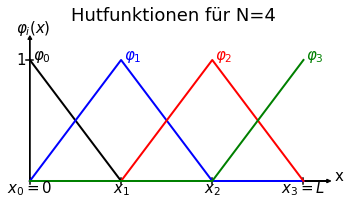

# Übungsblatt 2: Grundlagen der Methode der finiten Elemente

<div class="alert alert-warning">
Die Abgabe von Arbeitsblatt 1 bis 4 ist verpflichtend und konstituiert die Studienleistung der Veranstaltung <b>Simulationstechniken</b>. Die Arbeitsblätter führen von der mathematischen Formulierung eines Modellproblems hin zur numerischen Lösung dieses Problems und bauen aufeinander auf. Zum Bestehen der Veranstaltung müssen auf <b>jedem</b> Blatt mindestens 50% der erzielbaren Punkte erreicht werden.
</div>
<br>

<div class="alert alert-danger">
<b>Geben Sie bei allen Aufgaben die Lösungswege und Zwischenergebnisse mit an. Das Endergebnis alleine ist nicht ausreichend!</b> Wir empfehlen Ihnen die Nutzung von Python und Jupyter-Notebooks. Sollten Sie ein Jupyter-Notebook verwenden, dann können Sie dieses einfach direkt als Lösung bei uns einreichen. In allen anderen Fällen erzeugen Sie bitte ein PDF und legen die numerischen Codes als separate Datei dazu.
</div>

## Hinweise zu den numerischen Aufgaben: 
* Codes sollten immer möglichst übersichtlich und leicht lesbar sein. Beachten Sie insbesondere:
    * Verwenden Sie Namen anstelle von Symbolen um Ihre Variablen zu benennen, also z.Bsp. *concentration* oder *Konzentration* anstelle von *c*
    * Nutzen Sie Suffixe, um die Dimensionen von Matrizen und Vektoren zu beschreiben. *concentration_x* bedeutet beispielsweise, dass die Einträge im Vektor *concentration* von der Raumrichtung *x* abhängen.
    * Kommentieren Sie Ihren Code ausreichend!
* Verwenden Sie die *numpy*-interne Funktion `numpy.linalg.solve` zum lösen von linearen Gleichungssystemen. Ein eigener Algorithmus zum Lösen von Gleichungssystemen ist NICHT Teil dieses Übungsblatts.
* Folgende *numpy*-Funktionen können (aber müssen nicht) hilfreich sein: `full`, `linspace`, `zeros`, `eye`, `diag`, `maximum`
* Eine vollständige Dokumentation der *numpy*-Funktionen finden Sie auf https://numpy.org/doc/stable/
* Für die Erstellung der Plots können Sie beispielsweise `matplotlib.pyplot` verwenden. Die Dokumentation von matplotlib und Anwendungsbeispiele finden Sie auf https://matplotlib.org/index.html
* Um eine Stufenfunktion zu plotten empfiehlt sich beispielsweise die Funktion `matplotlib.pyplot.step` (https://matplotlib.org/gallery/lines_bars_and_markers/step_demo.html#sphx-glr-gallery-lines-bars-and-markers-step-demo-py) 
* Beachten Sie bitte die Regeln zur Erstellung von Graphiken!

# Aufgabe 1 (8 Punkte)
## Fourier-Basisfunktionen

### 1.1 Orthogonalität der 1D-Fourier-Basisfunktionen (3 Punkte)
Auf Übungsblatt 1 haben Sie eine analytische Lösung der Diffusionsgleichung mithilfe der eindimensionalen Fourier-Reihe bestimmt. Weisen Sie nach, dass die Basisfunktionen dieser Fourier-Reihe eine orthogonale Basis bilden. Das Skalarprodukt zweier $$L$$-periodischen Funktion sei dabei definiert als:
\begin{equation}
\left( f, g \right) = \frac{1}{L} \int_0^L dx \; \left( f^*(x) g(x) \right)
\end{equation}
wobei $$f^*(x)$$ für das komplex-konjugierte von $$f(x)$$ steht.

### 1.2 Orthogonalität der 2D-Fourier-Basisfunktionen (3 Punkte)
Zeigen Sie, dass auch die Basisfunktionen der zweidimensionalen Fourier-Reihe eine orthogonale Basis bilden. Das Skalarprodukt zweier Funktionen, die in x-Richtung $$L_x$$-periodisch und in y-Richtung $$L_y$$-periodisch sind, sei dabei gegeben als
\begin{equation}
\left(f, g \right) = \frac{1}{L_x L_y} \int_0^{L_y} \int_0^{L_x} dx\,dy \, \left( f^*(x,y) g(x,y) \right)
\end{equation}

### 1.3 Fourier-Koeffizienten (2 Punkte)
Leiten Sie die Formel für die Koeffizienten der zweidimensionalen Fourierreihe her, indem Sie die Funktion $$f(x,y)$$ auf die Fourierreihen-Basis projizieren.

# Aufgabe 2 (8 Punkte)
## Finite-Elemente
In dieser Aufgabe betrachten wir die Grundlagen der Finite Elemente Methode.
Als Beispielproblem nehmen wir die stationäre Diffusionsgleichung in 1D (Vgl. Übungsblatt 1, Aufgabe 4):
\begin{equation}
D \frac{\partial^2 c}{\partial x^2} = f(x)
\label{eq:Diffusion}
\end{equation}
Wie in Übungsblatt 1 ist dabei $$D$$ die Diffusionskonstante, $$c(x)$$ eine Stoffmengenkonzentration und $$f(x)$$ ein Quellterm.

### 2.1 Schwache Form (2 Punkte)
Leiten Sie die schwache Form von Gleichung $$\ref{eq:Diffusion}$$ her und verringern Sie die Anforderung an die Differenzierbarkeit von $$c(x)$$. Gehen Sie dabei von der Annahme aus, dass die Diffusionsgleichung auf einem endlichen Gebiet $$[0; L]$$ gilt.

### 2.2 Galerkin-Methode (1 Punkt)

Jetzt wird $$c(x)$$ in einem Funktionensystem mit den linear unabhängigen Basisfunktionen $$\varphi_i$$ dargestellt:
\begin{equation}
c(x) = \sum a_i \varphi_i(x)
\label{eq:c_in_Funktionensys}
\end{equation}

Verwenden Sie die Galerkin-Methode, um ein System von Gleichungen für die Koeffizienten $$a_i$$ zu bekommen.

### 2.3 Diskretisierung und Basis-Funktionen (5 Punkte)
Als Diskretisierung wollen wir $$N$$ gleichmäßig verteilte Gitterpunkte verwenden. Als Basisfunktionen wählen wir die stückweise linearen Zeltfunktionen, wie sie in der Abbildung dargestellt sind.


    

    


Berechnen Sie die diskretisierten Gleichungen, d.h. $$\left( \varphi_j, R\right)=0$$, für die inneren Testfunktionen $$\varphi_j$$ für $$j \in \{1; 2; ...; N-2\}$$ für die Quellterme:
1. $$f(x) = -\delta\left(x - \frac{L}{3} \right) + \delta\left(x - \frac{2L}{3} \right)$$
2. $$f(x) = f_0$$

**Hinweise** zu der Berechnung mit Delta-Distributionen als Quellterm: 
* Um die Berechnung der diskretisierten Terme zu erleichtern, können Sie die Anzahl an Gitterpunkte $$N$$ immer so wählen, dass die dirac Quellterme auf einem Knoten liegen, also  $$N=3N'+1$$ mit $$N' \in \mathbb{N}$$.
* Die Delta-Distribution ist durch ihre Filter-Eigenschaft definiert:
$$
\int_0^L dx \; \delta (x-a) f(x) = f(a)
$$

# Aufgabe 3 (9 Punkte)
## Finite-Element im periodischen Raum
In dieser Aufgabe wollen wir die Diffusionsgleichung mit periodischen Randbedingungen auf dem Gebiet $$[0;L]$$, die in Übungsblatt 1, Aufgabe 4 analytisch gelöst wurde mit Finiten Elementen lösen.

Dabei wählen wir die gleiche Diskretisierung und die gleichen Basisfunktionen wie in Aufgabe 2.3. Genau wie bei der analytischen Lösung ist der Quellterm $$f(x) = -\delta\left(x - \frac{L}{3} \right) + \delta\left(x - \frac{2L}{3} \right)$$.

### 3.1 Mittelwertbedingung (1 Punkt)
Wie wir auf dem Übungsblatt 1 gesehen haben, ist der Mittelwert der Lösungsfunktion nicht bestimmbar. Anders gesagt, wenn $$c_1(x)$$ eine periodische Lösung der Diffusionsgleichung ist, dann ist $$c_2(x) = c_1(x) + \text{konst.}$$ ebenfalls eine periodische Lösung der Diffusionsgleichung. Diese Unendlichkeit an Lösungen bedeutet, dass das Gleichungssystem, das wir mit den Finiten Elementen aufstellen, nicht eindeutig lösbar ist. 

Damit wir ein lösbares Gleichungssystem bekommen, brauchen wir ein Problem mit einer eindeutigen Lösung. Wir müssen deshalb die Forderung 'periodische Randbedingungen' mit einer weiteren Bedingung ergänzen. Wir wählen dafür einen vorgegebenen Mittelwert von 0, d.h. \begin{equation}\frac{1}{L}\int_0^L dx \; c(x) = 0\end{equation}

Dadurch ergibt sich eine weitere Gleichung für die Koeffizienten $$a_i$$. Stellen Sie diese Gleichung auf.

### 3.2 Systemmatrix (1 Punkt)
Das Gleichungssystem aus diskretisierten Gleichungen für die Koeffizienten $$a_i$$ wird üblicherweise in Matrix-Form geschrieben:
\begin{equation}
\underline{K} \cdot \overrightarrow{a} = \overrightarrow{f}
\end{equation}
$$\underline{K}$$ nennt man dann die Systemmatrix. 

Stellen Sie die Systemmatrix für die Lösung der 1D-Diffusionsgleichung mit periodischen Randbedingungen und einem vorgegebenen Mittelwert mithilfe von lineare Finiten Elementen für 4 Gitterpunkte auf.

### 3.3 Numerische Lösung (7 Punkte)
Beachten Sie bitte die Hinweise am Anfang des Übungsblattes!

Schreiben Sie eine python-Funktion, um die Diffusionsgleichung im periodischen Raum mit linearen Finiten Elementen zu lösen. Diese Funktion sollte als Argumente die Anzahl der Gitterpunkte $$N$$, den Abstand zwischen zwei Gitterpunkten $$dx$$ und einen Vektor mit der bereits diskretisierten rechten Seite des Problems erwarten. Verwenden Sie also bitte die Schnittstelle

```python
def fem_laplace_linear_1d_periodic(nb_grid_pts, dx, rhs_x)
    """
    Function to solve the 1D Laplace equation with periodic boundary conditions and an
    imposed average using a regular grid and linear finite elements.
    
    Arguments
    ---------
    nb_grid_pts: int
        Number of grid points
    dx: float
        Length between two adjacent grid points
    rhs_x: numpy.ndarray(nb_grid_pts) of floats
        Right-hand-side vector
    
    Returns
    -------
    func_x: numpy.ndarray(nb_grid_pts) of floats
        Solution of the discretized 1D Laplace equation at each grid point
    """
```

Nutzen Sie Ihre Funktion, um einen Plot, zu erstellen, auf dem die FEM-Lösung mit der analytischen Lösung verglichen wird.
Auf dem Plot muss zu sehen sein:
* Analytische Lösung aus Übungsblatt 1, Aufgabe 4:
$$c(x) = \frac{1}{D}(-\max(0, x-L/3)+\max(0, x-2L/3) + \frac{1}{3D} x$$
* Lösung mit FEM für N=4
* Lösung mit FEM für N=7

Kommentieren Sie kurz, was man auf dem Plot beobachten kann. Was würden Sie erwarten, wenn der Dirac-Impuls nicht direkt auf einem Gitterpunkt liegt? (Eine Berechnung ist nicht nötig, ein kurzer Kommentar genügt.)

Verwenden Sie für den Plot folgende Werte für die Parameter:
* $$D = 0.8\frac{\mathrm{m}^2}{\mathrm{s}}$$
* $$L = 1.5\mathrm{m}$$

# Aufgabe 4 (16 Punkte)
## Finite-Elemente mit Dirichlet- und Neumann-Randbedingungen
In dieser Aufgabe betrachten wir die Diffusionsgleichung mit einer Dirichlet-Randbedingung bei $$x=0$$ und einer Neumann-Randbedingung bei $$x=L$$:
\begin{align}
c(x=0) &= c_0  \quad\text{(Dirichlet)}\\
\left.\frac{\partial c}{\partial x}\right\vert_{x=L} &= c'_L \quad\text{(Neumann)}
\end{align}


Physikalisch entspricht dies einem System, dass auf der einen Seite an ein unendliches Reservoir, in dem die Konzentration immer gleich bleibt, angeschlossen ist, während auf der anderen Seite ein konstanter Teilchenstrom in bzw. aus dem System fließt.

Zur Lösung mit Finiten Elementen wählen wir die gleiche Diskretisierung und die gleichen Basisfunktionen wie in Aufgabe 2.3.

### 4.1 Randbedingungen (2 Punkte)
Stellen Sie die Gleichungen für die Koeffizienten $$a_i$$ auf, die die Dirichlet und die Neumann Randbedingungen beschreiben. Setzen Sie dabei für den Quellterm:
1. $$f(x) = -\delta\left(x - \frac{L}{3} \right) + \delta\left(x - \frac{2L}{3} \right)$$
2. $$f(x) = f_0$$

### 4.2 Numerische Lösung (14 Punkte)
Beachten Sie bitte die Hinweise am Anfang des Übungsblattes!

Schreiben Sie eine python-Funktion, um die Diffusionsgleichung mit einer Dirichlet- und einer Neumann-Randbedingung mit linearen Finiten Elementen zu lösen. Diese Funktion sollte als Argumente die Anzahl der Gitterpunkte $$N$$, den Abstand zwischen zwei Gitterpunkten $$dx$$ und einen Vektor mit der bereits diskretisierten rechten Seite des Problems erwarten. Ein zusätzliches Argument sollte angeben, ob die Systemmatrix zurückgegeben wird oder nicht. Verwenden Sie also bitte die Schittstelle

```python
def FEM_Laplace_Linear_1D(nb_grid_pts, dx, rhs_x, return_system_matrix=False):
    """
    Function to solve the 1D Laplace equation with a Dirichlet boundary condition
    and a Neumann boundary condition using a regular grid and linear finite elements.
    
    Arguments
    ---------
    nb_grid_pts: int
        Number of grid points
    dx: float
        Length between two adjacent grid points
    rhs_x: numpy.ndarray(nb_grid_pts) of floats
        Right-hand-side vector
    return_system_matrix: boolean
        True if the system matrix should be returned. Default is False.
    
    Returns
    -------
    func_x: numpy.ndarray(nb_grid_pts) of floats
        Solution of the discretized problem at each grid point
    system_matrix_xx: numpy.ndarray((nb_grid_pts, nb_grid_pts)) of floats
        System matrix of the discretized problem. Is only returned if the argument
        return_system_matrix is True.
    """
```


Nutzen Sie Ihre Funktion, um 4 Plots zu erstellen, auf denen Folgendes dargestellt wird:
* Lösung der Diffusionsgleichung mit zwei Delta-Distributionen als Quellterm: FEM-Lösung für N=4, N=7 und N=10 darstellen.
* Lösung der Diffusionsgleichung mit konstantem Quellterm: FEM-Lösung für N=4, N=7 und N=10 sowie die analytische Lösung
* Struktur der Systemmatrix für N=4, N=7 und N=10. Verwenden Sie dafür die Funktion matplotlib.pyplot.spy (https://matplotlib.org/3.1.1/api/_as_gen/matplotlib.pyplot.spy.html). 
* Ableitung der Konzentration nach $$x$$ für einen konstanten Quellterm: Ableitung der FEM-Lösungen für N=4, N=7 und N=10 sowie die Ableitung der analytischen Lösung.

Kommentieren Sie jeweils kurz, was auf den Plots zu beobachten ist.

Verwenden Sie folgende Werte für die Parameter:
* $$D = 0.8\frac{\mathrm{m}^2}{\mathrm{s}}$$
* $$L = 3\mathrm{m}$$
* $$c_0 = 2\mathrm{m}^{-3}$$
* $$c'_L = 0.7\mathrm{m}^{-4}$$
* $$f_0 = 0.5\mathrm{m}^{-3}\mathrm{s}^{-1}$$

Hinweis: Die analytische Lösung können Sie durch Integration bestimmen.

# Aufgabe 5 (13 Punkte)
## Finite-Elemente Lösung der linearisierten Poisson-Boltzmann Gleichung
Nachdem wir die Grundlagen der FEM betrachtet haben, wollen wir jetzt zu unserem Modell-Problem zurückkehren und die linearisierte Poisson-Boltzmann-Gleichung für den symmetrischen Elektrolyten in 1D lösen, die in Übungsblatt 1, Aufgabe 7 hergeleitet wurde. In 1D lautet sie
\begin{equation}
\frac{\partial^2 \Phi(x)}{\partial x^2} = \frac{2 c^{\infty} q^2}{\varepsilon k_B T} \Phi(x) = \lambda^{-2} \Phi(x) \, \text{,}
\label{eq:A5_Poisson_Boltzmann}
\end{equation}
wobei $$\Phi(x)$$ das elektrostatische Potential, $$\varepsilon$$ die Permittivität, $$k_B$$ die Boltzmann-Konstante, $$q$$ der Ladungsbetrag der betrachteten Ionen, $$T$$ die Temperatur, $$c^{\infty}$$ die Referenzkonzentration der Ionen und $$\lambda$$ die Debye-Länge ist.

Wir betrachten die Gleichung auf einem endlichen Gebiet $$[0; L]$$. An den Rändern von diesem Gebiet befinden sich zwei inerte Elektroden mit elektrostatischem Potential $$\Phi_0$$ und $$\Phi_1$$, bei dem System könnte es ich also um einen Plattenkondensator handeln.


### 5.1 Schwache Formulierung (2 Punkte)
Leiten Sie die schwache Formulierung von Glg. $$\ref{eq:A5_Poisson_Boltzmann}$$ her und verringern Sie die Anforderung an die Differenzierbarkeit von $$\Phi(x)$$.

### 5.2 Galerkin - Methode (1 Punkt)
Nutzen Sie die Galerkin Methode, um ein System von Gleichungen für die Koeffizienten $$a_i$$ herzuleiten, wenn $$\Phi(x) = \sum_i a_i \varphi_i(x)$$ in einem Funktionensystem mit Basisfunktionen $$\varphi_i$$ dargestellt wird.

### 5.3 Diskretisierung (3 Punkte)
Als Diskretisierung wollen wir $$N$$ gleichmäßig verteilte Gitterpunkte verwenden. Als Basisfunktionen wählen wir die stückweise linearen Hutfunktionen aus Aufgabe 2.3

Stellen Sie die diskretisierten Gleichungen für die inneren Testfunktionen auf.


### 5.4 Randbedingungen (1 Punkt)
Um welche Art von Randbedingungen handelt es sich? Stellen Sie die Gleichungen für die Koeffizienten $$a_i$$ auf, die die Randbedingungen beschreiben. 

### 5.5 Numerische Lösung (6 Punkte)
Beachten Sie bitte die Hinweise am Anfang des Übungsblatts!

Schreiben Sie eine python-Funktion, um die 1D-Poisson-Boltzmann Gleichung mit zwei Dirichlet-Randbedingungen mit linearen Finiten Elementen zu lösen. Diese Funktion sollte als Argumente die Anzahl der Gitterpunkte $$N$$, den Abstand zwischen zwei Gitterpunkten $$l$$, die Debye-Länge $$\lambda = \sqrt \frac{\varepsilon k_B T}{2 c^\infty q^2}$$ und einen Vektor mit der bereits diskretisierten rechten Seite des Problems nehmen. Verwenden Sie also die Schnittstelle

```python
def FEM_Poisson_Boltzmann_1D(nb_grid_pts, dx, debye_length, rhs_x):
    """
    Function to solve the 1D Poisson Boltzmann equation with a Dirichlet 
    boundary condition and a Neumann boundary condition using a regular grid 
    and linear finite elements.
    
    Arguments
    ---------
    nb_grid_pts: int
        Number of grid points
    dx: float
        Length between two adjacent grid points
    debye_length: float
        Debye length
    rhs_x: numpy.ndarray(nb_grid_pts) of floats
        Right-hand-side vector
    
    Returns
    -------
    func_x: numpy.ndarray(nb_grid_pts) of floats
        Solution of the discretized problem at each grid point
    """
```

Nutzen Sie Ihre Funktion, um einen Plot mit der Lösung der 1D-Poisson-Boltzmann Gleichung zu erstellen. Der Plot sollte enthalten:
* Analytische Lösung aus Übungsblatt 1, Aufgabe 7: \begin{equation}\Phi(x) = K_1 \exp{\left( \frac{1}{\lambda}x\right)} + K_2\exp{\left( -\frac{1}{\lambda}x\right)}\end{equation} mit $$K_1 = \left( \Phi_1 - \Phi_0 \exp{\left( -\frac{L}{\lambda}\right)}\right)\left( \exp{\left( \frac{L}{\lambda}\right)} - \exp{\left( -\frac{L}{\lambda}\right)} \right)^{-1}$$ und $$K_2 = \Phi_0 - K_1$$
* FEM Lösung für N=4
* FEM Lösung für N=8
* FEM Lösung für N=16

Verwenden Sie folgende Werte für die Parameter: 
* $$L = 3 \mathrm{nm}$$
* $$\Phi_0 = -0.01 \mathrm{V}$$
* $$\Phi_1 = 0.04 \mathrm{V}$$
* $$c^{\infty} = 10^{3}\mathrm{mol}\, \mathrm{m}^{-3}$$
* $$q = e = 1.602\cdot 10^{-19}\mathrm{A} \mathrm{s}$$
* $$\varepsilon = 80 \cdot 8.85\cdot 10^{-12}\mathrm{A} \, \mathrm{s} \, \mathrm{V}^{-1} \, \mathrm{m}^{-1}$$
* $$k_B = 1.380649\cdot 10^{-23} \mathrm{J} \, \mathrm{K}^{-1}$$
* $$T = 293.15 \mathrm{K}$$
* Avogrado-Zahl $$N_A = 6.022\cdot 10^{23}$$


```python

```
