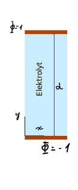

<script type="text/x-mathjax-config">
MathJax.Hub.Config({
    TeX: {
        equationNumbers: { autoNumber: "AMS" }
    }
});
</script>
# Übungsblatt 3: Finite-Elemente in 2D

<div class="alert alert-warning">
Die Abgabe von Arbeitsblatt 1 bis 4 ist verpflichtend und konstituiert die Studienleistung der Veranstaltung <b>Simulationstechniken</b>. Die Arbeitsblätter führen von der mathematischen Formulierung eines Modellproblems hin zur numerischen Lösung dieses Problems und bauen aufeinander auf. Zum Bestehen der Veranstaltung müssen auf <b>jedem</b> Blatt mindestens 50% der erzielbaren Punkte erreicht werden.
</div>
<br>

<div class="alert alert-danger">
<b>Geben Sie bei allen Aufgaben die Lösungswege und Zwischenergebnisse mit an. Das Endergebnis alleine ist nicht ausreichend!</b> Wir empfehlen Ihnen die Nutzung von Python und Jupyter-Notebooks. Sollten Sie ein Jupyter-Notebook verwenden, dann können Sie dieses einfach direkt als Lösung bei uns einreichen. In allen anderen Fällen erzeugen Sie bitte ein PDF und legen die numerischen Codes als separate Datei dazu.
</div>
<br>

<div class="alert alert-block alert-info">
     
Sie werden durch die einzelnen Schritte der Modellimplementierung geleitet, und wir geben Hinweise zur Implementierung. Es ist nicht zwingend notwendig, diese 1-zu-1 zu verfolgen. Im Rahmen dieser Hinweise finden Sie Codeabschnitte, die Sie verwenden können. Sie dürfen natürlich auch die Codebeispiele aus dem Vorlesungsmaterial hier verwenden.
    
</div>

# Aufgabe 1 (6 Punkte)
## Entdimensionalisierung der linearisierten Poisson-Boltzmann-Gleichung und der Poisson-Nernst-Planck-Gleichungen

##### Lernziele

Der Studierende...

- ...lernt die Herleitung und den Umgang mit entdimensionalisierten Gleichungen.

### Motivation

- Entimensionalisierung rückt alle Werte näher an die Größenordnung 1 heran.
- Dies kann bei der Konvergenz der Lösung helfen und vereinfacht die Wahl der Konvergenzkriterien.

Winzige oder riesige Zahlen sind in der Regel für den Computer kein großes Problem. Über die interne Darstellung als Fließkommazahlen in der Form 1.564912 10⁴ mit *Mantisse*, *Basis* und *Exponent* (s.h. z.B. https://de.wikipedia.org/wiki/Gleitkommazahl) kann der Computer mit Werte ganz verschiedener Größendordnungen umgehen.

`numpy` arbeitet standardmäßig mit 64-bit Fließkommazahlen (s.h. https://numpy.org/devdocs/user/basics.types.html#extended-precision). Damit lässt sich etwa eine Präzision von $$10^{-15}$$ erreichen (s.h. z.B. https://en.wikipedia.org/wiki/Double-precision_floating-point_format#IEEE_754_double-precision_binary_floating-point_format:_binary64). Vergleichen Sie dazu die Ausgabe von


```python
import numpy as np
```


```python
np.finfo(float)
```


    finfo(resolution=1e-15, min=-1.7976931348623157e+308, max=1.7976931348623157e+308, dtype=float64)


und


```python
np.finfo(np.float64)
```


    finfo(resolution=1e-15, min=-1.7976931348623157e+308, max=1.7976931348623157e+308, dtype=float64)


Problematisch wird es, wenn mit verschiedenen Variablen gearbeitet wird, die 
sich um mehr als 15 Größenordnungen unterscheiden.  Wenn man solche Werte 
addiert, macht man also numerische Fehler. Vergleichen Sie dazu die Ausgabe von


```python
np.float64(1e-15) + np.float64(1)
```


    1.000000000000001


mit


```python
np.float64(1e-16) + np.float64(1)
```


    1.0


Bei unseren nichtlinearen Differentialgleichungen, in denen 
physikalische Größen verschiedener Natur auftreten, können die Unterschiede
in der Größenordnung gerade in der elektrochemischen Doppelschicht mit
stark erhöhten oder verdünnten Konzentrationen schnell an diese Grenze stoßen,
wenn in SI-Einheiten gerechnet wird. 
Zudem ist es nicht möglich,
sinnvolle Konvergenzkriterien für iterative Löser zu definieren, weil
unterschiedliche absolute Fehler für Spannungen und Konzentrationen 
zulässig sind. 
Entdimensionalisierung wird hier notwendig, um Konvergenz sicherzustellen.

In der Entdimensionalisierung ersetzt man SI-Einheiten mit charakteristischen Maßen des Systems. Im elektrochemischen Kontext ist z.B. die Debye-Länge eine sinnvolle Wahl, oder auch die Länge der Simulationsdomäne. Die sinnvolle Wahl der Einheiten genießt also Spielraum.

Bei geschickter Wahl der Einheiten werden Parameter in den entdimensionalisierten Gleichungen auf Einheitsgrößen reduziert, sodass eine Simulation über geeignete Skalierung auf unterschiedliche physikalische Situationen bezogen werden kann. Die nun effektiv geringere Anzahl an Parameter macht die Simulation selbst übersichtlicher. 


### Vorgegebenes Einheitensystem


Konzentrationseinheit: $$c^\infty$$, werden wir als identisch für alle Spezies annehmen. 

Ladungseinheit: $$q_e$$, die Ladung eines Elektrons (Absolutwert).

Einheit für das elektrische Potential: $$k_B T / q_e$$, die *Temperaturspannung* (engl. "*thermal voltage*").

Längeneinheit: $$\lambda = \sqrt{\frac{\varepsilon k_B T }{2 q_e ^2 c^\infty}}$$ die *Debye-Länge* (für zwei Ionenspezies).

Zeiteinheit: $$\lambda^2 / D$$


*Anmerkung zur Konzentrationseinheit*: In diesem und im nächsten Übungsblatt werden wir statische Poisson-Boltzmann-Systeme (PB) und dynamische Poisson-Nernst-Planck-Systeme (PNP) betrachten. In allen Systemen gehen wir von symmetrischen Elektrolyten aus, d.h. Anionen und Kationen sind (im geschlossenen System anfänglich, im offenen System im Bad) in gleicher Menge vorhanden. Wir sprechen daher häufig im Singular von *der Referenzkonzentration*. In PB-Systemen stellt die in der PB-Gleichung auftretende Konzentration $$c^\infty$$ eine natürliche Referenzeinheit dar. Diese Konzentration entspricht im offenen System der Konzentration im Bad. Im (geschlossenen dynamischen) PNP-System werden wir die (initiale) mittlere Konzentration ebenfalls $$c^\infty$$ nennen und als Referenzeinheit wählen.

### Aufgabe  1.1: Nichtlineare Poisson-Boltzmann-Gleichung (2 Punkte)

Die Poisson-Boltzmann-Gleichung lautet 
\begin{equation}
\nabla^2\Phi = -\frac{1}{\varepsilon}\sum_{\alpha} q_\alpha\, c^\infty\, \exp\left(\frac{-q_\alpha\Phi}{k_B T}\right)\,\text{.}
\end{equation}

Schreiben Sie diese Gleichung mithilfe der entdimensionalisierten Größen 

\begin{align}
\tilde \Phi &= \Phi q_e / k_B T 
\\
\tilde x &= x/\lambda
\\
\tilde y &= y/\lambda
\\
\tilde q_\alpha &= q_\alpha / q_e
\end{align}

### Aufgabe 1.2: Linearisierte Poisson-Boltzmann-Gleichung (1 Punkt)

Bringen Sie die für ein binäres, symmetrisches Elektrolyt einfacher Ladung linearisierte Poisson-Boltzmann-Gleichung in entdimensionalisierte Form.

### Aufgabe 1.3: Poisson-Nernst-Planck-Gleichungen (3 Punkte)

Bringen Sie die Poisson-Nernst-Planck-Gleichungen,

\begin{equation}
\frac{\partial c_\alpha}{\partial t} =  \nabla \cdot D_\alpha \left( \nabla c_\alpha + \frac{q_\alpha c_\alpha}{k_B T} \nabla \Phi \right)
\end{equation}

und

\begin{equation}
\nabla^2\Phi = -\frac{1}{\varepsilon}\sum_{\alpha} q_\alpha\, c_\alpha,
\end{equation}

in entdimensionalisierte Form. Wählen Sie $$\tilde c_\alpha = c_\alpha / c^\infty$$ und nehmen Sie die Diffusinskonstanten $$D_\alpha$$ als konstant im Rechengebiet und equivalent für alle Spezies an, d.h. $$D_\alpha = D$$ für alle $$\alpha$$.

Im Folgenden bezeichnen $$\Phi, c_\alpha, q_\alpha$$ die entdimensionalisierte Größen. Dimensionsbehaftete Größen mit einem Superskript $$^D$$ gekennzeichnet, z.B. $$\Phi^D$$.

# Aufgabe 2 (40 Punkte)
## Stationäre Lösung der linearisierten Poisson-Boltzmann-Gleichung in 2D

##### Lernziele

Der Studierende...
* ...lernt dem Umgang mit finiten Elementen auf zweidimensionalen strukturierten Gittern.

### Die linearisierte Poisson-Boltzmann-Gleichung

Wir lösen die linearisierte Poisson-Boltzmann-Gleichung, die wir in Aufgabe 1 entdimensionalisiert haben, auf dem zweidimensionalen Gebiet $$\Omega$$. Auf dem Rand $$\partial \Omega_D$$ herrschen Dirichlet-Randbedingungen, und auf dem Rand $$\partial \Omega_N$$ gelten Neumann-Randbedingungen. 

Der  Einfachheit halber verzichten wir darauf, $$\tilde \Phi$$ für die entdimensionalisierte Größe zu verwenden, und schreiben direkt $$\Phi$$. Bei der Interpretation der Ergebnisse werden wir die Dimensionsbehaftete Größe explizit kennzeichnen: $$\Phi^D$$.


### Aufgabe 2.1: Herleitung des diskretisierten  Gleichungssystems (12 Punkte)

#### Aufgabe 2.1.1 Schwache Form (1 Punkt)

Bringen sie die lineare Poisson-Boltzmann-Gleichung in die schwache Form und reduzieren Sie die Differenzierbarkeitsanforderungen. 

#### Aufgabe 2.1.2: Diskrete Formulierung (1 Punkt)

Drücken Sie $$\Phi$$ mit Hilfe einer Funktionenbasis $$\{\varphi_i\}$$ aus und überführen Sie die Integralgleichung mit Hilfe der Galerkinmethode in ein algebraisches Gleichungssystem.

Im Folgenden werden wir nur noch Dirichlet-Randbedingungen und homogene Neumann-Randbedingungen, $$\nabla \Phi(x,y) = 0$$ für $$(x,y) \in \partial \Omega_N$$, betrachten. Dadurch vereinfacht sich das Gleichungssystem leicht.

#### Aufgabe 2.1.3: Finite-Elemente-Diskretisierung (2 Punkte)

Wir betrachten ein rechteckiges Gebiet mit einem regulären Gitter an dreieckigen Elementen. Das folgende Bild zeigt zum Beispiel ein Gitter mit 4 Knoten in x- und y-Richtung.


Eingetragen ist die serielle Indexierung der Knoten, <font color="red">Elemente</font> und <font color="blue">Kästen</font>.
K
Die Knoten und Kästen können auch durch ein Paar kartesischer Indizes identifiziert werden, die wir ebenfalls bei 0 anfangen lassen. Zum Verständnis der kartesischen Indizes ist es nützlich, sich zu überlegen beispielsweise welchen kartesischen Indizes Knoten 5 hat und welchen kartesischen Indizes Kasten 5 hat.

Verwenden Sie stückweise lineare Basisfunktionen und beschränken Sie sich auf den Funktionenraum

\begin{equation}
\Phi(x, y) = \sum_i \varphi_i(x, y)\,\Phi_i~\text{.}
\end{equation}
$$i$$ ist der Index des Knotens. Die Basisfunktionen haben die Eigenschaft $$\varphi_i(x_j, y_j) = \delta_{ij}~\text{,}$$
wobei es sich bei $$\delta_{ij}$$ um das Kronecker-Delta mit $$\delta_{ij} = 1 $$ für $$i=j$$ und $$\delta_{ij} = 0 $$ für $$i\neq j$$ und bei $$x_j, y_j$$ um die kartesischen Koordinaten des Knoten $$j$$ handelt.

Innerhalb eines Elementes $$e$$,  $$ (x, y) \in \Omega_e$$, lässt sich 
$$\varphi_i(x, y)$$ mithilfe der linearen Formfunktionen aufschreiben: 

\begin{equation}
\varphi_{g(e, I)}(x, y) = N^{(e)}_{I}(x, y) = a + b x + c y
\end{equation}

Dabei bezeichnet $$g(e, I)$$ die Abbildung vom lokalen Knotenindex $$I\in\{0,1,2\}$$ auf Element $$e \in \{0, ..., N_e-1\}$$ zum globalen Knotenindex $$i \in \{0, ..., N_{n}-1\}$$. $$N^{(e)}_{I}(x, y)$$ ist eine abgekürzte Schreibweise für $$N_{I}(\xi^{(e)}(x,y), \eta^{(e)}(x,y))$$. 

Geben Sie $$\nabla N^{(e)}_I(x,y)$$ an.

#### Aufgabe 2.1.4: Berechnung der Systemmatrix (6 Punkte)

Mit der Galerkin-Methode erhält man ein Gleichungssystem der Form $$\sum_j K_{ij} \Phi_j = b_i $$, wobei $$K_{ij}$$ Integrale der Form $$\int \limits_{\Omega} dx dy \nabla \varphi_i \cdot \nabla \varphi_j$$ und $$\int \limits_{\Omega} dx dy \varphi_i \varphi_j$$ enthält. Die nicht verschwindenden Elemente dieser Systemmatrix lassen sich Elementweise mithilfe der Formfunktionen aufschreiben, z.B. 

\begin{equation}
K_{ij} =\int \limits_{\Omega} dx dy\ \varphi_{i}  \varphi_{j}
\end{equation}

\begin{equation}
K_{ij} = \int \limits_{\Omega} dx dy \left( \sum_e \sum_I N^{(e)}_I \delta_{g(I,e)i} \right) \varphi_{j}
\end{equation}

\begin{equation}
K_{ij} = \int \limits_{\Omega} dx dy \left( \sum_e \sum_I \delta_{g(I,e)i} \right) \varphi_{j}
\end{equation}

\begin{equation}
K_{ij} = \sum_e \sum_I \delta_{g(e,I)i} \delta_{g(e,J)j} \int \limits_{\Omega_e} dx dy N^{(e)}_I N^{(e)}_J 
\end{equation}

\begin{equation}
K_{ij} = \sum_e \sum_I \delta_{g(e,I)i} \delta_{g(e,J)j} K^{(e)}_{IJ}
\end{equation}

Die globale Matrix $$\underline{K}$$ kann mit Hilfe von $$3\times3$$ Elementmatrizen $$\underline{K}^{(e)}$$ aufgeschrieben werden. Aufgrund des regulären Gitters sind alle Elementmatrizen $$\underline{K}^{(e)}$$ identisch. $$g(e,I)$$ bezeichnet hier den globalen Knoten, welcher zum lokalen Knoten $$I$$ in Element $$e$$ gehört.

Die Systemmatrix kann in Beiträge von den unterschiedlichen Elementen, und damit von den einzelnen Formfunktionen, zerlegt werden. Im folgenden sollen Sie diese Beiträge berechnen, die die Elementmarix liefern.

##### Schritt 1

Berechnen Sie


\begin{equation}
\int \limits_{\Omega^{(e)}} dx dy \  \nabla N_I \cdot \nabla N_J
\end{equation}


Da in den Gradienten nur Abstände zwischen Gitterpunkten auftreten und die Knoten regelmäßig verteilt sind, werden diese Integrale für jedes Element das gleiche Ergebnis liefern.

Im regelmäßigen Gitter gibt es zwei Arten von Dreiecken. Wenn wir die Ecken $$0, 1, 2$$ gegen den Uhrzeigersinn (positiver Umlaufsinn) bennenen, wie unten illustriert, dann sind diese Dreiecke aber identisch bis auf eine 180° Rotation. $$0$$ bezeichnet die Ecke mit dem rechten Winkel.


```
    2
    | \
    |  \ 
∆y  |   \
    |    \
    0 --- 1

      ∆x
      
 oder 
 
       ∆x
     1 ---0
      \   | 
       \  |  ∆y 
        \ |  
         \|
          2

```


Wie lautet die Elementmatrix des Laplace-Operators für den Sonderfall $$\Delta x=\Delta y$$?

##### Schritt 2

Implementieren Sie die Elementmatrix für den Laplace-Operator

```python
def laplace_element_matrix(dx, dy):
    """
    Construct the element matrix of the partially integrated Laplace operator with
    homogeneous Neumann boundary conditions.

    The rows and columns of the element matrix correspond to the nodes (corners of
    the triangle) ordered in geometric positive order, starting with the node with
    the 90° angle.

    Parameters
    ----------
    dx : float
        Grid spacing in x direction
    dy : float
        Grid spacing in y direction

    Returns
    -------
    element_matrix_ll : numpy.ndarray
        Array of shape (3,3) containing the element matrix
    """
    pass
```

##### Schritt 3

Berechnen Sie die Elementmatrix für den Term in $$\Phi$$, der bei der Überführung in die schwache Form aus der rechten Seite der linearisierten Poisson-Boltzman Gleichung hervorgegangen ist. Diese Matrix nennen wir Massenmatrix. Schreiben Sie wiederum eine Funktion, die diese Matrix konstruiert:

```python
def mass_element_matrix(dx, dy):
    return ....

```

Die Integrale sind ein aufwendiger zu berechnen, als die des Laplace-Operators. 

Berechnen Sie 

$$\int \limits_{\Omega_e}   N^{(e)}_1  N^{(e)}_2 \ dx dy $$.

Den Rest der Matrix dürfen Sie aus dem Skript entnehmen.

#### Aufgabe 2.1.5: Zusammenbau der Systemmatrix (1 Punkt)

siehe z.B.
[Larson, M. G. et al. 10, (Springer Berlin Heidelberg, 2013)] Algo 11

Wir bauen erst die Systemmatrix zusammen, ohne uns Gedanken über die Randbedingungen zu machen. Danach werden die Matrix und die rechte Seite entsprechend der Dirichlet- und Neumann-Randbedingungen (und eventueller Quellterme) justiert.

Sie haben jetzt die einzelnen Integrale der diskretisierten schwachen Formulierung auf Elementebene ausgewertet. Jetzt müssen Sie das gesamte Integral 

\begin{equation}
\int \limits_{\Omega} \ldots = \sum_{e} \int \limits_{\Omega_e} \ldots
\end{equation}

berechnen, also die einzelnen Beiträge der Integrale über die Elemente aufsummieren.

Graphisch kann man sich das folgendermaßen vorstellen: 

</img>

Die Aufgabe besteht darin, für jedes Element die Einträge der Elementsteifigkeitsmatrix an der entsprechenden Stelle in der Gesamtmatrix aufzuaddieren. Dafür braucht man eine Tabelle oder Funktion, die den Knoten an den Ecken des Elementes einen globalen Index zuweist.

Der Einfachheit halber sollten Sie zuerst die Beziehung zwischen lokalen Elementecken und globalen Knotenindizes für das oben illustrierte 4 x 4 Knoten Gitter von Hand in einer Tabelle aufschreiben:

```python
element_indices = [
[0,1,4],
...
[15, 14, 11]
]
```

Damit können Sie im Zweifelsfall auch schon die ersten Testbeispiele weiter unten simulieren. Später sollten die Indizes automatische erstellt werden, um beliebige Gittergrößen zu ermöglichen.

Hier ein Paar Schritte, die bei der Ermittlung der Beziehung zwischen den Indexierungssystemen helfen können:

* Geben Sie die Beziehung zwischen dem seriellen Index $$k$$ und dem kartesischen Index-Paar $$i, j$$ eines Knotens an.

* Geben Sie die Beziehung zwischen dem seriellen Index $$k$$ und den kartesischen Indexen $$i, j$$ einer Box an.


Implementieren Sie folgende Funktionen, die zwischen den verschiedenen Indexierungen hin- und herkonvertieren:


```python
def node_coordinates(g, nb_nodes):
    """
    Convert the global linear consecutive index of a node to its Cartesian coordinates.
    
    Parameters
    ----------
    g : int
        global linear index of the node
    nb_nodes : tuple of ints
        Number of nodes in the Cartesian directions
        
    Returns
    -------
    i : int
        x-coordinate (integer) of the node
    j : int
        y-coordinate (integer) of the node
    """
    pass


def node_index(i, j, nb_nodes):
    """
    Turn node coordinates (i, j) into their global node index.

    Parameters
    ----------
    i : int
        x-coordinate (integer) of the node
    j : int
        y-coordinate (integer) of the node
    nb_nodes : tuple of ints
        Number of nodes in the Cartesian directions

    Returns
    -------
    g : int
        Global node index
    """
    pass


def make_grid(nb_nodes):
    """
    Make an array that contains all elements of the grid. The
    elements are described by the global node indices of
    their corners. The order of the corners is in order of
    the local node index.

    They are sorted in geometric positive order and the first
    is the node with the right angle corner at the bottom
    
    . Elements within the same box are consecutive.

    This is the first element per box:

        2
        | \
        |  \ 
    dy  |   \
        |    \
        0 --- 1
    
          dx
          
    This is the second element per box:
     
           dx
         1 ---0
          \   | 
           \  |  dy 
            \ |  
             \|
              2

    Parameters
    ----------
    nb_nodes : tuple of ints
        Number of nodes in the Cartesian directions

    Returns
    -------
    triangles_el : numpy.ndarray
        Array containing the global node indices of the
        element corners. The first index (suffix _e)
        identifies the element number and the second index
        (suffix _l) the local node index of that element.
    """
    pass
```

Für kleine Gitter können Sie folgende Funktion verwenden, um Ihre Indexierung nach Korrektheit zu überprüfen:


```python
import matplotlib.pyplot as plt


def show_mesh(nb_nodes, physical_sizes):
    """
    Show a simple representation of the grid, showing the order of
    the linear indices for nodes and elements.
    
    Parameters
    ----------
    nb_nodes : tuple of ints
        Number of nodes along x and y direction
    physical_sizes : tuple of floats
        Length of the simulation domain along x and y direction
    """

    def nb_elements(nb_nodes):
        Nx, Ny = nb_nodes
        return (Nx - 1) * (Ny - 1) * 2

    sx, sy = physical_sizes
    Nx, Ny = nb_nodes
    dx = sx / (Nx - 1)
    dy = sy / (Ny - 1)
    assert np.prod(nb_nodes) < 40, "grid to big to be reasonably plotted"

    fig, ax = plt.subplots()
    triangles_el = make_grid(nb_nodes)
    for k in range(nb_elements(nb_nodes)):
        nodes_n = triangles_el[k]
        mean_x = 0
        mean_y = 0
        for n in nodes_n:
            ix, iy = node_coordinates(n, nb_nodes)
            mean_x = mean_x + ix
            mean_y = mean_y + iy
            ax.text(ix * dx, iy * dy, "n{}".format(n))
        ax.text(mean_x / 3 * dx, mean_y / 3 * dy, "e{}".format(k), color="red")

    ax.set_xlim(- dx, Nx * dx)
    ax.set_ylim(- dy, Ny * dy)

    ax.set_xlabel("x")
    ax.set_ylabel("y")
```

#### Aufgabe 2.1.6: Funktionen für die Darstellung der Ergebnisse (0 Punkte)

Farbige 2D "Höhenlinien" Darstellung 


```python
def plot_colormap(field_g, nb_nodes, physical_sizes,
                  show_mesh=False, levels=11):
    """
    Show a scalar field on a triangulated structured grid using
    a colormap representation. The field will be linearly interpolated
    between the node values.
    
    Parameters
    ----------
    field_g : array_like
        Values of the field in serial form (of length corresponding
        to number of nodes)
    nb_nodes : tuple of ints
        Number of nodes (Nx, Ny) in the Cartesian directions
    physical_sizes : tuple of floats
        Length of the simulation domain along x and y direction
    show_mesh : bool, optional
        If True, shows nodes and element boundaries in black
        (Default: False)
    levels : int, optional
        Number of levels in the colormap
        (Default: 11)
    
    Returns
    -------
    figure : matplotlib.Figure
        Figure object
    axes : matplotlib.Axes
        Axes object
    colorbar : matplotlib.Colorbar
        Colorbar object
    """
    import matplotlib.tri as mtri

    Nx, Ny = nb_nodes
    sx, sy = physical_sizes

    dx = sx / (Nx - 1)
    dy = sy / (Ny - 1)

    fig, ax = plt.subplots()

    ax.set_aspect(1)

    x = np.array([node_coordinates(i, nb_nodes)[0] for i in range(np.prod(nb_nodes))])
    y = np.array([node_coordinates(i, nb_nodes)[1] for i in range(np.prod(nb_nodes))])

    x = x * dx
    y = y * dy

    triangles_el = make_grid(nb_nodes)
    triang = mtri.Triangulation(x, y, triangles_el)

    cb = plt.colorbar(ax.tricontourf(triang, field_g, levels=levels))
    if show_mesh:
        ax.triplot(triang, 'ko-')

    ax.set_xlabel(r"x ($$\lambda$$)")
    ax.set_ylabel(r"y ($$\lambda$$)")

    return fig, ax, cb
```

Interpolation zwischen den Knotenpunkten, z.B. für die Darstellung von Schnitten, können Sie folgende Funktion verwenden


```python
def interpolate(x_i, y_i, field_g, nb_nodes, physical_sizes):
    """
    Performs a linear finite element interpolation of the field in x, y 
    
    Parameters: 
    -----------
    x_i, y_i : array_like
        Positions where to interpolate the field
    field_g : array_like
        Values of the field in serial form (of length corresponding
        to number of nodes)
    nb_nodes : tuple of ints
        Number of nodes (Nx, Ny) in the Cartesian directions
    physical_sizes : tuple of floats
        Length of the simulation domain along x and y direction

    Returns: 
    --------
    interpolated_field_i : numpy.ndarray
        Values interpolated at position x_i, y_i
    
    """
    import matplotlib.tri as mtri

    Nx, Ny = nb_nodes
    sx, sy = physical_sizes

    dx = sx / (Nx - 1)
    dy = sy / (Ny - 1)

    _x = np.array([node_coordinates(i, nb_nodes)[0]
                   for i in range(np.prod(nb_nodes))])
    _y = np.array([node_coordinates(i, nb_nodes)[1]
                   for i in range(np.prod(nb_nodes))])

    _x = _x * dx
    _y = _y * dy

    triangles_el = make_grid(nb_nodes)
    triang = mtri.Triangulation(_x, _y, triangles_el)

    interp = mtri.LinearTriInterpolator(triang, field_g)

    return interp(x_i, y_i)
```

#### Aufgabe 2.1.7: Konstituierendes Gleichungssystem aufstellen (1 Punkt)

Sie sollen die einzelnen Schritte beim Erstellen des Gleichungssystems in separaten Funktionen implementieren. Danach sollte sich eine Simulation in einem recht knappen Skript aufsetzen lassen.

```python

# Simulation geometry
nb_nodes = (4, 4)
physical_sizes = (3., 3.)

# Construct system matrix ignoring boundary conditions
# (We call this here the 'bulk' matrix)
system_matrix_gg = poisson_boltzmann_bulk_matrix(nb_nodes, physical_sizes)

# Add source term to the right hand side (may not be necessary)
rhs_g = source(nb_nodes, physical_sizes, 
               source_parameter_1=..., source_parameter_2=...)

# Add boundary condition to matrix and right hand side
my_interesting_bc(
    system_matrix_gg, rhs_g, nb_nodes, physical_sizes,
    bc_parameter_1=..., bc_parameter_2=...)

# Solve linear system
...

# Visualize solution
...
```

Implementieren Sie `poisson_boltzmann_bulk_matrix`.

### Aufgabe 2.2: Modellvalidation gegen das 1D Problem (10 Punkte)

Um unser Modell zu validieren, betrachten wir wieder den Plattenkondensator aus Übungsblatt 1. Aufgrund der Struktur des Gitters ist es einfacher, wenn die Kondensatorplatten oben ($$y=d$$) und unten ($$y=0$$) liegen statt links und rechts. Bitte setzen Sie auf der unteren Platte ein (entdimensionalisiertes) Potential von $$-1$$ an und auf der oberen Platte ein Potential von $$1$$ an. Es gibt keinen Quellterm. 



#### Aufgabe 2.2.1: Analytische Referenzlösung (0 Punkte)

Die analytische Lösung zu $$\frac{\partial^2\Phi}{\partial x^2} - \Phi = 0$$ mit den Randbedingungen $$\Phi(0) = \Phi_0$$ und $$\Phi(L) = \Phi_1$$ und Abstand $$L$$ zwischen den Kondensatorplatten wurde in Übungsblatt 1 aufgestellt. Implementieren Sie diese als

```python
def poisson_boltzmann_linear_1d_ana(y, potential_bottom, potential_top, plate_separation):
    """
    Parameters
    ----------
    y : array_like
        Positions where to evaluate the analytical solution.
        In unis of the debye length
        debye^2 = kT*permittivity / (q**2 * concentration_bath)
    potential_bottom : float
        Value of the electric potential on the plate at y = 0
        In units of the thermal_voltage =  kb*T / q 
    potental_top : float
        Value of the electric potential on the plate at y = plate_separation
    plate_separation : float 
        distance between the bottom and top plate in units of the debye length
    
    Returns 
    -------
    potential : np.ndarray
        Analytical solution of the 1D linearized Poisson-Boltzman equation
    """
    pass
```

#### Aufgabe 2.2.2: Randbedingungen in 2D (2 Punkte)

Mit welcher Randbedingungen "links" und "rechts" lässt sich der unendliche Plattenkondensator auch mit der 2D-Diskretisierung modellieren?

Implementieren Sie diese Randbedingungen und vergleichen Sie Ihr Modell mit der analytischen Lösung. Variieren Sie die Größe des Gitters um die Konvergenz der Lösung mit Auflösung der Simulation. Implementieren Sie dafür folgende Funktion, die die Systemmatrix und die rechte Seite (right hand side, rhs) entsprechend modifiziert:

```python
def two_electrode_bc(system_matrix_gg, rhs_g, nb_nodes, potential_bottom, potential_top):
    """
    Modifies the global system matrix and the right hand side according to following boundary conditions: 
    bottom and top faces: Dirichlet
    left and right faces: Neumann homogeneous
    
    Parameters
    ----------
    system_matrix_gg : ndarray of shape (Nx * Ny, Nx * Ny)
        System matrix with natural boundary conditions
    rhs_g: ndarray of shape (Nx * Ny)
        Right hand side with natural boundary conditions
    nb_nodes : tuple of ints
        Number of nodes in the Cartesian directions (Nx, Ny)
    potential_bottom : float
        Value of the electric potential on the bottom electrode (y = 0)
    potential_top : float
        Value of the electric potential on the top electrode (y = plate_separation )
    
    """
    
    pass
```

Die Dirichlet-Randbedingungen lässt sich am einfachsten implementieren, indem Sie die entsprechenden Randknoten auf den gewünschten Wert zwingen. Das können Sie erreichen, indem Sie in Ihrer Funktion alle Elemente der Systemmatrix $$K_{ii} = 1$$ und $$K_{ij} = 0 ~\forall i \neq j$$ und den entsprechenden Eintrag im Quellvektor (rhs) $$b_i = \Phi_{0}$$ auf dem linken Rand und $$\Phi_{1}$$ auf dem rechten Rand setzen, falls $$i$$ einen Knoten auf einem dieser Dirichlet-Ränder beschreibt.

#### Aufgabe 2.2.3: Die erste Simulation (4 Punkte)

Stellen Sie die Lösung mit der Funktion `plot_colormap` für $$4\times 4$$ Knoten und einer physikalischen Systemgröße von $$5\lambda \times 5 \lambda $$ dar.

#### Aufgabe 2.2.4: Gitterkonvergenz und Vergleich mit der analytischen Lösung (4 Punkte)

Vergleichen Sie numerische Lösung und analytische Lösung für $$2\times 4$$, $$4 \times 4$$, $$2 \times 8$$, $$2 \times 16$$, $$2 \times  32$$,  $$16 \times 16$$ Knoten. Benutzen Sie dabei eine Systemgröße von $$5 \lambda \times 5\lambda$$. Stellen Sie die Lösung an den Knotenpunkten bei $$x = 0$$ dar.

### Aufgabe 2.3: Elektrolytkondensator in 2D (8 Punkte)

Jetzt widmen wir uns einem Problem, das wir analytisch nicht lösen können. Analog zur Vorlesung schauen wir uns einen Plattenkondensator an, mit dem Unterschied, dass sich jetzt ein Elektrolyt, also bewegliche Ladungen, zwischen den Platten befindet. An der Oberfläche der Platten befinden sich zwei gegenüberliegende Elektroden mit Potiential $$\Phi_u$$ und $$\Phi_o$$. Die Platten sind unendlich breit und haben den Abstand $$d$$. Die Elektrodenhaben eine endliche Länge $$L$$.


Links und rechts der Elektroden nehmen wir an, dass das elektrische Feld keine Komponente Senkrecht zur Oberfläche hat. 
Weit von den Elektroden klingt das elektrische Feld zu Null ab, was wir durch die Bedingung $$\partial \Phi / \partial x = 0$$ Auf dem rechten Rand der Simulationsdomäne approximieren. Wir werden später bestimmen, wie groß die "Puffer-Zone" dafür sein muss.

Das System besitzt eine vertikale Symmetrieebene die durch die Mitte beider Elektroden geht. Dies erlaubt uns, nur die Hälfte des Systems zu simulieren, wobei die Symmetriebedingung auch wieder durch eine homogene Neumann Randbedingung erzwungen wird.

Verwenden Sie folgende Parameter

* $$c_{\infty}^D = 100 ~\mathrm{mol}\, \mathrm{m}^{-3}$$, wobei $$\mathrm{mol} = N_A$$ einfach als Avogadro-Zahl betrachtet wird.
* $$q_e^D = 1.602\cdot 10^{-19}\mathrm{A} \mathrm{s}$$
* $$\varepsilon = 80 \cdot 8.85\cdot 10^{-12}\mathrm{A} \, \mathrm{s} \, \mathrm{V}^{-1} \, \mathrm{m}^{-1}$$
* $$k_B = 1.380649\cdot 10^{-23} \mathrm{J} \, \mathrm{K}^{-1}$$
* $$T = 293.15 \mathrm{K}$$
* Avogrado-Zahl $$N_A = 6.022\cdot 10^{23}$$
* Elektrodenbreite: $$L^D=10~\text{nm}$$
* Plattenabstand: $$d^D=5~\text{nm}$$
* Potential unten: $$\Phi_u^D = -0.1~\text{V}$$
* Potential oben: $$\Phi_o^D = 0.1~\text{V}$$


#### Aufgabe 2.3.1: Randbedingungen implementieren (4 Punkte)

Lösen Sie das obige Problem und stellen Sie die Lösung für $$3\times 3$$ Knoten und einer Simulationsdomänengröße von $$10 ~\text{nm}\times 5 ~\text{nm}$$. Vergessen Sie nicht, dass nur die Hälfte der Elektroden simuliert werden, i.e. die Simulationsdomänengröße entspricht dem roten Kasten in der Abbildung. Benutzen Sie `plot_colormap` mit `levels=np.linspace(-0.1, 0.1., 11)` für die Visualisierung. Stellen Sie die Ergebnisse in SI Einheiten dar.


#### Aufgabe 2.3.2: Gitterkonvergenz (4 Punkte)

Stellen Sie den Verlauf des Potentials als Querschnitt bei $$y^D = 0.1~\text{nm}$$ dar. Zeigen Sie, wie die Lösung mit 

* zunehmender Gitterfeinheit einerseits und 
* zunehmendem Abstand des Neumann-Randes zur Elektrode ("Pufferzone") andererseits 

konvergiert. 

### Aufgabe 2.4: Berechnung der Kapazität (10 Punkte)

In der Vorlesung wurde der Zusammenhang zwischen der elektrischen Ladung auf der Elektrode und dem elektrischen Feld an dieser Elektrode erklärt. Damit wollen wir untersuchen, wie die Kapizät des Kondensators vom Elektrolyten beeinflusst wird. 
Wir arbeiten hier wieder mit den dimensionslosen Größen. Die Bedeutung der Ergebnisse erläutern wir auch anhand der dimensionsbehafteten Größen, die mit einem Exponent $$^D$$ gekennzeichnet werden.

#### Aufgabe 2.4.1: Kapazität und Aspektverhältnis (4 Punkte)

Stellen Sie die entdimensionalisierte Kapazität $$C = C^D / \varepsilon^D t^D$$ in Abhängigkeit des Aspektverhältnisses $$d / L$$ für verschiedene Elektrodenlängen $$L$$ auf logarithmischer Skala dar. $$t^D L^D$$ ist die Fläche des Kondensators.

Verwenden Sie folgende Parameterkombinationen:
- $$\Delta x = \Delta y = 0.0125$$, $$N_p=32$$,
- $$\Delta x = \Delta y = 0.05$$, $$N_p=128$$,
- $$\Delta x = \Delta y = 0.2$$, $$N_p=128$$,

wobei $$N_p$$ die Anzahl an Knoten in der Elektrode ist. Eine Puffer-Zone von einer Länge von etwa $$\text{min}(1, d)$$ sollte ausreichend sein, da 1 der Debye Länge entspricht. 

Variieren Sie den Abstand $$d$$ ($$N_y=8,16,32,64$$) für jede dieser Parameterkombinationen. 

Um den Diskretisierungsfehler abzuschänen können wir noch gröber diskretisierte Simulationen einzeichnen, z.B.:

- $$\Delta x = \Delta y = 0.025$$, $$N_p=16$$, $$N_y=32$$
- $$\Delta x = \Delta y = 0.1$$, $$N_p=256$$, $$N_y=16$$

In der Vorlesung wurde gezeigt, dass bei kleinen Aspektverhältnissen $$d/L$$, $$L/d$$ der Kapazität des Plattenkondensators ohne Elektrolyt entspricht. Zeichnen sie $$C = L/d$$ als Anhaltspunkt auch ein.

Bei fixem Aspektverhältnis bedeutet ein größeres $$L$$ dass die gesamte Geometrie bei konstanter Debye-Länge vergrößert wird. Das kann aber auch so interpretiert werden, dass die Geometrie fixiert bleibt und sich die Debye-Länge verkürzert, z.B. durch eine höhere Ionenkonzentration.


#### Aufgabe 2.4.2: Betrachtung von Grenzfällen (1 Punkt)

Erklären Sie was Sie für die Grenzfälle $$L$$ und $$d$$ $$\gg 1$$ und $$L$$ und $$d$$ $$\ll 1$$ beobachten.


#### Aufgabe 2.4.3: Kapazität und Debye-Länge (3 Punkte)

Wir wollen jetzt verstehen, wie die Kapazität im Grenzfall $$d \gg 1$$ von $$L^D$$ und $$\lambda$$ abhängt.

Stellen Sie die Kapazitäts als Funktion der Länge der Elektrode dar. Verwenden Sie folgende Parameter: 

- $$\Delta x = \Delta y = 0.2$$
- $$N_y =  32, 64$$
- $$N_p = 2,4,8,16,32,64$$


#### Aufgabe 2.4.4: Analytische berechnung der Kapazität (2 Punkte)

In Übungsblatt 1 haben sie die Poisson-Boltzmann Gleichung im eindimensionalen Fall analytisch gelöst. Berechnen Sie die Kapazität des Kondensators mit Hilfe des analytischen Modells aus. Stellen Sie diese in Zusammen mit Ihren Simulationsergebnissen in 2.4.1 und 2.4.3 dar.


### Aufgabe 2.5: Praktische Anwendung (0 Punkte)

Wie lässt sich dieser Kondensator auch als Sensor verwenden ? 
