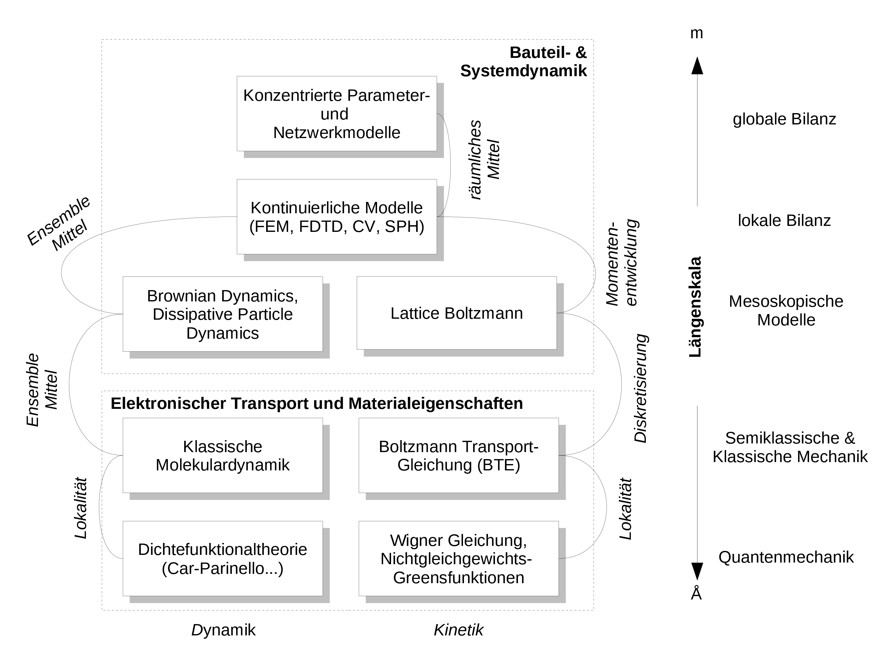

<h2 class='chapterHead'>Kapitel 1 Einleitung</h2>

<!-- l. 6 -->
Kontext: Die Simulation beschäftigt sich mit der numerischen
(computergestützten) Lösung von Modellen. In diesem einleitenden Kapitel
gehen wir auf Modellbildung ein und stellen unterschiedliche Klassen von
Modellen vor. Diese Modelle werden mathematisch üblicherweise mit Hilfe
von Differentialgleichungen beschrieben, d.h. die Simulation ist oft (aber
nicht immer) die numerische Lösung von gewöhnlichen oder partiellen
Differentialgleichungen. In dieser Lehrveranstaltung werden wir vornehmlich die
Lösung von partiellen Differentialgleichungen mit Hilfe der Methode der finiten
Elemente besprechen. 

<!-- l. 10 -->
<a class='url' href='https://uni-freiburg.cloud.panopto.eu/Panopto/Pages/Embed.aspx?id=e484ec5a-a280-479d-8144-ac7201129f9f'>https://uni-freiburg.cloud.panopto.eu/Panopto/Pages/Embed.aspx?id=e484ec5a-a280-479d-8144-ac7201129f9f</a>

<h3 class='sectionHead'>1.1  Modelle</h3>
<!-- l. 14 -->
Modelle sind üblicherweise für bestimmte Längenskalen angemessen. So kann
z.B. ein Modell, welches explizit Atome beschreibt, auf Längenskalen \(\sim \text{nm}\)
angemessen sein; ein “makroskopisches” System mit Abmessungen \(\sim \text{mm}\) würden wir
mit einem solchen Modell aber nicht beschreiben wollen. Wir müssen uns daher
darüber klar werden, welches der Phänomene der Ingenieurswissenschaften die
Anwendung welcher physikalischer Modelle und welcher mathematischer
Methoden verlangt.

<!-- l. 18 -->
Anmerkung: “Wollen” ist hier das falsche Wort. Zum einen ist es auf Grund
begrenzter Computerressourcen nicht möglich, zum anderen versteckt
sich in einem solchen Modell unter Umständen die essentielle Frage,
die wir beantworten wollen, wie die legendäre Nadel im Heuhaufen. 

<!-- l. 22 -->
 Abbildung <a href='#x1-2001r1'>1.1<!-- tex4ht:ref: fig:Scheme --></a> zeigt in der vertikalen Anordnung von Längenskalen und deren
Zuordnung zu verschiedenen Beschreibungsebenen. Auf der kürzesten
Längenskala ist meist eine quantenmechanische Beschreibung notwendig. Dies
bedeutet, wenn wir die Phänomene in Å auflösen wollen, befinden wir uns auf
der Beschreibungsebene der Quantenmechanik und alle zugrundeliegenden
Modelle sind von quantenmechanischer Natur. D.h. wir haben es hier im
nichtrelativistischen Fall mit der Schrödingergleichung zu tun. Diese ist in

verschiedenen Methoden implementiert, wie z.B. der Dichtefunktionaltheorie, einer
Vielteilchenbeschreibung des quantenmechanischen elektronischen Systems. Bei
dieser Art der Vielteilchenbeschreibung handelt es sich, im Gegensatz zur
Molekulardynamik als Methode auf einer größeren Längenskala, nicht um eine
Beschreibung von Punktteilchen, sondern um gekoppelte Felder, was den Aufwand
im Vergleich zu einer reinen Punktmechanik wesentlich erhöht. In der
Punktmechanik haben wir es mit drei Orts- und drei Geschwindigkeitsvariablen
für jedes der \(n\) wechselwirkenden Teilchen zu tun, während wir in einer
quantenmechanischen Vielteilchenbeschreibung es mit einem Feld mit je drei \(n\)
Ortsvariablen zu tun haben, nämlich \(\Psi (\v{r}_1,\v{r}_2,\dots ,\v{r}_n;t)\).

<figure class='figure'>

<!-- l. 41 -->

<!-- l. 45 -->
  

<figcaption class='caption'>Abbildung 1.1:: Die vertikale Anordnung der Kisten repräsentiert die
Längenskale, welche auf der rechten Seite gezeigt ist. In den Kästen selbst
stehen Simulationsmethode welche auf diesen Skalen Anwendung finden. In
dieser Lehrveranstaltung beschäftigen wir uns mit der Diskretisierung von
Feldern und wählen einen spezifischen Anwendungsfall, der in die lokale
Bilanz hineinfällt. </figcaption><!-- tex4ht:label?: x1-2001r1.1 -->

</figure>

<!-- l. 51 -->
Anmerkung: 

<ul class='itemize1'>
<li class='itemize'>\(1\,\AA =10^{-10}\,\text{m}\)
</li>
<li class='itemize'>Atome
in unserer Umwelt werden durch quantenmechanische Phänomene
zusammengehalten. Modelle die auf quantenmechanischen Prinzipien
fußen, heißen auch ab-initio (“von Anfang an”) Modelle. Im Englischen
werden solche Modell auch als “first principles” Modelle bezeichnet.
Die fundamentale Gleichung, welche quantenmechanische Objekte
beschreibt, ist die Schrödingergleichung. Diese selbst ist in der Tat
bereits eine Näherung!
</li>
<li class='itemize'>Die Einteilchen-Schrödingergleichung
lautet \(i\hbar \frac{\partial }{\partial t} \Psi (\v{r},t) = \hat{H} \Psi (\v{r},t)\). Dies ist eine partielle Differentialgleichung für das orts- und
zeitabhängige skalare Materiefeld \(\Psi (\v{r},t)\), mit der Planckschen Konstanten \(\hbar \)
und dem Hamiltonoperator \(\hat{H}\), der die Details des Modells enthält. Eine
Bewegungsgleichung für viele wechselwirkende Teilchen, wie sie durch
\(\Psi (\v{r}_1,\v{r}_2,\dots ,\v{r}_n;t)\) beschrieben wird, ist unvergleichlich umfangreicher.
</li>
<li class='itemize'>“Semiklassisch“ bedeutet, dass die Bewegung der Teilchen nach
der klassischen Mechanik berechnet werden, die Wechselwirkungen
der Teilchen untereinander aber aus quantenmechanischen Gesetzen
abgeleitet sind. Dies ist natürlich eine Näherung, die es zu
rechtfertigen gilt.
</li>
<li class='itemize'>“Mesoskopisch” heißt, dass das Modell über eine innere Längenskala
verfügt und/oder thermische Fluktuationen wichtig sind. Diese
Modelle operieren meistens auf Längenskalen oberhalb der atomaren
Skala (\(\sim \) nm) aber unterhalb der Skalen unserer Wahrnehmung der
Umwelt (\(\sim \) mm).
</li>
<li class='itemize'>“Bilanz” heißt, dass der Kern der Beschreibung
eine Erhaltungsgröße ist, die einfach gezählt werden kann. Erhalten
sind z.B. Teilchenzahlen. Eine Bilanzgleichung oder Bilanzierung zählt

dann einfach die Teilchen, die über ein gewisses Zeitinterval in ein
Volumen hinein fließen, heraus fließen oder darin produziert werden.
Weitere Erhaltungsgrößen, die man bilanzieren kann, sind der Impuls
und die Energie. Die Bilanzgleichung wird auch Kontinuitätsgleichung
genannt.</li></ul>

<!-- l. 70 -->
 Auf der Ebene der semiklassischen und klassischen Mechanik, auch
als kinetische Ebene bezeichnet, werden die Modelle entweder durch die
Molekulardynamik beschrieben oder durch die Bewegungsgleichung der
Einteilchen-Wahrscheinlichkeitsdichte im Phasenraum \(f(\v{r},\v{p})\) - mit den unabhängigen
Variablen Ort \(\v{r}\) und Impuls \(\v{p}\). Im zweiten Fall haben wir eine Funktion \(f(\v{r}(t),\v{p}(t),t)\) die von
Ort, Impuls und der Zeit sowohl explizit, als auch implizit über \(\v{r}(t)\) und \(\v{p}(t)\)
abhängt. Nehmen wir an, wir müssen \(f(\v{r}(t),\v{p}(t),t)\) durch diskrete Stützstellen
interpolieren. Dies sind bei einer geringen Auflösung von 10 Punkten pro
Variabler schon bereits 10.000.000 Interpolationspunkte. Dies ist vielleicht
handhabbar, die Auflösung ist aber nicht besonders gut. Und daher ist
dieses Unterfangen eher unnütz. Wir wollen nicht verschweigen, dass es
durchaus Methoden zur numerischen Lösung der beiden oben beschriebenen
Probleme gibt, auf diese werden aber in dieser Veranstaltung nicht näher
eingegangen.

<h3 class='sectionHead'>1.2  Partikel</h3>
<!-- l. 87 -->
Grob können wir daher zwei Arten von Modellen unterscheiden: Modelle, die
einzelne diskrete Elemente, beispielsweise Partikel (Atome, Moleküle,
Körner, etc.), als zentrales Element haben und Modelle die kontinuierliche
Felder (elektrostatisches Potential, Ionenkonzentrationen, mechanische
Spannungen und Dehnungen) als zentrales Element haben. Im ersten Modelltyp
werden Evolutionsgleichungen für diskrete Eigenschaften, welche auf den
Partikeln definiert sind, wie z.B. deren Positionen \(\v{r}_i\) und Geschwindigkeiten \(\v{v}_i\),
formuliert.

<!-- l. 89 -->
 Um beispielsweise die Kinetik dieser Partikel zu beschreiben, könnten wir die
Newtonschen Bewegungsgleichungen lösen. D.h. wir müssen für jedes der \(n\)
Teilchen \(6\) gewöhnliche Differentialgleichungen, die noch untereinander gekoppelt
sind, lösen, nämlich: \begin{equation} \dot{\v{r}}_i(t)=\v{v}_i(t)=\frac{\v{p}_i(t)}{m_i} \label{eq:posupdate} \end{equation}
Dies ist die Gleichung für die Bahnkurve des Teilchens \(i\) im Ortsraum. Da \(\v{r}\) ein

Vektor ist, ist Gl. \eqref{eq:posupdate} ein System aus \(3\) gewöhnlichen
Differentialgleichungen. Die Geschwindigkeit \(\v{v}_i\) des Teilchen \(i\) zum Zeitpunkt \(t\)
unterliegt durch den Impuls \(\v{p}_i\) ebenfalls einem System von Differentialgleichungen:
\begin{equation} \dot{\v{p}}_i(t)=\sum _j\v{F}_{ij}(t) \label{eq:velupdate} \end{equation}
Gleichung \eqref{eq:velupdate} beschreibt die zeitliche Entwicklung des Impulses
des Teilchens \(i\). Gleichung \eqref{eq:posupdate} und \eqref{eq:velupdate} sind je \(3\times n\)
gekoppelte gewöhnliche Differentialgleichungen. Wollen wir z.B. die Bewegung
sämtlicher Moleküle in einem Liter Wasser durch eine Simulation beschreiben,
so ist dies ob der großen Zahl an Gleichungen unmöglich und wir müssen
übergehen zu einer Beschreibung mit Hilfe von Bilanzgleichungen und
Feldern.

<!-- l. 112 -->
 Die Newtonschen Bewegungsgleichungen \eqref{eq:posupdate} und
\eqref{eq:velupdate} sind von ihrer Natur her physikalische Grundprinzipien. Sie
gelten so für Atome oder Planeten. Die Natur der Kraft selbst, \(\v{F}_{ij}\) in den
Gleichungen oben, basiert natürlich auf physikalisch beschreibbaren Effekten, ist
aber nicht notwendigerweise ein Naturprinzip. Als einfaches Beispiel sei die
Lennard-Jones-Wechselwirkung genannt, für welche die Wechselwirkungsenergie
\begin{equation} V_{ij} = 4\varepsilon \left [ \left (\frac{\sigma }{r_{ij}}\right )^{12} - \left (\frac{\sigma }{r_{ij}}\right )^{6}\right ] \label{eq:lj_potential} \end{equation}
und damit die Kraft \begin{equation} \v{F}_{ij} = -4\varepsilon \left [ 12\left (\frac{\sigma ^{12}}{r_{ij}^{13}}\right ) - 6\left (\frac{\sigma ^{6}}{r_{ij}^{7}}\right )\right ]\hat{r}_{ij} \label{eq:lj} \end{equation}
gilt, wobei \(r_{ij}\) der Abstand zwischen den Partikeln (hier Atomen oder Molekülen) \(i\)
und \(j\) ist. Der Term \(\propto r^{-13}\) beschreibt die Abstoßung der Atome auf Grund des
Paulischen Ausschließungsprinzips und der Term \(\propto r^{-7}\) beschreibt die Anziehung der
Atome auf Grund der Londonschen Dispersionswechselwirkung. Beide
Wechselwirkungen fußen auf physikalischen Grundprinzipien, aber die
Formulierung Gl. \eqref{eq:lj} reduziert diese komplexen Phänomene auf ein
einfaches konstituierendes Gesetz. Solche Gesetze werden oft Konstitutivgesetze
genannt. Die numerische Lösung der Newtonschen Bewegungsgleichungen für
Atome wird als Molekulardynamiksimulation bezeichnet.

<!-- l. 124 -->
Anmerkung: Der Begriff Konstitutivgesetz taucht öfter im Rahmen von
Feldtheorien auf. Für das Lennard-Jones-Potential ist dieser Begriff eher
ungewöhnlich, dieses Gesetzes ist aber trotzdem durchaus einer konstitutiven
Natur. 

<!-- l. 128 -->
 Ein weiteres Beispiel von Modellen mit diskreten Elemente sind
Netzwerkmodelle für elektrische Schaltkreise. Hierbei verknüpft ein Element
eine Potentialdifferenz (Energiedifferenz) mit einem fließenden Strom,
beispielweise beschreibt \begin{equation} i = u / R \label{eq:resistor} \end{equation}
den Strom \(i\), der durch einen Widerstand \(R\) fließt, über den die Spannung \(u\) abfällt.

Hinzu kommen die Kirchhoffschen Regeln für Strom und Spannung. Solche
Modelle werden im englischen oft als “lumped-element models” bezeichnet.
Gleichung \eqref{eq:resistor} hat natürlich auch die Qualität eines
Konstitutivgesetzes, da komplexe elektronische Prozesse hinter dem einzelnen
Parameter \(R\) stehen. Die Kirchhoffschen Regeln hingegen haben die Qualität einer
Bilanzgleichung. In Abb. <a href='#x1-2001r1'>1.1<!-- tex4ht:ref: fig:Scheme --></a> werden diese Modelle daher mit dem Begriff
globale Bilanz bezeichnet. “Lumped-element models” führen auch zu
Systemen gewöhnlicher Differentialgleichungen, die oft numerisch durch
explizite Zeitpropagation gelöst werden. Bekannte Vertreter dieser Gattung
Simulationssoftware sind z.B. SPICE oder MATLAB Simulink.

<!-- l. 135 -->
 Diese globale Bilanzebene ist geprägt durch das Desinteresse an lokaler
Auflösung. Wir interessieren uns nicht für Dichten, sondern nur für
Gesamtmassen, nicht für Stromdichten sondern nur für Ströme. Am besten
lässt sich dies an dem o.g. Widerstand verdeutlichen, dessen Kontakte auf
unterschiedlichen Potentialen liegen. Dies hat im einfachsten Fall einen Stromfluss
zur Folge. Wir fragen uns nicht, wie der Strom in dem Widerstand verteilt ist.
Wir fragen nicht einmal, ob der Widerstand homogen oder inhomogen ist,
wir nehmen ihn als Gesamtwert, als schwarzen Kasten, dem wir einen
Parameterwert zuordnen. Diese Herangehensweise wurden schon ausführlich in
der Elektrotechnik und der Systemtheorie besprochen.

<!-- l. 146 -->

<h3 class='sectionHead'>1.3  Felder</h3>
<!-- l. 148 -->
Wenn wir nun aber feststellen, dass der schwarze Kasten mit einem Parameter nur
ungenügend beschrieben ist, dann fangen wir an, ihn zu ersetzen durch einen
komplexeren Ersatzschaltkreis mit Details, die den inneren Zustand des Bauteils
auflösen. Dies kann man wiederum soweit treiben, dass zum Schluss ein
Kontinuum entsteht - wir sind auf der lokalen Bilanzebene angekommen.
Dazu wiederum brauchen wir Parameter, wie z.B. die Leitfähigkeit, die
Viskosität oder die Diffusivität, die ihrerseits als Modelle nicht aus der
kontinuierlichen Beschreibung der lokalen Bilanz ableitbar sind. Man braucht
beispielsweise Experimente oder ab-initio Simulationen, um diese Größen zu
ermitteln.

<!-- l. 157 -->
 Lokale Bilanz bedeutet, dass wir an jedem Raumpunkt dem System eine
Dichte, Konzentration, Temperatur oder ähnliche Größe zuordnen können.
Damit sind aber die zeitlichen Veränderungen der Ortsfreiheitsgrade - also die
Impulse, respektive die Geschwindigkeiten - in ihrer Verteilung durch eine
lokale, thermodynamische Gleichgewichtsbedingung festgelegt. (Die Impulse

genügen im thermodynamischen Gleichgewicht einer Maxwell-Boltzmann
Verteilung.) Dieses lokale Gleichgewicht bedeutet nicht, dass wir keine
Dynamik mehr haben. Aber wenn wir an einen Schwarm von Gas- oder
Flüssigkeitsteilchen denken, dann folgen eben deren individuelle Geschwindkeiten
einer Gleichgewichtsverteilungsfunktion, deren Mittel folgt aber der
Bilanzgleichung. Die Dynamik läuft also gemittelt über eine riesige Zahl
dieser Teilchen hinweg ab. Lokale Bilanz bedeutet auch nicht, dass an
unterschiedlichen Orten nicht unterschiedliche Temperaturen oder Dichten
vorliegen können. Die Unterschiede in diesen Parametern sind dann die
treibenden Kräfte der Dynamik - Temparaturgradient, Dichtegradient,
etc.

<!-- l. 169 -->
 Solche Modelle fallen in den Bereich der Feldtheorien, und deren
mathematische Beschreibung erfolgt über partielle Differentialgleichungen. (Dies
steht im Gegensatz zu den gewöhnlichen Differentialgleichungen der
diskreten Modelle.) Eine Feldtheorie, die auf Bilanzierung von Masse,
Impuls oder Energie basiert, benötigt immer Konstitutivgesetze für die
Beschreibung des Materialverhaltens. Diese Konstitutivgesetze enthalten
Transportparameter wie die Viskosität oder Diffusionskonstante. Es gibt auch
Feldtheorien, die den Charakter eines physikalischen Grundprinzips haben.
Dies ist beispielsweise die o.g. Schrödingergleichung oder aber auch die
Maxwell-Gleichungen der Elektrodynamik. In dieser Lehrveranstaltung
wollen wir uns auf solche kontinuierliche Systeme konzentrieren, die als
Feldtheorie mit Hilfe von partiellen Differentialgleichungen formuliert
werden.

<!-- l. 172 -->

<h3 class='sectionHead'>1.4  Welches Modell ist das richtige?</h3>
<!-- l. 174 -->
Wohlgemerkt, wir haben keine der Beschreibungsebenen auf verschiedenen
Längenskalen mit irgendeiner Wertung versehen. Nur weil sie Quantenmechanik
heisst und den Einen oder die Andere ob ihrer Komplexität in Ehrfurcht
erstarren lässt, bietet sie nicht notwendigerweise die Lösung. Ganz im
Gegenteil, es kann sogar hinderlich sein, zu viel Detail aufösen zu wollen und wir
müssen uns ständig fragen, wieviel Detail in der Simulation notwendig ist. Mehr
noch, fragen wir uns stets bevor wir eine Simulation angehen: “Ist eine
Simulation dieser Komplexität wirklich notwendig, oder kann ich das Problem
vereinfachen?” Die Simulation sollte als Hilfsmittel gesehen werden und nicht
als Selbstzweck, frei nach dem amerikanischen Mathematiker Richard
Wesley Hamming (*1915, \(\dagger \)1998): The purpose of computing is insight, not

numbers.

<h2 class='likechapterHead'>Literaturverzeichnis</h2>

