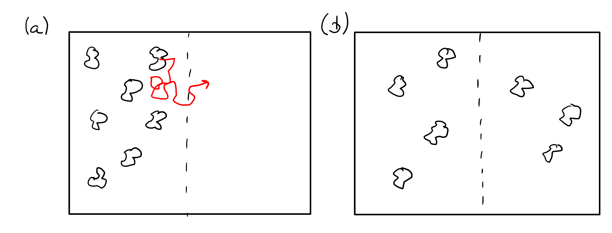
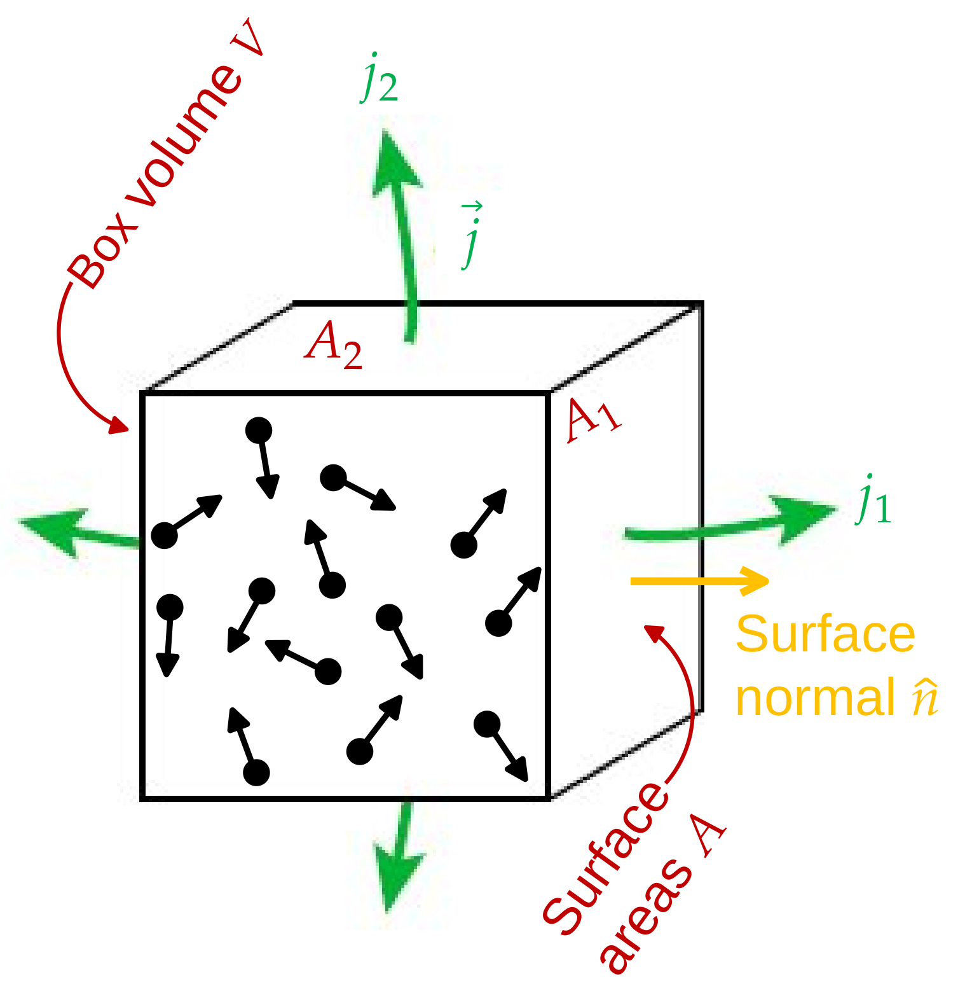

<h2 class='chapterHead'>Kapitel 3 Transporttheorie</h2>

<!-- l. 8 -->
Kontext: Dieses Lernmodul führt die Grundlagen des Modellproblems ein,
welches wir im Laufe der Lehrveranstaltung mit numerischen Methoden lösen
werden. Hier geht es zunächst um die Grundlagen der Transporttheorie. 

<h3 class='sectionHead'>3.1  Diffusion und Drift</h3>
<!-- l. 14 -->
Diffusiver Transport ist einfach zugänglich über das Bild des “Random Walk”,
einer zufälligen stochastischen Bewegung von Teilchen. Solche zufälligen
Bewegungsprozesse wurden zuerst von dem Botaniker Robert Brown (1773-1858)
beschrieben und tragen den Namen Brownsche Bewegung oder Brownsche
Molekularbewegung. Robert Brown wusste damals allerdings nicht von
Molekülen und dachte zu seinen Lebzeiten, dass diese Bewegung auf
aktive Prozesse (der “Lebenskraft” der Pollen) zurückzuführen sei.
Heute wissen wir, dass diese Bewegung durch thermische Fluktuationen
verursacht wird, also Moleküle die zufällig auf die Pollen treffen und diese
in eine Richtung stoßen. Diese Erklärung benötigt die Existenz von
Atomen und wurde erst 1905 von Albert Einstein (<a href='#Xeinstein_uber_1905'>Einstein</a>, <a href='#Xeinstein_uber_1905'>1905</a>) hoffähig
gemacht.

<!-- l. 16 -->
 Brownsche Molekularbewegung führt zu diffusivem Transport. Abbildung <a href='#x1-2001r1'>3.1<!-- tex4ht:ref: fig:brownian --></a>
zeigt ein einfaches qualitatives Gedankenexperiment. Die Konfiguration in
Abb. <a href='#x1-2001r1'>3.1<!-- tex4ht:ref: fig:brownian --></a>a zeigt eine Lokalisierung der “Pollen” in der linken Hälfte der
gezeigten Domäne. Durch deren zufällige Bewegung (als Beispiel gezeigt an
der roten Linie in Abb. <a href='#x1-2001r1'>3.1<!-- tex4ht:ref: fig:brownian --></a>a) werden einige der Pollen die gestrichelte
Grenzlinie in die rechte Hälfte überschreiten und auch wieder zurück
kommen. Nach einer gewissen Zeit lässt sich der Anfangszustand nicht
mehr identifizieren und die Pollen verteilen sich in der gesamten Domäne
(Abb. <a href='#x1-2001r1'>3.1<!-- tex4ht:ref: fig:brownian --></a>b). Die Konzentration ist nun konstant. Die Pollen bewegen sich zwar
weiter, aber in Mittel bewegt sich die gleiche Zahl Pollen nach links wie
nach rechts. Im Fall der in Abb. <a href='#x1-2001r1'>3.1<!-- tex4ht:ref: fig:brownian --></a>a gezeigt ist, ist diese Symmetrie
gebrochen.

<figure class='figure'>

<!-- l. 22 -->
  

<figcaption class='caption'>Abbildung 3.1: Illustration eines Diffusionsprozesses. Die “Pollen” in (a)
bewegen sich zufällig in der gezeigten Domäne. Nach einer gewissen Zeit
(b) ist der anfängliche Konzentrationsunterschied zwischen dem linken und
rechten Teil der Domäne ausgeglichen.
</figcaption><!-- tex4ht:label?: x1-2001r3.1 -->

</figure>
<!-- l. 28 -->
 Dieses Gedankenexperiment kann einfach mathematisch formalisiert werden.
Wir betrachten ein Teilchen, das eine Zufallsbewegung in einer Dimension
vollführt. Wir beginnen mit einem Teilchen, das zufällig auf einer Geraden hin-
und herspringt. Die Gerade liege entlang der x-Richtung. Das Teilchen
kann nur zu vorher festgelegten Positionen auf der x-Achse springen,
die wir mit \(x_j\) bezeichnen und die äquidistant verteilt seien, \(x_j-x_{j-1}=\Delta x\) für \(j\in \mathbb {Z}\) (siehe
Abb. <a href='#x1-2003r2'>3.2<!-- tex4ht:ref: fig:Brown --></a>).

<figure class='figure'>

<!-- l. 36 -->

<figcaption class='caption'>Abbildung 3.2: Zufallsbewegung in einer Dimension ist gegeben durch
Übergangswahrscheinlichkeiten \(p\) (für eine Bewegung nach links) und \(q\) für
eine Bewegung nach rechts.
</figcaption><!-- tex4ht:label?: x1-2003r3.1 -->

</figure>
<!-- l. 60 -->
 Ein Teilchen springe mit einer Wahrscheinlichkeit \(p\) nach links und mit einer
Wahrscheinlichkeit \(q\) nach rechts. Darüberhinaus haben wir die Wahrscheinlichkeit
überhaupt ein Teilchen zur Zeit \(t\) bei Position \(x\) zu finden. Diese ist auf dem 1D
Gitter durch die Funktion \(P(x,t)\) gegeben.

<h4 class='subsectionHead'>3.1.1  Diffusion</h4>
<!-- l. 66 -->
<a class='url' href='https://uni-freiburg.cloud.panopto.eu/Panopto/Pages/Embed.aspx?id=e45b44b6-d450-4025-ac9d-ac750109f647'>https://uni-freiburg.cloud.panopto.eu/Panopto/Pages/Embed.aspx?id=e45b44b6-d450-4025-ac9d-ac750109f647</a>

<!-- l. 68 -->
 Wir betrachten zunächst den Fall \(p=q=1/2\), also dass die Wahrscheinlichkeiten für
die Sprünge nach links und rechts identisch sind. Wir nehmen an, das Teilchen
springe von einem Platz zum benachbarten in einem diskreten, endlichen und
konstanten Zeitschritt \(\tau \). Dann ist die Wahrscheinlichkeit ein Teilchen zur Zeit \(t+\tau \) am
Ort \(x\) zu finden, wenn zur Zeit \(t\) mit einer Wahrscheinlichkeit \(P(x-\Delta x,t)\) ein Teilchen bei der
Position \(x-\Delta x\) zu finden war und mit der Wahrscheinlichkeit \(P(x+\Delta x,t)\) eines bei \(x+\Delta x\), gegeben durch
\begin {equation} P(x,t+\tau )=\frac {1}{2}P(x+\Delta x,t)+\frac {1}{2}P(x-\Delta x,t). \end {equation}
Indem wir \(P(x,t)\) auf beiden Seiten abziehen und durch \(\tau \) teilen, erhalten wir die folgende
äquivalente Form: \begin {equation} \frac {P(x,t+\tau )-P(x,t)}{\tau } = \frac {\Delta x^2}{2\tau }\frac {P(x+\Delta x,t)-2P(x,t)+P(x-\Delta x,t)}{\Delta x^2} \end {equation}
Wir können nun den Grenzübergang zum “Kontinuum” machen. Für \(\tau \rightarrow 0\) und
gleichzeitig \(h\rightarrow 0\) unter der Bedingung, dass \begin {equation} \lim _{\Delta x\rightarrow 0, \tau \rightarrow 0}\frac {\Delta x^2}{2\tau }=D \end {equation}
erhält man \begin {equation} \frac {\partial P(x,t)}{\partial t}=D\frac {\partial ^2 P(x,t)}{\partial x^2}. \end {equation}
Dies die wohlbekannte Diffusionsgleichung. In mehreren Dimensionen wird aus der
zweiten Ableitung der Laplace-Operator \(\nabla ^2\), \begin {equation} \frac {\partial P(x,t)}{\partial t}=D \nabla ^2 P(x,t). \label {eq:diffusion} \end {equation}
Diese Gleichung ist nur dann korrekt, wenn die Diffusionskonstante auch wirklich
konstant ist und nicht räumlich variiert.

<!-- l. 100 -->

<h4 class='subsectionHead'>3.1.2  Drift</h4>
<!-- l. 102 -->
<a class='url' href='https://uni-freiburg.cloud.panopto.eu/Panopto/Pages/Embed.aspx?id=3443491b-853e-4a3b-b627-ac750109f67d'>https://uni-freiburg.cloud.panopto.eu/Panopto/Pages/Embed.aspx?id=3443491b-853e-4a3b-b627-ac750109f67d</a>

<!-- l. 104 -->
 Wie sieht es aus, wenn die Wahrscheinlichkeiten für die Sprünge nach rechts
oder links nicht gleich sind, \(p\ne q\) (aber natürlich \(p+q=1\))? Wir gehen nach wie vor von
diskreten, gleichförmigen Zeitschritten und äquidistanten Stützstellen
aus.

<!-- l. 107 -->
 In diesem Fall haben wir \begin {equation} P(x,t+\tau )=pP(x+\Delta x,t)+qP(x-\Delta x,t) \end {equation}
und somit folgt \begin {equation} \frac {P(x,t+\tau )-P(x,t)}{\tau }=\frac {\Delta x^2}{\tau }\frac {pP(x+\Delta x,t)-P(x,t)+qP(x-\Delta x,t)}{\Delta x^2}. \label {eq:driftpq} \end {equation}
Wir schreiben \begin {equation} p=\frac {1}{2}-\varepsilon \quad \text {und}\quad q=\frac {1}{2}+\varepsilon \quad \text {mit}\quad 0\le |\varepsilon |\le \frac {1}{2} \quad \text {oder}\quad 2\varepsilon = q-p, \end {equation}
wobei \(\varepsilon \) nun angibt, um wieviel wahrscheinlicher ein Sprung nach rechts als nach

links ist. Ein positives \(\varepsilon \) heißt also, dass die Partikel sich im Mittel nach
rechts bewegen werden – dies ist die Driftbewegung. Wir können nun
Gl. \eqref{eq:driftpq} mit Hilfe von \(\varepsilon \) als \begin {equation} \begin {split} \frac {P(x,t+\tau )-P(x,t)}{\tau }=&amp; \frac {\Delta x^2}{2\tau }\frac {P(x+\Delta x,t)-2P(x,t)+P(x-\Delta x,t)}{\Delta x^2}\\ &amp;-\frac {2\varepsilon \Delta x}{\tau }\frac {P(x+\Delta x,t)-P(x-\Delta x,t)}{2\Delta x} \end {split} \end {equation}
ausdrücken. In den Grenzfällen \(\tau \rightarrow 0\) und \(\Delta x\rightarrow 0\) fordern wir \begin {equation} \lim _{\Delta x\rightarrow 0, \tau \rightarrow 0}\frac {\Delta x^2}{2\tau }=D \quad \text { und }\quad \lim _{\Delta x\rightarrow 0, \tau \rightarrow 0}\frac {2\varepsilon \Delta x}{\tau }=v \label {eq:limit2} \end {equation}
und erhalten somit die Drift-Diffusions-Gleichung \begin {equation} \frac {\partial P(x,t)}{\partial t}=\left (D\frac {\partial ^2}{\partial x^2} -v\frac {\partial }{\partial x}\right ) P(x,t). \label {eq:driftdiffusion} \end {equation}
Hier beschreibt der erste Summand auf der rechten Seite wieder den
Diffusionsprozess. Der zweite Summand ist ein Driftprozess und \(v\) eine konstante
Driftgeschwindigkeit. (Aus Gl. \eqref{eq:limit2} und \eqref{eq:driftdiffusion}
wird ersichtlich, dass die Einheit von \(v\) genau einer Geschwindigkeit entspricht.) Es
ist die Geschwindigkeit mit der sich das Teilchen (im Mittel) entlang der \(x\)-Achse
bewegen. Die Lösung dieser Gleichung wurde bereits im vorhergehenden Kapitel
besprochen. Aus der Lösung des vorhergehenden Kapitels wird auch klar, dass
die Driftbewegung für positive \(v\) in Richtung der positiven \(x\)-Achse ist. Dies ist
konsistent mit der obigen Definition von \(\varepsilon \).

<!-- l. 150 -->
Anmerkung: Die Bewegung unseres Teilchen wurde mit Hilfe einer
Aufenthaltswahrscheinlichkeit \(P\) modelliert. Im thermodynamischen Limes, also
für ganz viele Teilchen (üblicherweise in Größenordnung der Avogadroschen
Zahl \(N_A\)), wird aus dieser Wahrscheinlich die Dichte \(\rho \) oder die Konzentration \(c\). Man
kann also einfach in den oben genannten Gleichungen die Wahrscheinlichkeit \(P\)
durch eine Teilchenkonzentration \(c\) ersetzen. Der Grund hierfür ist, dass
wir die Teilchenkonzentration als Ensemble-Mittel schreiben können,
\begin {equation} c(x, t) = \langle 1 \rangle (x, t), \end {equation}
wobei der Mittelwert \begin {equation} \langle f(x) \rangle (x, t) = f(x) P(x, t). \end {equation}

<!-- l. 161 -->

<h3 class='sectionHead'>3.2  Kontinuität</h3>
<!-- l. 163 -->
<a class='url' href='https://uni-freiburg.cloud.panopto.eu/Panopto/Pages/Embed.aspx?id=a68a4595-c00c-46ad-bc29-ac75011ef1b2'>https://uni-freiburg.cloud.panopto.eu/Panopto/Pages/Embed.aspx?id=a68a4595-c00c-46ad-bc29-ac75011ef1b2</a>

<!-- l. 165 -->
 Die Gleichungen \eqref{eq:diffusion} und \eqref{eq:driftdiffusion} vermischen
zwei Konzepte, die wir hier jetzt getrennt behandeln wollen: Die Erhaltung der
Anzahl der Teilchen (Kontinuität) und der Prozess, welcher zu einem
Teilchenstrom führt (Diffusion oder Drift). Die Teilchenzahl ist einfach
deshalb erhalten, weil wir keine Atome aus dem Nichts erzeugen oder in
das Nichts vernichten können. Wir wissen also, wenn wir eine gewissen

Anzahl Teilchen \(N_{\text {tot}}\) in unserem Gesamtsystem haben, dass diese Anzahl
\begin {equation} N_{\text {tot}} = \int \dif ^3r \, c(\v {r}) \end {equation}
sich nicht über die Zeit ändern kann: \(\dif N_{\text {tot}}/\dif t=0\).

<!-- l. 171 -->
 Für einen kleinen Ausschnitt mit Volumen \(V\) aus diesem Gesamtvolumen kann
sich die Teilchenzahl ändern, weil diese über die Wände des Probevolumens
fließen können (siehe Abb. <a href='#x1-5001r3'>3.3<!-- tex4ht:ref: fig:continuity --></a>). Die Änderung dieser Teilchenzahl ist zum einen
gegeben durch \begin {equation} \dot {N} = \frac {\partial }{\partial t} \int _V \dif ^3r \, c(\v {r}, t) = \int _V \dif ^3r \, \frac {\partial c}{\partial t}. \label {eq:nchange} \end {equation}
Die Änderung \(\dot {N}\) muss aber auch durch die Anzahl der Partikel, die über die
Seitenwände abfließen, gegeben sein. Für einen Würfel (Abb. <a href='#x1-5001r3'>3.3<!-- tex4ht:ref: fig:continuity --></a>) mit sechs
Wänden gilt \begin {equation} \begin {split} \dot {N} = &amp; - j_{\text {rechts}} A_{\text {rechts}} - j_{\text {links}} A_{\text {links}} \\ &amp; - j_{\text {oben}} A_{\text {oben}} - j_{\text {unten}} A_{\text {unten}} \\ &amp; - j_{\text {vorne}} A_{\text {vorne}} - j_{\text {hinten}} A_{\text {hinten}} \end {split} \label {eq:dotN} \end {equation}
wenn die Wände klein genug sind, so dass \(j\) nahezu konstant über \(A\) ist. (Die
Stromdichte \(j\) hat die Einheit Anzahl Partikel/Zeit/Fläche.)

<figure class='figure'>

<!-- l. 211 -->
 

<figcaption class='caption'>Abbildung 3.3: Teilchen können das Volumen \(V\) nur durch die Seitenwände
verlassen. Die Änderung der Teilchenzahl \(N\) über ein Zeitintervall \(\tau \) ist daher
durch die Anzahl der Teilchen gegeben, die durch die Wände fließen. Hierzu
brauchen wir die Teilchenströme \(j\). Die Anzahl der Teilchen, welche durch
eine Oberfläche fließen ist dann gegeben durch \(j\,A\tau \), wobei \(A\) die Fläche der
Seitenwand ist.
</figcaption><!-- tex4ht:label?: x1-5001r3.2 -->

</figure>
<!-- l. 217 -->
 Hier bezeichnet der skalare Strom \(j\) den Strom, der aus der Fläche heraus
fließt. Für eine allgemeine vektorielle Stromdichte \(\v {j}\), welche die Stärke und
Richtung des Teilchenstroms angibt, ist \(j_i = \v {j}_i \cdot \hat {n}_i\) wobei \(\hat {n}_i\) der Normalenvektor auf die Wand
\(i\) ist. Der Strom durch die Wand ist also nur die Komponente von \(\v {j}\), die parallel zur
Oberflächennormale steht. Mit diesem Argument können wir die Änderung der
Teilchenzahl allgemein als \begin {equation} \dot {N} = -\int _{\partial V} \dif ^2r \, \v {j}(\v {r})\cdot \hat {n}(\v {r}) \label {eq:flux} \end {equation}
ausdrücken, wobei \(\partial V\) die Oberfläche des Volumens \(V\) bezeichnet. In dieser
Gleichung ist explizit angezeigt, dass selbstverständlich sowohl der Fluss \(\v {j}\) als
auch die Oberflächennormale \(\hat {n}\) von der Position \(\v {r}\) auf der Oberfläche
abhängen.

<!-- l. 224 -->
 Alternativ können wir auch die Änderung der Teilchenzahl Gl. \eqref{eq:dotN}
folgendermaßen gruppieren: \begin {equation} \begin {split} \dot {N} = &amp; - (j_{\text {rechts}} + j_{\text {links}}) A_{\text {rechts/links}} \\ &amp; - (j_{\text {oben}} + j_{\text {unten}}) A_{\text {oben/unten}} \\ &amp; - (j_{\text {vorne}} + j_{\text {hinten}}) A_{\text {vorne/hinten}} \end {split} \end {equation}
Hierbei haben wir die Tatsache genutzt, dass \(A_{\text {rechts}}=A_{\text {links}}\equiv A_{\text {rechts/links}}\). Nun ist aber \begin {equation} \begin {split} j_{\text {rechts}} &amp;= \hat {x} \cdot \v {j}(x+\Delta x/2,y,z) = j_x(x+\Delta x/2,y,z) \quad \text {und} \\ j_{\text {links}} &amp;= -\hat {x} \cdot \v {j}(x-\Delta x/2,y,z) = -j_x(x-\Delta x/2,y,z) \end {split} \end {equation}
da \(\hat {n}=\hat {x}\) für die rechte Wand aber \(\hat {n}=-\hat {x}\) für die linke Wand. Hierbei ist \(\hat {x}\) der
Normalenvektor entlang der \(x\)-Achse des Koordinatensystems. Es dreht
sich also zwischen der rechten und linken Fläche das Vorzeichen der
Oberflächennormale um. Das gleiche gilt für die Wände oben/unten und
vorne/hinten. Wir können diese Gleichung weiterhin umschreiben als
\begin {equation} \begin {split} \dot {N} = &amp; - \frac {j_x(x+\Delta x/2,y,z) - j_x(x-\Delta x/2,y,z)}{\Delta x} V \\ &amp; - \frac {j_y(x,y+\Delta y/2,z) - j_y(x,y-\Delta y/2,z)}{\Delta y} V \\ &amp; - \frac {j_z(x,y,z+\Delta z/2) - j_z(x,y,z-\Delta z/2)}{\Delta z} V, \end {split} \label {eq:dotNdiscr} \end {equation}
da \(V=A_{\text {rechts/links}}\Delta x=A_{\text {oben/unten}}\Delta y=A_{\text {vorne/hinten}}\Delta z\). Die Faktoren vor dem Volumen \(V\) in Gl. \eqref{eq:dotNdiscr} sind
nun aber genau der Differenzenquotienten der Flüsse \(j_i\), jeweils in die \(x\)-, \(y\)-
und \(z\)-Richtung. Für kleine Volumina (und kleine \(\Delta x\), etc.) wird dies zu
\begin {equation} \dot {N} = -\int _{V} \dif ^3r \, \nabla \cdot \v {j}(\v {r}). \label {eq:flux2} \end {equation}
Wir habe hier gerade heuristisch den Gaussschen Satz (engl. “Divergence
Theorem” - siehe auch Gl. \eqref{eq:divergencetheorem}) hergeleitet, um
Gl. \eqref{eq:flux} als Volumenintegral auszudrücken.

<!-- l. 290 -->
Anmerkung: Der Gausssche Satz ist ein wichtiges Ergebnis der Vektoranalysis.
Er wandelt ein Integral über ein Volumen \(V\) in ein Integral über die Oberfläche \(\partial V\)
dieses Volumens um. Für ein Vektorfeld \(\v {f}(\v {r})\) gilt: \begin {equation} \int _V \dif ^3 r\, \nabla \cdot \v {f}(\v {r}) = \int _{\partial V} \dif ^2 r\, \v {f}(\v {r}) \cdot \hat {n}(\v {r}) \label {eq:divergencetheorem} \end {equation}
Hier ist \(\hat {n}(\v {r})\) der Normalenvektor, welcher auf dem Rand \(\partial V\) des Volumens \(V\) nach außen
zeigt. 

<!-- l. 301 -->
 Gleichung \eqref{eq:nchange} und \eqref{eq:flux2} zusammen ergeben
\begin {equation} \int _V \dif ^3r \, \left \{\frac {\partial c}{\partial t}+\nabla \cdot \v {j}\right \} = 0. \label {eq:continuityweak} \end {equation}
Da dies für jedes beliebige Volumen \(V\) gilt, muss auch \begin {equation} \frac {\partial c}{\partial t}+\nabla \cdot \v {j} = 0 \label {eq:continuity} \end {equation}
erfüllt sein. Diese Gleichung trägt den Namen Kontinuitätsgleichung. Sie
beschreibt die Erhaltung der Teilchenzahl bzw. der Masse des Systems.

<!-- l. 313 -->
Anmerkung: In der hier dargestellten Herleitung haben wir implizit bereits die
starke Formulierung und eine schwache Formulierung (engl. “weak formulation”
einer Differentialgleichung kennengelernt. Gleichung \eqref{eq:continuity} ist die
starke Formulierung der Kontinuitätsgleichung. Diese verlangt, dass die
Differentialgleichung für jeden räumlichen Punkt \(\v {r}\) erfüllt ist. Die entsprechende
schwache Formulierung ist Gl. \eqref{eq:continuityweak}. Hier wird nur verlangt,
dass die Gleichung in einer Art Mittelwert, hier als Integral über ein
Probevolumen \(V\), erfüllt ist. Innerhalb des Volumens muss die starke Form nicht
erfüllt sein, aber das Integral über diese Abweichungen (die wir später
als “Residuum” bezeichnen werden) muss verschwinden. Die schwache
Formulierung ist für endliche Probevolumina \(V\) damit eine Näherung. In
der Methode der finiten Elemente löst man eine schwache Gleichung
für eine gewissen (approximative) Ansatzfunktion exakt. Die schwache
Formulierung wird daher im Verlauf dieser Veranstaltung wichtig werden. 

<!-- l. 317 -->
 Wir können weiterhin noch verlangen, dass innerhalb unseres Probevolumens
“Teilchen” produziert werden. In der aktuellen Interpretation der Gleichung
wären dies z.B. chemische Reaktionen, die einen Teilchentyp in einen anderen
umwandeln. Eine identische Gleichung gilt für den Wärmetransport. Hier wäre
ein Quellterm die Produktion von Wärme, z.B. durch ein Heizelement. Gegeben
ein Quellenstrom \(Q\) (mit Einheit Anzahl Partikel/Zeit/Volumen), kann die
Kontinuitätsgleichung auf \begin {equation} \frac {\partial c}{\partial t}+\nabla \cdot \v {j} = Q \label {eq:continuitywithsource} \end {equation}
erweitert werden. Die Kontinuitätsgleichung mit Quellterm wird auch manchmal
als Bilanzgleichung bezeichnet.

<!-- l. 324 -->
Anmerkung: Gleichung \eqref{eq:continuitywithsource} beschreibt die zeitliche
Veränderung der Konzentration \(c\). Eine verwandte Frage ist die nach der Lösung
dieser Gleichung nach sehr langer Zeit - wenn sich ein dynamisches Gleichgewicht
eingestellt hat. Dieses Gleichgewicht ist dadurch gekennzeichnet, dass \(\partial c/\partial t=0\). Die
Gleichung \begin {equation} \nabla \cdot \v {j} = Q \end {equation}
ist die stationäre Variante der Kontinuitätsgleichung. 

<h4 class='subsectionHead'>3.2.1  Drift</h4>
<!-- l. 334 -->
Kommen wir zurück zu Transportprozessen, zunächst zu Drift. Wenn sich alle
Teilchen in unserem Probevolumen in mit der Geschwindigkeit \(\v {v}\) bewegen, dann
führt das zu einem Teilchenstrom \begin {equation} \v {j}_{\text {Drift}} = c \v {v}. \label {eq:drift} \end {equation}
Eingesetzt in die Kontinuitätsgleichung \eqref{eq:continuity} ergibt dies den
Drift-Beitrag zur Drift-Diffusions-Gleichung \eqref{eq:driftdiffusion}.

<!-- l. 341 -->

<h4 class='subsectionHead'>3.2.2  Diffusion</h4>
<!-- l. 343 -->
Aus unserem obigen Gedankenexperiment wird klar, dass der Diffusionstrom
immer in Richtung der niedrigen Konzentration, also in entgegengesetzte Richtung
des Gradienten \(\nabla c\) der Konzentration, gehen muss. Der entsprechende Strom ist
gegeben durch \begin {equation} \v {j}_{\text {Diffusion}} = - D \nabla c. \label {eq:stationary} \end {equation}
Eingesetzt in die Kontinuitätsgleichung \eqref{eq:continuity} ergibt dies die
Diffusionsgleichung \eqref{eq:diffusion}.

<!-- l. 350 -->
 Die gesamte Drift-Diffusionsgleichung hat daher die Form \begin {equation} \frac {\partial c}{\partial t} + \nabla \cdot \left \{-D\nabla c + c\v {v}\right \}=0. \label {eq:drift-diffusion-full} \end {equation}
Im Gegensatz zu Gleichungen \eqref{eq:diffusion} und \eqref{eq:driftdiffusion} gilt
diese Gleichung auch wenn die Diffusionskonstante \(D\) oder Drift-Geschwindigkeit \(\v {v}\)
räumlich variiert.

<!-- l. 357 -->
Anmerkung: Wir haben hier die Transporttheorie im Sinne einer
Teilchenkonzentration \(c\) eingeführt. Die Kontinuitätsgleichung beschreibt jedoch
allgemein die Erhaltung einer bestimmten Größe, in unserem Fall der
Teilchenzahl (oder äquivalent der Masse). Andere physikalisch erhaltene Größen
sind der Impuls und die Energie. Die Kontinuitätsgleichung für den Impuls
führt zur Navier-Stokes Gleichung. Die Kontinuitätsgleichung für die Energie
führt zur Wärmeleitungsgleichung. Für das Beispiel dieser Veranstaltung ist
nur die Erhaltung der Masse relevant. 

<h2 class='likechapterHead'>Literaturverzeichnis</h2>

   A. Einstein. Über die von der molekularkinetischen Theorie der Wärme
geforderte Bewegung von in ruhenden Flüssigkeiten suspendierten
Teilchen. Ann. Phys., 17:549, 1905.

