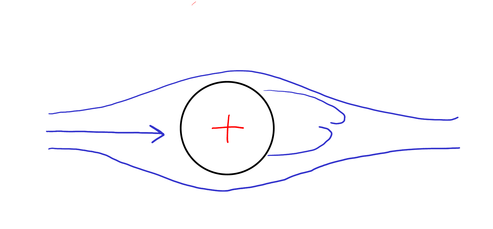

                                                                          
   <h2 class='chapterHead'>Kapitel 4 Ladungstransport</h2>
   

<!-- l. 6 -->
Kontext: In diesem Lernmodul führen wir die spezifischen Gleichungen ein,
welche Ladungstransport beschreiben. Ähnliche Gleichungen finden sich für
Ladungstransport in Halbleitern und in Elektrolyten. Insbesondere sollten
ähnliche Gleichungen bereits in der Vorlesung “Halbleiterphysik” aufgetaucht
sein. Wir werden die Gleichungen hier im Kontext der Elektrochemie
entwickeln. Ziel des Kapitels ist die Einführung der Poisson-Nernst-Planck
Gleichung, die wir im Rest der Veranstaltung numerisch lösen werden. 

   <h3 class='sectionHead'>4.1    Elektrostatik</h3>
<!-- l. 12 -->
Wir wiederholen hier die Grundlagen der Elektrostatik. Eine Punktladung \(q\) am
Ort \(\v{r}_0\) erzeugt ein elektrostatisches Potential der Form \begin{equation} \Phi (\v{r}) = \frac{1}{4\pi \varepsilon } \frac{q}{|\v{r}-\v{r}_0|}, \label{eq:point_charge} \end{equation}
wobei \(\varepsilon =\varepsilon _0 \varepsilon _r\) die Permittivität ist. Im Vakuum ist \(\varepsilon _r=1\). Wir werden hier ausschließlich
(wässrige) Elektrolyte behandeln, also Ionen die in Wasser gelöst sind. Für
Wasser ist \(\varepsilon _r\approx 80\). Gleichung \eqref{eq:point˙charge} ist die spezifische Lösung der
Poisson-Gleichung, \begin{equation} \nabla ^2 \Phi (\v{r}) = -\frac{\rho (\v{r})}{\varepsilon } \end{equation}
für eine Punktladung \(\rho (\v{r})=q\delta (\v{r}-\v{r}_0)\).

<!-- l. 23 -->
   Die Poisson-Gleichung hat die gleiche Form wie die (stationäre)
Diffusionsgleichung aus Kapitel 3. Wir können auch diese wieder in zwei
Gleichungen aufsplitten. Zunächst ist das elektrische Feld \(\v{E}\) gegeben durch
\begin{equation} \v{E} = -\nabla \Phi , \end{equation}
den (negativen) Gradienten des Potentials. (Im Sinne der Analogie zur
Diffusionsgleichung ist das Feld eine Art Stromdichte.) Die “Kontinuitätsgleichung”
für das Feld ist gegeben durch (siehe auch Gl. \eqref{eq:stationary})
\begin{equation} \nabla \cdot \v{E} = \frac{\rho }{\varepsilon }. \end{equation}
Zusammen ergeben diese Gleichungen die Poisson-Gleichung.

<!-- l. 33 -->
   Wir werden die Poisson-Gleichung benötigen, um das elektrostatische
Potential (und damit auch das elektrische Feld) innerhalb eines Elektrolyten zu
berechnen. Innerhalb des Elektrolyten haben wir üblicherweise eine positiv und
eine negativ geladenen Spezies, mit entsprechenden Konzentrationen \(c_+(\v{r})\) und \(c_-(\v{r})\). Die
entsprechende Ladungsdichte ist dann proportional zur Differenz dieser
Konzentrationen, \(\rho (\v{r})=|e|(c_+(\v{r})-c_-(\v{r}))\).

<!-- l. 35 -->

                                                                          

                                                                          

   <h3 class='sectionHead'>4.2    Drift im elektrischen Feld</h3>
<!-- l. 37 -->
<a class='url' href='https://uni-freiburg.cloud.panopto.eu/Panopto/Pages/Embed.aspx?id=f822dd82-e8d9-4f93-90ce-ac75011ef18a'>https://uni-freiburg.cloud.panopto.eu/Panopto/Pages/Embed.aspx?id=f822dd82-e8d9-4f93-90ce-ac75011ef18a</a>

<!-- l. 39 -->
   Die Ladungen in unserem Elektrolyten erzeugen nicht nur ein elektrischen
Feld, sie reagieren auch auf dieses. Die Kraft \(\v{f}\), welche auf ein Teilchen mit Ladung
\(q\) wirkt, ist gegeben durch \begin{equation} \v{f}_{\text{E}} = q \v{E}. \end{equation}
Positiv geladene Teilchen bewegen sich in Richtung des elektrischen Feldes,
negativ geladene Teilchen entgegen dieser Richtung.

<!-- l. 45 -->
   Es wirkt also auf Grund des elektrischen Feldes eine Kraft auf unsere Ionen.
Diese Kraft alleine würde zu einer Beschleunigung der Ionen führen,
also einer kontinuierlichen Zunahme der Geschwindigkeit. Da sich das
Ion in einem Medium (Lösungsmittel, z.B. Wasser) bewegt erfährt es
einen Strömungswiderstand (siehe Abb. <a href='#x1-3001r1'>4.1<!-- tex4ht:ref: fig:brownian  --></a>). Im Fall laminaren Flusses
um ein sphärisches Teilchen mit Radius \(R\) wird dieser nur durch innere
Reibung innerhalb des Fluids hervorgerufen. Die resultieren Kraft wirkt
entgegen der Bewegungsrichtung und wird durch das Stokessche Gesetz,
\begin{equation} \v{f}_{\text{Stokes}} = -6\pi \eta R \v{v} = -\v{v}/\Lambda , \end{equation}
mit \(\Lambda =(6\pi \eta R)^{-1}\) beschrieben. Hier ist \(\eta \) die Viskosität der Flüssigkeit. Die Größe \(\Lambda \) nennt sich
die Mobilität. Im Gleichgewicht \(\v{f}_{\text{E}} + \v{f}_{\text{Stokes}}=0\) ergibt sich die Driftgeschwindigkeit
\begin{equation} \v{v} = q \Lambda \v{E}. \end{equation}
Diese Driftgeschwindigkeit ergibt zusammen mit Gl. \eqref{eq:drift} den durch
das elektrische Feld hervorgerufenen Driftstrom, \begin{equation} \v{j} = q\Lambda c \v{E} = \sigma \v{E} \end{equation}
mit \(\sigma = q\Lambda c\). Die Größe \(\sigma \) wird auch Leitfähigkeit genannt. Ein äquivalentes Gesetz gilt
beispielsweise für die Elektronenleitung in Metallen.

   <figure class='figure'> 

                                                                          

                                                                          
                                                                          

                                                                          
<!-- l. 64 -->
  

<figcaption class='caption'>Abbildung 4.1::   Ein   Teilchen   (z.B.   ein   Ion),   welches   sich   in   einer
Flüsiggkeit  bewegt,  erfährt  einen  Strömungswiderstand.  Bei  geringen
Geschwindigkeiten   wird   dieser   durch   innere   Reibung   innerhalb   des
umströmenden Fluids hervorgerufen.
</figcaption><!-- tex4ht:label?: x1-3001r4.2  -->
                                                                          

                                                                          
   </figure>
   <h3 class='sectionHead'>4.3    Nernst-Planck-Gleichung</h3>
<!-- l. 72 -->
<a class='url' href='https://uni-freiburg.cloud.panopto.eu/Panopto/Pages/Embed.aspx?id=5dda06b4-a5c4-478c-a191-ac7501230300'>https://uni-freiburg.cloud.panopto.eu/Panopto/Pages/Embed.aspx?id=5dda06b4-a5c4-478c-a191-ac7501230300</a>

<!-- l. 74 -->
   Ein Diffusionsstrom in Kombination mit Drift im elektrischen Feld ergibt die
Nernst-Planck-Gleichung. Die Stromdichte für Ionenspezies \(\alpha \) ist gegeben durch
\begin{equation} \v{j}_\alpha = - D_\alpha \nabla c_\alpha + q_\alpha \Lambda _\alpha c_\alpha \v{E}, \end{equation}
wobei wir explizit durch den Index \(\alpha \) darauf hingewiesen haben, dass die
Transportparameter (\(D\), \(\Lambda \)), die Ladung \(q\) und die Konzentration \(c\) von der ionischen
Spezies abhängt. Mit Hilfe der Einstein-Smoluchowski-Beziehung, \(D = \Lambda k_B T\) kann die
Mobilität \(\Lambda \) mit der Diffusionskonstante \(D\) ausgedrückt werden. Dies führt zu der
üblichen Form der Nernst-Planck-Gleichung, \begin{equation} \v{j}_\alpha = - D_\alpha \left (\nabla c_\alpha + \frac{q_\alpha }{k_B T} c_\alpha \nabla \Phi \right ), \label{eq:NPcurrent} \end{equation}
in der wir das elektrische Feld als \(\v{E}=-\nabla \Phi \) ausgedrückt haben.

<!-- l. 89 -->

   <h3 class='sectionHead'>4.4    Poisson-Nernst-Planck-Gleichungen</h3>
<!-- l. 91 -->
Wir kombinieren nun das Nernst-Plancksche Transportproblem mit der Lösung
der Poisson-Gleichung um das elektrostatische Potential \(\Phi \) zu bestimmen. Hierzu
müssen hier zwei Ionenspecies betrachten, eine positiv (Ladung \(q_+\)) und eine
negativ (Ladung \(q_-\)) geladene. Damit müssen wir neben dem Potential \(\Phi \) zwei
Konzentrationen \(c_+\) und \(c_-\) bestimmen.

<!-- l. 93 -->
   Das gekoppelte Gleichungssystem, welches die Transportprozesse in
unserer Elektrolytlösung beschreibt, sieht daher folgendermaßen aus: \begin{align} \frac{\partial }{\partial t} c_+ + \nabla \cdot \v{j}_+ = 0 &amp; \quad \quad \text{(Erhaltung der positiven Spezies)} \label{eq:continuityplus} \\ \v{j}_+ = - D_+ \left (\nabla c_+ + \frac{q_+}{k_B T} c_+ \nabla \Phi \right ) &amp; \quad \quad \text{(Transport der positiven Spezies)} \label{eq:currentplus} \\ \frac{\partial }{\partial t} c_- + \nabla \cdot \v{j}_- = 0 &amp; \quad \quad \text{(Erhaltung der negative Spezies)} \label{eq:continuityminus} \\ \v{j}_- = - D_- \left (\nabla c_- + \frac{q_-}{k_B T} c_- \nabla \Phi \right ) &amp; \quad \quad \text{(Transport der negative Spezies)} \label{eq:currentminus} \\ \nabla ^2 \Phi = -\frac{q_+ c_+ + q_- c_-}{\varepsilon } &amp; \quad \quad \text{(Elektrostatisches Potential)} \label{eq:poissonfinal} \end{align}

<!-- l. 128 -->
   Wir werden dieses gekoppelte Differentialgleichungssystem im Rahmen dieses
Kurses mit Hilfe der Methode der finiten Elemente lösen. Man nennt diese
Gleichungen die Poisson-Nernst-Planck Gleichungen.

   

<!-- l. 130 -->
Anmerkung: Ein Satz von Gleichungen identisch zu Gl. \eqref{eq:continuityplus}
bis \eqref{eq:poissonfinal} beschreibt den Transport von Ladungsträgern in
Halbleitern. Die positiven Ladungsträger sind dann Löcher und die negative
Elektronen. Das was hier als “chemisches Potential” bezeichnet wird, heißt dort
teilweise das Quasiferminiveau. Diese Art des Ladungsträgertransports wurde
bereits in der Vorlesung “Halbleiterphysik” besprochen. 

                                                                          

                                                                          
<!-- l. 134 -->
   Neben der transienten Lösung des Problems, also der Zeitpropagation der
beiden Konzentrationen \(c_+\) und \(c_-\), ist auch die stationäre Lösung interessant. Für
die stationäre Lösung verschwindet die Zeitabhängigkeit, also \(\partial c_{+/-}/\partial t = 0\) in diesen
Gleichungen. Wir werden hier sowohl die transiente als auch die stationäre
Lösung dieses Gleichungssystems betrachten.

<!-- l. 137 -->

   <h3 class='sectionHead'>4.5    Poisson-Boltzmann-Gleichung</h3>
<!-- l. 139 -->
Die Nernst-Planck-Gleichung kann weiter durch die Einführung eines chemischen
Potentials vereinfacht werden. Das chemische Potential integriert den Effekt der
Diffusion in ein effektives Potential \begin{equation} \mu _\alpha (\v{r}) = q_\alpha \Phi (\v{r}) + k_B T \ln c_\alpha (\v{r}). \label{eq:chempot} \end{equation}
Der Term \(q_\alpha \Phi \) ist hier die potentielle Energie eines Ions mit Ladung \(q_\alpha \) in einem
elektrischen Feld. Der Term \(k_B T \ln c_\alpha \) ist die freie Energie eines idealen Gases mit Dichte \(c_\alpha \).
Wir können hier die Ionen als ideales Gas beschreiben, weil diese (in
unserem Modell) nur über das elektrostatische Potential wechselwirken. Die
Stromdichte wird dann proportional zum Gradienten des chemischen Potentials \(\mu \),
\begin{equation} \v{j}_\alpha = -\frac{D_\alpha }{k_B T} c_\alpha \nabla \mu = -\Lambda _\alpha c_\alpha \nabla \mu . \label{eq:NPcompact} \end{equation}
Durch Einsetzen von Gl. \eqref{eq:chempot} in Gl. \eqref{eq:NPcompact}
erhält man Gl. \eqref{eq:NPcurrent}.

<!-- l. 155 -->
   Gleichung \eqref{eq:NPcompact} sagt uns, dass kein Strom fließt, wenn das
chemische Potential \(\mu \) räumlich konstant ist. Dies ist genau dann der Fall, wenn
\begin{equation} c_\alpha (\v{r}) = c_0 \exp \left (-\frac{q_\alpha \Phi (\v{r})}{k_B T}\right ) \end{equation}
mit einer Konstanten \(c_0\). Diese Gleichung in Verbindung mit der Poisson-Gleichung
zur Bestimmung von \(\Phi \) heißt auch die Poisson-Boltzmann-Gleichung.

<!-- l. 162 -->

   <h3 class='sectionHead'>4.6    Anwendungsbeispiel</h3>
<!-- l. 164 -->
Im folgende Video diskutieren wir die Anwendung der Poisson-Nernst-Planck-Gleichung
für die Modellierung von Ladungstransport in Superkondensatoren mit porösen
Elektroden.

<!-- l. 166 -->
   <a class='url' href='https://uni-freiburg.cloud.panopto.eu/Panopto/Pages/Embed.aspx?id=7053001f-75d5-4340-af5e-ac75012302cf'>https://uni-freiburg.cloud.panopto.eu/Panopto/Pages/Embed.aspx?id=7053001f-75d5-4340-af5e-ac75012302cf</a>
                                                                          

                                                                          

   <h2 class='likechapterHead'>Literaturverzeichnis</h2>
    
