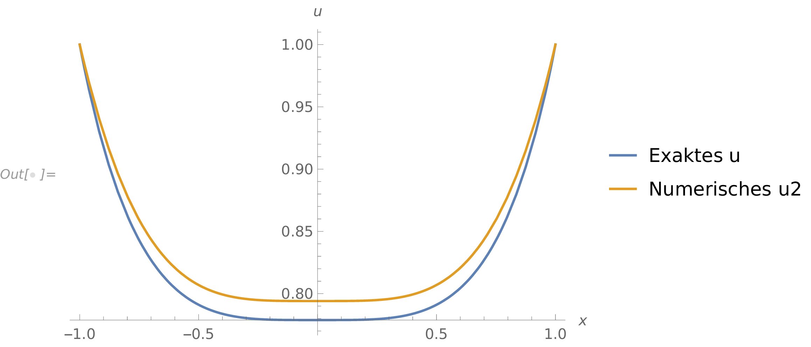

<h2 class='chapterHead'>Kapitel 5 Numerische Lösungsstrategien</h2>

<!-- l. 6 -->
Kontext: Wir legen jetzt das Transportproblem für eine Weile zur Seite
und wollen uns der numerischen Lösung von Differentialgleichungen
widmen. Dieses Kapitel zeigt die Grundzüge der numerischen Analyse von
Differentialgleichungen und führt ein paar wichtige Konzepte ein, insbesondere
die Reihenentwicklung und das Residuum. Die Darstellung hier folgt Kapitel 1 aus
<a href='#Xboyd_chebyshev_2000'>Boyd</a> (<a href='#Xboyd_chebyshev_2000'>2000</a>). 

<h3 class='sectionHead'>5.1  Reihenentwicklung</h3>
<!-- l. 12 -->
<a class='url' href='https://uni-freiburg.cloud.panopto.eu/Panopto/Pages/Embed.aspx?id=2c5c9440-a3de-442a-9d84-ac840105f558'>https://uni-freiburg.cloud.panopto.eu/Panopto/Pages/Embed.aspx?id=2c5c9440-a3de-442a-9d84-ac840105f558</a>

<!-- l. 14 -->
 In abstrakter Schreibweise suchen wir nach unbekannten Funktionen \(u(x,y,z,...)\) die einen
Satz von Differentialgleichungen \begin {equation} \mathcal {L} u(x,y,z,\ldots ) = f(x,y,z,\ldots ) \label {eq:gendgl} \end {equation}
erfüllen. Hierbei ist \(\mathcal {L}\) ein (nicht zwingend linearer) Operator, der die
Differential- (oder Integral-)operationen enthält. Zur (numerischen) Lösung
der Differentialgleichung führen wir nun ein wichtiges Konzept ein: Wir
nähern die Funktion \(u\) durch eine Reihenentwicklung an. Wir schreiben
\begin {equation} u_N(x, y, z, \ldots ) = \sum _{n=0}^N a_n \varphi _n(x,y,z,\ldots ) \label {eq:seriesexpansion} \end {equation}
wobei die \(\varphi _n\) als “Basisfunktionen” bezeichnet werden. Wir werden die Eigenschaften
dieser Basisfunktionen in mehr Details im nächsten Kapitel diskutieren.

<!-- l. 29 -->
 Die Differentialgleichung können wir nun schreiben als, \begin {equation} \mathcal {L} u_N(x,y,z,\ldots ) = f(x,y,z,\ldots ). \end {equation}
Durch diese Darstellung wird erreicht, dass wir nun die Frage nach der
unbekannten Funktion \(u\) durch die Frage nach den unbekannte Koeffizienten \(a_n\)
ersetzt haben. Den Differentialoperator \(\mathcal {L}\) müssen wir nur auf die (bekannten)
Basisfunktionen \(\varphi _n\) wirken lassen, und dies können wir analytisch berechnen.

<!-- l. 36 -->
 Was verbleibt ist die Bestimmung der Koeffizienten \(a_n\). Diese Koeffizienten
sind Zahlen, und diese Zahlen können von einem Computer berechnet
werden. Gleichung \eqref{eq:seriesexpansion} ist selbstverständlich eine
Näherung. Für gewisse Basisfunktionen kann gezeigt werden, dass diese
“vollständig” sind und damit bestimmte Klassen von Funktionen exakt
abbilden können. Dies stimmt aber nur unter der Bedingung, dass die Reihe
Gl. \eqref{eq:seriesexpansion} bis \(N\to \infty \) geführt wird. Für alle praktischen
Anwendungsfälle (so wie Implementierungen in Computercode), muss diese
Reihenentwicklung jedoch abgebrochen werden. Eine “gute” Reihenentwicklung
approximiert die exakte Lösung bereits bei niedrigem \(N\) mit kleinem Fehler. Wir
müssten bei dieser Aussage natürlich noch spezifizieren, wie wir Fehler
quantifizieren möchten. Numerisch suchen wir dann genau nach den
Koeffizienten \(a_n\), die den Fehler minimieren.

<!-- l. 39 -->
 Die Wahl guter Basisfunktion ist nichttrivial. Wir werden hier hauptsächlich
“finite Elemente” als Basisfunktionen nutzen und andere Arten kurz ansprechen.
Bevor wir tiefer in dieses Thema einsteigen, brauchen wir noch weitere Konzepte
für das Verständnis der numerischen Analyse.

<!-- l. 41 -->

<h3 class='sectionHead'>5.2  Residuum</h3>
<!-- l. 43 -->
Ein wichtiges Konzept ist das des Residuums. Unser Ziel ist es, Gl. \eqref{eq:gendgl}
zu lösen. Für die exakte Lösung wäre \(\mathcal {L} u - f\equiv 0\). Da wir aber nur eine Näherungslösung
konstruieren können, wird diese Bedingung nicht exakt erfüllt sein. Wir
definieren das Residuum als genau diese Abweichung von der exakten Lösung,
nämlich \begin {equation} R(x,y,z,\ldots ; a_0, a_1, \ldots , a_N) = \mathcal {L} u_N(x,y,z,\ldots ) - f(x,y,z,\ldots ). \label {eq:residual} \end {equation}
Das Residuum ist damit eine Art Maß für den Fehler den wir machen. Die Strategie
zur numerischen Lösung der Differentialgleichung Gl. \eqref{eq:gendgl}, ist es nun,
die Koeffizienten \(a_n\) so zu bestimmen, dass das Residuum Gl. \eqref{eq:residual}
minimal wird. Wir haben damit die Lösung der Differentialgleichung auf ein
Optimierungsproblem abgebildet. Die unterschiedlichen numerischen Verfahren,
die wir in den nächsten Kapiteln diskutieren werden, entscheiden sich hier
hauptsächlich in der spezifischen Optimierungsstrategie.

<!-- l. 52 -->
Anmerkung: Numerische Verfahren für die Optimierung sind ein zentraler
Kern der numerischen Lösung von Differentialgleichungen und damit der
Simulationstechniken. Es gibt unzählige Optimierungsverfahren, die in
unterschiedlichen Situationen besser oder schlechter funktionieren. Wir
werden hier zunächst solche Optimierer als “Black Box” behandeln.
Zum Ende der Lehrveranstaltung werden wir zur Frage der Optimierung
zurückkehren und einige bekannte Optimierungsverfahren diskutieren. Der
Begriff Minimierungsverfahren wird oft synonym zu Optimierungsverfahren
verwendet. Eine gute Übersicht über Optimierungsverfahren bietet das Buch
von <a href='#Xnocedal_numerical_2006'>Nocedal and Wright</a> (<a href='#Xnocedal_numerical_2006'>2006</a>). 

<!-- l. 56 -->

<h3 class='sectionHead'>5.3  Ein erstes Beispiel</h3>
<!-- l. 59 -->
<a class='url' href='https://uni-freiburg.cloud.panopto.eu/Panopto/Pages/Embed.aspx?id=025ad4dc-b395-4980-8fdc-ac84016870c8'>https://uni-freiburg.cloud.panopto.eu/Panopto/Pages/Embed.aspx?id=025ad4dc-b395-4980-8fdc-ac84016870c8</a>

<!-- l. 61 -->
 Wir wollen nun diese abstrakten Ideen an einem Beispiel konkretisieren und
ein paar wichtige Begriffe einführen. Wir schauen uns das eindimensionale
Randwertproblem, \begin {equation} \frac {\dif ^2 u}{\dif x^2} - (x^6 + 3x^2)u = 0, \label {eq:odeexample} \end {equation}
mit den Randbedingungen \(u(-1)=u(1)=1\) an. (D.h. \(x\in [-1,1]\) ist die Domäne auf der wir die Lösung
suchen.) Der abstrakte Differentialoperator \(\mathcal {L}\) nimmt in diesem Fall die konkrete
Form \begin {equation} \mathcal {L} = \frac {\dif ^2 }{\dif x^2} - (x^6 + 3x^2) \end {equation}
an. Die exakte Lösung dieses Problems ist gegeben durch \begin {equation} u(x) = \exp \left [(x^4-1)/4\right ]. \end {equation}

<!-- l. 76 -->
 Wir raten nun eine Näherungslösung als Reihenentwicklung für diese
Gleichung. Diese Näherungslösung sollte bereits die Randbedingungen
erfüllen. Die Gleichung \begin {equation} u_2(x) = 1 + (1-x^2)(a_0 + a_1 x + a_2 x^2) \label {eq:approxexample} \end {equation}
ist so konstruiert, dass die Randbedingungen erfüllt sind. Wir können diese als
\begin {equation} u_2(x) = 1 + a_0 (1-x^2) + a_1 x (1-x^2) + a_2 x^2 (1-x^2) \end {equation}
umschreiben, um die Basisfunktionen \(\varphi _i(x)\) zu exponieren. Hier \(\varphi _0(x)=1-x^2\), \(\varphi _1(x)= x (1-x^2)\) und \(\varphi _2(x) = x^2 (1-x^2)\). Da diese
Basisfunktionen auf der gesamten Domäne \([-1,1]\) ungleich Null sind, heißt diese Basis
eine spektrale Basis. (Mathematisch: Der Träger der Funktion entspricht der
Domäne.)

<!-- l. 87 -->
 Im nächsten Schritt müssen wir das Residuum \begin {equation} R(x; a_0, a_1, a_2) = \frac {\dif ^2 u_2}{\dif x^2} - (x^6 + 3x^2)u_2 \end {equation}
minimieren. Hierfür wählen wir eine Strategie, die als Kollokation bezeichnet
wird: Wir verlangen, dass an drei ausgewählten Punkten das Residuum exakt
verschwindet: \begin {equation} R(x_i; a_0, a_1, a_2)=0 \quad \text {für}\quad x_0=-1/2, x_1=0\;\text {und}\;x_2=1/2. \end {equation}

<!-- l. 98 -->
Anmerkung: Das Verschwinden des Residuums bei \(x_i\) bedeutet nicht, dass auch \(u_2(x_i)\equiv u(x_i)\),
also dass bei \(x_i\) unsere approximative Lösung der exakten Lösung entspricht. Wir
sind immer noch auf einen begrenzten Satz von Funktionen, nämlich die
Funktionen die durch Gl. \eqref{eq:approxexample} erfasst werden, beschränkt. 

<!-- l. 102 -->
 Aus der Kollokationsbedingung bekommen wir nun ein lineares Gleichungssystem
mit drei Unbekannten: \begin {align} R(x_0; a_0, a_1, a_2) \equiv &amp; -\frac {659}{256} a_0 + \frac {1683}{512} a_1 - \frac {1171}{1024} a_2 - \frac {49}{64} = 0 \\ R(x_1; a_0, a_1, a_2) \equiv &amp; -2(a_0-a_2) = 0 \\ R(x_2; a_0, a_1, a_2) \equiv &amp; -\frac {659}{256} a_0 - \frac {1683}{512} a_1 - \frac {1171}{1024} a_2 - \frac {49}{64} = 0 \\ \end {align}

<!-- l. 108 -->
 Die Lösung dieser Gleichungen ergibt \begin {equation} a_0 = -\frac {784}{3807}, \quad a_1 = 0 \quad \text {und} \quad a_2 = a_0. \end {equation}
Abbildung <a href='#x1-4001r1'>5.1<!-- tex4ht:ref: fig:first_example --></a> zeigt die “numerische” Lösung \(u_2(x)\) im Vergleich mit der exakten
Lösung \(u(x)\).

<figure class='figure'>

<!-- l. 118 -->
  

<figcaption class='caption'>Abbildung 5.1: Analytische Lösung \(u(x)\) und “numerische” approximative
Lösung \(u_2(x)\) der GDGL \eqref{eq:odeexample}.
</figcaption><!-- tex4ht:label?: x1-4001r5.3 -->

</figure>
<!-- l. 124 -->
 In dem hier dargestellten numerischen Beispiel können sowohl die
Basisfunktionen als auch die Strategie für die Minimierung des Residuums variiert
werden. Im Laufe dieser Lehrveranstaltung werden wir als Basisfunktionen die
finiten Elemente etablieren und als Minimierungsstrategie die Galerkin-Methode
nutzen. Hierzu müssen wir zunächst Eigenschaften möglicher Basisfunktionen
diskutieren.

<!-- l. 126 -->
Anmerkung: Das hier dargestellte Beispiel ist ein einfacher Fall einer
Diskretisierung. Wir sind von einer kontinuierlichen Funktion auf die diskreten
Koeffizienten \(a_0\), \(a_1\), \(a_2\) übergegangen. 

<h2 class='likechapterHead'>Literaturverzeichnis</h2>

   J. P. Boyd. Chebyshev and Fourier Spectral Methods. Dover Publications,
New York, 2000.

   J. Nocedal and S. J. Wright. Numerical Optimization. Springer, New
York, 2nd ed edition, 2006.

