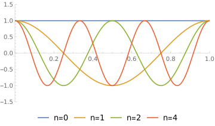
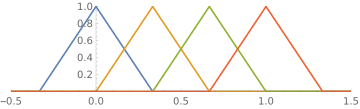

<h2 class='chapterHead'>Kapitel 6 Funktionenräume</h2>

<!-- l. 6 -->
Kontext: Bevor wir tiefer in die numerische Lösung von partiellen
Differentialgleichungen einsteigen, müssen wir hier ein leicht abstraktes Konzept
einführen: Das Konzept der Funktionenräume, bzw. konkreter des Hilbertraums.
Funktionenräume sind nützlich, weil sie die Reihenentwicklung formalisieren
und durch das Konzept der Basisfunktionen einen einfachen Zugang zu den
Koeffizienten einer Reihenentwicklung liefern. 

<h3 class='sectionHead'>6.1  Vektoren</h3>
<!-- l. 12 -->
<a class='url' href='https://uni-freiburg.cloud.panopto.eu/Panopto/Pages/Embed.aspx?id=8efc0e26-23c7-4afc-80ab-ac840157f78f'>https://uni-freiburg.cloud.panopto.eu/Panopto/Pages/Embed.aspx?id=8efc0e26-23c7-4afc-80ab-ac840157f78f</a>

<!-- l. 14 -->
 Zur Einführung erinnern wir an die üblichen kartesischen Vektoren. Einen
Vektor \(\v{a}=(a_0, a_1, a_2)\) können wir als Linearkombination aus Basisvektoren \(\hat{e}_0\), \(\hat{e}_1\) und \(\hat{e}_2\),
\begin{equation} \v{a} = a_0 \hat{e}_0 + a_1 \hat{e}_1 + a_2 \hat{e}_2, \end{equation}
schreiben. Die Einheitsvektoren \(\hat{e}_0\), \(\hat{e}_1\) und \(\hat{e}_2\) sind natürlich die Vektoren, welche das
kartesische Koordinatensystem aufspannen. (In vorherigen Kapiteln wurde auch
die Notation \(\hat{x}\equiv \hat{e}_0\), \(\hat{y}\equiv \hat{e}_1\) und \(\hat{z}\equiv \hat{e}_2\) genutzt.) Die Zahlen \(a_0\), \(a_1\) und \(a_2\) sind die Komponenten oder
Koordinaten des Vektors, aber auch die Koeffizienten der Einheitsvektoren.
In diesem Sinne sind sie identisch zu den Entwicklungskoeffizienten der
Reihenentwicklung, mit dem Unterschied, dass die \(\hat{e}_i\) orthogonal sind, also
\begin{equation} \hat{e}_i\cdot \hat{e}_j = \delta _{ij} \end{equation}
wobei \(\delta _{ij}\) das Kronecker-\(\delta \) ist. Zwei kartesische Vektoren \(\v{a}\) und \(\v{b}\) sind orthogonal, wenn
das Skalarprodukt zwischen ihnen verschwindet: \begin{equation} \v{a}\cdot \v{b} = \sum _i a_i b_i = 0 \label{eq:vecscalar} \end{equation}

<!-- l. 29 -->
 Mit Hilfe der Basisvektoren und dem Skalarprodukt können wir direkt die
Komponenten erhalten: \(a_i = \v{a}\cdot \hat{e}_i\). Dies ist eine direkte Konsequenz der Orthogonalität
der Basisvektoren \(\hat{e}_i\).

<!-- l. 31 -->

<h3 class='sectionHead'>6.2  Funktionen</h3>
<!-- l. 33 -->
Im vorhergegangen Abschnitt steht die Behauptung, dass die Basisfunktionen
aus Kapitel 5 nicht orthogonal sind. Hierzu brauchen wir eine Idee für
Orthogonalität von Funktionen. Mit einer Definition eines Skalarprodukts
zwischen zwei Funktionen könnten wir dann Orthogonalität als Verschwinden
dieses Skalarprodukts definieren.

<!-- l. 35 -->
 Wir führen nun Skalarprodukt auf Funktionen(räume) ein, das diese
Eigenschaften auch erfüllt. Gegeben zwei Funktionen \(g(x)\) und \(f(x)\) auf dem Interval \(x\in [a,b]\),
definieren wir das Skalarprodukt als \begin{equation} (f,g) = \int _a^b \dif x\, f^*(x) g(x), \label{eq:funcscalar} \end{equation}
wobei \(f^*(x)\) die komplex-konjugierte von \(f(x)\) ist. Dieses inneres Produkt oder
Skalarprodukt ist eine Abbildung mit den Eigenschaften 

<ul class='itemize1'>
<li class='itemize'>Positiv definit: \((f,f)\ge 0\) und \((f,f)=0\Leftrightarrow f=0\)
</li>
<li class='itemize'>Sesquilinear: \((\alpha f+\beta g,h)=\alpha ^*(f,h)+\beta ^*(g,h)\)
</li>
<li class='itemize'>Hermitesch: \((f,g)=(g,f)^*\)</li></ul>
<!-- l. 47 -->
Die Skalarprodukte Gl. \eqref{eq:vecscalar} und \eqref{eq:funcscalar} erfüllen
beide diese Eigenschaften.

<!-- l. 49 -->
Anmerkung: Das Skalarprodukt zwischen zwei Funktionen wird oft allgemeiner
mit einer Gewichtsfunktion \(w(x)\) definiert, \begin{equation} (f,g) = \int _a^b \dif x\, f^*(x) g(x) w(x). \end{equation}
Die Frage nach Orthogonalität zwischen Funktionen kann damit nur respektive
einer bestimmten Definition des Skalarprodukts geklärt werden. So sind z.B. die
Tschebyschow-Polynome respektive der Gewichtsfunktion \(w(x)=(1-x^2)^{-1/2}\) orthogonal.
Innerhalb dieser Lehrveranstaltung werden wir nur den Fall \(w(x)=1\) benötigen. 

<!-- l. 57 -->

<h3 class='sectionHead'>6.3  Basisfunktionen</h3>
<!-- l. 60 -->
Kommen wir nun zurück zur Reihenentwicklung, \begin{equation} f_N(x) = \sum _{n=0}^N a_n \varphi _n(x). \label{eq:series2} \end{equation}
Die Funktionen \(\varphi _i(x)\) heißen Basisfunktionen. Eine notwendige Eigenschaft der
Basisfunktionen ist deren lineare Unabhängigkeit. Die Funktionen sind linear
unabhängig, wenn keine der Basisfunktionen selbst als Linearkombination, also
in der Form der Reiheentwicklung Gl. \eqref{eq:series2}, der anderen
Basisfunktionen geschrieben werden kann. D.h. es muss erfüllt sein, dass
\begin{equation} \sum _{n=0}^{N}a_n \varphi _n(x) = 0 \end{equation}
dann und nur dann wenn alle \(a_n=0\). Linear unabhängige Elemente bilden eine
Basis.

<!-- l. 73 -->
 Diese Basis heißt vollständig, wenn alle relevanten Funktionen
(= Elemente des zu Grunde liegenden Vektorraums) sich durch die
Reihenentwicklung \eqref{eq:series2} abbilden lassen. (Beweise der
Vollständigkeit von Basisfunktionen sind komplex und außerhalb des Fokus
dieser Lehrveranstaltung.) Die Koeffizienten \(a_n\) heißen Koordinaten oder
Koeffizienten. Die Anzahl der Basisfunktionen bzw. der Koordinaten \(N\) nennt man
die Dimension des Vektorraums.

<!-- l. 75 -->
Anmerkung: Ein Vektorraum ist eine Menge, auf der die Operationen der
Addition und Skalarmultiplikation mit den üblichen Eigenschaften, wie der
Existenz von neutralen und inversen Elementen und Assoziativ-, Kommutativ-
und Distributivgesetzen, definiert sind. Ist dieser Raum auf Funktionen definiert,
dann spricht man auch von einem Funktionenraum. Existiert zusätzlich ein
Skalarprodukt wie Gl. \eqref{eq:funcscalar}, dann spricht man von einem
Hilbertraum. 

<!-- l. 79 -->
 Besonders nützliche Basisfunktionen sind orthogonal. Mit Hilfe des
Skalarprodukts können wir nun Orthogonalität für diese Funktionen
definieren. Zwei Funktionen \(f\) und \(g\) sind orthogonal wenn das Skalarprodukt
verschwindet, \((f, g) = 0\). Ein Satz gegenseitig orthogonaler Basisfunktionen erfüllt
\begin{equation} (\varphi _n, \varphi _m) = \nu _{n} \delta _{nm}, \end{equation}
wobei \(\delta _{nm}\) das Kronecker-\(\delta \) ist. Für \(\nu _n\equiv (\varphi _n, \varphi _n)=1\) heißt die Basis orthonormal.

<!-- l. 85 -->
 Die Orthogonalität ist nützlich, weil sie uns einen Weg aufzeigt, mit dem wir
die Koeffizienten der Reihenentwicklung \eqref{eq:series2} bekommen können:
\begin{equation} (\varphi _n, f_N) = \sum _{i=0}^N a_i (\varphi _n, \varphi _i) = \sum _{i=0}^N a_i \nu _i \delta _{ni} = a_n \nu _n \end{equation}
bzw. \begin{equation} a_n = \frac{(\varphi _n, f_N)}{(\varphi _n, \varphi _n)}. \label{eq:coordinates} \end{equation}
D.h. die Koordinaten sind gegeben durch die Projektion (das Skalarprodukt) der
Funktion auf die Basisvektoren. Wir erinnern uns daran, dass auch für
kartesische Vektoren gilt: \(a_n = \v{a}\cdot \hat{e}_n\). (Der Normierungsfaktor entfällt hier, weil \(\hat{e}_n\cdot \hat{e}_n=1\).) Die
Koordinaten, die durch Gl. \eqref{eq:coordinates} gegeben sind, sind in genau
dem gleichen Kontext zu sehen.

<!-- l. 102 -->

<h4 class='subsectionHead'>6.3.1  Fourier-Basis</h4>
<!-- l. 105 -->
<a class='url' href='https://uni-freiburg.cloud.panopto.eu/Panopto/Pages/Embed.aspx?id=6e2bcafd-24b2-4ee5-b58c-ac840157f7bc'>https://uni-freiburg.cloud.panopto.eu/Panopto/Pages/Embed.aspx?id=6e2bcafd-24b2-4ee5-b58c-ac840157f7bc</a>

<!-- l. 107 -->
 Ein berühmter und wichtiger Satz von Basisfunktionen ist die Fourier-Basis,

\begin{equation} \varphi _n = \exp \left ( i q_n x \right ), \label{eq:fourier-basis} \end{equation}
auf dem Interval \(x\in [0,L]\) mit \(q_n = 2\pi n/L\) und \(n\in \mathbb{Z}\). Die Fourier-Basis ist periodisch auf diesem
Interval und in Abb. <a href='#x1-5001r1'>6.1<!-- tex4ht:ref: fig:fourierbasis --></a> gezeigt. Es kann einfach gezeigt werden, dass
\begin{equation} (\varphi _n, \varphi _m) = L \delta _{nm}, \end{equation}
also dass die Fourier-Basis orthogonal ist. Die Koeffizienten \(a_n\) der Fourier-Reihe,
\begin{equation} f_N(x) = \sum _{n=-N}^N a_n \varphi _n(x), \label{eq:fourierseries} \end{equation}
können damit für eine Reihe \(f_N(x)\) direkt als \begin{equation} a_n=\frac{1}{L}(\varphi _n, f_N)=\frac{1}{L}\int _0^L \dif x\, f_N(x) \exp \left (-i q_n x\right ) \end{equation}
bestimmt werden. Dies ist die bekannte Formel für die Koeffizienten der
Fourier-Reihe. Man beachte, dass die Summe in Gl. \eqref{eq:fourierseries} von \(-N\)
bis \(N\) läuft und man \(2N+1\) Koeffizienten erhält.

<figure class='figure'>

<!-- l. 131 -->
 

<figcaption class='caption'>Abbildung 6.1::
Realteil der Fourier-Basisfunktionen, Gl. \eqref{eq:fourier-basis}, für \(n=1,2,3,4\). Die
Basisfunktionen höherer Ordnung oszillieren mit einer kleineren Periode
und repräsentieren höhere Frequenzen.
</figcaption><!-- tex4ht:label?: x1-5001r6.3 -->

</figure>

<!-- l. 137 -->
Anmerkung: Konzeptuell beschreibt die Fourier-Basis unterschiedliche
Frequenzkomponenten, während die Basis der im nächsten Abschnitt
beschriebenen finiten Elemente unterschiedliche Raumbereiche beschreibt. 

<h4 class='subsectionHead'>6.3.2  Finite Elemente</h4>
<!-- l. 144 -->
<a class='url' href='https://uni-freiburg.cloud.panopto.eu/Panopto/Pages/Embed.aspx?id=ec080e9a-ff09-4366-8784-ac840166145c'>https://uni-freiburg.cloud.panopto.eu/Panopto/Pages/Embed.aspx?id=ec080e9a-ff09-4366-8784-ac840166145c</a>

<!-- l. 146 -->
 Wir werden hier hauptsächlich mit der Basis der finiten Elemente arbeiten.
Im Gegensatz zur Fourier-Basis, die auf der gesamten Domäne nur an isolierten
Punkten gleich Null wird, ist die Finite-Elemente-Basis im Raum lokalisiert und
für große Bereiche der Domäne Null. Sie zerlegt damit die Domäne in
räumliche Abschnitte.

<!-- l. 148 -->
 In ihrer einfachsten Form besteht die Basis aus lokalisierten abschnittsweise
linearen Funktionen, der “Zelt”-Funktion, \begin{equation} \varphi _n(x) = \left \{ \begin{array}{ll} \frac{x-x_{n-1}}{x_n - x_{n-1}} &amp; \text{für}\; x\in [x_{n-1},x_n]\\ \frac{x_{n+1-x}}{x_{n+1} - x_n} &amp; \text{für}\; x\in [x_n,x_{n+1}] \\ 0 &amp; \text{sonst} \end{array} \right . \label{eq:finite-element-basis} \end{equation}
Hierbei sind die \(x_n\) die Stützstellen (auch Gitterpunkte oder Knoten - engl.
“node”), zwischen denen die Zelte aufgespannt sind. Die Funktionen sind so
konstruiert, dass \(\int \dif x\,\varphi _n(x)=(x_{n+1}-x_{n-1})/2\). Diese Basis ist die einfachste Form der finite Elemente-Basis
und in Abb. <a href='#x1-6001r2'>6.2<!-- tex4ht:ref: fig:febasis --></a> gezeigt. Für höhere Genauigkeit werden auch Polynome
höherer Ordnung eingesetzt.

<figure class='figure'>

<!-- l. 165 -->
 

<figcaption class='caption'>Abbildung 6.2:: Die Basis der finiten Elemente in ihrer einfachsten,
linearen Inkarnation. Jede Basisfunktion ist ein “Zelt”, dass über ein
gewisses Interval zwischen \(0\) und \(1\) und wieder zurück verläuft, siehe auch
Gl. \eqref{eq:finite-element-basis}.
</figcaption><!-- tex4ht:label?: x1-6001r6.3 -->

</figure>
<!-- l. 171 -->
 Ein wichtiger Hinweis an dieser Stelle ist, dass die Basis der finiten Element
nicht orthogonal ist. In unserem eindimensionalen Fall verschwindet das
Skalarprodukt nicht für die nächsten Nachbarn. Dies ist deshalb der Fall, weil
bei zwei Nachbarn jeweils eine steigende und eine fallende Flanke überlappt.
Man erhält \begin{align} (\varphi _n, \varphi _n) &amp;= \frac{1}{3}(x_{n+1}-x_{n-1}) \equiv M_{nn} \\ (\varphi _n, \varphi _{n+1}) &amp;= \frac{1}{6}(x_{n+1}-x_n) \equiv M_{n,n+1}\\ (\varphi _n, \varphi _m) &amp;= 0\quad \text{für}\;|n-m|&gt;1 \equiv M_{nm} \end{align}

<!-- l. 177 -->
 für die Skalarprodukte.

<!-- l. 179 -->
 Trotzdem können wir diese Relationen nutzen, um die Koeffizienten einer
Reihenentwicklung, \begin{equation} f_N(x) = \sum _{n=0}^N a_n \varphi _n(x) \end{equation}
zu berechnen. Man erhält \begin{equation} \begin{split} (\varphi _n, f_N(x)) &amp;= a_{n-1} (\varphi _n, \varphi _{n-1}) + a_n (\varphi _n, \varphi _n) + a_{n+1} (\varphi _n, \varphi _{n+1}) \\ &amp;= M_{n,n-1} a_{n-1} + M_{nn} a_n + M_{n,n+1} a_{n+1}. \end{split} \end{equation}
Dies können wir als \begin{equation} (\varphi _n, f_N(x)) = \left [ \t{M}\cdot \v{a} \right ]_n \end{equation}
schreiben, wobei \([\v{v}]_n=v_n\) die \(n\)te Komponente des Vektors, welcher durch die beiden
eckigen Klammer \([\cdot ]_n\) eingeschlossen wird, bezeichnet. Die Matrix \(\t{M}\) ist dünnbesetzt
(engl. “sparse”). Für eine orthogonale Basis, wie beispielsweise die Fourier-Basis
in Abschnitt <a href='#x1-50006.3.1'>6.3.1<!-- tex4ht:ref: sec:fouirer-basis --></a>, ist diese Matrix diagonal. Für eine Basis mit identischen
Abständen \(x_{n+1}-x_n=1\) der Stützstellen \(x_n\) hat die Matrix die folgende Form \begin{equation} \t{M} = \begin{pmatrix} 2/3 &amp; 1/6 &amp; 0 &amp; 0 &amp; 0 &amp; 0 &amp; \cdots \\ 1/6 &amp; 2/3 &amp; 1/6 &amp; 0 &amp; 0 &amp; 0 &amp; \cdots \\ 0 &amp; 1/6 &amp; 2/3 &amp; 1/6 &amp; 0 &amp; 0 &amp; \cdots \\ 0 &amp; 0 &amp; 1/6 &amp; 2/3 &amp; 1/6 &amp; 0 &amp; \cdots \\ 0 &amp; 0 &amp; 0 &amp; 1/6 &amp; 2/3 &amp; 1/6 &amp; \cdots \\ 0 &amp; 0 &amp; 0 &amp; 0 &amp; 1/6 &amp; 2/3 &amp; \cdots \\ \vdots &amp; \vdots &amp; \vdots &amp; \vdots &amp; \vdots &amp; \vdots &amp; \ddots \end{pmatrix}. \end{equation}
Um die Koeffizienten \(a_n\) zu finden, muss also ein (dünnbesetztes) lineares
Gleichungssystem gelöst werden. Wir werden \(\t{M}\) später unter dem Namen
Massematrix wieder treffen.

<!-- l. 207 -->
Anmerkung: Basissätze, die nur an individuellen Punkten von Null verschieden
sind, nennt man spektrale Basissätze. Insbesondere ist die Fourier-Basis ein
spektraler Basissatz für periodische Funktionen. Grundsätzlich bilden die
orthogonalen Polynome wichtige spektrale Basissätze die auch in der Numerik
Anwendung finden. So sind beispielsweise die Tschebyschow-Polynome gute
Basissätze für auf abgeschlossenen Intervallen definierte nicht-periodische
Funktionen. Die Basis der finiten Elemente ist keine spektrale Basis. 

<h2 class='likechapterHead'>Literaturverzeichnis</h2>

