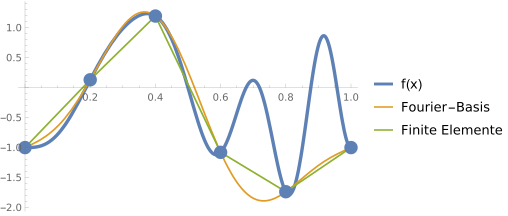
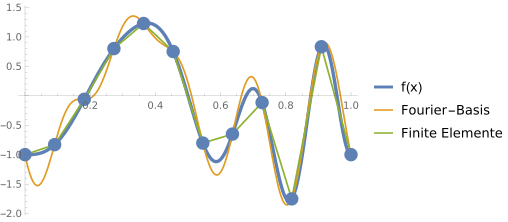
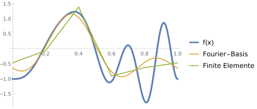
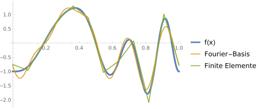

<h2 class='chapterHead'>Kapitel 7 Approximation und Interpolation</h2>

<!-- l. 6 -->
Kontext: Wir wenden nun die Idee der Basisfunktionen an, um Funktionen zu
approximieren. Hierfür kommen wir zu dem Konzept des Residuums zurück.
Ziel der Funktionsapproximation ist es, dass die approximierte Funktion das
Residuum minimiert. Aufbauend auf diesen Ideen besprechen wir dann
im nächsten Kapitel die Approximation von Differentialgleichungen. 

<h3 class='sectionHead'>7.1  Residuum</h3>
<!-- l. 12 -->
Im vorherigen Abschnitt haben wir beschrieben, wie mit Basisfunktionen eine
Reihenentwicklung aufgebaut werden kann. Eine typische Reihenentwicklung
enthält eine endliche Zahl an Elementen \(N+1\) und hat die Form \begin {equation} f_N(x) = \sum _{n=0}^N a_n \varphi _n(x), \end {equation}
wobei die \(\varphi _n(x)\) die im vorherigen Kapitel eingeführten Basisfunktionen sind.

<!-- l. 18 -->
 Wir wollen uns nun der Frage nähern, wie wir ein beliebige Funktion \(f(x)\) über
eine solche Basisfunktionsentwicklung annähern können. Hierzu definieren wir
das Residuum \begin {equation} R(x) = f_N(x) - f(x), \end {equation}
welches an jedem Punkt \(x\) verschwindet wenn \(f_N(x)\equiv f(x)\). Für eine Approximation wollen
wir dieses Residuum “minimieren”. (Mit minimieren ist hier gemeint, es
möglichst nah an Null zu bringen.) Wir suchen also die Koeffizienten \(a_n\) der
Reihenentwicklung, welche die Funktion \(f(x)\) im Sinne einer Minimierung des
Residuums approximiert.

<!-- l. 24 -->
 An dieser Stelle sei noch bemerkt, dass die Basisfunktionen auf dem gleichen
Raum für die Zielfunktion \(f(x)\) definiert sein müssen. Für die Approximation einer
periodischen Funktion \(f(x)\) sollte auch ein periodischer Basissatz verwandt
werden.

<!-- l. 26 -->

<h3 class='sectionHead'>7.2  Kollokation</h3>
<!-- l. 28 -->
<a href='https://uni-freiburg.cloud.panopto.eu/Panopto/Pages/Embed.aspx?id=0a7985a2-0753-4d29-83fe-aca8010a16f2' class='url'>https://uni-freiburg.cloud.panopto.eu/Panopto/Pages/Embed.aspx?id=0a7985a2-0753-4d29-83fe-aca8010a16f2</a>

<!-- l. 30 -->
 Als erste Minimierungsstrategie wird hier die Kollokation eingeführt.
In diese Methode wird verlangt, dass das Residuum an ausgewählten
Kollokationspunkten \(y_n\) verschwindet, \begin {equation} R(y_n) = 0 \quad \text {bzw.}\quad f_N(y_n) = f(y_n). \end {equation}
Die Anzahl der Kollokationspunkte muss hier der Anzahl der Koeffizienten in der
Reihenentwicklung entsprechen. Die Wahl der idealen Kollokationspunkte \(y_n\) selbst

ist nicht-trivial, und wir werden hier nur spezifische Fälle besprechen.

<!-- l. 36 -->
 Als erstes Beispiel diskutieren wir hier eine Entwicklung mit \(N\) finiten
Elementen. Als Kollokationspunkte wählen wir die Stützstellen der Basis, \(y_n=x_n\). An
diesen Stützstellen ist nur eine der Basisfunktionen ungleich Null, \(\varphi _n(y_n)=1\) und \(\varphi _n(y_k)=0\) falls \(n\not =k\).
Damit führt die Bedingung \begin {equation} R(y_n) = 0 \end {equation}
trivial zu \begin {equation} a_n = f(y_n). \end {equation}
Die Koeffizienten \(a_n\) sind also durch den Funktionswert der zu approximierenden
Funktion am Kollokationspunkt gegeben. Die Approximation ist damit eine
stückweise lineare Funktion zwischen den Funktionswerten von \(f(x)\).

<!-- l. 46 -->
 Als zweites Beispiel diskutieren wir hier eine Fourier-Reihe mit entsprechenden
\(2N+1\) Fourier-Basisfunktionen, \begin {equation} \varphi _n(x) = \exp \left ( i q_n x \right ). \end {equation}
Im Rahmen einer Kollokationsmethode, verlangen wir, dass das Residuum auf \(2N+1\)
äquidistanten Punkten verschwindet, \(R(y_n)=0\) mit \begin {equation} y_n = n L / (2N+1). \end {equation}
Die Bedingung dafür lautet dann \begin {equation} \sum _{k=-N}^{N} a_k \exp \left (i q_k y_n\right ) = \sum _{k=-N}^{N} a_k \exp \left (i 2\pi \frac {k n}{2N+1}\right ) = f(y_n). \label {eq:fourier-collocation} \end {equation}
Gleichungen \eqref{eq:fourier-collocation} können nun nach \(a_k\) aufgelöst werden.
Wir nutzen dazu, dass für äquidistanter Kollokationspunkte die Fourier-Matrix \(W_{kn}=\exp (i2\pi kn/(2N+1))\)
(bis auf einen Faktor) unitär ist, d.h. ihr Inverses ist durch die Adjungierte
gegeben: \(\sum _n W_{kn} W_{nl}^* = (2N+1)\delta _{kl}\). Wir können also Gl. \eqref{eq:fourier-collocation} mit \(W_{nl}^*\) multiplizieren
und über \(n\) summieren. Dies ergibt \begin {equation} \sum _{n=-N}^{N} \sum _{k=-N}^{N} a_k \exp \left [i 2\pi \frac {(k - l) n}{2N+1}\right ] = \sum _{k=-N}^{N} N a_k \delta _{kl} = N a_l \end {equation}
wobei \begin {equation} \sum _{n=-N}^{N} \exp \left [i 2\pi \frac {(k - l) n}{2N+1}\right ] = (2N+1)\delta _{kl} \end {equation}
genutzt wurde. Damit können die Koeffizienten als \begin {equation} a_l = \frac {1}{2N+1} \sum _{n=-N}^{N} f\left (\frac {nL}{2N+1}\right ) \exp \left (-i 2\pi \frac {l n}{2N+1}\right ), \end {equation}
bestimmt werden. Dies ist die diskrete Fourier-Transformation der auf den
Kollokationspunkten diskretisierten Funktion \(f(y_n)\).

<!-- l. 99 -->
 Als einfaches Beispiel zeigen wir hier Approximation der Beispielfunktion
\(f(x)=\sin (2\pi x)^3 + \cos (6\pi (x^2-1/2))\) mit Hilfe der Fourier-Basis und der finiten Elemente. Abbildung <a href='#x1-5001r2'>7.2<!-- tex4ht:ref: fig:example-collocation --></a>
zeigt diese Approximation für \(2N+1=5\) und \(2N+1=11\) Basisfunktionen mit äquidistanten
Kollokationspunkten.

<figure class='figure'>

<!-- l. 110 -->

<!-- l. 111 -->

 

<!-- l. 113 -->

<!-- l. 114 -->

 

<!-- l. 117 -->
figureApproximation der auf dem Interval \([0,1]\) periodischen Funktion \(f(x)=\sin (2\pi x)^3 + \cos (6\pi (x^2-1/2))\)
mit einer Fourier-Basis und finiten Elementen. Es wurde jeweils \(5\)
(oben) und \(11\) (unten) Basisfunktionen genutzt. Die Koeffizienten wurden
mit der Kollokationsmethode bestimmt. Die runden Punkte zeigen die
Kollokationspunkte. Beide Approximationen laufen exakt durch diese
Kollokationspunkte. (Der rechte Kollokationspunkt ist auf Grund der
Periodizität identisch zum linken.) Die Approximation mit \(N=5\) Basisfunktionen
kann die beiden rechten Oszillationen der Zielfunktion \(f(x)\) in beiden Fällen
nicht abbilden.

Abbildung 7.1: Approximation der auf dem Interval \([0,1]\) periodischen Funktion
\(f(x)=\sin (2\pi x)^3 + \cos (6\pi (x^2-1/2))\) mit einer Fourier-Basis und finiten Elementen. Es wurde jeweils \(5\)
(oben) und \(11\) (unten) Basisfunktionen genutzt. Die Koeffizienten wurden
mit der Kollokationsmethode bestimmt. Die runden Punkte zeigen die
Kollokationspunkte. Beide Approximationen laufen exakt durch diese
Kollokationspunkte. (Der rechte Kollokationspunkt ist auf Grund der
Periodizität identisch zum linken.) Die Approximation mit \(N=5\) Basisfunktionen
kann die beiden rechten Oszillationen der Zielfunktion \(f(x)\) in beiden Fällen
nicht abbilden.

</figure>
<!-- l. 121 -->
 Die Abbildung zeigt, dass alle Approximationen, wie von der
Kollokationsbedingung verlangt, exakt durch die Kollokationspunkte laufen.
Zwischen den Kollokationspunkten interpolieren die beiden Ansätze
unterschiedlich. Die finiten Elementen führen zu einer linearen Interpolation
zwischen den Punkten. Die Fourier-Basis ist komplizierter. Der Kurvenverlauf
zwischen den Kollokationspunkten wird Fourier-Interpolation genannt.

<h3 class='sectionHead'>7.3  Gewichtete Residuen</h3>
<!-- l. 126 -->
Wir möchten nun die Kollokationsmethode verallgemeinern. Hierzu führen wir
das Konzept der Testfunktion ein. Anstelle zu verlangen, dass das Residuum an
individuellen Punkten verschwindet, verlangen wir, dass das Skalarprodukt
\begin {equation} (v, R) = 0 \label {eq:test-function} \end {equation}
mit einer Funktion \(v(x)\) verschwindet. Wenn Gl. \eqref{eq:test-function}
für jede beliebigen Testfunktion \(v(x)\) verschwindet, dann ist die “schwache”
Formulierung Gl. \eqref{eq:test-function} identisch zur starken Formulierung \(R(x)=0\).
Gleichung \eqref{eq:test-function} heißt “schwache” Formulierung, weil die
Bedingung nur im integralen Sinne erfüllt ist. Insbesondere wird in Kapitel 9
gezeigt, dass diese schwache Formulierung zu einer schwachen Lösung (engl.
“weak solution”) führt, die die ursprüngliche (starke) PDGL nicht in jedem
Punkt erfüllen kann. Die Bedingung \eqref{eq:test-function} wird oft unter dem
Begriff der gewichteten Residuen subsumiert.

<!-- l. 133 -->
 Ein spezieller Satz an Testfunktion führt direkt zur Kollokationsmethode.
Wir wählen den Satz von \(N\) Testfunktionen \begin {equation} v_n(x) = \delta (x-y_n) \label {eq:colloctest} \end {equation}
wobei \(\delta (x)\) die Diracsche \(\delta \)-Funktion ist und \(y_n\) die Kollokationspunkte. Die Bedingung \((v_n,R)=0\)
für alle \(n\in [0,N-1]\) führt direkt zur Kollokationsbedingung \(R(y_x)=0\).

<!-- l. 140 -->
Anmerkung: Die Diracsche \(\delta \)-Funktion sollte aus Vorlesungen zur Signalverarbeitung
bekannt sein. Die wichtigste Eigenschaft dieser Funktion ist die Filtereigenschaft,
\begin {equation} \int _{-\infty }^{\infty } \dif x\, f(x) \delta (x-x_0) = f(x_0), \end {equation}
also das Integral über das Produkt der \(\delta \)-Funktion ergibt den Funktionswert, bei
dem das Argument der \(\delta \)-Funktion verschwindet. Hieraus folgen alle weiteren
Eingenschaften, z.B. \begin {equation} \int \dif x\, \delta (x) = \Theta (x), \end {equation}
wobei \(\theta (x)\) die (Heaviside-)Stufenfunktion ist. 

<!-- l. 152 -->

<h3 class='sectionHead'>7.4  Galerkin-Methode</h3>
<!-- l. 154 -->
<a href='https://uni-freiburg.cloud.panopto.eu/Panopto/Pages/Embed.aspx?id=697b4e0d-37c0-45e6-a958-aca8010a16c3' class='url'>https://uni-freiburg.cloud.panopto.eu/Panopto/Pages/Embed.aspx?id=697b4e0d-37c0-45e6-a958-aca8010a16c3</a>

<!-- l. 156 -->
 Die Galerkin-Methode basiert auf der Idee, als Testfunktionen die
Basisfunktionen \(\varphi _n\) der Reihenentwicklung zu verwenden. Dies führt zu den \(N\)
Bedingungen \begin {equation} (\varphi _n, R) = 0, \label {eq:galerkinortho} \end {equation}
bzw. \begin {equation} (\varphi _n, f_N) = (\varphi _n, f). \end {equation}

<!-- l. 166 -->
 Für einen orthogonalen Satz von Basisfunktionen erhält man direkt
\begin {equation} a_n = \frac {(\varphi _n, f)}{(\varphi _n, \varphi _n)}. \end {equation}
Dieser Ansatz wurde bereits in Abschnitt ?? diskutiert.

<!-- l. 172 -->
 Für einen nicht-orthogonalen Basissatz, z.B. der Basis der finiten Elemente,
erhält man ein lineares Gleichungssystem, \begin {equation} \sum _{m=0}^N (\varphi _n,\varphi _m) a_m = (\varphi _n, f), \label {eq:galerkin-coefficients} \end {equation}
wobei die Matrix \(A_{nm}=(\varphi _n,\varphi _m)\) für die finiten Elemente dünnbesetzt ist.

<!-- l. 179 -->
 Wir wollen nun wieder zu unserer Beispielfunktion \(f(x)=\sin (2\pi x)^3 + \cos (6\pi (x^2-1/2))\) zurückkommen.
Abbildung <a href='#x1-5001r2'>7.2<!-- tex4ht:ref: fig:example-collocation --></a> zeigt die Approximation dieser Funktion mit Fourier und
finite Elemente Basissätzen und der Galerkin-Methode. Es gibt keine
Kollokationspunkte und die Approximation mit Hilfe der finiten Elemente stimmt
auch nicht an den Stützstellen exakt mit der zu approximierenden Funktion
überein. Die Funktion wird nur im integralen Sinne approximiert.

<figure class='figure'>

<!-- l. 190 -->

<!-- l. 191 -->

 

<!-- l. 193 -->

<!-- l. 194 -->

 

<!-- l. 197 -->
figureApproximation der auf dem Interval \([0,1]\) periodischen Funktion \(f(x)=\sin (2\pi x)^3 + \cos (6\pi (x^2-1/2))\) mit
einer Fourier-Basis und finiten Elementen. Es wurde jeweils \(5\) (oben) und
\(11\) (unten) Basisfunktionen genutzt. Die Koeffizienten wurde mit Hilfe der
Galerkinmethode bestimmt. Die Approximation mit \(5\) Basisfunktionen kann
die beiden rechten Oszillationen der Zielfunktion \(f(x)\) in beiden Fällen nicht
abbilden.

Abbildung 7.2: Approximation der auf dem Interval \([0,1]\) periodischen Funktion
\(f(x)=\sin (2\pi x)^3 + \cos (6\pi (x^2-1/2))\) mit einer Fourier-Basis und finiten Elementen. Es wurde jeweils \(5\) (oben)
und \(11\) (unten) Basisfunktionen genutzt. Die Koeffizienten wurde mit Hilfe der
Galerkinmethode bestimmt. Die Approximation mit \(5\) Basisfunktionen kann
die beiden rechten Oszillationen der Zielfunktion \(f(x)\) in beiden Fällen nicht
abbilden.

</figure>

<!-- l. 201 -->
Anmerkung: Die Galerkin-Bedingung (siehe auch Gl. \eqref{eq:galerkinortho})
\begin {equation} (\varphi _n, R) = 0, \end {equation}
bedeutet, dass das Residuum orthogonal zu allen Basisfunktionen ist. Anders
ausgedrückt, im Residuum können nur noch Beiträge zur Funktion
vorkommen, die nicht mit dem gegeben Basissatz abgebildet werden können. Das
heißt aber auch, dass wir durch Erweiterung des Basissatzes unsere Lösung
systematisch verbessern können. 

<h3 class='sectionHead'>7.5  Minimales Fehlerquadrat</h3>
<!-- l. 211 -->
Ein alternativer Ansatz zur Approximation ist es, das Fehlerquadrat des
Residuums, \((R, R)\), zu minimieren. Für eine allgemeine Reihenentwicklung mit \(N\)
Basisfunktionen erhält man \begin {equation} \begin {split} (R, R) &amp;= (f, f) + (f_N, f_N) - (f_N, f) - (f, f_N) \\ &amp;= (f, f) + \sum _{n=0}^N \sum _{m=0}^N a_n^* a_m (\varphi _n, \varphi _m) - \sum _{n=0}^N a_n^* (\varphi _n, f) - \sum _{n=0}^N a_n (f, \varphi _n). \end {split} \end {equation}
Diese Fehlerquadrat ist dann minimiert, wenn \begin {equation} \frac {\partial (R,R)}{\partial a_k} = \sum _{n=0}^N a_n^* (\varphi _n, \varphi _k) = (f, \varphi _k). \end {equation}
und \begin {equation} \frac {\partial (R,R)}{\partial a^*_k} = \sum _{n=0}^N a_n (\varphi _k, \varphi _n) = (\varphi _k, f). \end {equation}
Dieser Ausdruck ist identisch zu Gl. \eqref{eq:galerkin-coefficients} der
Galerkin-Methode.

<h2 class='likechapterHead'>Literaturverzeichnis</h2>

