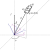

<h2 class='chapterHead'>Kapitel 8 Spektrale Lösungsansätze</h2>

<!-- l. 6 -->
Kontext: Wir entwickeln nun die in den vorherigen Kapiteln skizzierten
Ideen für die Lösung partieller Differentialgleichungen weiter. In diesem
Kapitel beschäftigen wir uns mit der Fourier-Basis. Dies führt zu einem
Lösungsverfahren, das üblicherweise unter dem Namen Integraltransformation
subsumiert wird. Zwar können spektrale Methoden auch für numerische Lösungen
eingesetzt werden, hier besprechen wir aber nur die Fourier-Transformation als
analytisches Lösungsverfahren. Neben der Anwendung dieser Verfahren,
erweitern wir hier die Lösungsansätze auch auf mehrdimensionale Räume. 

<h3 class='sectionHead'>8.1  Differentialoperatoren</h3>
<!-- l. 12 -->
Für die Lösung von Differentialgleichungen nutzen wir nun exakt die gleichen
Methoden, die wir im vorhergehenden Kapitel entwickelt haben: Minimierung des
Residuums mit Hilfe der Galerkin-Methode. Unser Residuum hat nun die
allgemeine Form, \begin{equation} R(x,y,z,\ldots ; a_0, a_1, \ldots , a_N) = \mathcal{L} u_N(x,y,z,\ldots ) - f(x,y,z,\ldots ), \end{equation}
wobei die unbekannte Funktion \(u_N\) hier als eine Reihenentwicklung in eine
bestimme Basis \(\varphi _n(x,y,z)\) dargestellt ist. In der Galerkin-Methode verlangt man
\begin{equation} (\varphi _n, R) = 0 \end{equation}
für jedes \(n\).

<!-- l. 24 -->
 Wir diskutieren zunächst die Fourier-Basis für periodische Funktionen auf \(x\in [0,L]\)
in einer Dimension, \begin{equation} \varphi _n(x) = \exp (i q_n x) \label{eq:fourierbasis} \end{equation}
mit \(q_n = 2\pi n/L\). Der Operator \(\mathcal{L}\) kann beliebige Differentialoperationen enthalten, die auf die
Basisfunktionen wirken, beispielsweise \begin{align} \frac{d}{dx} \varphi _n(x) &amp;= iq_n \varphi _n(x) \\ \frac{d^2}{dx^2} \varphi _n(x) &amp;= -q_n^2 \varphi _n(x). \end{align}

<!-- l. 34 -->
 D.h. die Ableitungen der (Fourier-)Basisfunktionen ergeben die gleiche
Basisfunktion und einen algebraischen Faktor. Man sagt auch, die Basisfunktionen
diagonalisieren den Differentialoperator. (Dies wird für die finiten Elemente, die
im nächsten Kapitel besprochen werden, anders sein.)

<!-- l. 36 -->
 Diese Eigenschaft ist besonders nützlich, weil zumindest für lineare
Differentialgleichungen damit das Residuum wieder eine triviale Reihenentwicklung
wird und wir auf Grund der Orthogonalität der Basis die Koeffizienten leicht
bestimmen können.

<!-- l. 38 -->

<h3 class='sectionHead'>8.2  Poisson-Gleichung in einer Dimension</h3>
<!-- l. 41 -->
<a class='url' href='https://uni-freiburg.cloud.panopto.eu/Panopto/Pages/Embed.aspx?id=88c55914-ce6f-4a02-96b5-aca8010e6886'>https://uni-freiburg.cloud.panopto.eu/Panopto/Pages/Embed.aspx?id=88c55914-ce6f-4a02-96b5-aca8010e6886</a>

<!-- l. 43 -->
 Als Demonstrator für diese Verhalten nutzen wir die (eindimensionale)
Poisson-Gleichung, \begin{equation} \nabla ^2 \Phi \equiv \frac{\dif ^2 \Phi }{\dif x^2} = - \frac{\rho }{\varepsilon }. \label{eq:poisson-1d} \end{equation}
Hier ist \(\rho \) eine Ladungsdichte und \(\Phi \) das elektrostatische Potential. Das Residuum ist
daher \begin{equation} R(x)=\frac{\dif ^2 \Phi }{\dif x^2} + \frac{\rho }{\varepsilon }, \label{eq:poisson-1d-res} \end{equation}
und die Lösung von Gl. \eqref{eq:poisson-1d} ist gegeben durch \(R(x)=0\).

<!-- l. 60 -->
 Formal schreiben wir nun das Potential als die Reihenentwicklung
\begin{equation} \Phi (x) \approx \Phi _N(x) = \sum _{n=-N}^N a_n \varphi _n(x), \end{equation}
wobei wir die Summationsgrenzen im folgenden nicht weiter explizit angeben
werden. Wir entwickeln auch die rechte Seite der Gl. \eqref{eq:poisson-1d} in
eine Reihe mit den gleichen Basisfunktionen, \begin{equation} \rho _N(x) = \sum _{n=-N}^N b_n \varphi _n(x). \label{eq:seriesphi} \end{equation}
Eingesetzt in Gl. \eqref{eq:poisson-1d-res} erhalten wir \begin{equation} R_N(x) = - \sum _n a_n q_n^2 \varphi _n(x) + \frac{1}{\varepsilon } \sum _n b_n \varphi _n(x). \end{equation}
Wir multiplizieren dies nun von links mit den Basisfunktionen, \((\varphi _k, R_N)\) (Galerkinmethode)
und erhalten auf Grund der Orthogonalität der Basisfunktionen die Gleichungen
\begin{equation} (\varphi _k, R_N) = - L q_k^2 a_k + L b_k/\varepsilon . \end{equation}
(Der Faktor \(L\) erscheint, weil die Basisfunktionen nicht normalisiert sind.) Die
Bedingung \((\varphi _k, R_N)=0\) führt zu \(a_k = b_k/(q_k^2 \varepsilon )\). Die approximative Lösung der Poisson-Gleichung ist
damit gegeben durch \begin{equation} \Phi _N(x) = \sum _n \frac{b_n}{q_n^2 \varepsilon } \varphi _n(x). \label{eq:discrpoissonfouriersol} \end{equation}
Dies ist die Fourier-Reihe der Lösung.

<!-- l. 85 -->

<h3 class='sectionHead'>8.3  Übergang zur Fourier-Transformation</h3>
<!-- l. 87 -->
<a class='url' href='https://uni-freiburg.cloud.panopto.eu/Panopto/Pages/Embed.aspx?id=bd5cfab2-323e-48dc-b7b9-aca9011cf271'>https://uni-freiburg.cloud.panopto.eu/Panopto/Pages/Embed.aspx?id=bd5cfab2-323e-48dc-b7b9-aca9011cf271</a>

<!-- l. 89 -->
 Die Fourier-Basis Gl. \eqref{eq:fourier-basis} ist auf einen finite Gebiet der
Länge \(L\) periodisch. Wenn wir die Länge \(L\) gegen unendlich gehen lassen,
bekommen wir eine Formulierung für nicht-periodische Funktionen. Dies führt
direkt zur Fourier-Transformation.

<!-- l. 91 -->
 Wir schreiben die Reihenentwicklung als \begin{equation} \Phi _N(x) = \sum _{n=-N}^N a_n \varphi _n(x) = \sum _{n=-N}^N a_n \exp \left ( i q_n x \right ) = \sum _{n=-N}^N \frac{\Delta q}{2\pi }\,\tilde{\Phi }(q_n) \exp \left ( i q_n x \right ) \label{eq:fouriertrafo1} \end{equation}
mit \(\Delta q = q_{n+1}-q_n = 2\pi /L\) und umskalierten Koeffizienten \(\tilde{\Phi }(q_n)=L a_n\). Hier wurde auf der rechten Seite von
Gl. \eqref{eq:fouriertrafo1} lediglich der Faktor \(1=L \Delta q/2\pi \) eingefügt. Dies hilft nun, den
Limes \(L\to \infty \) und \(N\to \infty \) zu bilden. In diesem Fall wird \(\Delta q \to dq\) und die Summe zum Integral. Man
erhält \begin{equation} \Phi (x) = \int _{-\infty }^\infty \frac{\dif q}{2\pi }\,\tilde{\Phi }(q) \exp \left ( i q x \right ), \label{eq:fouriertrafo2} \end{equation}
die Fourier-Rücktransformation.

<!-- l. 103 -->
 Die (Hin-)Transformation erhält man über ein ähnliches Argument. Wir
wissen nun, dass \begin{equation} \tilde{\Phi }(q_n) = L a_n = L \frac{(\varphi _n, \Phi _N)}{(\varphi _n, \varphi _n)} = (\varphi _n, \Phi _N) = \int _0^L \dif x \, \Phi _N(x) \exp \left ( -i q_n x \right ). \end{equation}
Im Grenzfall \(L\to \infty \) und \(N\to \infty \) wird dies zu \begin{equation} \tilde{\Phi }(q) = \int _{-\infty }^\infty \dif x \, \Phi (x) \exp \left ( -i q x \right ), \label{eq:fouriertrafo3} \end{equation}

der Fourier-Transformation. Die Fourier-Transformation ist nützlich, um
analytische Lösungen für partielle Differentialgleichungen auf unendlichen
Gebieten zu erhalten.

<!-- l. 124 -->
Anmerkung: Eine Tilde \(\tilde{f}(q)\) bezeichnet die Fourier-Transformierte einer Funktion \(f(x)\).
Die Fourier-Transformierte ist eine Funktion des Wellenvektors \(q\). Im Gegensatz
dazu erhalten wir bei der Fourier-Reihe abzählbare Koeffizienten \(a_n\). Der Grund
hierfür ist die Periodizität des betrachteten Gebiets. 

<!-- l. 128 -->

<h3 class='sectionHead'>8.4  Poisson-Gleichung in mehreren Dimensionen</h3>
<!-- l. 130 -->
Ähnlich wie wir eine approximierte Lösung für eine Differentialgleichung mit
Hilfe einer Reihenentwicklung konstruiert haben, können wir nun den Ansatz
Gl. \eqref{eq:fouriertrafo2} nutzen, um analytische Lösungen zu erhalten. In
diesem Abschnitt wird dies mit Hilfe der Poisson-Gleichung in drei Dimensionen
demonstriert.

<!-- l. 132 -->
 In drei Dimensionen lautet die Poisson-Gleichung \begin{equation} \nabla ^2 \Phi \equiv \frac{\partial ^2 \Phi }{\partial x^2} + \frac{\partial ^2 \Phi }{\partial y^2} + \frac{\partial ^2 \Phi }{\partial z^2} = - \frac{\rho }{\varepsilon }. \label{eq:poisson-3d} \end{equation}
Im Gegensatz zu Gl. \eqref{eq:poisson-1d} taucht hier nun die partielle
Ableitung \(\partial \) auf, weil \(\Phi (x,y,z)\) nun von drei Variablen (den kartesischen Koordinaten)
abhängt.

<!-- l. 143 -->
 Die Verallgemeinerung der Fourier-Basis und damit auch der
Fourier-Transformation auf drei Dimensionen ist trivial. Man erhält eine Basis,
in dem man Basisfunktionen in die kartesischen Richtungen (\(x\), \(y\) und \(z\)) multipliziert.
Üblicherweise braucht man nun drei Indices für die Koeffizienten, die
jeweils die Basis in \(x\), \(y\) und \(z\) bezeichnen. Man erhält als Reihenentwicklung
\begin{equation} \begin{split} \Phi _{NMO}(x,y,z) =&amp; \sum _{n=-N}^N \sum _{m=-M}^M \sum _{o=-O}^O a_{nmo} \varphi _n(x) \varphi _m(y) \varphi _o(z) \\ \equiv &amp; \sum _{n=-N}^N \sum _{m=-M}^M \sum _{o=-O}^O a_{nmo} \varphi _{nmo}(x,y,z) \end{split} \end{equation}
mit (möglicherweise unterschiedlicher) Entwicklungsordnung \(N\), \(M\) und \(O\). Der Basissatz
ist hier gegeben durch die Menge der Funktionen \(\varphi _{nmo}(x,y,z)=\varphi _n(x)\varphi _m(y)\varphi _o(z)\). Orthogonalität dieses
Basissatzes geht trivialerweise aus der Orthogonalität der eindimensionalen
Basisfunktionen \(\varphi _n(x)\) hervor. Die Verallgemeinerung der Fourier-Transformation
folgt hieraus direkt. Die Fourier-Rücktransformation schreibt sich als
\begin{equation} \Phi (x,y,z) = \int _{-\infty }^\infty \frac{\dif ^3 q}{(2\pi )^3}\,\tilde{\Phi }(q_x, q_y, q_z) \exp \left ( i q_x x + i q_y y + i q_z z\right ), \label{eq:fouriertrafo3d} \end{equation}
wobei die Fouriertransformierte \(\tilde{\Phi }\) jetzt natürlich von drei Wellenvektoren \(q_x\), \(q_y\)
und \(q_z\) abhängt. Der Differentialoperator \(\dif ^3 q=\dif q_x \dif q_y \dif q_z\) ist eine Kurznotation für die
dreidimensionale Integration.

<!-- l. 157 -->
 Wir können nun Gl. \eqref{eq:fouriertrafo3d} in die PDGL
Gl. \eqref{eq:poisson-3d} einsetzen und erhalten \begin{equation} R(\v{r}) = \int _{-\infty }^\infty \frac{\dif ^3 q}{(2\pi )^3}\, \left [ \left (-q_x^2 - q_y^2 - q_z^2\right ) \tilde{\Phi }(\v{q}) + \frac{\tilde{\rho }(\v{q})}{\varepsilon } \right ] \exp \left ( i \v{q}\cdot \v{r} \right ) = 0 \end{equation}
mit \(\v{r}=(x,y,z)\) und \(\v{q}=(q_x,q_y,q_z)\). Diese Gleichung muss für jedes \(x,y,z\) erfüllt sein und damit muss das
Argument der Integration verschwinden, also \begin{equation} -q^2 \tilde{\Phi }(\v{q}) + \frac{\tilde{\rho }(\v{q})}{\varepsilon } = 0. \label{eq:fourierpoisson2d} \end{equation}

<!-- l. 179 -->
Anmerkung: Ein alternatives Argument erhält man, wenn man die
Fourier-Transformation von \(R(x,y,z)\) hinschreibt: \begin{equation} R(q_x', q_y', q_z') = \int \dif ^3 r \, R(\v{r}) \exp \left ( -i q_x x - i q_y y - i q_z z \right ). \end{equation}
Diese enthält Terme der Form \begin{equation} \int _{-\infty }^\infty \dif x\, \exp \left (i (q_x - q_x') x\right ) = 2\pi \delta (q_x - q_x'), \end{equation}
welche Ausdruck der Orthogonalität der Basisfunktionen sind. Da die
Basisfunktionen nun mit einem Kontinuierlichen \(q_x\) (anstelle eines diskreten \(n\))
“parameterisiert” sind, erhält man eine Diracsche \(\delta \)-Funktion anstelle des
Kronecker-\(\delta \) in der Orthogonalitätsrelation. 

<!-- l. 193 -->
 Gleichung \eqref{eq:fourierpoisson2d} kann einfach analytisch gelöst werden.
Man erhält \begin{equation} \tilde{\Phi }(\v{q}) = \frac{\tilde{\rho }(\v{q})}{\varepsilon q^2} \label{eq:fourierpoissonsol} \end{equation}
mit \(q=|\v{q}|\). Dies ist äquivalent zur Lösung Gl. \eqref{eq:discrpoissonfouriersol} für
die Poisson-Gleichung auf einem periodischen Gebiet. Die Schwierigkeit
besteht nun da drin, für ein gegebenes \(\rho (x,y,z)\) die Hin- und Rücktransformation
auszuwerten.

<!-- l. 202 -->
Beispiel: Als Beispiel betrachten wir nun die Lösung für eine Punktladung \(Q\) am
Ursprung, \begin{equation} \rho (x,y,z) = Q \delta (x) \delta (y) \delta (z). \end{equation}
Die Fourier-Transformierte der Ladungsdichte \(\rho \) erhält man aus
Gl. \eqref{eq:fouriertrafo3}, \begin{equation} \tilde{\rho }(q_x,q_y,q_z) = Q. \end{equation}
D.h. die Fourier-Transformierte des elektrostatischen Potentials ist gegeben durch
(siehe Gl. \eqref{eq:fourierpoissonsol}) \begin{equation} \tilde{\Phi }(\v{q}) = \frac{Q}{\varepsilon q^2}, \end{equation}
und damit lautet die Darstellung im Realraum \begin{equation} \begin{split} \Phi (\v{r}) =&amp; \int _{-\infty }^\infty \frac{\dif ^3 q}{(2\pi )^3}\, \frac{Q}{\varepsilon q^2} \exp \left ( i \v{q}\cdot \v{r} \right ) \\ =&amp; \frac{Q}{(2\pi )^3 \varepsilon } \int _0^\infty \dif q \int _0^{2\pi } \dif \phi \int _{-1}^1 \dif (\cos \theta ) \, \exp \left ( i q r \cos \theta \right ) \end{split} \end{equation}
wobei \(\dif ^3 q = q^2 \dif q \dif \phi \dif (\cos \theta )\) mit Azimutwinkel \(\phi \) und Elevationswinkel \(\theta \), genutzt wurde (siehe auch
Abb. <a href='#x1-5001r1'>8.1<!-- tex4ht:ref: fig:volume-spherical --></a>). Wir verlangen hier (ohne Beschränkung der Allgemeinheit), dass \(\v{r}\) in
Richtung Zenit zeigt.

<!-- l. 230 -->
 Man erhält \begin{equation} \begin{split} \Phi (\v{r}) =&amp; \frac{Q}{(2\pi )^2 \varepsilon } \int _0^\infty \dif q \int _{-1}^1 \dif (\cos \theta ) \, \exp \left ( i q r \cos \theta \right ) \\ =&amp; \frac{Q}{(2\pi )^2 \varepsilon } \int _0^\infty \dif q\, \frac{\exp ( i q r ) - \exp (-iqr)}{iqr} \\ =&amp; \frac{Q}{(2\pi )^2 \varepsilon } \int _{-\infty }^\infty \dif q\, \frac{\sin q r}{qr} \\ =&amp; \frac{Q}{4\pi \varepsilon r}, \end{split} \end{equation}
wobei \(\int \dif x\,\sin x/x=\pi \) genutzt wurde. Dies ist die bekannte Lösung für das elektrostatische
Potential einer Punktladung. Man nennt sie auch die Fundamentallösung
oder Greensche Funktion der (dreidimensionalen) Poisson-Gleichung. 

<figure class='figure'>

<!-- l. 255 -->
 

<figcaption class='caption'>Abbildung 8.1:: Volumenelement für die Integration in Kugelkoordination
</figcaption><!-- tex4ht:label?: x1-5001r8.4 -->

</figure>

<h2 class='likechapterHead'>Literaturverzeichnis</h2>

