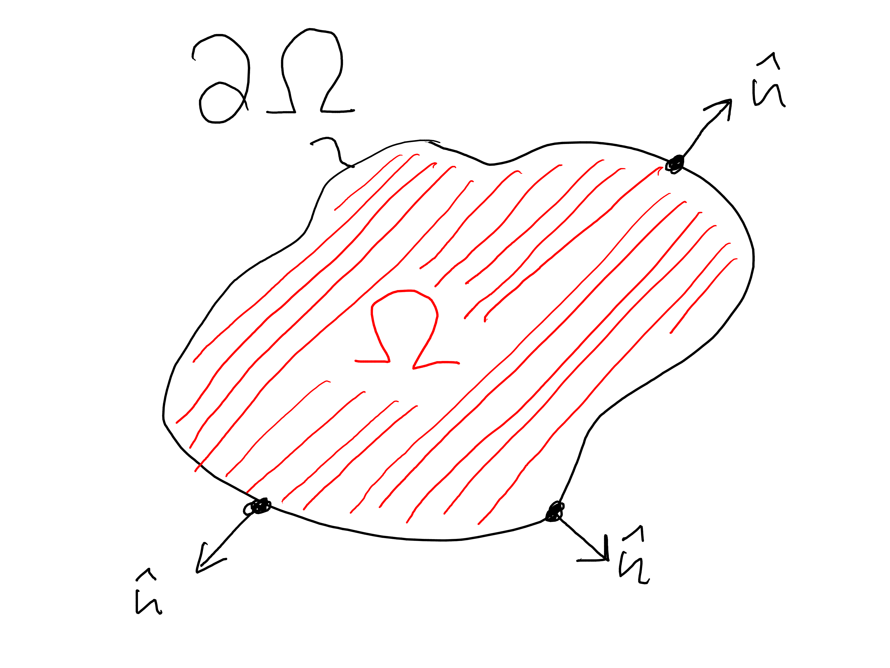
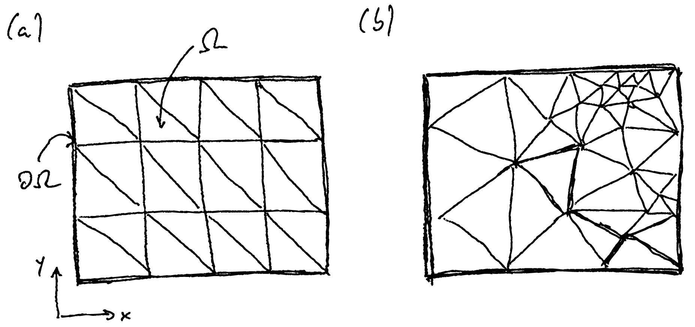
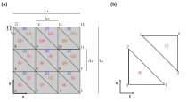
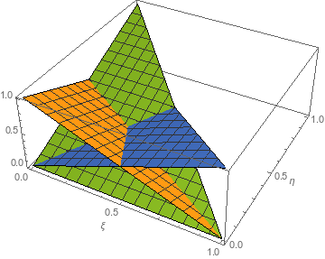

                                                                          
   <h2 class='chapterHead'>Kapitel 10 Finite Elemente in mehreren Dimensionen</h2>
   

<!-- l. 4 -->
Kontext: Wir verallgemeinern nun die Ergebnisse des vorhergehenden Kapitels
auf mehrere Dimensionen. Dies hat mehrere technische Hürden: Für die
partielle Integration müssen wir nun Ergebnisse der Vektoranalysis, insbesondere
den Gaussschen Satz bzw. die Greenschen Formeln nutzen. Die Diskretisierung
erfolgt in Form von Elementen, üblicherweise Dreiecke oder Tetraeder. Durch
diese komplexere Geometrie der Elemente wird eine saubere Buchhaltung der
Indices, also die Unterscheidung von globalen Knoten, Elementknoten und
Elementen wichtig. 

   <h3 class='sectionHead'>10.1    Differenzierbarkeit</h3>
<!-- l. 10 -->
<a class='url' href='https://uni-freiburg.cloud.panopto.eu/Panopto/Pages/Embed.aspx?id=5a9f99ea-5864-42a4-8920-acba010f39db'>https://uni-freiburg.cloud.panopto.eu/Panopto/Pages/Embed.aspx?id=5a9f99ea-5864-42a4-8920-acba010f39db</a>

<!-- l. 12 -->
   Zur Illustration, wie die Anforderung an die Differenzierbarkeit in
höherdimensionalen Problemen reduziert werden kann, und wir damit
wieder lineare Basisfunktionen verwenden können, wird hier weiter die
Poisson-Gleichung betrachtet. In \(D\)-Dimensionen (mit üblicherweise \(D=2\) oder \(D=3\)) führt
die Poisson-Gleichung zu dem Residuum \begin{equation} R(\v{r}) = \nabla ^2 \Phi + \frac{\rho (\v{r})}{\varepsilon } = \nabla \cdot \left (\nabla \Phi \right ) + \frac{\rho (\v{r})}{\varepsilon } \label{eq:poissonreshighd} \end{equation}
wobei \(\v{r}=(x,y,z,\ldots )\) nun ein \(D\)-dimensionaler Vektor ist, der die Position bezeichnet,
und \(\nabla ^2\) der Laplace-Operator in \(D\)-Dimensionen. Das Potential \(\Phi (\v{r})\) hängt nun
selbstverständlich auch von der räumlichen Position \(\v{r}\) ab. Die rechte Seite von
Gl. \eqref{eq:poissonreshighd} ist explizit so geschrieben, dass man die
Verknüpfung aus Divergenz und Gradient erkennt, die den Laplace-Operator
ergibt.

<!-- l. 23 -->
   Wir schreiben nun das gewichtete Residuum auf. Das Skalarprodukt mit einer
Testfunktion \(v(\v{r})\) ergibt \begin{align} (v(\v{r}), R(\v{r})) =&amp; \int _\Omega \dif ^Dr\, v(\v{r}) \left ( \nabla ^2 \Phi + \frac{\rho (\v{r})}{\varepsilon } \right ) \\ =&amp; \int _{\partial \Omega } \dif ^{D-1} r\, v(\v{r}) \left (\nabla \Phi \cdot \hat{n}(\v{r})\right ) -\int _\Omega \dif ^Dr\, \nabla v \cdot \nabla \Phi + \int _\Omega \dif ^Dr\, \frac{v(\v{r})\rho (\v{r})}{\varepsilon }, \label{eq:weakformhighd} \end{align}

<!-- l. 34 -->
   wobei nun die erste Greensche Formel verwandt wurde, um das Flächen- bzw.
Volumenintegral über \(\Omega \) umzuschreiben und dabei den Gradienten auf die
Testfunktion zu überführen. Die Greensche Formel nimmt hier die Rolle ein, die
in dem eindimensionalen Fall die partielle Integration hatte, siehe auch
Gl. \eqref{eq:beforepartialint}-\eqref{eq:afterpartialint}. \(\hat{n}(\v{r})\) ist der Normalenvektor,
welcher auf dem Rand \(\partial \Omega \) der Domäne nach außen zeigt (siehe Abb. <a href='#x1-2001r1'>10.1<!-- tex4ht:ref: fig:domainandboundary  --></a>. Der erste
Term auf der rechten Seite von Gl. \eqref{eq:weakformhighd} wird wieder
wichtig werden, wenn wir Neumann-Randbedingungen auf den Rand \(\partial \Omega \)
der Domäne vorgeben möchten. Im Dirichlet-Fall verschwindet dieser
Term.

                                                                          

                                                                          
   

<!-- l. 36 -->
Anmerkung: Die Greenschen Formeln sind ein weiteres wichtiges Ergebnis der
Vektoranalysis. Sie gehen aus dem Gausschen Satz hervor. Der Gausssche Satz
lautet (siehe auch Gl. \eqref{eq:divergence˙theorem}) \begin{equation} \int _\Omega \dif ^D r\, \nabla \cdot \v{f}(\v{r}) = \int _{\partial \Omega } \dif ^{D-1} r\, \v{f}(\v{r}) \cdot \hat{n}(\v{r}) \end{equation}
wobei \(\partial \Omega \) den \(D-1\) dimensionalen Rand des \(D\)-dimensionalen Integrationsgebiets \(\Omega \)
bezeichnet. Weiterhin ist \(\hat{n}(\v{r})\) der Normalenvektor, der senkrecht auf den Rand steht
und aus dem Integrationsgebiet hinaus zeigt (siehe auch Abb. <a href='#x1-2001r1'>10.1<!-- tex4ht:ref: fig:domainandboundary  --></a>). Wir wenden
den Gausschen Satz jetzt auf ein Vektorfeld \(\v{f}(\v{r})=\phi (\v{r})\v{v}(\v{r})\) an, wobei \(\phi (\v{r})\) ein skalares Feld und \(\v{v}(\v{r})\)
wiederum ein Vektorfeld ist. Man erhält \begin{equation} \int _\Omega \dif ^D r\, \nabla \cdot \left (\phi \v{v}\right ) = \int _{\partial \Omega } \dif ^{D-1} r\, \left (\phi \v{v}\right ) \cdot \hat{n}. \end{equation}
Auf Grund der Kettenregel der Ableitung gilt \begin{equation} \nabla \cdot \left (\phi \v{v}\right ) = \left (\nabla \phi \right )\cdot \v{v} + \phi \left (\nabla \cdot \v{v}\right ). \label{eq:chainrulevec} \end{equation}
(Das Gl. \eqref{eq:chainrulevec} gilt sieht man am einfachsten, wenn man sie
komponentenweise hinschreibt.) Dies führt zu \begin{equation} \int _\Omega \dif ^D r\, \left (\nabla \phi \cdot \v{v} + \phi \nabla \cdot \v{v}\right ) = \int _{\partial \Omega } \dif ^{D-1} r\, \left (\phi \v{v}\right ) \cdot \hat{n}. \end{equation}
Mit \(\v{v}(\v{r})=\nabla \psi \) erhält man die übliche Darstellung der ersten Greenschen Formel,
\begin{equation} \int _\Omega \dif ^D r\, \left (\nabla \phi \cdot \nabla \psi + \phi (\v{r}) \nabla ^2\psi \right ) = \int _{\partial \Omega } \dif ^{D-1} r\, \left (\phi \nabla \psi \right ) \cdot \hat{n}. \end{equation}

<!-- l. 70 -->
   In Gl. \eqref{eq:weakformhighd} ist nun die Anforderung an die
Differenzierbarkeit reduziert. Der Laplace-Operator, also die zweite Ableitung,
taucht nicht mehr in dieser Gleichung auf. Wir müssen lediglich Gradienten der
Testfunktion \(v(\v{r})\) und des Potentials \(\Phi (\v{r})\) berechnen können.

   <figure class='figure'> 

                                                                          

                                                                          
                                                                          

                                                                          
<!-- l. 76 -->
  

<figcaption class='caption'>Abbildung 10.1::              Der              Rand              \(\partial \Omega \)              begrenzt
das Integrations- bzw. Simulationsgebiet \(\Omega \). Der Normalenvektor \(\hat{n}\) ist auf dem
Rand \(\partial \Omega \) definiert und zeigt dort senkrecht zum Rand nach außen. In dieser
Skizze ist der zweidimensionale Fall dargestellt. Im dreidimensionalen Fall
ist \(\Omega \) ein Volumen und \(\partial \Omega \) die Fläche, welche das Volumen begrenzt. Auch in
diesem Fall kann man einen Normalenvektor \(\hat{n}\) auf diese begrenzende Fläche
definieren.
</figcaption><!-- tex4ht:label?: x1-2001r10.1  -->
                                                                          

                                                                          
   </figure>
   <h3 class='sectionHead'>10.2    Gitter</h3>
<!-- l. 84 -->
<a class='url' href='https://uni-freiburg.cloud.panopto.eu/Panopto/Pages/Embed.aspx?id=1f20826b-88c9-44cf-9b09-acba01318cd7'>https://uni-freiburg.cloud.panopto.eu/Panopto/Pages/Embed.aspx?id=1f20826b-88c9-44cf-9b09-acba01318cd7</a>

<!-- l. 86 -->
   Wir müssen nun geeignete Basisfunktionen wählen, um mit Hilfe
der Galerkin-Bedingungen ein lineares Gleichungssystem zu erhalten.
Hierbei ist es nützlich, die Formulierung im Sinne von Formfunktionen
und nicht von Basisfunktionen vorzunehmen. Die weitere Entwicklung
der Theorie in diesem Kapitel wird für zweidimensionale Probleme (\(D=2\))
vorgenommen.

<!-- l. 88 -->

   <h4 class='subsectionHead'>10.2.1    Triangulierung</h4>
<!-- l. 90 -->
Bevor wir über diese Details der Basisfunktionen reden können, müssen wir
die Zerlegung des Simulationsgebiet in Elemente diskutieren. In zwei Dimensionen
sind diese Elemente üblicherweise (aber nicht zwingend) Dreiecke, d.h.
man nimmt eine Triangulierung des Gebiets vor. Abbildung <a href='#x1-4001r2'>10.2<!-- tex4ht:ref: fig:triangulation  --></a> zeigt
eine solche Triangulierung für ein rechteckiges (2-dimensionales) Gebiet.
Diese Zerlegung nennt man auch das Gitter (oder Netz, engl. “grid” oder
“mesh”), die einzelnen Dreiecke Elemente (engl. “elements”) und die
Ecken der Dreiecke Knoten (engl “nodes”). Der Prozess der Zerlegung
des Gebiets wird Vernetzung genannt. Wir werden hier ausschließlich
mit strukturierten Gittern, wie in Abb. <a href='#x1-4001r2'>10.2<!-- tex4ht:ref: fig:triangulation  --></a>a dargestellt, arbeiten. Viele
Simulationspakete unterstützen auch unstrukturierte Gitter wie in Abb. <a href='#x1-4001r2'>10.2<!-- tex4ht:ref: fig:triangulation  --></a>b
gezeigt.

   <figure class='figure'> 

                                                                          

                                                                          
                                                                          

                                                                          
<!-- l. 96 -->
  

<figcaption class='caption'>Abbildung 10.2::  Triangulierung  eines  rechteckigen  Gebiets  \(\Omega \)  in  ein  (a)
strukturiertes Gitter und ein (b) unstrukturiertes Gitter.
</figcaption><!-- tex4ht:label?: x1-4001r10.2  -->
                                                                          

                                                                          
   </figure>
<!-- l. 102 -->
   Auch für diese Art der Zerlegung kann man die Zielfunktion \(\Phi (\v{r})\) durch eine
Summe approximieren. Wir schreiben \begin{equation} \Phi (x,y) \approx \Phi _N(x,y) = \sum _n a_n \varphi _n(x, y), \end{equation}
wobei \(n\) ein eindeutiger Knotenindex ist. D.h. die Freiheitsgrade bzw.
Expansionskoeffizienten \(a_n\) leben auf den Knoten (mit den Positionen \(\v{r}_n\)) des
Simulationsgebietes, und für eine Finite-Elemente Basis wird wieder gelten \(\Phi (\v{r}_n)=a_n\), d.h. \(a_n\)
ist der Funktionswert auf dem entsprechenden Knoten. Die Formfunktion ist dann
eine Vorschrift, wie zwischen den Knoten (also über die Dreiecke) dieser
Funktionswert interpoliert wird.

   

<!-- l. 108 -->
Anmerkung: In drei Dimensionen erfolgt die Zerlegung des Raumes
üblicherweise in Tetraeder. Die Vernetzung eines solchen dreidimensionalen
Gebiets ist höchst nicht-trivial. Alle kommerziellen Finite-Elemente Pakete
haben Vernetzer eingebaut, die diesen Prozess übernehmen oder zumindest
unterstützen. Eine freie Softwarelösung für die Vernetzung von komplexen
Geometrien ist Gmsh (<a class='url' href='https://gmsh.info/'>https://gmsh.info/</a>). 

   <h4 class='subsectionHead'>10.2.2    Strukturierung</h4>
<!-- l. 114 -->
Die Nutzung eines strukturierten Gitters vereinfacht die Zuweisung eines
Knotenindices \(n\) bzw. eines Elementindices \((n)\) zu entsprechenden räumlichen
Positionen. Abbildung <a href='#x1-5001r3'>10.3<!-- tex4ht:ref: fig:structured-grid  --></a> zeigt eine solche strukturierte Zerlegung in \(M_x\times M_y\) (mit \(M_x=L_x/\Delta x=3\) und
\(M_y=L_y/\Delta y=3\)) Kästen mit jeweils zwei Elementen. Das Gitter beinhaltet \(N_x \times N_y\) (mit \(N_x=M_x+1=4\) und \(N_y=M_y+1=4\))
Knoten.

   <figure class='figure'> 

                                                                          

                                                                          
                                                                          

                                                                          
<!-- l. 120 -->
 

<figcaption class='caption'>Abbildung 10.3:: Zerlegung eines rechteckigen Gebiets in ein strukturiertes
Gitter. (a) Die strukturierte Zerlegung erfolgt zuerst in kleinere Kästen,
deren eindeutiger globaler  Index in eckigen Klammern \([\cdot ]\) und blau gezeigt
ist. Diese Kästen werden dann in zwei Dreiecke, die Elemente, geteilt. Der
eindeutige globale Elementindex ist in runden Klammern \((\cdot )\) und rot gezeigt.
Weiterhin  sind  die  Knoten  mit  ihrem  einem  eindeutigen  globalen  Index
(schwarz) bezeichnet. (b) Die Kästen werden in zwei Dreicke mit lokalen
Elementindices \((0)\) und \((1)\) zerlegt. Innerhalb eines Elements, werden die Knoten
mit einem entsprechenden lokalen Knotenindex identifiziert.
</figcaption><!-- tex4ht:label?: x1-5001r10.2  -->
                                                                          

                                                                          
   </figure>
<!-- l. 126 -->
   In diesem strukturierten Gitter können wir von Koordinaten der Knoten auf
deren globalen Index \(n_{\text{K}}\) schließen. Da die Freiheitsgrade auf den Knoten leben,
identifiziert der globale Knotenindex \(n_{\text{K}}\) später eine Spalte oder Zeile aus der
Systemmatrix. Sei \(i,j\) die (ganzzahlige) Koordinate des Knotens, dann ist
\begin{equation} n_{\text{K}} = i + N_x j \label{eq:linindex} \end{equation}
der entsprechende globale Knotenindex. Hierbei laufen die Knotenkoordinaten bei
Null los, d.h. \(i\in \{0,1,\ldots ,N_x-1\}\) und \(j\in \{0,1,\ldots ,N_y-1\}\). Genauso können wir von Elementkoordinaten \(k,l,m\) auf den
Elementindex \(n_{\text{E}}\) schließen, \begin{equation} n_{\text{E}} = k + 2(l + M_x m), \label{eq:linindexel} \end{equation}
wobei nun \(l,m\) mit \(l\in \{0,1,\ldots ,M_x-1\}\) und \(m\in \{0,1,\ldots ,M_y-1\}\) die Koordinate des Kastens ist und \(k\in \{0, 1\}\) das Element innerhalb
eines Kastens indiziert. Der Faktor \(2\) taucht in Gl. \eqref{eq:linindexel} auf, weil
es zwei Elemente pro Kasten gibt.

   

<!-- l. 138 -->
Anmerkung: Gleichungen \eqref{eq:linindex} und \eqref{eq:linindexel} sind die
vermutlich einfachste Abbildung von Koordinaten auf einen linearen, konsekutiven
Index. Andere Möglichkeiten, die auch in der Numerik eingesetzt werden,
ergeben sich durch die raumfüllenden Kurven, wie z.B. die Hilbert- oder
Peano-Kurve. Raumfüllende Kurven haben teilweise vorteilhafte Eigenschaften,
wie z.B. dass Koordinaten die nah beieinander liegen auch Indices bekommen, die
nah bei einander liegen. Dies führt zu einer kompakteren Struktur der
dünnbesetzten Systemmatrix und kann Vorteile in der Laufzeit der Algorithmen
mit sich bringen. Der Grund für solche Laufzeitvorteile ist eng mit der
Hardware verknüpft, z.B. wie die Hardware Speicherzugriff organisiert
und Caches nutzt. Eine Optimierung von Algorithmen für spezifische
Hardwarearchitekturen ist höcht nicht-trivial und benötigt detailliertes Wissen
über die Rechnerarchitektur. 

   <h3 class='sectionHead'>10.3    Formfunktionen</h3>
<!-- l. 144 -->
<a class='url' href='https://uni-freiburg.cloud.panopto.eu/Panopto/Pages/Embed.aspx?id=e070f7d8-2d2d-468d-9589-acba013b471a'>https://uni-freiburg.cloud.panopto.eu/Panopto/Pages/Embed.aspx?id=e070f7d8-2d2d-468d-9589-acba013b471a</a>

<!-- l. 146 -->
   Unsere Formfunktionen leben auf den einzelnen Dreiecken der Triangulierung
und müssen auf den jeweiligen Knoten entweder \(1\) sein oder verschwinden. Wir
drücken die Formfunktionen hier mit Hilfe der skalierten Koordinaten \(\xi =(x-x_0)/\Delta x\) und \(\eta =(y-y_0)/\Delta y\) aus,
wobei \(x_0\) und \(y_0\) der Ursprung des jeweiligen Kastens ist. Damit ist in der
linken unteren Ecke des Kastens \(\xi =0\) und \(\eta =0\) und in der rechten obere Ecke \(\xi =1\) und
\(\eta =1\).

<!-- l. 148 -->
   Die Formfunktionen für das Element mit lokalen Elementindex \((0)\) (siehe
                                                                          

                                                                          
Abb. <a href='#x1-5001r3'>10.3<!-- tex4ht:ref: fig:structured-grid  --></a>b) lauten \begin{align} N^{(0)}_0(\xi , \eta ) &amp;= 1-\xi -\eta \\ \label{eq:formfunc1} N^{(0)}_1(\xi , \eta ) &amp;= \xi \\ N^{(0)}_2(\xi , \eta ) &amp;= \eta , \end{align}

<!-- l. 155 -->
   wobei der Index \(i\) in \(N^{(0)}_i\) den lokalen Knotenindex bezeichnet, bei dem die
Formfunktion \(1\) wird. Diese Formfunktionen sind in Abb. <a href='#x1-6001r4'>10.4<!-- tex4ht:ref: fig:febasis2d  --></a> gezeigt. Auf
Element \((1)\) lauten die Formfunktionen \begin{align} N^{(1)}_0(\xi , \eta ) &amp;= \xi +\eta -1 \\ N^{(1)}_1(\xi , \eta ) &amp;= 1-\xi \\ \label{eq:formfunc6} N^{(1)}_2(\xi , \eta ) &amp;= 1-\eta . \end{align}

<!-- l. 162 -->
   Diese Formfunktionen erfüllen die Eigenschaft \(N^{(n)}_0+N^{(n)}_1+N^{(n)}_2=1\), die sich Zerlegung der Eins
(engl. “partition of unity”) nennt.

   <figure class='figure'> 

                                                                          

                                                                          
                                                                          

                                                                          
<!-- l. 168 -->
 

<figcaption class='caption'>Abbildung 10.4::  Formfunktionen  für  lineare  Dreieckelemente  in  zwei
Dimensionen. Jeweils eine der Formfunktionen ist an einem der Knoten \(1\). An
den anderen beiden Knoten fallen die Formfunktionen auf \(0\) ab.
</figcaption><!-- tex4ht:label?: x1-6001r10.3  -->
                                                                          

                                                                          
   </figure>
<!-- l. 174 -->
   Wir brauchen im folgenden die Ableitungen der Formfunktionen respektive der
Positionen \(x\) und \(y\). Im allgemeinen Fall erhält man \begin{align} \frac{\partial N_i^{(n)}}{\partial x} &amp;= \frac{\partial N_i^{(n)}}{\partial \xi } \frac{\partial \xi }{\partial x} + \frac{\partial N_i^{(n)}}{\partial \eta } \frac{\partial \eta }{\partial x} \\ \frac{\partial N_i^{(n)}}{\partial y} &amp;= \frac{\partial N_i^{(n)}}{\partial \xi } \frac{\partial \xi }{\partial y} + \frac{\partial N_i^{(n)}}{\partial \eta } \frac{\partial \eta }{\partial y}, \end{align}

<!-- l. 179 -->
   oder in kompakter Matrix-Vektor Schreibweise \begin{equation} \nabla _{x,y} N_i^{(n)}\cdot \t{J} = \nabla _{\xi ,\eta } N_i^{(n)}, \label{eq:formgrad} \end{equation}
wobei \(\nabla _{x,y}\) den Gradienten respektive der angezeigten Koordinaten meint. Die Matrix
\begin{equation} \t{J} = \begin{pmatrix} \partial x/\partial \xi &amp; \partial x/\partial \eta \\ \partial y/\partial \xi &amp; \partial y/\partial \eta \end{pmatrix} = \begin{pmatrix} \Delta x &amp; 0 \\ 0 &amp; \Delta y \end{pmatrix} \label{eq:jacobi} \end{equation}
nennt sich Jacobi-Matrix. In unserem Beispiel ergibt sich die explizite Matrix auf
der rechten Seite von Gl. \eqref{eq:jacobi}, die unabhängig vom Kasten ist, den
wir betrachten. Für komplexere Gitter (z.B. Abb. <a href='#x1-4001r2'>10.2<!-- tex4ht:ref: fig:triangulation  --></a>b) beschreibt die
Jacobi-Matrix die Form der Dreiecke und damit die Struktur des Gitters.
Die Darstellung mit Hilfe der reskalierten Koordinaten \(\xi \) und \(\eta \), und damit
Gl. \eqref{eq:formgrad} als Gradienten, entkoppelt die Interpolationsvorschrift
Gl. \eqref{eq:formfunc1}-\eqref{eq:formfunc6} von der Struktur des Gitters und
ist daher besonders für unstrukturierte Gitter nützlich.

<!-- l. 201 -->
   Für unser Gitter finden wir also \begin{align} \frac{\partial N_0^{(0)}}{\partial x} &amp;= -1/\Delta x,\quad \frac{\partial N_0^{(0)}}{\partial y} = -1/\Delta y, \\ \frac{\partial N_1^{(0)}}{\partial x} &amp;= 1/\Delta x,\quad \frac{\partial N_1^{(0)}}{\partial y} = 0, \\ \frac{\partial N_2^{(0)}}{\partial x} &amp;= 0,\quad \frac{\partial N_2^{(0)}}{\partial y} = 1/\Delta y, \\ \frac{\partial N_0^{(1)}}{\partial x} &amp;= 1/\Delta x,\quad \frac{\partial N_0^{(1)}}{\partial y} = 1/\Delta y, \label{eq:N10der} \\ \frac{\partial N_1^{(1)}}{\partial x} &amp;= -1/\Delta x,\quad \frac{\partial N_1^{(1)}}{\partial y} = 0, \\ \frac{\partial N_2^{(1)}}{\partial x} &amp;= 0,\quad \frac{\partial N_2^{(1)}}{\partial y} = -1/\Delta y \label{eq:N12der} \end{align}

<!-- l. 219 -->
   für die Ableitungen der Formfunktionen. Da wir lediglich lineare Elemente
verwandt haben, sind diese Ableitungen alle Konstanten.

   <h3 class='sectionHead'>10.4    Galerkin-Methode</h3>
<!-- l. 223 -->
<a class='url' href='https://uni-freiburg.cloud.panopto.eu/Panopto/Pages/Embed.aspx?id=0f06cd8a-1931-4d51-9572-acba0129bf64'>https://uni-freiburg.cloud.panopto.eu/Panopto/Pages/Embed.aspx?id=0f06cd8a-1931-4d51-9572-acba0129bf64</a>

<!-- l. 225 -->
   Wir können nun die Galerkin-Methode anwenden, um das lineare
Gleichungssystem, welches die diskretisierte Differentialgleichung beschreibt, zu
bestimmen. Wir unterscheiden hier wieder zwischen Elementmatrizen und der
Systemmatrix. Für die Elementmatrix schreiben wir den Beitrag der
Formfunktion zur Galerkin-Bedingung auf. Man erhält \begin{equation} \begin{split} (N_I^{(n)}, R) &amp;= \left (N_I^{(n)}, \nabla ^2 \Phi + \frac{\rho (\v{r})}{\varepsilon }\right ) \\ &amp;= \int _{\partial \Omega } \dif ^2r\, N_I^{(n)}(\v{r})\nabla \Phi \cdot \hat{n}(\v{r}) - \sum _J a_J (\nabla N_I^{(n)}, \nabla N_J^{(n)}) + \frac{1}{\varepsilon } (N_I^{(n)}, \rho ), \\ &amp;= - \sum _J K_{IJ}^{(n)} a_J + f_I^{(n)}, \end{split} \end{equation}
wobei \(K_{IJ}^{(n)}\) nun die Elementmatrix ist und \(f_I^{(n)}\) der Beitrag des Elements zur rechten Seite.
Man erhält \begin{equation} K_{IJ}^{(n)} = (\nabla N_I^{(n)}, \nabla N_J^{(n)}). \end{equation}
wobei für zwei Vektorfelder \(\v{f}(\v{r})\) und \(\v{g}(\v{r})\) das Skalarprodukt als \begin{equation} (\v{f}, \v{g}) = \int _\Omega \dif ^3r\, \v{f}^*(\v{r})\cdot \v{g}(\v{r}), \end{equation}
also als kartesisches Skalarprodukt zwischen den beiden Funktionswerten, zu
verstehen ist. Der Beitrag des Elements zur rechten Seite lautet \begin{equation} f_I^{(n)} = \frac{1}{\varepsilon }(N_I^{(n)}, \rho ) + \int _{\partial \Omega } \dif ^2r\, N_I^{(n)}(\v{r})\nabla \Phi \cdot \hat{n}(\v{r}). \label{eq:rhs2d} \end{equation}

   

<!-- l. 251 -->
Beispiel: Wir berechnen nun die Elementmatrizen für die beiden Elemente
unseres strukturierten Beispielgitters. So lautet z.B. die Komponente \(I=0\) und \(J=0\) des
Elements \((0)\), \begin{equation} \begin{split} K_{00}^{(0)} &amp;= (\nabla N_0^{(0)}, \nabla N_0^{(0)}) \\ &amp;= \int _{\Omega ^{(0)}} \dif ^2r \left ( \frac{1}{\Delta x^2} + \frac{1}{\Delta y^2} \right ) \\ &amp;= \frac{\Delta x\Delta y}{2} \left ( \frac{1}{\Delta x^2} + \frac{1}{\Delta y^2} \right ) \\ &amp;= \frac{1}{2}\left (\frac{\Delta y}{\Delta x} + \frac{\Delta x}{\Delta y}\right ) \end{split} \end{equation}
                                                                          

                                                                          
wobei der Faktor \(\Delta x\Delta y/2\) die Fläche des Elements ist. Wir betrachten im
folgenden den Spezialfall \(\Delta x=\Delta y\), in dem man \(K_{00}^{(0)}=1\) erhält. (Im eindimensionalen Fall,
Gl. \eqref{eq:elmat1d}, blieb hier noch ein \(1/\Delta x\) stehen. Die Einheiten von \(K\)
unterscheiden sich damit im eindimensionalen und zweidimensionalen
Fall!)

<!-- l. 271 -->
   Die andere Skalarprodukte können ähnlich ausgerechnet werden. Man
erhält \begin{equation} \t{K}^{(0)} = \t{K}^{(1)} = \begin{pmatrix} 1 &amp; -1/2 &amp; -1/2 \\ -1/2 &amp; 1/2 &amp; 0 \\ -1/2 &amp; 0 &amp; 1/2 \end{pmatrix} \label{eq:elmat2d} \end{equation}
für beide Elementmatrizen. Diese Matrizen sind identisch, weil die Nummerierung
der lokalen Elementknoten so gewählt wurde, dass die beiden Dreiecke
ineinander rotiert werden können (siehe Abb. <a href='#x1-5001r3'>10.3<!-- tex4ht:ref: fig:structured-grid  --></a>b).

<!-- l. 282 -->
   Aus diesen Elementmatrizen müssen wir nun die Systemmatrix zusammenbauen.
Die lokalen Knotenindices sind in Abb. <a href='#x1-5001r3'>10.3<!-- tex4ht:ref: fig:structured-grid  --></a>b gezeigt. Diese entsprechen den
Spalten und Zeilen von Gl. \eqref{eq:elmat2d}. Sie müssen nun auf die globalen
Knotenindices abgebildet werden und in der Systemmatrix summiert werden. So
müssen wir Beispielsweise für Element \((8)\) in Abb. <a href='#x1-5001r3'>10.3<!-- tex4ht:ref: fig:structured-grid  --></a>a den lokalen Knoten \(0\) auf
den globalen Knoten \(5\) abbilden, \(0\to 5\). D.h. die erste Zeile der Elementmatrix wird zur
sechsten Zeile der Systemmatrix. (Es ist die sechste Zeile, und nicht die
fünfte Zeile, da die Indizierung bei Null beginnt.) Weiterhin müssen wir \(1\to 6\)
und \(2\to 9\) abbilden. Der Beitrag \(\Delta \t{K}^{(8)}\) von Element \((8)\) zur \(16\times 16\) Systemmatrix ist daher
\begin{equation} \Delta \t{K}^{(8)} = \left (\begin{array}{*{16}c} \cdot &amp; \cdot &amp; \cdot &amp; \cdot &amp; \cdot &amp; \cdot &amp; \cdot &amp; \cdot &amp; \cdot &amp; \cdot &amp; \cdot &amp; \cdot &amp; \cdot &amp; \cdot &amp; \cdot &amp; \cdot \\ \cdot &amp; \cdot &amp; \cdot &amp; \cdot &amp; \cdot &amp; \cdot &amp; \cdot &amp; \cdot &amp; \cdot &amp; \cdot &amp; \cdot &amp; \cdot &amp; \cdot &amp; \cdot &amp; \cdot &amp; \cdot \\ \cdot &amp; \cdot &amp; \cdot &amp; \cdot &amp; \cdot &amp; \cdot &amp; \cdot &amp; \cdot &amp; \cdot &amp; \cdot &amp; \cdot &amp; \cdot &amp; \cdot &amp; \cdot &amp; \cdot &amp; \cdot \\ \cdot &amp; \cdot &amp; \cdot &amp; \cdot &amp; \cdot &amp; \cdot &amp; \cdot &amp; \cdot &amp; \cdot &amp; \cdot &amp; \cdot &amp; \cdot &amp; \cdot &amp; \cdot &amp; \cdot &amp; \cdot \\ \cdot &amp; \cdot &amp; \cdot &amp; \cdot &amp; \cdot &amp; \cdot &amp; \cdot &amp; \cdot &amp; \cdot &amp; \cdot &amp; \cdot &amp; \cdot &amp; \cdot &amp; \cdot &amp; \cdot &amp; \cdot \\ \cdot &amp; \cdot &amp; \cdot &amp; \cdot &amp; \cdot &amp; 1 &amp; -\frac{1}{2} &amp; \cdot &amp; \cdot &amp; -\frac{1}{2} &amp; \cdot &amp; \cdot &amp; \cdot &amp; \cdot &amp; \cdot &amp; \cdot \\ \cdot &amp; \cdot &amp; \cdot &amp; \cdot &amp; \cdot &amp; -\frac{1}{2} &amp; \frac{1}{2} &amp; \cdot &amp; \cdot &amp; \cdot &amp; \cdot &amp; \cdot &amp; \cdot &amp; \cdot &amp; \cdot &amp; \cdot \\ \cdot &amp; \cdot &amp; \cdot &amp; \cdot &amp; \cdot &amp; \cdot &amp; \cdot &amp; \cdot &amp; \cdot &amp; \cdot &amp; \cdot &amp; \cdot &amp; \cdot &amp; \cdot &amp; \cdot &amp; \cdot \\ \cdot &amp; \cdot &amp; \cdot &amp; \cdot &amp; \cdot &amp; \cdot &amp; \cdot &amp; \cdot &amp; \cdot &amp; \cdot &amp; \cdot &amp; \cdot &amp; \cdot &amp; \cdot &amp; \cdot &amp; \cdot \\ \cdot &amp; \cdot &amp; \cdot &amp; \cdot &amp; \cdot &amp; -\frac{1}{2} &amp; \cdot &amp; \cdot &amp; \cdot &amp; \frac{1}{2} &amp; \cdot &amp; \cdot &amp; \cdot &amp; \cdot &amp; \cdot &amp; \cdot \\ \cdot &amp; \cdot &amp; \cdot &amp; \cdot &amp; \cdot &amp; \cdot &amp; \cdot &amp; \cdot &amp; \cdot &amp; \cdot &amp; \cdot &amp; \cdot &amp; \cdot &amp; \cdot &amp; \cdot &amp; \cdot \\ \cdot &amp; \cdot &amp; \cdot &amp; \cdot &amp; \cdot &amp; \cdot &amp; \cdot &amp; \cdot &amp; \cdot &amp; \cdot &amp; \cdot &amp; \cdot &amp; \cdot &amp; \cdot &amp; \cdot &amp; \cdot \\ \cdot &amp; \cdot &amp; \cdot &amp; \cdot &amp; \cdot &amp; \cdot &amp; \cdot &amp; \cdot &amp; \cdot &amp; \cdot &amp; \cdot &amp; \cdot &amp; \cdot &amp; \cdot &amp; \cdot &amp; \cdot \\ \cdot &amp; \cdot &amp; \cdot &amp; \cdot &amp; \cdot &amp; \cdot &amp; \cdot &amp; \cdot &amp; \cdot &amp; \cdot &amp; \cdot &amp; \cdot &amp; \cdot &amp; \cdot &amp; \cdot &amp; \cdot \\ \cdot &amp; \cdot &amp; \cdot &amp; \cdot &amp; \cdot &amp; \cdot &amp; \cdot &amp; \cdot &amp; \cdot &amp; \cdot &amp; \cdot &amp; \cdot &amp; \cdot &amp; \cdot &amp; \cdot &amp; \cdot \\ \cdot &amp; \cdot &amp; \cdot &amp; \cdot &amp; \cdot &amp; \cdot &amp; \cdot &amp; \cdot &amp; \cdot &amp; \cdot &amp; \cdot &amp; \cdot &amp; \cdot &amp; \cdot &amp; \cdot &amp; \cdot \end{array}\right ) \label{eq:elmat2dlarge} \end{equation}
wobei Enträge mit Wert \(0\) zur besseren visuellen Darstellung als Punkt (\(\cdot \)) gezeigt
sind. Die gesamte Systemmatrix ergibt sich dann als Summe über alle Elemente,
\(\t{K}=\sum _n \t{K}^{(n)}\). Man erhält \begin{equation} \t{K} = \left (\begin{array}{*{16}c} 1 &amp; \bar{\frac{1}{2}} &amp; \cdot &amp; \cdot &amp; \bar{\frac{1}{2}} &amp; \cdot &amp; \cdot &amp; \cdot &amp; \cdot &amp; \cdot &amp; \cdot &amp; \cdot &amp; \cdot &amp; \cdot &amp; \cdot &amp; \cdot \\ \bar{\frac{1}{2}} &amp; 2 &amp; \bar{\frac{1}{2}} &amp; \cdot &amp; \cdot &amp; \bar{1} &amp; \cdot &amp; \cdot &amp; \cdot &amp; \cdot &amp; \cdot &amp; \cdot &amp; \cdot &amp; \cdot &amp; \cdot &amp; \cdot \\ \cdot &amp; \bar{\frac{1}{2}} &amp; 2 &amp; \bar{\frac{1}{2}} &amp; \cdot &amp; \cdot &amp; \bar{1} &amp; \cdot &amp; \cdot &amp; \cdot &amp; \cdot &amp; \cdot &amp; \cdot &amp; \cdot &amp; \cdot &amp; \cdot \\ \cdot &amp; \cdot &amp; \bar{\frac{1}{2}} &amp; 1 &amp; \cdot &amp; \cdot &amp; \cdot &amp; \bar{\frac{1}{2}} &amp; \cdot &amp; \cdot &amp; \cdot &amp; \cdot &amp; \cdot &amp; \cdot &amp; \cdot &amp; \cdot \\ \bar{\frac{1}{2}} &amp; \cdot &amp; \cdot &amp; \cdot &amp; 2 &amp; \bar{1} &amp; \cdot &amp; \cdot &amp; \bar{\frac{1}{2}} &amp; \cdot &amp; \cdot &amp; \cdot &amp; \cdot &amp; \cdot &amp; \cdot &amp; \cdot \\ \cdot &amp; \bar{1} &amp; \cdot &amp; \cdot &amp; \bar{1} &amp; 4 &amp; \bar{1} &amp; \cdot &amp; \cdot &amp; \bar{1} &amp; \cdot &amp; \cdot &amp; \cdot &amp; \cdot &amp; \cdot &amp; \cdot \\ \cdot &amp; \cdot &amp; \bar{1} &amp; \cdot &amp; \cdot &amp; \bar{1} &amp; 4 &amp; \bar{1} &amp; \cdot &amp; \cdot &amp; \bar{1} &amp; \cdot &amp; \cdot &amp; \cdot &amp; \cdot &amp; \cdot \\ \cdot &amp; \cdot &amp; \cdot &amp; \bar{\frac{1}{2}} &amp; \cdot &amp; \cdot &amp; \bar{1} &amp; 2 &amp; \cdot &amp; \cdot &amp; \cdot &amp; \bar{\frac{1}{2}} &amp; \cdot &amp; \cdot &amp; \cdot &amp; \cdot \\ \cdot &amp; \cdot &amp; \cdot &amp; \cdot &amp; \bar{\frac{1}{2}} &amp; \cdot &amp; \cdot &amp; \cdot &amp; 2 &amp; \bar{1} &amp; \cdot &amp; \cdot &amp; \bar{\frac{1}{2}} &amp; \cdot &amp; \cdot &amp; \cdot \\ \cdot &amp; \cdot &amp; \cdot &amp; \cdot &amp; \cdot &amp; \bar{1} &amp; \cdot &amp; \cdot &amp; \bar{1} &amp; 4 &amp; \bar{1} &amp; \cdot &amp; \cdot &amp; \bar{1} &amp; \cdot &amp; \cdot \\ \cdot &amp; \cdot &amp; \cdot &amp; \cdot &amp; \cdot &amp; \cdot &amp; \bar{1} &amp; \cdot &amp; \cdot &amp; \bar{1} &amp; 4 &amp; \bar{1} &amp; \cdot &amp; \cdot &amp; \bar{1} &amp; \cdot \\ \cdot &amp; \cdot &amp; \cdot &amp; \cdot &amp; \cdot &amp; \cdot &amp; \cdot &amp; \bar{\frac{1}{2}} &amp; \cdot &amp; \cdot &amp; \bar{1} &amp; 2 &amp; \cdot &amp; \cdot &amp; \cdot &amp; \bar{\frac{1}{2}} \\ \cdot &amp; \cdot &amp; \cdot &amp; \cdot &amp; \cdot &amp; \cdot &amp; \cdot &amp; \cdot &amp; \bar{\frac{1}{2}} &amp; \cdot &amp; \cdot &amp; \cdot &amp; 1 &amp; \bar{\frac{1}{2}} &amp; \cdot &amp; \cdot \\ \cdot &amp; \cdot &amp; \cdot &amp; \cdot &amp; \cdot &amp; \cdot &amp; \cdot &amp; \cdot &amp; \cdot &amp; \bar{1} &amp; \cdot &amp; \cdot &amp; \bar{\frac{1}{2}} &amp; 2 &amp; \bar{\frac{1}{2}} &amp; \cdot \\ \cdot &amp; \cdot &amp; \cdot &amp; \cdot &amp; \cdot &amp; \cdot &amp; \cdot &amp; \cdot &amp; \cdot &amp; \cdot &amp; \bar{1} &amp; \cdot &amp; \cdot &amp; \bar{\frac{1}{2}} &amp; 2 &amp; \bar{\frac{1}{2}} \\ \cdot &amp; \cdot &amp; \cdot &amp; \cdot &amp; \cdot &amp; \cdot &amp; \cdot &amp; \cdot &amp; \cdot &amp; \cdot &amp; \cdot &amp; \bar{\frac{1}{2}} &amp; \cdot &amp; \cdot &amp; \bar{\frac{1}{2}} &amp; 1 \end{array}\right ) \label{eq:sysmat2d} \end{equation}
wobei der Balken über der Zahl ein Minus anzeigt, also z.B. \(\bar{1}=-1\). Diese \(16\times 16\) Matrix ist
wiederum nicht regulär; ihr Rang ist 15. D.h. man braucht mindestens eine
Dirichlet-Randbedingung, um zu einem lösbaren Problem zu kommen. Anhand
dieses Beispiels wird auch vermutlich klar, dass die Systemmatrix nur schwer von
Hand auszurechnen ist und wir einen Computer zu Hilfe ziehen müssen. 

<!-- l. 329 -->

   <h3 class='sectionHead'>10.5    Randbedingungen</h3>
<!-- l. 331 -->

                                                                          

                                                                          

   <h4 class='subsectionHead'>10.5.1    Dirichlet-Randbedingungen</h4>
<!-- l. 333 -->
Dirichlet-Randbedingungen funktionieren in höheren Dimensionen analog zum
eindimensionalen Fall. Wir fixieren den Funktionswert auf einem Knoten.
Man erhält \(\Phi _N(\v{r}_n)=a_n\equiv \Phi _n\), wobei \(\Phi _n\) der gewählte Funktionswert ist, und ersetzt damit
eine Galerkin-Bedingung durch diese Fixierung des Potential auf den
Knoten.

<!-- l. 335 -->

   <h4 class='subsectionHead'>10.5.2    Neumann-Randbedingungen</h4>
<!-- l. 337 -->
Wie im eindimensionalen Fall werden Neumann-Randbedingungen über den
Oberflächenterm in Gl. \eqref{eq:rhs2d} in die rechte Seite eingebaut. Diese
Bedingungen werden daher auf den Seiten der Dreiecke definiert. Für eine
konstanten Richtungsableitung \(\Phi ^\prime = \nabla \Phi \cdot \hat{n}\) erhält man \begin{equation} f_I^{(n)} = \frac{1}{\varepsilon }(N_I^{(n)}, \rho ) + \Phi ^\prime \int _{\partial \Omega } \dif r\, N_I^{(n)}(\v{r}). \label{eq:rhs2d2} \end{equation}
Das Integral in Gl. \eqref{eq:rhs2d2} wird über die Seite des Dreiecks
ausgeführt. Für die Seite zwischen den Knoten \(2\) und \(3\) (siehe Abb. <a href='#x1-5001r3'>10.3<!-- tex4ht:ref: fig:structured-grid  --></a>),
beispielsweise, sind die Formfunktionen \(N_0^{(0)}\) und \(N_1^{(0)}\) (Element \((4)\)) ungleich Null. Man
erhält \begin{align} f_0^{(4)} &amp;= \frac{1}{\varepsilon }(N_0^{(0)}, \rho ) + \Phi ^\prime \int _0^{\Delta x} \dif x\, (1-x/\Delta x) = \frac{1}{\varepsilon }(N_0^{(0)}, \rho ) + \frac{1}{2}\Phi ^\prime \Delta x \\ f_1^{(4)} &amp;= \frac{1}{\varepsilon }(N_1^{(0)}, \rho ) + \Phi ^\prime \int _0^{\Delta x} \dif x\, x/\Delta x = \frac{1}{\varepsilon }(N_1^{(0)}, \rho ) + \frac{1}{2}\Phi ^\prime \Delta x \end{align}

<!-- l. 347 -->
   für die rechte Seite. Die Randbedingungen, welche man ohne weitere
Modifikation der rechten Seite erhält (siehe Gl. \eqref{eq:sysmat2d}), sind
daher Neumann-Bedingungen mit verschwindender Ableitung, \(\Phi ^\prime = 0\).
                                                                          

                                                                          

   <h2 class='likechapterHead'>Literaturverzeichnis</h2>
    
