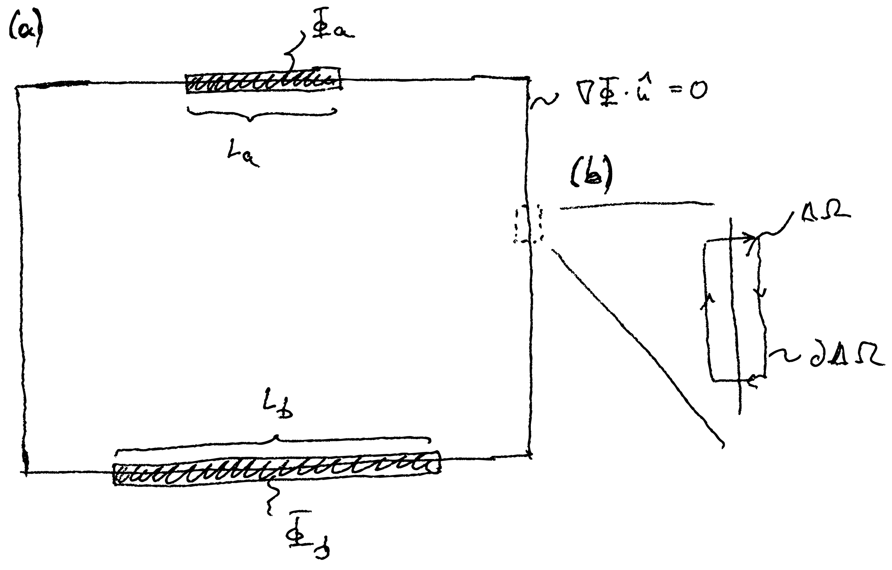

<h2 class='chapterHead'>Kapitel 11 Datenstrukturen &amp; Implementierung</h2>

<!-- l. 5 -->
Kontext: In diesem Kapitel wird Anhand unseres Beispiels, der Lösung der
Poisson-Gleichung, gezeigt, wie nun ein einfacher Finite-Elemente-Löser in der
Programmiersprache Python implementiert werden kann. Wir nehmen hier an, dass
die Ladungsdichte verschwindet. Wir berechnen also die räumliche Verteilung des
elektrostatischen Potentials unter entsprechenden Randbedingungen. Dies werden
wir nutzen, um die Kapazität eines Plattenkondensators auszurechnen. 

<h3 class='sectionHead'>11.1  Beispielproblem</h3>
<!-- l. 11 -->
Wir werden nun unser Beispielproblem aus den vorhergehenden Kapitel
weiterentwickeln und die Kapazität eines Plattenkondensators berechnen.
Hierfür nehmen wir eine verschwindende Ladungsdichte im Kondensator an, \(\rho =0\).
Die Poisson-Gleichung wird dann zur Laplace-Gleichung, \begin {equation} \nabla ^2 \Phi = 0. \end {equation}
Die Platten des Kondensators werden als metallisch angenommen, d.h. das
Potential auf den Kondensatorplatten ist konstant (siehe Abb. <a href='#x1-2001r1'>11.1<!-- tex4ht:ref: fig:plate-capacitor --></a>a). Dies wird
durch eine Dirichlet-Randbedingung abgebildet. Der Rest des Gebiets erhält
eine Neumann-Randbedingung, in der die Ableitung auf der Oberfläche
verschwindet.

<figure class='figure'>

<!-- l. 21 -->
  

<!-- l. 23 -->
figure(a) Geometrie des in diesem Kapitel betrachteten Plattenkondensators.
Auf den Elektroden ist das Potential \(\Phi \) konstant. (b) Ausschnitt aus dem
Randbereich mit Integrationsbereich für die Herleitung der Intepretation
der Richtungsableitung am Rand.

<figcaption class='caption'>Abbildung 11.1: (a) Geometrie des in diesem Kapitel betrachteten
Plattenkondensators. Auf den Elektroden ist das Potential \(\Phi \) konstant. (b)
Ausschnitt aus dem Randbereich mit Integrationsbereich für die Herleitung
der Intepretation der Richtungsableitung am Rand.
</figcaption><!-- tex4ht:label?: x1-2001r11.1 -->

</figure>
<!-- l. 27 -->
 Im Kontext der Poisson- bzw. Laplace-Gleichung haben Richtungsableitungen am
Rand eine einfache Interpretation. Wir schauen uns ein kleines Volumenelement \(\Delta \Omega \)
am Rand des Gebiets an (siehe Abb. <a href='#x1-2001r1'>11.1<!-- tex4ht:ref: fig:plate-capacitor --></a>b). Integration der Poisson-Gleichung
über dieses Gebiet ergibt, \begin {equation} \int _{\Delta \Omega }\dif ^3 r\, \nabla ^2 \Phi = \int _{\partial \Delta \Omega }\dif ^2 r\, \nabla \Phi \cdot \hat {n}(\v {r}) = \frac {1}{\varepsilon } \int _{\Delta \Omega }\dif ^3 r\, \rho (\v {r}), \end {equation}
wobei die Integration über \(\partial \Delta \Omega \) entlang des in Abb. <a href='#x1-2001r1'>11.1<!-- tex4ht:ref: fig:plate-capacitor --></a>b gezeigten Pfades erfolgt.
Nun nehmen wir an, dass die beiden Seiten des Pfades, die senkrecht auf den
Rand des Gebiets stehen, vernachlässigbar gegenüber den beiden anderen
Seiten sind. Weiterhin nehmen wir an, dass in dem Gebiet lediglich eine
Oberflächenladung \(\sigma (\v {r})\) lebt. Damit erhält man \begin {equation} \int _{\partial \Delta \Omega }\dif ^2 r\, \nabla \Phi \cdot \hat {n}(\v {r}) = \frac {1}{\varepsilon } \int _{\Delta A}\dif ^2 r\, \sigma (\v {r}), \end {equation}
wobei \(\Delta A\) die Fläche des Randes des Simulationsgebiets ist, welcher in \(\Delta \Omega \) liegt. Nimmt
man nun an, dass der Raum außerhalb des Simulationsgebietes feldfrei ist, also \(\nabla \Phi =0\),
dann erhält man \begin {equation} \nabla \Phi \cdot \hat {n}(\v {r}) = \frac {\sigma (\v {r})}{\varepsilon }, \label {eq:surfacecharge} \end {equation}
die Richtungsableitung ergibt also die Oberflächenladung am Rand.

<!-- l. 51 -->
 Die Feldfreiheit außerhalb unserer Simulationsdomäne ist exakt nur an
den Elektroden erfüllt. Diese sind metallisch und daher per Definition
feldfrei. (Ein Feld innerhalb eines idealen Metalls führt sofort zu einer
Umordnung von Ladungen, die dieses Feld dann kompensieren.) D.h.
wir können Gl. \eqref{eq:surfacecharge} nutzen, um die auf den
Kondensatorplatten induzierte Ladung zu berechnen. Zusammen mit
dem durch die Dirichlet-Randbedingungen vorgegebenen Potential, kann
dies zur Berechnung der Kapazität auf den Kondensatorplatten genutzt
werden.

<!-- l. 53 -->
 Auf der anderen Seite heißt die implizite Neumann-Randbedingung \(\nabla \Phi \cdot \hat {n}=0\), dass
unsere Simulation unter Bedingungen durchgeführt wird, in denen der Rand
ladungsfrei ist aber außerhalb der Simulationsdomäne das Feld verschwindet.
Dies ist eine künstliche Bedingung, die Fehler verursachen kann. Man muss
also sicherstellen, dass die Simulationsdomäne in Richtung parallel zu
den Kondensatorplatten groß genug ist, um die Streufelder am Rand den
Kondensators vernünftig zu erfassen.

<h3 class='sectionHead'>11.2  Datenstrukturen</h3>
<!-- l. 57 -->
Die zentrale Datenstruktur für numerische Anwendungen ist der multidimensionale
Array, numpy.ndarray, der <a href='https://numpy.org/'>numpy</a>-Bibliothek. Multidimensionale Arrays halten
Speicher für eine gewisse Menge an Einträgen vor. (Diese Einträge werden
auch Elemente genannt, aber um diese nicht mit den finite Elementen
durcheinander zu werden, werden sie in diesem Dokument durchgehend Einträge
genannt.) Ein mit Nullen gefülltes Array der Länge \(10\) (also \(10\) Einträge) erhält

man durch 
<!-- l. 58 -->

1import numpy as np  
2a = np.zeros(10)

<!-- l. 62 -->
 Diese Array hat die Dimension \(1\). Der mehrdimensionale Charakter der Arrays
äußert sich darin, dass die Arrays implizit eine Abbildung von mehreren
Koordinaten auf einen lineare Index, wie z.B. durch Gl. \eqref{eq:linindex} und
Gl. \eqref{eq:linindexel} gegeben, implementieren. Einen zweidimensionalen
Array bekommt man z.B. durch 
<!-- l. 63 -->

1b = np.zeros([2, 5])

<!-- l. 66 -->
 Man kann nun jeweils auf die Array-Einträge zugreifen, z.B. 
<!-- l. 67 -->

1a[6]  
2b[1, 1]

<!-- l. 71 -->
 Beide Befehle greifen auf Eintrag \(6\) des zu Grunde liegenden Speicherbereichs
zu. Ein natürlicher Einsatz der multidimensionalen Arrays ist die
Repräsentation von Vektoren (\(1\)-dimensionale Arrays) oder Martrizen
(\(2\)-dimensionale Arrays).

<!-- l. 75 -->
Anmerkung: Die Aussage, dass 
<!-- l. 77 -->

1a[6]  
2b[1, 1]

<!-- l. 81 -->
 in dem o.g. Beispiel auf den gleichen Eintrag des zu Grunde liegenden
Speicherbereichs zugreift, hängt von der Speicherreihenfolge (engl. “storage
order”) ab. Sie gilt nur dann, wenn der letzte Index kompakt im Speicher
steht. Diese Speicherreihenfolge nennt sich “row major”, weil in einem
zweidimensionalen Array, also einer Matrix, die Zeilen (engl. “row”) kompakt im
Speicher stehen. Ist der erste Index der kompakte spricht man von “column
major”. In numpy heißt “row major” auch “C-continguous” und “column major”
heißt “F-contiguous”. Dies kommt daher, dass in der Programmiersprache C die
Speicherreihenfolge “row major” und in der Programmiersprache Fortran die
Speicherreihenfolge “column major” ist. Arrays in numpy sind standardmäßig
“column major”, andere Speicherreihenfolgen werden aber unterstützt und
kommen auch vor. 

<!-- l. 84 -->

<h3 class='sectionHead'>11.3  Initialisierung</h3>
<!-- l. 86 -->
Die Beispielimplementierungen folgen einfache Regeln für lesbaren Computercode.
Dieser sollte immer so geschrieben sein, dass eine dritte Person diesen lesen und
wiederverwenden kann. Wir werden daher...

<ol class='enumerate1'>
<li class='enumerate' id='x1-4002x1'>...ausschließlich englische Sprache verwenden.
</li>
<li class='enumerate' id='x1-4004x2'>...Variablennamen ausschreiben und keine Symbole als Variablennamen
verwenden (also z.B. potential und nicht das ausgeschriebene Symbol
phi als Name).
</li>
<li class='enumerate' id='x1-4006x3'>...Array-Variablen mit einem Suffix versehen, der den Typ der Indices
anzeigt (z.B. potential_xy um anzuzeigen, dass es zwei Indices gibt
die den Positionen \(x\) und \(y\) entsprechen).
</li>
<li class='enumerate' id='x1-4008x4'>...den Code
mit Kommentarblöcken und Python <a href='https://www.python.org/dev/peps/pep-0257/'>Docstrings</a> dokumentieren. Wir
empfehlen den <a href='https://numpydoc.readthedocs.io/en/latest/format.html'>numpydoc</a>-Standard für Docstrings.</li></ol>
<!-- l. 93 -->
In dieser Implementierung verwenden wir explizite Schleifen, um die Lesbarkeit des
Codes zu verbessern. Der Code kann durch Verwenden von numpy-Operationen
noch vektorisiert werden.

<!-- l. 97 -->
 Zunächst müssen wir den Code initialisieren und festlegen, wieviele
Gitterpunkte wir verwenden wollen. Wir definieren die Variablen 
<!-- l. 98 -->

1# Grid size, number of nodes  
2nb_nodes = 32, 32  
3Nx, Ny = nb_nodes

<!-- l. 103 -->
 Wir legen nun auch noch fest, über welchen Bereich sich die beiden
Elektroden des Kondensators erstrecken sollen: 
<!-- l. 104 -->

1# Top capacitor plate  
2top_left = Nx//4  
3top_right = 3*Nx//4-1  
4top_potential = 1  
5  
6# Bottom capacitor plate  
7bottom_left = Nx//4  
8bottom_right = 3*Nx//4-1  
9bottom_potential = -1

<!-- l. 115 -->
 Der Bereich wird hier mit Knotenindices angegeben. Weiterhin benötigen
wir noch die Elementmatrix, Gl. \eqref{eq:elmat2d}, die wir in einem
numpy.ndarray speichern: 
<!-- l. 116 -->

1# Element matrix, index l indicates element-local node  
2element_matrix_ll = np.array([[1, -1/2, -1/2],  
3                              [-1/2, 1/2, 0],  
4                              [-1/2, 0, 1/2]])

<!-- l. 122 -->
 Der Suffix _ll bezeichnet hier, dass es zwei Indices gibt (der Array ist
zweidimensional), die beide einen lokalen Elementknoten bezeichnen. Wir
initialisieren weiterhin die Systemmatrix und die rechte Seite, zunächst mit
Nullen: 
<!-- l. 123 -->

1# System matrix, index g indicates global node  
2system_matrix_gg = np.zeros([Nx*Ny, Nx*Ny])  
3  
4# Right hand side  
5rhs_g = np.zeros(Nx*Ny)

<!-- l. 130 -->
 Der Suffix _g bezeichnet hier den Index des globalen Knoten. Die Variable
rhs_g enthält den Vektor \(\v {f}\) und benötigt daher nur einen Index. Die Variable
system_matrix_gg beinhaltet die Systemmatrix \(\t {K}\) und braucht daher zwei globale
Knotenindices.

<!-- l. 132 -->

<h3 class='sectionHead'>11.4  Systemmatrix</h3>
<!-- l. 134 -->
<a href='https://uni-freiburg.cloud.panopto.eu/Panopto/Pages/Embed.aspx?id=a6057226-fa98-45ed-a69f-acc000e9f3e7' class='url'>https://uni-freiburg.cloud.panopto.eu/Panopto/Pages/Embed.aspx?id=a6057226-fa98-45ed-a69f-acc000e9f3e7</a>

<!-- l. 136 -->
 Kern des Simulationsprogramms ist der Aufbau der Systemmatrix. In diesem
Abschnitt wird dies durch explizite Schleifen realisiert. Im nächsten Abschnitt
wird gezeigt, wie dies mit speziellen numpy-Befehlen kompakter (und effizienter),
aber weniger transparent gestaltet werden kann.

<!-- l. 138 -->
 Zunächst definieren wir eine Funktion, die aus Knotenkoordinaten den
globalen Knotenindex macht: 
<!-- l. 139 -->

1def node_index(i, j, nb_nodes):  
2    """  
3    Turn node coordinates (i, j) into their global node index.  
4  
5    Parameters  
6    ----------  
7    i : int  
8        x-coordinate (integer) of the node  
9    j : int  
10        y-coordinate (integer) of the node  
11    nb_nodes : tuple of ints  
12        Number of nodes in the Cartesian directions  
13  
14    Returns  
15    -------  
16    g : int  
17        Global node index  
18    """  
19    Nx, Ny = nb_nodes  
20    return i + Nx*j

<!-- l. 161 -->
 Dies nutzen wir in einer weiteren Hilfsfunktion, die die Elementmatrix zu der
Systemmatrix addiert. Hierzu muss zunächst die Elementmatrix auf die
Systemmatrix aufgespannt werden. Die Funktion sieht folgendermaßen aus:

<!-- l. 162 -->

1def add_element_matrix(system_matrix_gg, element_matrix_ll,  
2                       global_node_indices):  
3    """  
4    Add element matrix to global system matrix.  
5  
6    Parameters  
7    ----------  
8    system_matrix_gg : array_like  
9        N x N system matrix where N is the number of global  
10        nodes. This matrix will be modified by this function.  
11    element_matrix_ll : array_like  
12        n x n element matrix where n is the number of local  
13        nodes  
14    global_node_indices : list of int  
15        List of length n that contains the global node  
16        indices for the local node index that corresponds to  
17        the list position.  
18    """  
19    assert element_matrix_ll.shape == \  
20        (len(global_node_indices), len(global_node_indices))  
21    for i in range(len(global_node_indices)):  
22        for j in range(len(global_node_indices)):  
23            system_matrix_gg[global_node_indices[i],  
24                             global_node_indices[j]] += \  
25                element_matrix_ll[i, j]

<!-- l. 189 -->
 Die assert-Anweisung ist hier ein Wächter, der darauf achtet, dass die lokale
Elementmatrix und der Array global_node_indices die gleiche Länge haben.
Die beiden for-Schleifen laufen dann über alle Einträge der Elementmatrix.
Der Ausdruck global_node_indices[i] liefert dann den globalen Knotenindex,
der zu dem lokalen Knotenindex der Elementmatrix gehört. Der Zusammenbau
der Systemmatrix erfolgt dann über einen Aufruf dieser Hilfsmethode pro
Element: 
<!-- l. 190 -->

1def assemble_system_matrix(element_matrix_ll, nb_nodes):  
2    """  
3    Assemble system matrix from the element matrix  
4  
5    Parameters  
6    ----------  
7    element_matrix_ll : array_like  
8        3 x 3 element matrix  
9    nb_nodes : tuple of ints  
10        Number of nodes in the Cartesian directions  
11  
12    Returns  
13    -------  
14    system_matrix_gg : numpy.ndarray  
15        System matrix  
16    """  
17  
18    Nx, Ny = nb_nodes  
19    Mx, My = Nx-1, Ny-1 # number of boxes  
20  
21    # System matrix  
22    system_matrix_gg = np.zeros([Nx*Ny, Nx*Ny])  
23  
24    # Construct system matrix  
25    for l in range(Mx):  
26        for m in range(My):  
27            # Element (0)  
28            n0 = node_index(l, m, nb_nodes)  
29            n1 = node_index(l+1, m, nb_nodes)  
30            n2 = node_index(l, m+1, nb_nodes)  
31            add_element_matrix(system_matrix_gg,  
32                               element_matrix_ll,  
33                               [n0, n1, n2])  
34  
35            # Element (1)  
36            n0 = node_index(l+1, m+1, nb_nodes)  
37            n1 = node_index(l, m+1, nb_nodes)  
38            n2 = node_index(l+1, m, nb_nodes)  
39            add_element_matrix(system_matrix_gg,  
40                               element_matrix_ll,  
41                               [n0, n1, n2])  
42  
43    return system_matrix_gg

<!-- l. 235 -->
 Hier laufen die beiden for-Schleifen über die einzelnen Kästen.
Die Schleife über die beiden Elemente pro Kasten ist explizit als zwei
Aufrufe zu add_element_matrix geschrieben. Die Variablen n0, n1 und n2
enthalten die globalen Knotenindices, die die Ecken des jeweiligen Elements
beschreiben.

<!-- l. 237 -->
 <a href='https://uni-freiburg.cloud.panopto.eu/Panopto/Pages/Embed.aspx?id=de8eb963-78bb-4fd1-8387-acc000eee353' class='url'>https://uni-freiburg.cloud.panopto.eu/Panopto/Pages/Embed.aspx?id=de8eb963-78bb-4fd1-8387-acc000eee353</a>

<!-- l. 239 -->
 Die nun aufgebaute Systemmatrix hat (implizit) Neumann-Randbedingungen
mit \(\nabla \Phi \cdot \hat {n}(\v {r})=0\) auf dem Rand. Wir müssen nun noch die Dirichlet-Bedingungen für die
Elektroden hinzufügen. Hierzu ersetzen wir Zeilen der Systemmatrix und die
entsprechenden Einträge des Lastvektors: 
<!-- l. 240 -->

1def capacitor_bc(system_matrix_gg, rhs_g,  
2                 top_left, top_right, top_potential,  
3                 bottom_left, bottom_right, bottom_potential,  
4                 nb_nodes):  
5    """  
6    Set boundary conditions for the parallel plate capacitor.  
7  
8    Parameters  
9    ----------  
10    system_matrix_gg : numpy.ndarray  
11        System matrix. The system matrix is modified by a call  
12        to this function  
13    rhs_g : numpy.ndarray  
14        Right-hand side vector. The right-hand side vector is  
15        modified by a call to this function.  
16    top_left : int  
17        Leftmost node of the top electrode  
18    top_right : int  
19        Rightmost node of the top electrode  
20    top_potential : float  
21        Electrostatic potential of the top electrode  
22    bottom_left : int  
23        Leftmost node of the bottom electrode  
24    bottom_right : int  
25        Rightmost node of the bottom electrode  
26    bottom_potential : float  
27        Electrostatic potential of the bottom electrode  
28    nb_nodes : tuple of ints  
29        Number of nodes in the Cartesian directions  
30    """  
31    Nx, Ny = nb_nodes  
32    # Dirichlet boundary conditions for top plate  
33    for i in range(top_left, top_right+1):  
34        n = node_index(i, Ny-1, nb_nodes)  
35        mat_g = np.zeros(Nx*Ny)  
36        mat_g[n] = 1  
37        system_matrix_gg[n] = mat_g  
38        rhs_g[n] = top_potential  
39  
40    # Dirichlet boundary conditions for bottom plate  
41    for i in range(bottom_left, bottom_right+1):  
42        n = node_index(i, 0, nb_nodes)  
43        mat_g = np.zeros(Nx*Ny)  
44        mat_g[n] = 1  
45        system_matrix_gg[n] = mat_g  
46        rhs_g[n] = bottom_potential

<!-- l. 289 -->
 <a href='https://uni-freiburg.cloud.panopto.eu/Panopto/Pages/Embed.aspx?id=cac3d182-6a34-4c9c-9b6c-acc000f19238' class='url'>https://uni-freiburg.cloud.panopto.eu/Panopto/Pages/Embed.aspx?id=cac3d182-6a34-4c9c-9b6c-acc000f19238</a>

<!-- l. 291 -->
 Der gesamte Simulationscode enthält nun Aufrufe dieser Funktionen,
gefolgt von der numerischen Lösung des linearen Gleichungssystems:

<!-- l. 292 -->

1# Construct system matrix  
2system_matrix_gg = assemble_system_matrix(element_matrix_ll,  
3                                          nb_nodes)  
4  
5# Boundary conditions  
6capacitor_bc(system_matrix_gg, rhs_g,  
7             top_left, top_right, top_potential,  
8             bottom_left, bottom_right, bottom_potential,  
9             nb_nodes)  
10  
11# Solve system of linear equations  
12potential_g = np.linalg.solve(system_matrix_gg, rhs_g)

<!-- l. 306 -->
 Die Variable potential_g enthält nun die Werte des elektrostatischen
Potentials auf den Knoten.

<!-- l. 308 -->

<h3 class='sectionHead'>11.5  Visualisierung</h3>
<!-- l. 310 -->
<a href='https://uni-freiburg.cloud.panopto.eu/Panopto/Pages/Embed.aspx?id=61f0f7d8-e311-4dcf-9f01-acc000f4b8d4' class='url'>https://uni-freiburg.cloud.panopto.eu/Panopto/Pages/Embed.aspx?id=61f0f7d8-e311-4dcf-9f01-acc000f4b8d4</a>

<!-- l. 312 -->
 Das Ergebnis der Rechnung kann mit Hilfe der <a href='https://matplotlib.org/'>matplotlib</a>-Bibliothek
visualisiert werden. Die Funktion matplotlib.pyplot.tripcolor kann Daten auf
einem triangulierten 2D-Gitter darstellen. Der folgende Codeblock visualisiert das
Ergebnis der Simulation mit Hilfe dieser Funktion. 
<!-- l. 313 -->

1import matplotlib.pyplot as plt  
2import matplotlib.tri  
3  
4def make_grid(nb_nodes):  
5    """  
6    Make an array that contains all elements of the grid. The  
7    elements are described by the global node indices of  
8    their corners. The order of the corners is in order of  
9    the local node index.  
10  
11    They are sorted in geometric positive order and the first  
12    is the node with the right angle corner at the bottom  
13    left. Elements within the same box are consecutive.  
14  
15    This is the first element per box:  
16  
17        2  
18        | \  
19        |  \  
20    dy  |   \  
21        |    \  
22        0 --- 1  
23  
24          dx  
25  
26    This is the second element per box:  
27  
28           dx  
29         1 ---0  
30          \   |  
31           \  |  dy  
32            \ |  
33             \|  
34              2  
35  
36    Parameters  
37    ----------  
38    nb_nodes : tuple of ints  
39        Number of nodes in the Cartesian directions  
40  
41    Returns  
42    -------  
43    triangles_el : numpy.ndarray  
44        Array containing the global node indices of the  
45        element corners. The first index (suffix _e)  
46        identifies the element number and the second index  
47        (suffix _l) the local node index of that element.  
48    """  
49    Nx, Ny = nb_nodes  
50    # These are the node position on a subsection of the grid  
51    # that excludes the rightmost and topmost nodes. The  
52    # suffix _G indicates this subgrid.  
53    y_G, x_G = np.mgrid[:Ny-1, :Nx-1]  
54    x_G.shape = (-1,)  
55    y_G.shape = (-1,)  
56  
57    # List of triangles  
58    lower_triangles = np.vstack(  
59        (node_index(x_G, y_G, nb_nodes),  
60         node_index(x_G+1, y_G, nb_nodes),  
61         node_index(x_G, y_G+1, nb_nodes)))  
62    upper_triangles = np.vstack(  
63        (node_index(x_G+1, y_G+1, nb_nodes),  
64         node_index(x_G, y_G+1, nb_nodes),  
65         node_index(x_G+1, y_G, nb_nodes)))  
66    # Suffix _e indicates global element index  
67    return np.vstack(  
68        (lower_triangles, upper_triangles)).T.reshape(-1, 3)  
69  
70def plot_results(values_g, nb_nodes, mesh_style=None,  
71                 ax=None):  
72    """  
73    Plot results of a finite-element calculation on a  
74    two-dimensional structured grid using matplotlib.  
75  
76    Parameters  
77    ----------  
78    nb_nodes : tuple of ints  
79        Number of nodes in the Cartesian directions  
80    values_g : array_like  
81        Expansion coefficients (values of the field) on the  
82        global nodes  
83    mesh_style : str, optional  
84        Will show the underlying finite-element mesh with  
85        the given style if set, e.g. ’ko-’ to see edges  
86        and mark nodes by points  
87        (Default: None)  
88    ax : matplotlib.Axes, optional  
89        Axes object for plotting  
90        (Default: None)  
91  
92    Returns  
93    -------  
94    trim : matplotlib.collections.Trimesh  
95        Result of tripcolor  
96    """  
97    Nx, Ny = nb_nodes  
98  
99    # These are the node positions on the full global grid.  
100    y_g, x_g = np.mgrid[:Ny, :Nx]  
101    x_g.shape = (-1,)  
102    y_g.shape = (-1,)  
103  
104    # Gouraud shading linearly interpolates the color between  
105    # the nodes  
106    if ax is None:  
107        ax = plt  
108    triangulation = matplotlib.tri.Triangulation(  
109        x_g, y_g, make_grid(nb_nodes))  
110    c = ax.tripcolor(triangulation, values_g,  
111                     shading=’gouraud’)  
112    if mesh_style is not None:  
113        ax.triplot(triangulation, mesh_style)  
114    return c  
115  
116plt.subplot(111, aspect=1)  
117plot_results(potential_g, nb_nodes, show_mesh=True)  
118plt.xlabel(r’$x$-position ($\Delta x$)’)  
119plt.ylabel(r’$y$-position ($\Delta y$)’)  
120plt.colorbar().set_label(r’Potential $\Phi$ (V)’)  
121plt.tight_layout()  
122plt.show()

<!-- l. 437 -->
 Die Funktion make_grid erzeugt hier eine Liste der globalen Knotenindices
pro Element. Der erste Index ist der Index des Elements (Suffix e), der zweite
Index ist der lokale Knotenindex innerhalb des Elements (Suffix l). Die
Reihenfolge der Dreiecke entspricht Abb. ??a. Die Knoten des jeweiligen
Elements sind gegen den Uhrzeigersinn nummeriert. Für die Visualisierung wird
“Gouraud”-Schattierung genutzt. Diese Art der Färbung interpoliert
den Wert der Knoten linear auf den Dreiecken und entspricht exakt der
Interpolationsvorschrift unserer Formfunktionen. Wir können damit die volle
interpolierte Funktion \(\Phi _N(\v {r})\) darstellen.

<!-- l. 439 -->

<h3 class='sectionHead'>11.6  Kapazität eines Plattenkondensators</h3>
<!-- l. 441 -->
Mit Hilfe des hier entwickelten Codes kann nun das elektrostatische Potential
innerhalb eines Plattenkondensators berechnet werden. Abbildung <a href='#x1-7001r2'>11.2<!-- tex4ht:ref: fig:plate-capacitor-potential --></a> zeigt das
Ergebnis dieser Rechnung für unterschiedliche Auflösung der Simulation, also
unterschiedliche Anzahl an Elementen. Durch Erhöhung der Auflösung kann die
Simulation systematisch verbessert werden.

<figure class='figure'>

<!-- l. 447 -->
 

<!-- l. 449 -->
figureElektrostatisches Potential
innerhalb des Plattenkondensators, gerechnet mit (a) \(4\times 4\) Knoten (\(18\) Elemente)
und (b) \(32\times 32\) Knoten (\(1922\) Elemente). In (a) sieht man in der farblichen Codierung
den linearen Funktionsverlauf innerhalb der Elemente.

<figcaption class='caption'>Abbildung 11.2: Elektrostatisches Potential
innerhalb des Plattenkondensators, gerechnet mit (a) \(4\times 4\) Knoten (\(18\) Elemente)
und (b) \(32\times 32\) Knoten (\(1922\) Elemente). In (a) sieht man in der farblichen Codierung
den linearen Funktionsverlauf innerhalb der Elemente.
</figcaption><!-- tex4ht:label?: x1-7001r11.6 -->

</figure>
<!-- l. 453 -->
 Für die Berechnung der Kapazität müssen wir nun noch die Ladung auf
den Kondensatorplatten ermitteln. Die Gesamtladung \(Q_\alpha \) auf der Elektrode \(\alpha \) erhält
man aus der Oberflächenladung, die durch Gl. \eqref{eq:surfacecharge} gegeben
ist. Durch Integration über die Fläche der Kondensatorplatten \(A_\alpha \) erhält man
\begin {equation} Q_\alpha = \int _{A_\alpha } \dif ^2 r\, \sigma (\v {r}) = \varepsilon \int _{A_\alpha } \dif ^2 r\, \nabla \Phi _N\cdot \hat {n}(\v {r}). \end {equation}
Hier spielt nun die Permittivität \(\varepsilon \) eine wichtige Rolle für die Einheit der
Ladung. Wir können nun wieder die Reihenentwicklung einsetzen. Zum Integral
trägt nur Elementtyp \((1)\) bei, und hier nur die Formfunktionen, bei denen die
Ableitung in \(y\)-Richtung nicht verschwindet, da \(\nabla \Phi _N\cdot \hat {n}(\v {r})=\pm \partial \Phi _N/\partial y\). Das Vorzeichnen ist bei oberer
und unterer Kondensatorplatte umgedreht. Nicht-verschwindende Beiträge
kommen von den Formfunktionen \(N_0^{(1)}\) und \(N_2^{(1)}\) (siehe Gl. \eqref{eq:N10der} und
\eqref{eq:N12der}). Man erhält \begin {align} \int _0^{\Delta x} \dif x \frac {\partial N_0^{(1)}}{\partial y} &amp;= \int _0^{\Delta x} \dif x \frac {1}{\Delta y} = \frac {\Delta x}{\Delta y} \\ \int _0^{\Delta x} \dif x \frac {\partial N_2^{(1)}}{\partial y} &amp;= \int _0^{\Delta x} \dif x \left (-\frac {1}{\Delta y}\right ) = -\frac {\Delta x}{\Delta y} \end {align}

<!-- l. 466 -->
 und damit für \(\Delta x=\Delta y\) \begin {equation} Q^{(n)} = \varepsilon t(a_0 - a_2) \end {equation}
als Beitrag des Elements \((n)\) zur Ladung auf der Elektrode. Hierbei bezeichnen die
Indices der Koeffizienten \(a_0\) und \(a_2\) die jeweiligen lokalen Knotenindices. Die Größe \(t\)
ist die Tiefe der Simulationsdomäne. Da wir das Problem hier in zwei
Dimensionen betrachten sind alle Ladungen effektiv Linienladungen (pro Tiefe)
und der Faktor \(t\) wird benötigt, um auf eine absolute Ladung zu kommen. Unser
Plattenkondensator ist in die dritte Dimension unendlich lang. Der Faktor \(\varepsilon t\) hat die
Einheit Farad und ist damit eine Kapazität.

<!-- l. 472 -->
 Die Kapazität des Kondensators ist nun gegeben als \(C=Q_0/\Delta \Phi \), wobei \(Q_0\) nun die Ladung
auf einer Kondensatorplatte ist und \(\Delta \Phi \) der (vorgegebene) Potentialunterschied. Die
zweite Kondensatorplatte muss die Ladung \(Q_1=-Q_0\) tragen. Der Code für die Berechnung
der Ladung auf den Kondensatorplatten sieht daher folgendermaßen aus:

<!-- l. 473 -->

1def get_charge(potential_g, nb_nodes,  
2               top_left, top_right,  
3               bottom_left, bottom_right):  
4    """  
5    Compute charge on both capacitor plates.  
6  
7    Parameters  
8    ----------  
9    potential_g : array_like  
10        Electrostatic potential  
11    nb_nodes : tuple of ints  
12        Number of nodes in the Cartesian directions  
13    top_left : int  
14        Leftmost node of the top electrode  
15    top_right : int  
16        Rightmost node of the top electrode  
17    bottom_left : int  
18        Leftmost node of the bottom electrode  
19    bottom_right : int  
20        Rightmost node of the bottom electrode  
21  
22    Returns  
23    -------  
24    charge_top : float  
25        Charge (divided by permittivity and thickness) on top  
26        plate  
27    charge_bottom : float  
28        Charge (divided by permittivity and thickness) on  
29        bottom plate  
30    """  
31    Nx, Ny = nb_nodes  
32    charge_top = 0.0  
33    for i in range(top_left+1, top_right+1):  
34        charge_top += \  
35            potential_g[node_index(i, Ny-1, nb_nodes)] - \  
36            potential_g[node_index(i, Ny-2, nb_nodes)]  
37  
38    charge_bottom = 0.0  
39    for i in range(bottom_left+1, bottom_right+1):  
40        charge_bottom += \  
41            potential_g[node_index(i, 0, nb_nodes)] - \  
42            potential_g[node_index(i, 1, nb_nodes)]  
43  
44    return charge_top, charge_bottom

<!-- l. 520 -->
 Natürlich wissen wir, wie die Kapazität eines Plattenkondensators aussieht.
Sie ist gegeben durch \begin {equation} C = \varepsilon \frac {A}{d}, \label {eq:anacapacity} \end {equation}
wobei \(A=tL\) die Fläche der Kondensatorplatte ist und \(d\) der Abstand der Platten. (\(L\) ist
die Länge der Platten, siehe Abb. <a href='#x1-2001r1'>11.1<!-- tex4ht:ref: fig:plate-capacitor --></a>a.) Dies können wir entdimensionalisiert
als \begin {equation} \frac {C}{\varepsilon t} = \frac {L}{d} \end {equation}
schreiben. Die linke Seite erhalten wir direkt aus unserer Simulation. Das Ergebnis
der Rechnung mit finiten Elementen ist in Abb. <a href='#x1-7047r3'>11.3<!-- tex4ht:ref: fig:plate-capacitor-capacity --></a> im Vergleich mit diesem
analytischen Ausdruck gezeigt. Man sieht, dass der analytische Ausdruck nur bei
kleinen Aspektverhältnissen \(d/L&lt;1\) gilt. Die Herleitung dieses Ausdrucks nimmt an,
dass die Feldlinien überall parallel und senkrecht zu den Kondensatorplatten

verlaufen. Für große Abstände der Kondensatorplatten ist dies nicht mehr der
Fall und Streufelder am Rand der Platten fangen an, eine Rolle für die
Kapazität zu spielen. Diese sind nicht von Gl. \eqref{eq:anacapacity} erfasst,
werden aber in der Simulation abgebildet.

<figure class='figure'>

<!-- l. 536 -->
 

<!-- l. 538 -->
figureKapazität \(C\) eines Plattenkondensators gegen den Abstand der Platten
\(d\). Beide Achsen sind entdimensionalisiert und zeigen Größen ohne Einheit.
Die gestrichelte Linie ist die klassische Vorhersage für die Kapazität, die
blaue Linie zeigt die Simulation. Hierbei wurde die Simulationsbox immer
mindestens so Breit wie das dreifache der Plattenlänge \(L\) oder dem Abstand
der Platten \(d\) gewählt. Die Plattenlänge \(L\) wurde mit \(8\) Elementen diskretisiert.

<figcaption class='caption'>Abbildung 11.3: Kapazität \(C\) eines Plattenkondensators gegen den Abstand
der Platten \(d\). Beide Achsen sind entdimensionalisiert und zeigen Größen
ohne Einheit. Die gestrichelte Linie ist die klassische Vorhersage für
die Kapazität, die blaue Linie zeigt die Simulation. Hierbei wurde
die Simulationsbox immer mindestens so Breit wie das dreifache der
Plattenlänge \(L\) oder dem Abstand der Platten \(d\) gewählt. Die Plattenlänge
\(L\) wurde mit \(8\) Elementen diskretisiert.
</figcaption><!-- tex4ht:label?: x1-7047r11.6 -->

</figure>

<!-- l. 542 -->
Anmerkung: Die Systemmatrix der finite-Elemente Methode ist dünnbesetzt
(engl. “sparse”). Für dünnbesetzte Matrizen gibt es spezielle Datenstrukturen,
die den Umgang mit diesen Matrizen vereinfachen. Diese sind in dem Paket
<a href='https://docs.scipy.org/doc/scipy/reference/sparse.html'>scipy.sparse</a> implementiert. Wir können diese Routinen nutzen, um eine
dünnbesetzte Systemmatrix zu konstruieren: 
<!-- l. 544 -->

1from scipy.sparse import coo_matrix  
2  
3def assemble_system_matrix(element_matrix_ll, nb_nodes):  
4    """  
5    Assemble system matrix from the element matrix  
6  
7    Parameters  
8    ----------  
9    element_matrix_ll : array_like  
10        3 x 3 element matrix  
11    nb_nodes : tuple of ints  
12        Number of nodes in the Cartesian directions  
13  
14    Returns  
15    -------  
16    system_matrix_gg : numpy.ndarray  
17        System matrix  
18    """  
19    Nx, Ny = nb_nodes  
20  
21    # Compute grid  
22    grid_el = make_grid(nb_nodes)  
23  
24    # Get number of elements  
25    nb_elements, nb_corners = grid_el.shape  
26  
27    # Spread out grid and element matrix such that they can  
28    # be used as global node coordinates for the sparse  
29    # matrix  
30    grid1_ell = np.stack(  
31        [grid_el, grid_el, grid_el], axis=1)  
32    grid2_ell = np.stack(  
33        [grid_el, grid_el, grid_el], axis=2)  
34    element_matrix_ell = np.stack(  
35        [element_matrix_ll]*nb_elements, axis=0)  
36  
37    # Construct sparse system matrix  
38    # ‘coo_matrix‘ will automatically sum duplicate entries  
39    system_matrix_gg = coo_matrix(  
40        (element_matrix_ell.reshape(-1),  
41         (grid1_ell.reshape(-1), grid2_ell.reshape(-1))),  
42        shape=(Nx*Ny, Nx*Ny))  
43  
44    return system_matrix_gg.todense()

<!-- l. 590 -->
 Diese Methode ersetzt die obige Implementation von assemble_system_matrix.
Sie liefert (aus Gründen der Kompatibiltät zum Rest der hier gezeigten
Implementierung) zum Schluss wieder eine dichtbesetzte (engl. “dense”) Matrix,
man kann aber durchaus mit der dünnbesetzten Matrix weiterrechnen. Im
Rahmen der Anwendung von <a href='https://docs.scipy.org/doc/scipy/reference/generated/scipy.sparse.coo_matrix.html'>coo_matrix</a> werden hier die globalen Knotenindizes
als “Koordinaten” der Matrixeinträge eingesetzt. Hierzu müssen sowohl die
Knotenindizes als auch die Einträge der Elementmatrix auf die Größe der
Systemmatrix vervielfältigt werden. Dies geschieht durch die <a href='https://numpy.org/doc/stable/reference/generated/numpy.stack.html'>numpy.stack</a>
Befehle in diesen Codefragment. 

<h2 class='likechapterHead'>Literaturverzeichnis</h2>

