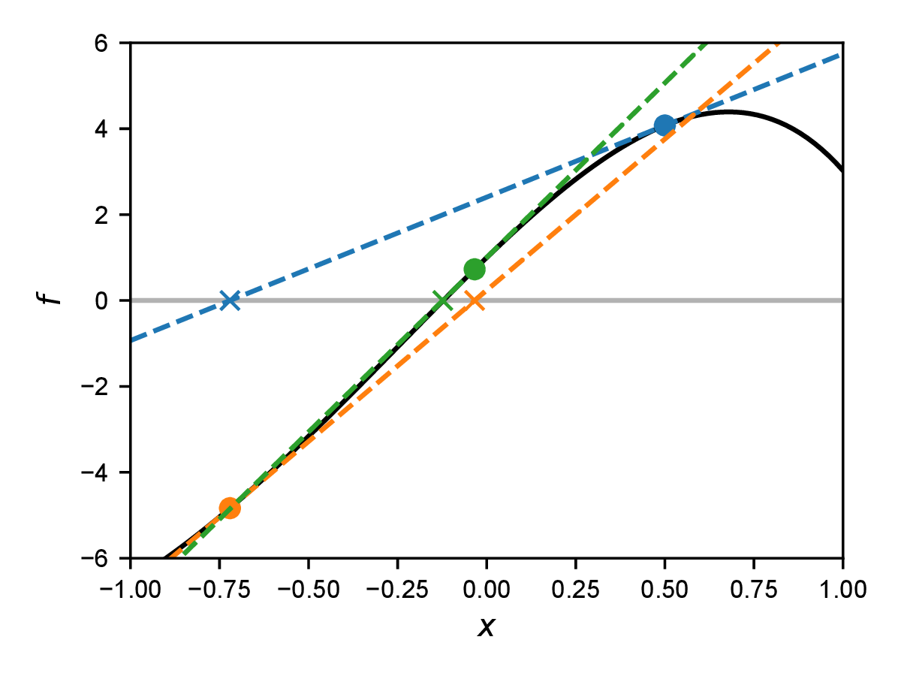

<h2 class='chapterHead'>Kapitel 12 Nichtlineare Probleme</h2>

<!-- l. 3 -->
Kontext: Bislang haben wir nur lineare Probleme betrachtet. Als Beispiel für
eine nichtlineare partielle Differentialgleichung ist uns allerdings bereits die
Poisson-Boltzmann-Gleichung begegnet. Die Lösung nichtlinearer partieller
Differentialgleichungen führt zu zwei zusätzlichen Schwierigkeitsgraden: Zum
einen müssen wir nichtlineare Gleichungssysteme lösen können, zum
anderen müssen wir Integrale über Funktionen mit Polynomordnung
höher als Zwei in den Basisfunktion ausrechnen. Hierzu werden in diesem
Kapitel das Newton-Raphson-Verfahren und Quadraturregeln eingeführt. 

<h3 class='sectionHead'>12.1  Newton-Raphson-Verfahren</h3>
<!-- l. 9 -->
Das Newton-Raphson-Verfahren, oder auch kurz nur Newton-Verfahren, ist
ein Verfahren für die iterative Lösung einer nichtlinearen Gleichung.
Zur Illustration beschreiben wir dieses hier zunächst für skalarwertige
Funktionen und werden dann das Verfahren für vektorwertige Funktionen
verallgemeinern.

<!-- l. 11 -->
 Wir suchen die allgemeine Lösung für die Gleichung \(f(x)=0\) mit beliebiger
Funktion \(f(x)\). Die Idee des Newton-Verfahrens ist es nun, die Gleichung an einem
Punkt zu linearisieren, also eine Taylorentwicklung bis zur ersten Ordnung
hinzuschreiben, und dann dieses linearisierte System zu Lösen. Die um den
Punkt \(x_i\) taylorentwickelte Gleichung \begin {equation} f(x) \approx f(x_i) + (x - x_i) f'(x_i) = 0 \label {eq:newtonapprox} \end {equation}
hat die Lösung \begin {equation} x_{i+1} = x_i - f(x_i) / f'(x_i), \end {equation}
wobei \(f'(x)=\dif f/\dif x\) die erste Ableitung der Funktion \(f\) ist. Der Wert \(x_{i+1}\) ist nun (unter gewissen
Bedingungen) näher an der Nullstelle \(x_0\) (mit \(f(x_0)=0\)) als der Wert \(x_i\). Die Idee des
Newton-Verfahrens ist es nun, eine Folge \(x_i\) von linearen Approximationen der
Funktion \(f\) zu konstruieren, die auf die Nullstelle konvergiert. Wir nutzen also die
Nullstelle der linearisierten Form der Gleichung als Startpunkt für die
nächste Iteration. Ein Beispiel einer solchen Iteration ist in Abb. <a href='#x1-2001r1'>12.1<!-- tex4ht:ref: fig:newton --></a>
gezeigt.

<figure class='figure'>

<!-- l. 26 -->
  

<!-- l. 28 -->
figureIllustration des Newton-Verfahrens zur Lösung der Gleichung \(f(x)=0\), hier
für die Funktion \(f(x)=10 \sin (x) - \exp 2x + 2\). Die gestrichelten Linien sind jeweils die linearisierte Form,
Gl. \eqref{eq:newtonapprox}. Das Verfahren started bei \(x=0.5\) (blauer Punkt) und
liefert die Nullstelle der um diesen Punkt linearisierten Form (blaues Kreuz).
Die zweite Iteration ist die orangene Linie, die dritte die grüne Linie. Hier
sind nur die ersten drei Schritte dieser Newton-Iteration gezeigt, nach denen
bereits eine gute Lösung der Nullstelle gefunden wurde.

<figcaption class='caption'>Abbildung 12.1: Illustration des Newton-Verfahrens zur Lösung der
Gleichung \(f(x)=0\), hier für die Funktion \(f(x)=10 \sin (x) - \exp 2x + 2\). Die gestrichelten Linien sind jeweils die
linearisierte Form, Gl. \eqref{eq:newtonapprox}. Das Verfahren started bei
\(x=0.5\) (blauer Punkt) und liefert die Nullstelle der um diesen Punkt linearisierten
Form (blaues Kreuz). Die zweite Iteration ist die orangene Linie, die dritte die
grüne Linie. Hier sind nur die ersten drei Schritte dieser Newton-Iteration
gezeigt, nach denen bereits eine gute Lösung der Nullstelle gefunden wurde.
</figcaption><!-- tex4ht:label?: x1-2001r12.1 -->

</figure>
<!-- l. 32 -->
 Die Diskretisierung unserer PDGLs führte uns auf ein lineares Gleichungssystem,
welches wir Abstrakt als \(\v {f}(\v {x})=\v {0}\) schreiben können. Wir werden in diesem Kapitel
nichtlineare Gleichungssysteme dieser Form kennen lernen. Das Newton-Verfahren
für die Lösung solcher gekoppelter nichtlinearer Gleichungen funktioniert analog
zu dem skalaren Fall. Wir schreiben zunächst die Taylor-Entwicklung
\begin {equation} \v {f}(\v {x}) \approx \v {f}(\v {x}_i) + \t {K}(\v {x}_i)\cdot (\v {x} - \v {x}_i) = 0 \end {equation}
mit der Jacobi-Matrix \begin {equation} K_{mn}(\v {x})=\frac {\dif f_m(\v {x})}{\dif x_n}. \end {equation}
Im Kontext der finiten Element wird \(\t {K}(\v {x}_i)\) auch häufig die Tangentenmatrix
(engl. “tangent matrix” oder “tangent stiffness matrix”) genannt. Das
Newton-Verfahren lässt sich dann als \begin {equation} \v {x}_{i+1} = \v {x}_i - \t {K}^{-1}(\v {x}_i)\cdot \v {f}(\v {x}_i) \label {eq:newtonmultidim} \end {equation}
schreiben. In der numerischen Lösung von Gl. \eqref{eq:newtonmultidim} wird
der Schritt \(\Delta \v {x}_i = \v {x}_{i+1} - \v {x}_i\) meist über die Lösung des linearen Gleichungssystems \(\t {K}_i\cdot \Delta \v {x}_i = -\v {f}(\v {x}_i)\) und nicht
mit Hilfe einer expliziten Matrixinversion von \(\t {K}_i\) implementiert.

<!-- l. 47 -->
 Für ein rein lineares Problem, wie wir sie ausschließlich in den vorhergehenden
Kapiteln besprochen haben, ist die Tangentenmatrix \(\t {K}\) konstant und nimmt die
Rolle der Systemmatrix ein. In diesem Fall konvergiert die Newton-Iteration in
einem Schritt.

<h3 class='sectionHead'>12.2  Numerische Integration</h3>
<!-- l. 51 -->
Alle Integrale aus den vorhergehenden Kapiteln, insbesondere die Integrale der
Laplace- und Massematrizen, konnten vollständig analytisch gelöst werden.
Dies ist bei nichtlinearen PDGLs in vielen Fällen nicht mehr möglich. Wir
müssen daher über numerische, approximative Integration reden. Dies wird oft
synonym auch numerische Quadratur genannt. Wir werden hier die Terme
Integration und Quadratur austauschbar verwenden.

<!-- l. 53 -->
 Wir betrachten zunächst eine Funktion \(f(x)\) und möchten das Integral \(\int _{-1}^1 \dif x\, f(x)\) über
ein gewisses Gebiet \([-1,1]\) auswerten. (Wie beschränken uns hier auf dieses
Gebiet. Eine Integration über ein allgemeines Interval \([a,b]\) kann immer auf
dieses Gebiet abgebildet werden.) Eine naheliegende Lösung wäre die
Approximation des Integrals mit einer Summe von Rechtecken. Wir schreiben
\begin {equation} \int _{-1}^1 \dif x\, f(x) \approx \sum _{n=0}^{N-1} w^Q_n f(x^Q_n), \label {eq:quadrature} \end {equation}
wobei \(\sum _n w_n = 2\). Der Quadraturpunkt \(x_n^Q\) muss im \(n\)-ten Interval liegen, \(\sum _{i=0}^{n-2} w_i^Q - 1 &lt; x_n^Q &lt; \sum _{i=0}^{n-1} w_i^Q-1\).
Gleichung \eqref{eq:quadrature} ist eine Quadraturregel (engl. “quadrature
rule”). Die Punkte \(x_n^Q\) heißen Quadraturpunkte (engl. “quadrature points”) und die \(w_n^Q\)
sind die Quadraturgewichte (engl. “quadrature weights”). Für die Rechteckregel
sind diese Gewichte genau die Breite der Rechtecke, andere Formen einer
Quadraturregel werden im folgenden Besprochen.

<!-- l. 60 -->
 Wir stellen nun die Frage, welche Wahl von \(x_n^Q\) und \(w_n^Q\) für eine gegebene Zahl and
Quadraturpunkten \(N\) ideal wäre. Eine gute Wahl für \(N=1\) ist sicherlich \(x_1^Q=0\) und \(w_1^Q=2\). Diese
Regel führt für lineare Funktionen zu der exakten Lösung. Verschieben wir den
Quadraturpunkt \(x_1^Q\) an einen anderen Ort, so werden nur noch konstante Funktionen
exakt approximiert.

<!-- l. 62 -->
 Mit zwei Quadraturpunkten sollten wir daher ein Polynom dritter
Ordnung exakt integrieren können. Wir können diese Punkte bestimmen,
in dem wir genau die exakte Integration von Polynomen bis zu dritter
Ordnung mit einer aus zwei Termen bestehenden Summe explizit verlangen: \begin {align} \int _{-1}^1 \dif x\, 1 &amp;= 2 = w_1^Q + w_2^Q \\ \int _{-1}^1 \dif x\, x &amp;= 0 = w_1^Q x_1^Q + w_2^Q x_2^Q \\ \int _{-1}^1 \dif x\, x^2 &amp;= 2/3 = w_1^Q (x_1^Q)^2 + w_2^Q (x_2^Q)^2 \\ \int _{-1}^1 \dif x\, x^3 &amp;= 0 = w_1^Q (x_1^Q)^3 + w_2^Q (x_2^Q)^3 \end {align}

<!-- l. 69 -->
 Die Lösung dieser vier Gleichungen führt direkt zu \(w_1^Q=w_2^Q=1\), \(x_1^Q=1/\sqrt {3}\) und \(x_2^Q=-1/\sqrt {3}\). Für drei
Quadraturpunkte erhält man mit einer identischen Konstruktion \(w_1^Q=w_3^Q=5/9\), \(w_2^Q=8/9\), \(x_1^Q=-\sqrt {3/5}\), \(x_2^Q=0\) und \(x_3^Q=\sqrt {3/5}\).
Diese Art der numerischen Integration nennt sich Gauß-Quadratur.

<!-- l. 71 -->

<h3 class='sectionHead'>12.3  Poisson-Boltzmann-Gleichung</h3>
<!-- l. 73 -->
Wir diskutieren nun die numerische Lösung der nichtlinearen
Poisson-Boltzmann-(PB-)Gleichung für zwei Spezies, \begin {equation} \begin {split} \nabla ^2 \Phi &amp;= - \frac {c_0}{\varepsilon } \left [ q_+ \exp \left (-\frac {q_+ \Phi }{k_B T}\right ) + q_- \exp \left (-\frac {q_- \Phi }{k_B T}\right ) \right ] \\ &amp;= \frac {2\rho _0}{\varepsilon } \sinh \left ( \frac {|e| \Phi }{k_B T} \right ) \end {split} \end {equation}
wobei \(\rho _0=|e|c_0\) die Referenzladungsdichte und \(q_+=|e|\) and \(q_-=-|e|\) die ionischen Ladungen sind. Da
für kleine \(x\) gilt \(\sinh x\approx x\), ist die linearisierte Variante der PB-Gleichung \(\nabla ^2\Phi =\Phi /\lambda ^2\) mit der
Debye-Länge \(\lambda =\sqrt {\varepsilon k_B T/(2|e|\rho _0)}\). Wir können die Debye-Länge nutzen um die Gleichung zu
\begin {equation} \tilde {\nabla }^2 \tilde {\Phi } = \sinh \tilde \Phi \label {eq:nondimensionalpb} \end {equation}
mit dem entdimensionalisierten Potential \(\tilde {\Phi } = \varepsilon \tilde {\Phi }/(2\rho _0 \lambda ^2)\) und der entdimensionalisierten Länge \(\tilde {x}=x/\lambda \)
(und \(\dif /\dif \tilde {x}=\lambda \dif /\dif x\)) umzuschreiben. In folgenden werden wir mit Gl. \eqref{eq:nondimensionalpb}
arbeiten aber der Einfachheit halber die Tilde nicht weiter explizit schreiben.

<!-- l. 90 -->
 Wir betrachten im Folgenden die eindimensionale Variante der PB-Gleichung
in Interval \([0,L]\). Das Residuum ist \begin {equation} R(x) = \frac {\dif ^2 \Phi }{\dif x^2} - \sinh \Phi . \end {equation}
Multiplikation mit einer Testfunktion \(v(x)\) liefert das gewichtete Residuum
\begin {equation} \begin {split} (v, R) &amp;= (v, \dif ^2 \Phi /\dif x^2) - (v, \sinh \Phi ) \\ &amp;= \left . v\frac {\dif \Phi }{\dif x}\right |_0^L - (\dif v/\dif x, \dif \Phi /\dif x) - (v, \sinh \Phi ). \end {split} \end {equation}
Der rechte Term ist nichtlinear in \(\Phi \) und benötigt zur Lösung numerische
Quadratur. Im Folgenden vernachlässigen wir weiterhin den Oberflächenterm.

<!-- l. 103 -->
 Der nächste Schritt ist der Galerkin-Ansatz, \(\Phi (x)\approx \Phi _N(x) = \sum _{n=0}^N a_n \varphi _n(x)\) und \(v(x)=\varphi _k(x)\). Der Laplace-Operator
wird zu \begin {equation} (\dif \varphi _k/\dif x, \dif \Phi _N/\dif x) = L_{kn} a_n \end {equation}
mit der bekannten (konstanten) Laplace-Matrix \(L_{kn}\). (Die Laplace-Matrix ist
konstant, da der Laplace-Operator linear ist.) Den nichtlinearen Term rechnen wir
mit einer Quadraturregel aus, die wir pro Element anwenden. Man erhält für
Element \((k)\) \begin {equation} (N_I^{(k)}, \sinh \Phi _N) = \sum _i w_i^Q N_I^{(k)}(x_i^{(k)}) \sinh \Phi _N(x_i^{(k)}), \end {equation}

wobei \(x_i^{(k)}\) der \(i\)-te Quadraturpunkt auf Element \((k)\) ist.

<!-- l. 113 -->
 Für die Lösung des Gleichungssystems \((\varphi _k, R_N)=0\) mit dem Newton-Raphson-Verfahren
brauchen wir die Tangentenmatrix \(\t {K}\). Es gilt, \begin {equation} K_{kn} = \frac {\partial (\varphi _k, R_N)}{\partial a_n} = - L_{kn} - \frac {\partial (N_1^{(k-1)}, \sinh \Phi _N)}{\partial a_n} - \frac {\partial (N_0^{(k)}, \sinh \Phi _N)}{\partial a_n} \end {equation}
mit \begin {equation} \frac {\partial (N_I^{(k)}, \sinh \Phi _N)}{\partial a_n} = \sum _i w_i^Q N_I^{(k)}(x_i^{(k)}) \varphi _n(x_i^{(k)}) \cosh \Phi _N(x_i^{(k)}). \end {equation}

<h2 class='likechapterHead'>Literaturverzeichnis</h2>

