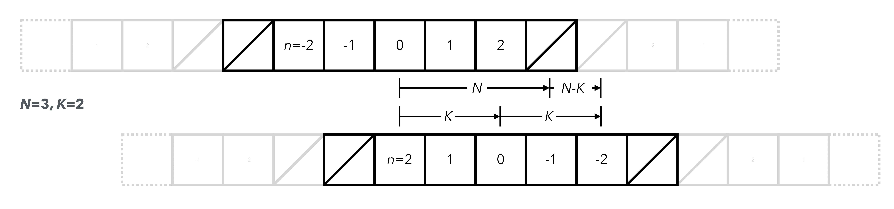

<h2 class='chapterHead' id='discrete-convolutions'>Chapter 7 Discrete convolutions</h2>

<!-- l. 8 -->
Context: This chapter revisits the discrete Fourier transform (DFT)
and illustrates how it can be used for the efficient computation of cyclic
convolutions. Nonlinear terms in partial differential lead to noncyclic
convolutions in spectral methods. Direct application of the DFT then yield
aliasing errors, which can be corrected through dealiasing procedures.

<h3 class='sectionHead' id='discrete-fourier-transform'>7.1  Discrete Fourier transform</h3>
<!-- l. 14 -->
The Fourier series represents functions on finite domains of length \(L\) as \begin {equation} f(x) = \frac {1}{L} \sum _{n=-\infty }^\infty \tilde {f}(q_n) \exp \left (i q_n x\right ) \label {eq:fourier-series} \end {equation} with \(q_n=2\pi n/L\).
The inverse transform is given by \begin {equation} \tilde {f}(q_n) = \int _0^L \dif x\, f(x) \exp \left (-i q_n x\right ). \label {eq:inverse-fourier-series} \end {equation} We now evaluate the Fourier series
only on discrete, equidistant sampling points \(x_k=kL/N\). The inverse transform
Eq. \eqref{eq:inverse-fourier-series} then becomes \begin {equation} \tilde {f}(q_n) = \frac {L}{N} \sum _{k=0}^{N-1} f(x_k) \exp \left (-i q_n x_k\right ), \end {equation} where the sum is the discrete
variant of \(\int \dif x\approx \sum \Delta x\) with grid spacing \(\Delta x=L/N\). The phase-factor \(q_n x_k = 2\pi kn/N\) is an integer multiple of \(2\pi \) if \(n\) is an
integer multiple of \(N\), hence \(\tilde {f}(q_{n+\alpha N})=\tilde {f}(q_{n})\) because \(k(n+\alpha N)/N=kn/N + k\alpha \) for integer \(\alpha \in \mathbb {Z}\). Formally this means
that Eq. \eqref{eq:fourier-series} diverges. This is consistent with the
interpretation that the discretely sampled \(f(x_k)\) is a convolution of \(f(x)\) with a Dirac
comb. We can truncate the forward transform to \begin {equation} f(x_k) = \frac {1}{L} \sum _{n=M}^{M+N-1} \tilde {f}(q_n) \exp \left (i q_n x_k\right ) = \sum _{n=M}^{M+N-1} W_{kn} \hat {f}_n , \label {eq:discrete-fourier-transform} \end {equation} where \(\hat {f}_n=\tilde {f}(q_n)/L\) and we are
using the DFT-matrix \(W_{kn}=\exp (i 2\pi k n/N)\), see also Eq. \eqref{eq:dft-matrix}. This indeed
yields the correct discretely sampled function, as can be seen by inserting
the inverse transform Eq. \eqref{eq:inverse-discrete-fourier-transform}
into Eq. \eqref{eq:discrete-fourier-transform}. The choice of \(M\in \mathbb {Z}\) in
Eq. \eqref{eq:discrete-fourier-transform} remains completely arbitrary, but a typical
choice is \(M=0\). Equation \eqref{eq:discrete-fourier-transform} is called the discrete Fourier
transform (DFT) with inverse Eq. \eqref{eq:inverse-discrete-fourier-transform}
which can be rewritten to \begin {equation} \hat {f}_n = \frac {1}{N} \sum _{k=0}^{N-1} W_{nk}^* f(x_k). \label {eq:inverse-discrete-fourier-transform} \end {equation} The DFT is typically computed using a fast Fourier
transform algorithm (FFT), that reduces the computational complexity from \(O(N^2)\) of
a naive implementation of Eq. \eqref{eq:discrete-fourier-transform} to
\(O(N \log N)\).

<!-- l. 70 -->

<h3 class='sectionHead' id='cyclic-convolutions'>7.2  Cyclic convolutions</h3>
<!-- l. 72 -->
The FFT is useful to reduce the complexity of computing cyclic convolutions from
\(O(N^2)\) to \(O(N \log N)\). A cyclic convolution of the discrete series \(a_n\) and \(b_n\) is given by \begin {equation} c_k = \sum _{n=0}^{N-1} a_n b_{a(k-n)} \end {equation} where \(a(m)=m+\alpha N\) with \(\alpha \in \mathbb {Z}\) such
that \(0\leq a(m)&lt;N\). We can insert the DFT expression, Eq. \eqref{eq:discrete-fourier-transform},
which automatically fulfills the cyclic property to obtain \begin {equation} \begin {split} c_k &amp;= \frac {1}{N^2} \sum _{n=0}^{N-1} \sum _{m=0}^{N-1} W_{nm} \hat {a}_m \sum _{l=0}^{N-1} W_{k-n,l} \hat {b}_l \\ &amp;= \frac {1}{N^2} \sum _{m=0}^{N-1} \sum _{l=0}^{N-1} \hat {a}_m W_{kl} \hat {b}_l \sum _{n=0}^{N-1} W_{n,m-l} \\ &amp;= \frac {1}{N^2} \sum _{m=0}^{N-1} \sum _{l=0}^{N-1} \hat {a}_m W_{kl} \hat {b}_l N\delta _{m,l} \\ &amp;= \frac {1}{N} \sum _{m=0}^{N-1} W_{km} \hat {a}_m \hat {b}_m, \end {split} \end {equation} which is the discrete

Fourier transform representation of the product, i.e. \begin {equation} \hat {c}_m=\hat {a}_m\hat {b}_m. \label {eq:cyclic-convolution-dft} \end {equation} This means the convolution
requires an element-wise product with complexity \(O(N)\), plus three fast Fourier
transforms, which all have complexity \(O(N\log N)\).

<!-- l. 133 -->

<h3 class='sectionHead' id='nonlinear-terms-and-aliasing'>7.3  Nonlinear terms and aliasing</h3>
<!-- l. 135 -->
We now discuss the treatment of nonlinear terms in numerical solution of partial
differential equations with Fourier spectral methods. As an example, let us regard
the simple multiplication of two functions, \begin {equation} h(x) = f(x) g(x). \label {eq:nonlinear-example} \end {equation} We expand both \(f(x)\), \(g(x)\) and \(h(x)\) into a
truncated Fourier series, i.e. we write \begin {align} f(x) &amp;\approx \sum _{n=-N}^N a_n \exp \left (iq_nx\right ), \\ g(x) &amp;\approx \sum _{m=-N}^N b_m \exp \left (iq_mx\right ), \\ h(x) &amp;\approx \sum _{k=-N}^N c_k \exp \left (iq_kx\right ). \end {align}

<!-- l. 150 -->
 To simplify notation, we use \(N\) to denote the truncation of the sums which now
run over \(2N+1\) terms.

<!-- l. 152 -->
 Inserting into Eq. \eqref{eq:nonlinear-example} yields \begin {equation} h(x) \approx \sum _{n=-N}^N \sum _{m=-N}^N a_n b_m \exp \left (iq_{n+m}x\right ). \end {equation} The discrete
form of this equation can be obtained from the Galerkin method, i.e. by
multiplying with \(\exp \left (iq_kx\right )\) from the left, which yields \begin {equation} c_k = \frac {1}{L} \left (\exp (iq_kx), h(x)\right ) = \sum _{n=-N}^N \sum _{m=-N}^N a_n b_m \delta _{k,n+m} = \sum _{n=-N}^N a_n b_{k-n} \label {eq:nonlinear-convolution} \end {equation} An important observation is
that \(c_k\) is nonzero in the range \(-2N\leq k \leq 2N\), but we truncated the sum at \(N\). Since \(b_m\) in
Eq. \eqref{eq:cyclic-convolution-dft} is not cyclic, using the discrete Fourier
transform to compute this convolution introduces an error. This type of numerical
error is called aliasing.

<!-- l. 184 -->
 Aliasing can be removed from the cyclic convolution by zero padding
the two vectors. We set \(a_n=0\) and \(b_n=0\) for \(n &gt; K\). The value of \(c_k\) is then exact for \(k\leq K\) if \(2K\leq N+(N-K)\),
yielding \(K\leq 2N/3\) (see Fig. <a href='#example-of-a-discrete-convolution-the-crossedout-boxes-indicate-the-zeropadded-region-the-gray-boxes-indicate-the-cyclic-periodic-continuation-implicit-in-the-convolution-computed-with-the-fft-period-interactions-are-eliminated-if-kk-nnk-leading-to-the-rule'>7.1<!-- tex4ht:ref: fig:convolution --></a> for an illustration). This means we can compute the
convolution, Eq. \eqref{eq:nonlinear-convolution}, using the FFT for the cyclic
convolution at the expanse of discarding \(1/3\) of the wavevectors. This is called the \(2/3\)
rule (<a href='#XOrszag1971-zf'>Orszag</a>, <a href='#XOrszag1971-zf'>1971</a>).

<figure class='figure'>

<!-- l. 198 -->
  

<figcaption class='caption'>Figure 7.1: Example of a discrete convolution. The crossed-out boxes indicate
the zero-padded region. The gray boxes indicate the cyclic (periodic)
continuation implicit in the convolution computed with the FFT. Period
interactions are eliminated if \(K+K\leq N+(N-K)\), leading to the \(2/3\) rule.
</figcaption><!-- tex4ht:label?: x1-4004r1 -->

</figure>

<h2 class='likechapterHead' id='bibliography'>Bibliography</h2>

   S. Orszag. On the elimination of aliasing in finite-difference schemes
by filtering high-wavenumber components. Journal of the Atmospheric
Sciences, 28:1074–1074, Sept. 1971.

