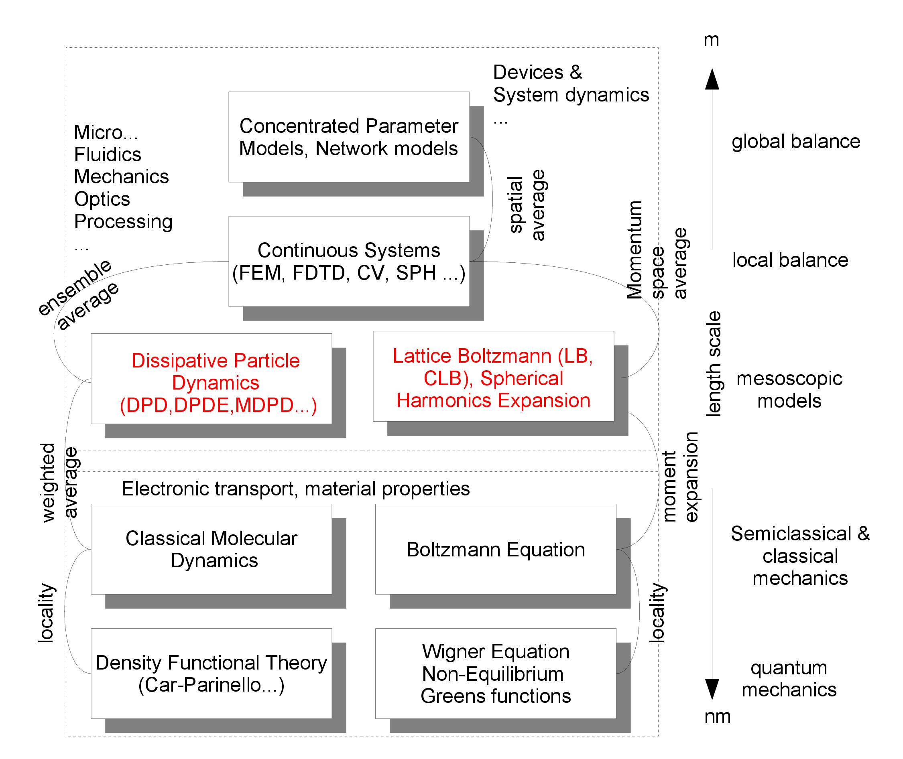

<h2 class='chapterHead' id='introduction'>Chapter 1 Introduction</h2>

<!-- l. 6 -->
Context: The term simulation refers to the numerical (computer-aided) solution
of models. In this introductory chapter, we discuss how models of physical reality
are build and present different classes of models. These models are usually
described mathematically by means of differential equations, i.e. the simulation is
often (but not always) the numerical solution of a set of ordinary or partial
differential equations. 

<h3 class='sectionHead' id='models'>1.1  Models</h3>
<!-- l. 12 -->
Models are usually approximations for the behavior of the physical world at
certain specific length scales. For example, a model that explicitly describes atoms
may be appropriate for length scales \(\sim \text {nm}\), but we would not want to describe a
“macroscopic” system with dimensions \(\sim \text {mm}\) with such a model. Key to carrying out
simulations is therefore to match the physical phenomena we want to describe
with the appropriate models and the mathematical methods required for their
solution.

<!-- l. 14 -->
Note: While we could describe even macroscopic systems with atomic-scale
models, this is typically prohibited by the computer resources available to us. In
addition, the core question we want to answer may be hidden in such a
fine-grained atomic-scale model like the legendary needle in a haystack.

<!-- l. 18 -->
 Figure <a href='#-the-vertical-arrangement-of-the-boxes-represents-the-length-scale-which-is-shown-on-the-right-the-boxes-themselves-contain-simulation-methods-that-are-used-on-these-scales-in-this-course-we-deal-with-the-discretization-of-fields-and-choose-a-specific-use-case-that-falls-into-the-local-balance-'>1.1<!-- tex4ht:ref: fig:Scheme --></a> shows the vertical arrangement of length scales and their
assignment to different levels of description. On the shortest length scale, a
quantum mechanical description is usually necessary. This means that if we want
to resolve the world with Å resolution, we find ourselves at the level of quantum
mechanics and all underlying models are of a quantum mechanical nature. This
typically means a solution of the Schrödinger equation, as implemented in
implemented in various methods, such as density functional theory, a
many-body description of the quantum mechanical electronic system. This
type of many-body description in contrast to molecular dynamics as a
method on a larger length scale. larger length scale, it is not a description of
point particles, but coupled fields, which makes the effort compared to
compared to pure point mechanics. In point mechanics, we have to deal
with three position and three velocity velocity variables for each of the \(n\)
interacting particles, whereas in a quantum mechanical many-body description
we are dealing with a field with three \(n\) position variables each, namely
\(\Psi (\v {r}_1,\v {r}_2,\dots ,\v {r}_n;t)\).

<figure class='figure'>

<!-- l. 36 -->

<!-- l. 40 -->
  

<figcaption class='caption'>Figure 1.1: The vertical arrangement of the boxes represents the length
scale, which is shown on the right. The boxes themselves contain simulation
methods that are used on these scales. In this course we deal with the
discretization of fields and choose a specific use case that falls into the local
balance. </figcaption><!-- tex4ht:label?: x1-2001r1 -->

</figure>

<!-- l. 46 -->
Note: 

<ul class='itemize1'>
<li class='itemize'>\(1\,\r {A}=10^{-10}\,\text {m}\)
</li>
<li class='itemize'>Atoms in our environment are held together by quantum mechanical
phenomena. Models based on quantum mechanical principles are
also called ab-initio (“from the beginning”) models. In English,
such models are also referred to as “first principles” models. The
fundamental equation that describes quantum mechanical objects is the
Schrödinger equation. This itself is in fact already an approximation!
</li>
<li class='itemize'>The single-particle Schrödinger equation is \(i\hbar \frac {\partial }{\partial t} \Psi (\v {r},t) = \hat {H} \Psi (\v {r},t)\). This is a partial
differential equation for the location- and time-dependent scalar matter
field \(\Psi (\v {r},t)\), with Planck’s constant \(\hbar \) and the Hamilton operator \(\hat {H}\), which
contains the details of the model. An equation of motion for many
interacting particles, as given by \(\Psi (\v {r}_1,\v {r}_2,\dots ,\v {r}_n;t)\) is described, is incomparably more
extensive.
</li>
<li class='itemize'>“Semiclassical“ means that the motion of the particles is calculated
according to classical mechanics, but the interactions between the
particles are derived from quantum mechanical laws. This is of course
an approximation that needs to be justified.
</li>
<li class='itemize'>“Mesoscopic” means that the model has an internal length scale and/or
thermal fluctuations are important. These models usually operate on
length scales above the atomic scale (\(\sim \) nm) but below the scales of our
perception of the environment (\(\sim \) mm).

</li>
<li class='itemize'>“balance” means that the core of the description is a conservation
quantity that can be easily counted. Preserved are e.g. particle numbers.
A balance equation or balancing then simply counts the particles that
flow into, out of or are produced in a volume over a certain time interval.
Other conservation variables that can be balanced are momentum and
energy. The balance equation is also called the continuity equation.</li></ul>

<!-- l. 65 -->
 At the level of semiclassical and classical mechanics, also referred to as the
kinetic kinetic level, the models are either described by molecular dynamics or by
the equation of motion of the single-particle probabilitydensity in phase space \(f(\v {r},\v {p})\) -
with the independent variables location \(\v {r}\) and momentum \(\v {p}\). In the second case, we
have a function \(f(\v {r}(t),\v {p}(t),t)\) which of location, momentum and time both explicitly
and implicitly via \(\v {r}(t)\) and \(\v {p}(t)\) depends. Let’s assume that we need \(f(\v {r}(t),\v {p}(t),t)\) must be
interpolated by discrete sampling points. With a low resolution of 10
points per variable, this is already 10,000,000 interpolation points. This
may be manageable, but the resolution is not particularly good. And
therefore this undertaking is rather useless. We do not want to conceal
the fact that there are methods for the numerical solution to the two
problems described above, but these will not be discussed in detail in this
course.

<h3 class='sectionHead' id='particles'>1.2  Particles</h3>
<!-- l. 79 -->
We can therefore roughly distinguish between two types of models: Models that
have individual discrete elements, for example particles (atoms, molecules, grains,
etc.), as the central element and models that have continuous fields (electrostatic
potential, ion concentrations, mechanical stresses and strains) as the central
element. In the first type of model, evolution equations are formulated for discrete
properties defined on the particles, such as their positions \(\v {r}_i\) and velocities
\(\v {v}_i\).

<!-- l. 81 -->
 For example, to describe the kinetics of these particles, we could solve
Newton’s equations of motion. This means that for each of the \(n\) particles we have
to formulate \(6\) ordinary differential equations, which are still coupled to each other,
namely: \begin {equation} \dot {\v {r}}_i(t)=\v {v}_i(t)=\frac {\v {p}_i(t)}{m_i} \label {eq:posupdate} \end {equation} This is the equation for the trajectory of the particle \(i\) in space. Since \(\v {r}\) is
a vector, Eq. \eqref{eq:posupdate} is a system of \(3\) ordinary differential equations.
differential equations. The velocity \(\v {v}_i\) of the particle \(i\) at time \(t\) is also subject to a

system of differential equations due to the momentum \(\v {p}_i\) system of differential
equations: \begin {equation} \dot {\v {p}}_i(t)=\sum _j\v {F}_{ij}(t) \label {eq:velupdate} \end {equation} Equation \eqref{eq:velupdate} describes the temporal development
of the momentum of the particle \(i\). Equation \eqref{eq:posupdate} and
\eqref{eq:velupdate} are each \(3\times n\) coupled ordinary differential equations. If, for
example, we want to describe the movement of all molecules in a liter
of water by a simulation, this is impossible due to the large number of
equations and we must switch to a description using balance equations and
fields.

<!-- l. 104 -->
 Newton’s equations of motion \eqref{eq:posupdate} and \eqref{eq:velupdate}
are by their nature physical basic principles. They apply to atoms or planets. The
nature of the force itself, \(\v {F}_{ij}\) in the equations above, is of course based on
physically describable effects, but is not necessarily a principle of nature. A
simple example is the Lennard-Jones interaction, for which the interaction
energy \begin {equation} V_{ij} = 4\varepsilon \left [ \left (\frac {\sigma }{r_{ij}}\right )^{12} - \left (\frac {\sigma }{r_{ij}}\right )^{6}\right ] \label {eq:lj_potential} \end {equation} and thus the force \begin {equation} \v {F}_{ij} = -4\varepsilon \left [ 12\left (\frac {\sigma ^{12}}{r_{ij}^{13}}\right ) - 6\left (\frac {\sigma ^{6}}{r_{ij}^{7}}\right )\right ]\hat {r}_{ij} \label {eq:lj} \end {equation} where \(r_{ij}\) is the distance between the particles
(here atoms or molecules) \(i\) and \(j\). The term \(\propto r^{-13}\) describes the repulsion of the
atoms due to the Pauli exclusion principle and the term \(\propto r^{-7}\) describes the
attraction of the atoms due to the London dispersion interaction. Both
interactions are based on fundamental physical principles, but the formulation
Eq. \eqref{eq:lj} reduces these complex phenomena to a simple constituent law.
Such laws are often called constitutive laws. The numerical solution of
Newton’s equations of motion for atoms is called molecular dynamics
simulation.

<!-- l. 116 -->
Note: The term constitutive law often appears in the context of field theories. For
the Lennard-Jones potential, this term is rather unusual, but this law is
nevertheless of a constitutive nature. 

<!-- l. 120 -->
 Another example of models with discrete elements are network models for
electrical circuits. Here, an element links a potential difference (energy
difference) with a flowing current, for example describes \begin {equation} i = u / R \label {eq:resistor} \end {equation} describes the
current \(i\) that flows through a resistor \(R\) across which the voltage \(u\) drops.
Kirchhoff’s rules for current and voltage are also used. Such models are often
referred to as “lumped-element models”. Equation \eqref{eq:resistor}
naturally also has the quality of a constitutive law, as complex electronic
processes are behind the individual parameter \(R\). Kirchhoff’s rules, on the other
hand, have the quality of a balance equation. In Fig. <a href='#-the-vertical-arrangement-of-the-boxes-represents-the-length-scale-which-is-shown-on-the-right-the-boxes-themselves-contain-simulation-methods-that-are-used-on-these-scales-in-this-course-we-deal-with-the-discretization-of-fields-and-choose-a-specific-use-case-that-falls-into-the-local-balance-'>1.1<!-- tex4ht:ref: fig:Scheme --></a>, these models are
therefore referred to as global balance. “Lumped-element models” also
lead to systems of ordinary differential equations, which are often solved
numerically by explicit time propagation. Well-known representatives of
this type of simulation software are, for example SPICE or MATLAB
Simulink.

<!-- l. 127 -->
 This global image level is characterized by a lack of interest in local resolution.
We are not interested not in densities, but only in total masses, not in
current densities but only for currents. This is best illustrated by the
above-mentioned resistor whose contacts are at different potentials. This results
in a current flow in the simplest case. We do not ask ourselves how the
current is distributed in the resistor. We do not even ask whether the
resistor is homogeneous or inhomogeneous, we take it as a total value, as
a black box to which we assign a parameter value. This approach has
already been discussed in detail in electrical engineering and systems
theory.

<!-- l. 137 -->

<h3 class='sectionHead' id='fields'>1.3  Fields</h3>
<!-- l. 139 -->
However, if we now realize that the black box is only insufficiently described with
one parameter, then we start replace it with a more complex equivalent
circuit with details that resolve the internal state of the component. This
in turn can be taken so far, that a continuum is created at the end -
we have arrived at the local image level. For this, we need parameters
such as conductivity, viscosity or diffusivity, which in turn cannot be
derived as models from the continuous description of the local balance. For
example, experiments or ab-initio simulations are needed to determine these
parameters.

<!-- l. 148 -->
 Local balance means that we can assign a density, concentration, temperature
or similar quantity to the system at each point in space. However, this means that
the temporal changes in the local degrees of freedom - i.e. the momentum or
velocity - are determined in their distribution by a local, thermodynamic
equilibrium condition . (In thermodynamic equilibrium, the momentum satisfies a
Maxwell-Boltzmann distribution). This local equilibrium does not mean that we
no longer have dynamics. But if we think of a swarm of gas or liquid particles,
then their individual velocities follow an equilibrium distribution function, but
their mean follows the balance equation. The dynamics are therefore averaged
over a huge number of these particles. Local balance also does not mean that
different temperatures or densities cannot exist at different locations. densities
at different locations. The differences in these parameters are then the
driving forces of the dynamics - temperature gradient, density gradient,
etc.

<!-- l. 159 -->
 Such models fall into the field of field theories, and their mathematical
description is based on partial differential equations. (This is in contrast to the

ordinary differential equations of discrete models). A field theory based on the
balancing of mass, momentum or energy always requires constitutive laws for the
description of the material behavior. These constitutive laws contain transport
parameters such as the viscosity or diffusion constant. There are also field theories
that have the character of a basic physical principle. This is, for example,
the Schrödinger equation mentioned above or the Maxwell equations of
electrodynamics. In this course we want to concentrate on such continuous
systems that are formulated as field theory with the help of partial differential
equations.

<!-- l. 162 -->

<h3 class='sectionHead' id='which-model-is-the-right-one'>1.4  Which model is the right one?</h3>
<!-- l. 164 -->
Mind you, we have not assigned any of the levels of description on different length
scales with any value. Just because it is called quantum mechanics and leaves one
or the other in awe at its complexity, it does not necessarily offer the solution. On
the contrary, it can even be a hindrance to want to resolve too much detail
and we must constantly ask ourselves how much detail is necessary in
the simulation. Even more, we always ask ourselves before we start a
simulation: “Is a simulation of this complexity really necessary, or can I
simplify the problem?” The simulation should be seen as a tool and not
as an end in itself, according to the American mathematician Richard
Wesley Hamming (*1915, \(\dagger \)1998): The purpose of computing is insight, not
numbers.

<h2 class='likechapterHead' id='bibliography'>Bibliography</h2>

