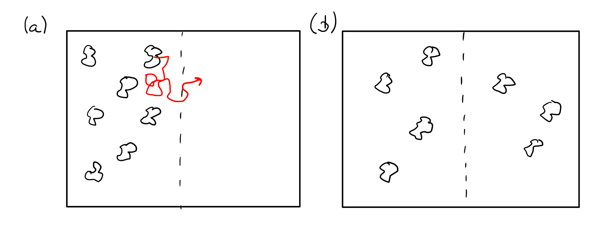

<h2 class='chapterHead' id='transport-theory'>Chapter 2 Transport theory</h2>

<!-- l. 8 -->
Context: We introduce the foundations of transport theory, in particular how to
balance conserved quantity. This leads to the continuity equation. We
start from an illustrating example, the diffusion of suspended particles.

<h3 class='sectionHead' id='diffusion-and-drift'>2.1  Diffusion and drift</h3>
<!-- l. 14 -->
Diffusive transport is easily accessible via the image of the “random walk”, a
random stochastic movement of particles. Random motion was first described by
the botanist Robert Brown (1773-1858) who observed random motion of grains of
pollen suspended in water. He lend his name for the now common term Brownian
motion or Brownian molecular motion. Robert Brown did not know about
molecules at his time. He initially believed that the movement was due to active
processes (the “force of life” of the pollen), but could then show that
inactive matter also exhibits this random motion. Today we know that this
movement is caused by thermal fluctuations, i.e. molecules that randomly hit
suspended particles and push them in random directions. This explanation
requires the existence of atoms and was popularized in 1905 by Albert
Einstein (<a href='#Xeinstein_uber_1905'>Einstein</a>, <a href='#Xeinstein_uber_1905'>1905</a>).

<!-- l. 16 -->
 Brownian molecular motion leads to diffusive transport. Figure <a href='#-illustration-of-diffusion-the-pollen-in-a-move-randomly-in-the-domain-after-a-certain-time-b-the-initial-concentration-difference-between-the-left-and-right-parts-of-the-domain-is-equalized-'>2.1<!-- tex4ht:ref: fig:brownian --></a> shows a
simple qualitative thought experiment. The configuration in Fig. <a href='#-illustration-of-diffusion-the-pollen-in-a-move-randomly-in-the-domain-after-a-certain-time-b-the-initial-concentration-difference-between-the-left-and-right-parts-of-the-domain-is-equalized-'>2.1<!-- tex4ht:ref: fig:brownian --></a>a shows a
localization of the “pollen” in the left half of the domain shown. Due to their
random movement (shown as an example by the red line in Fig. <a href='#-illustration-of-diffusion-the-pollen-in-a-move-randomly-in-the-domain-after-a-certain-time-b-the-initial-concentration-difference-between-the-left-and-right-parts-of-the-domain-is-equalized-'>2.1<!-- tex4ht:ref: fig:brownian --></a>a), some of
the pollen will cross the dashed boundary line into the right half and also come
back again. After a certain time, the initial state can no longer be identified and
the pollen are distributed throughout the domain (Fig. <a href='#-illustration-of-diffusion-the-pollen-in-a-move-randomly-in-the-domain-after-a-certain-time-b-the-initial-concentration-difference-between-the-left-and-right-parts-of-the-domain-is-equalized-'>2.1<!-- tex4ht:ref: fig:brownian --></a>b). The concentration
is now constant. The pollen continue to move, but on average the same
number of pollen move to the left as to the right. In the case shown in
Fig. <a href='#-illustration-of-diffusion-the-pollen-in-a-move-randomly-in-the-domain-after-a-certain-time-b-the-initial-concentration-difference-between-the-left-and-right-parts-of-the-domain-is-equalized-'>2.1<!-- tex4ht:ref: fig:brownian --></a>a, this left/right symmetry is broken which leads to a finite flux to the
right.

<figure class='figure'>

<!-- l. 22 -->
  

<figcaption class='caption'>Figure 2.1: Illustration of diffusion. The “pollen” in (a) move randomly in the
domain. After a certain time (b), the initial concentration difference between
the left and right parts of the domain is equalized.
</figcaption><!-- tex4ht:label?: x1-2001r1 -->

</figure>
<!-- l. 28 -->
 This thought experiment can be easily formalized mathematically. We consider
a particle that performs a random movement in one dimension is performed. We
start with a particle that randomly jumps back and forth on a straight line. The
straight line lies along the x-direction. The particle can only move to
predetermined positions on the x-axis, which we denote by \(x_j\) and which are
equidistant, \(x_j-x_{j-1}=\Delta x\) for \(j\in \mathbb {Z}\) (see Fig. <a href='#-random-movement-in-one-dimension-is-given-by-transition-probabilities-p-for-a-movement-to-the-left-and-q-for-a-movement-to-the-right-'>2.2<!-- tex4ht:ref: fig:Brown --></a>).

<figure class='figure'>

<!-- l. 34 -->

<figcaption class='caption'>Figure 2.2: Random movement in one dimension is given by transition
probabilities \(p\) (for a movement to the left) and \(q\) for a movement to the right.
</figcaption><!-- tex4ht:label?: x1-2002r2 -->

</figure>
<!-- l. 58 -->
 A particle jumps to the left with a probability \(p\) and to the right with a
probability probability \(q\) to the right. In addition, we have the probability of
finding a particle at time \(t\) at position \(x\). This is given on the 1D grid by the
function \(P(x_j,t)\).

<h4 class='subsectionHead' id='diffusion'>2.1.1  Diffusion</h4>
<!-- l. 64 -->
We first consider the case \(p=q=1/2\), i.e. that the probabilities for the jumps to the left and
right are identical. We assume that the particles jump from one place to the
neighboring one in a discrete, finite and constant time step \(\tau \). Then the probability
of finding a particle at time \(t+\tau \) at location \(x\) is \begin {equation} P(x,t+\tau )=\frac {1}{2}P(x+\Delta x,t)+\frac {1}{2}P(x-\Delta x,t), \end {equation} where \(P(x-\Delta x,t)\) is the probability of finding a
particle at position \(x-\Delta x\) and \(P(x+\Delta x,t)\) the probability of finding a particle at \(x+\Delta x\), both at time
\(t\).

<!-- l. 74 -->
 By subtracting \(P(x,t)\) on both sides and dividing by \(\tau \), we obtain the following
equivalent form: \begin {equation} \frac {P(x,t+\tau )-P(x,t)}{\tau } = \frac {\Delta x^2}{2\tau }\frac {P(x+\Delta x,t)-2P(x,t)+P(x-\Delta x,t)}{\Delta x^2} \end {equation} We can now make the limit transition to the “continuum”.
Taking \(\tau \rightarrow 0\) and at the same time \(\Delta x\rightarrow 0\) while maintaining \begin {equation} \lim _{\Delta x\rightarrow 0, \tau \rightarrow 0}\frac {\Delta x^2}{2\tau }=D \end {equation} yields \begin {equation} \frac {\partial P(x,t)}{\partial t}=D\frac {\partial ^2 P(x,t)}{\partial x^2}. \end {equation} This is the well-known
diffusion equation. In multiple dimensions, the second derivative becomes the
Laplace operator \(\nabla ^2\), \begin {equation} \frac {\partial P(x,t)}{\partial t}=D \nabla ^2 P(x,t). \label {eq:diffusion} \end {equation} This equation is only correct if the diffusion constant is
actually constant and does not vary spatially.

<!-- l. 95 -->
Note: The operator \(\nabla \) is a vector of the partial derivatives in the Cartesian
direction, i.e. \begin {equation} \nabla = \begin {pmatrix} \partial /\partial x \\ \partial /\partial y \\ \partial /\partial z \end {pmatrix}. \end {equation} Applying it to a scalar function \(f(x,y,z)\) yields the gradient, \begin {equation} \nabla f= \text {grad}\,f = \begin {pmatrix} \partial f/\partial x \\ \partial f/\partial y \\ \partial f/\partial z \end {pmatrix}. \end {equation} The Laplacian
is sometimes denoted by \(\nabla ^2\) (often in the anglosaxon literature) or \(\Delta \) (e.g. in the
German literature). It is explicitly given by \begin {equation} \Delta = \nabla ^2 = \frac {\partial ^2}{\partial x^2} + \frac {\partial ^2}{\partial y^2} + \frac {\partial ^2}{\partial z^2}. \end {equation} We will use \(\nabla ^2\) for the Laplacian
throuhout this text. 

<!-- l. 116 -->

<h4 class='subsectionHead' id='drift'>2.1.2  Drift</h4>
<!-- l. 118 -->
What happens if the probabilities for the jumps to the right or left are not equal, \(p\ne q\)
(but of course \(p+q=1\))? We still assume discrete, uniform time steps and equidistant
sampling points.

<!-- l. 120 -->
 In this case, we have \begin {equation} P(x,t+\tau )=pP(x+\Delta x,t)+qP(x-\Delta x,t) \end {equation} which yields \begin {equation} \frac {P(x,t+\tau )-P(x,t)}{\tau }=\frac {\Delta x^2}{\tau }\frac {pP(x+\Delta x,t)-P(x,t)+qP(x-\Delta x,t)}{\Delta x^2}. \label {eq:driftpq} \end {equation} This can be simplified by writing \begin {equation} p=\frac {1}{2}-\varepsilon \quad \text {and}\quad q=\frac {1}{2}+\varepsilon \quad \text {with}\quad 0\le |\varepsilon |\le \frac {1}{2} \quad \text {or}\quad 2\varepsilon = q-p, \end {equation} where \(\varepsilon \)
now indicates how much more likely a jump to right is than to the left. A positive \(\varepsilon \)
therefore means that the particles will move to the right on average – this is called
drift. We can now write Eq. \eqref{eq:driftpq} using \(\varepsilon \), giving \begin {equation} \begin {split} \frac {P(x,t+\tau )-P(x,t)}{\tau }=&amp; \frac {\Delta x^2}{2\tau }\frac {P(x+\Delta x,t)-2P(x,t)+P(x-\Delta x,t)}{\Delta x^2}\\\
&amp;-\frac {2\varepsilon \Delta x}{\tau }\frac {P(x+\Delta x,t)-P(x-\Delta x,t)}{2\Delta x}. \end {split} \end {equation} In the limit \(\tau \rightarrow 0\) and \(\Delta x\rightarrow 0\)

we require \begin {equation} \lim _{\Delta x\rightarrow 0, \tau \rightarrow 0}\frac {\Delta x^2}{2\tau }=D \quad \text { and }\quad \lim _{\Delta x\rightarrow 0, \tau \rightarrow 0}\frac {2\varepsilon \Delta x}{\tau }=v \label {eq:limit2} \end {equation} and thus obtain the drift-diffusion equation \begin {equation} \frac {\partial P(x,t)}{\partial t}=\left (D\frac {\partial ^2}{\partial x^2} -v\frac {\partial }{\partial x}\right ) P(x,t). \label {eq:driftdiffusion} \end {equation} Here, the first summand
on the right-hand side again describes the diffusion process. The second summand
is a drift process and \(v\) is a constant drift velocity. (From Eq. \eqref{eq:limit2}
and \eqref{eq:driftdiffusion} it can be seen that the unit of \(v\) corresponds exactly
to a velocity). It is the speed at which the particle moves (on average) along the
\(x\)-axis.

<!-- l. 162 -->
Note: The motion of our particle was modeled using a probability density \(P\). In the
thermodynamic limit, i.e. for many particles (usually of the order of Avogadro’s
number \(N_\text {A}\sim 10^{23}\)), this probability becomes the (mass) density \(\rho \) or the concentration
(number density) \(c\). We can therefore simply replace the probability \(P\) in the above
equations with a concentration \(c\). The reason for this is that we can write the
concentration as an ensemble mean, \begin {equation} c(x, t) = \langle 1 \rangle (x, t), \end {equation} where the mean value is defined as \begin {equation} \langle f(x) \rangle (x, t) = f(x) P(x, t). \end {equation}

<!-- l. 173 -->

<h3 class='sectionHead' id='continuity'>2.2  Continuity</h3>
<!-- l. 175 -->
The equations \eqref{eq:diffusion} and \eqref{eq:driftdiffusion} mix two concepts
that we want to treat separately now: The conservation of the number of particles
(continuity) and the process that leads to a flow of particles (diffusion or drift).
The number of particles is conserved simply because we cannot create atoms out
of nothing or destroy them into nothing. If we have a certain number
of particles \(N_{\text {tot}}\) in our overall system, we know that this number \begin {equation} N_{\text {tot}}(t) = \int \dif ^3r \, c(\v {r}, t) \label {eq:ntot} \end {equation} cannot
change over time: \(\dif N_{\text {tot}}/\dif t=0\). The integral in Eq. \eqref{eq:ntot} is carried out
over the total volume of our system, essentially the physical world of the
model.

<!-- l. 183 -->
 For a small section of our physical world with volume \(V\), the number of particles
can change because they can flow over the walls of the sample volume
(see Fig. <a href='#-particles-can-only-leave-the-volume-v-through-the-side-walls-the-change-in-the-number-of-particles-n-over-a-time-interval-is-therefore-given-by-the-number-of-particles-flowing-through-the-walls-for-this-we-need-the-particle-flows-j-the-number-of-particles-flowing-through-a-surface-is-then-given-by-ja-where-a-is-the-area-of-the-side-wall-'>2.3<!-- tex4ht:ref: fig:continuity --></a>). The change in the number of particles within \(V\) is given by
\begin {equation} \dot {N}_\text {V} = \frac {\partial }{\partial t} \int _V \dif ^3r \, c(\v {r}, t) = \int _V \dif ^3r \, \frac {\partial c}{\partial t}. \label {eq:nchange} \end {equation} However, the change \(\dot {N}_\text {V}\) must also be given by the number of particles
flowing through the side walls. For a cube (Fig. <a href='#-particles-can-only-leave-the-volume-v-through-the-side-walls-the-change-in-the-number-of-particles-n-over-a-time-interval-is-therefore-given-by-the-number-of-particles-flowing-through-the-walls-for-this-we-need-the-particle-flows-j-the-number-of-particles-flowing-through-a-surface-is-then-given-by-ja-where-a-is-the-area-of-the-side-wall-'>2.3<!-- tex4ht:ref: fig:continuity --></a>) with six walls, it is
approximately given \begin {equation} \begin {split} \dot {N}_\text {V} = &amp; - j_{\text {right}} A_{\text {right}} - j_{\text {left}} A_{\text {left}} \\ &amp; - j_{\text {above}} A_{\text {above}} - j_{\text {bottom}} A_{\text {bottom}} \\ &amp; - j_{\text {front}} A_{\text {front}} - j_{\text {back}} A_{\text {back}} \end {split} \label {eq:dotN} \end {equation} if the walls are small enough so that \(j\) is almost
constant over \(A\). We have, in passing, introduced the current density \(j\) has
the unit number of particles/time/area. The quantities \(j A\) are hence the
number of particles flowing per unit time through one of the walls with are
\(A\).

<figure class='figure'>

<!-- l. 223 -->
 

<figcaption class='caption'>Figure 2.3: Particles can only leave the volume \(V\) through the side walls. The
change in the number of particles \(N\) over a time interval \(\tau \) is therefore given
by the number of particles flowing through the walls. For this we need the
particle flows \(j\). The number of particles flowing through a surface is then
given by \(j\,A\tau \), where \(A\) is the area of the side wall.
</figcaption><!-- tex4ht:label?: x1-5004r3 -->

</figure>
<!-- l. 229 -->
 The scalar current density \(j\) describes the current flowing out of the surface. For
a general vectorial current density \(\v {j}\), which indicates the strength and direction of
the particle current, the total current density flowing out of the volume through
wall \(i\) is given by \(j_i = \v {j}_i \cdot \hat {n}_i\), where \(\hat {n}_i\) is the normal vector pointing outwards on wall \(i\). The
current through the wall is therefore only the component of \(\v {j}\) that is parallel to the
surface normal (or perpendicular to the wall). With this argument, we can
generalize the expression for the change in number of particles to \begin {equation} \dot {N}_\text {V} = -\int _{\partial V} \dif ^2r \, \v {j}(\v {r})\cdot \hat {n}(\v {r}) \label {eq:flux} \end {equation} where \(\partial V\) denotes
the surface area of the volume \(V\). This equation explicitly indicates that
both the flux \(\v {j}\) and the surface normal \(\hat {n}\) depend on the position \(\v {r}\) on the
surface.

<!-- l. 236 -->
 Alternatively, we can also group the change in the number of particles
Eq. \eqref{eq:dotN} as follows: \begin {equation} \begin {split} \dot {N}_\text {V} = &amp; - (j_{\text {right}} + j_{\text {left}}) A_{\text {right/left}} \\ &amp; - (j_{\text {top}} + j_{\text {bottom}}) A_{\text {top/bottom}} \\ &amp; - (j_{\text {front}} + j_{\text {rear}}) A_{\text {front/back}} \end {split} \end {equation} Here we have used the fact that \(A_{\text {right}}=A_{\text {left}}\equiv A_{\text {right/left}}\). But
now \begin {equation} \begin {split} j_{\text {right}} &amp;= \hat {x} \cdot \v {j}(x+\Delta x/2,y,z) = j_x(x+\Delta x/2,y,z) \quad \text {and} \\ j_{\text {left}} &amp;= -\hat {x} \cdot \v {j}(x-\delta x/2,y,z) = -j_x(x-\delta x/2,y,z) \end {split} \end {equation} since \(\hat {n}=\hat {x}\) for the right wall but \(\hat {n}=-\hat {x}\) for the left wall. Here, \(\hat {x}\) is the normal
vector along the \(x\)-axis of the coordinate system. The sign of the surface
normal is therefore reversed between the right and left surfaces. The same
applies to the top/bottom and front/back walls. We can further rewrite
this equation as \begin {equation} \begin {split} \dot {N} = &amp; - \frac {j_x(x+\Delta x/2,y,z) - j_x(x-\Delta x/2,y,z)}{\Delta x} V \\ &amp; - \frac {j_y(x,y+\Delta y/2,z) - j_y(x,y-\Delta y/2,z)}{\Delta y} V \\ &amp; - \frac {j_z(x,y,z+\Delta z/2) - j_z(x,y,z-\Delta z/2)}{\Delta z} V, \end {split} \label {eq:dotNdiscr} \end {equation} since \(V=A_{\text {right/left}}\Delta x=A_{\text {top/bottom}}\Delta y=A_{\text {front/back}}\Delta z\). However, the factors in front of the volume \(V\) in
Eq. \eqref{eq:dotNdiscr} are now exactly the difference quotients of the flows \(j_i\), in
the \(x\), \(y\) and \(z\) directions respectively. For small volumes (and small \(\Delta x\), etc.) this
becomes \begin {equation} \dot {N} = -\int _{V} \dif ^3r \, \nabla \cdot \v {j}(\v {r}). \label {eq:flux2} \end {equation} We have just heuristically derived the divergence theorem (see also
Eq. \eqref{eq:divergencetheorem}) to express Eq. \eqref{eq:flux} as a volume
integral.

<!-- l. 302 -->
Note: We have expressed the divergence of a vectorial field \(\v {f}(\v {r})\) through the nabla
operator, \begin {equation} \nabla \cdot \v {f} = \text {div}\, \v {f} = \frac {\partial f_x}{\partial x} + \frac {\partial f_y}{\partial y} + \frac {\partial f_z}{\partial z} \end {equation} The divergence theorem is an important result of vector calculus. It
converts an integral over a volume \(V\) into an integral over the surface \(\partial V\) of this
volume. For a vector field \(\v {f}(\v {r})\) applies: \begin {equation} \int _V \dif ^3 r\, \nabla \cdot \v {f}(\v {r}) = \int _{\partial V} \dif ^2 r\, \v {f}(\v {r}) \cdot \hat {n}(\v {r}) \label {eq:divergencetheorem} \end {equation} Here \(\hat {n}(\v {r})\) is the normal vector which points
outwards on the edge \(\partial V\) of the volume \(V\). Note that in one dimension this reduces to \begin {equation} \int _a^b \dif x\, \frac {\partial f}{\partial x} = f(b) - f(a) \end {equation}
while is the integration rule we all know from high school. The divergence theorem
is hence a generalization of this integration rule to functions of many variables.

<!-- l. 331 -->
 Equation \eqref{eq:nchange} and \eqref{eq:flux2} together result in \begin {equation} \int _V \dif ^3r \, \left \{\frac {\partial c}{\partial t}+\nabla \cdot \v {j}\right \} = 0. \label {eq:continuityweak} \end {equation} Since
this applies to any volume \(V\), the equation \begin {equation} \frac {\partial c}{\partial t}+\nabla \cdot \v {j} = 0 \label {eq:continuity} \end {equation} must also hold. This equation is called
continuity equation. It describes the conservation of the number of particles or the
mass of the system.

<!-- l. 343 -->
Note: In the derivation presented here, we have already implicitly used the
strong formulation and a weak formulation of a differential equation.

Equation \eqref{eq:continuity} is the strong formulation of the continuity
equation. This requires that the differential equation is satisfied for every spatial
point \(\v {r}\). A corresponding weak formulation is Eq. \eqref{eq:continuityweak}. Here
it is only required that the equation is fulfilled in a kind of mean value, here as
an integral over a sample volume \(V\). Within the volume, the strong form
need not be satisfied, but the integral over these deviations (which we
will later call “residuum”) must vanish. The weak formulation is thus an
approximation for finite sample volumes \(V\). In many numerical approaches, a weak
equation is solved exactly for a certain (approximate) initial function.

<!-- l. 347 -->
 We can still require that “particles” are produced within our sample volume.
In the current interpretation of the equation, this could be, for example, chemical
reactions that convert one type of particle into another. An identical equation
applies to heat transport, because just like particle numbers, also the energy is a
conserved quantity. Here, a source term would be the production of heat, e.g. by a
heating element. Given a flow \(Q\) (with unit number of particles/time/volume), the
particle or heat source, the continuity equation can be extended to \begin {equation} \frac {\partial c}{\partial t}+\nabla \cdot \v {j} = Q. \label {eq:continuitywithsource} \end {equation} The
continuity equation with source term is also sometimes referred to as the balance
equation.

<!-- l. 354 -->
Note: Equation \eqref{eq:continuitywithsource} describes the change in
concentration \(c\) over time. A related question is how to solve this equation after a
very long time - when a dynamic equilibrium has been reached and the
concentration no longer varies but is stationary. This equilibrium is then
characterized by the fact that \(\partial c/\partial t=0\). The equation \begin {equation} \nabla \cdot \v {j} = Q \end {equation} is the stationary variant of the
continuity equation. 

<h4 class='subsectionHead' id='drift1'>2.2.1  Drift</h4>
<!-- l. 364 -->
Let us come back to transport processes, first to drift. If all particles in our
sample volume move with the speed \(\v {v}\), this leads to a particle flow \begin {equation} \v {j}_{\text {drift}} = c \v {v}. \label {eq:drift} \end {equation} When inserted
into the continuity equation \eqref{eq:continuity}, this results in the drift
contribution to the drift-diffusion equation \eqref{eq:driftdiffusion}.

<!-- l. 371 -->

<h4 class='subsectionHead' id='diffusion1'>2.2.2  Diffusion</h4>
<!-- l. 373 -->
From our thought experiment above, it is clear that the diffusion current must

always go in the direction of the low concentration, i.e. in the opposite direction
to the gradient \(\nabla c\) of the concentration. The corresponding current is given by \begin {equation} \v {j}_{\text {Diffusion}} = - D \nabla c. \label {eq:stationary} \end {equation}
When inserted into the continuity equation \eqref{eq:continuity}, this results in
the diffusion equation \eqref{eq:diffusion}.

<!-- l. 380 -->
 The entire drift-diffusion equation therefore has the form \begin {equation} \frac {\partial c}{\partial t} + \nabla \cdot \left \{-D\nabla c + c\v {v}\right \}=0. \label {eq:drift-diffusion-full} \end {equation} In contrast to
equations \eqref{eq:diffusion} and \eqref{eq:driftdiffusion}, this equation also
applies if the diffusion constant \(D\) or drift velocity \(\v {v}\) varies spatially.

<!-- l. 387 -->
Note: We have introduced transport theory here in terms of a particle
concentration \(c\). However, the continuity equation generally describes the
conservation of a certain quantity, in our case the number of particles (or
equivalently the mass). Other physically conserved quantities are momentum and
energy. The continuity equation for the momentum leads to the Navier-Stokes
equation. The continuity equation for the energy leads to the heat conduction
equation. 

<h2 class='likechapterHead' id='bibliography'>Bibliography</h2>

   A. Einstein. Über die von der molekularkinetischen Theorie der Wärme
geforderte Bewegung von in ruhenden Flüssigkeiten suspendierten
Teilchen. Ann. Phys., 17:549, 1905.

