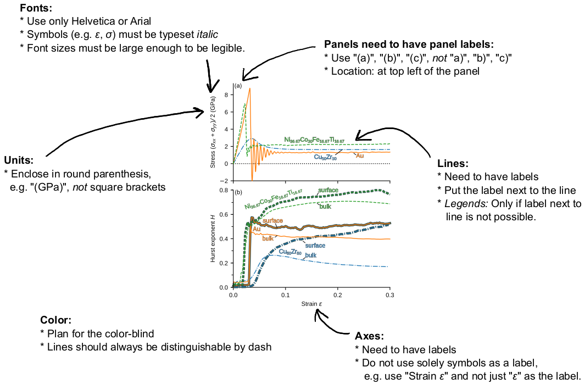

# Figures

Each figure muss contain the following:
* Labels of all axes must have units (unless the property is dimensionless)
* If there is more than one curve, the plot needs a legend
* If there is more than one display panel, it should have a category (a), (b), (c), etc.

We subtract points if these rules are violated. There are more hints on style in the above example figure.
