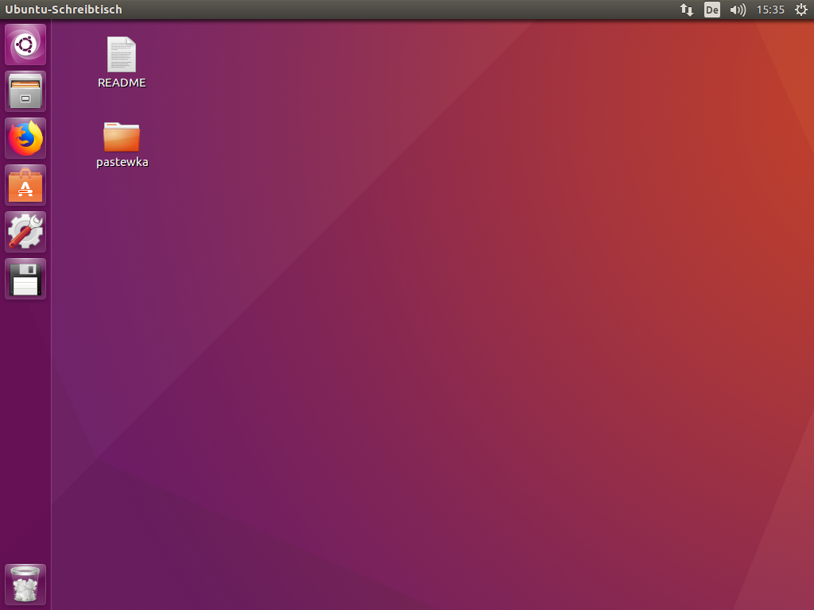

# Python, numpy, scipy

Wir empfehlen Ihnen, die Lösungen für diese Vorlesung in [Python][python] und der numerischen Bibliothek [numpy][numpy] zu erarbeiten. Für Python gibt es z.B. folgende (frei verfügbare) Entwicklungsumgebungen:

* [Jupyter-Notebooks][jupyter] und [Jupyter-Lab][jupyter-lab]
* [PyCharm][pycharm]
* [Visual Studio Code][vscode]

Für alle diese Entwicklungsumgebungen benötigen Sie eine funktionierende Python-Installation. Wir beschreiben hier zwei Möglichkeiten, eine solche aufzusetzen: Die direkte Installation auf Ihrem Computer und die Nutzung einer virtuellen Maschine mit einem von uns bereitgestellten Betriebssystemabbild. Bitte beachten Sie, dass auf unserem Betriebssystemabbild nur [Jupyter][jupyter] zur Verfügung steht.

## Installation auf einem eigenen Computer

Dieses Dokument enthält Empfehlungen zur Installation von Python unter Windows, Linux und macOS. Wenn Sie Windows verwenden, empfehlen wir grundsätzlich, das [Windows Subsystem für Linux (WSL)][wsl] zu installieren. Für WSL gelten die nachstehenden Linux-Anweisungen.

### Unter Windows

Wir empfehlen die Nutzung des [Windows-Subsystems für Linux (WSL)][wsl]. Wenn Sie sich für die Installation von Ubuntu entscheiden, gelten die nachstehenden Anweisungen. Als Alternative können Sie [Anaconda][anaconda] nutzen um eine native Python-Installation zu bekommen.

### Unter Linux

Die Installation hängt von Ihrer Distribution ab. Unter Ubuntu installieren Sie die bitte folgenden Pakete: `openmpi-bin`, `libopenmpi-dev`, `python3`, `python3-dev`, `python3-pip`, `python3-numpy`, `python3-scipy`, `python3-distutils`, `python3-juypter-core`, `python3-juypter-client`, `python3-notebook`. Sie können dies von der Kommandozeile aus tun:

```bash
sudo apt install openmpi-bin libopenmpi-dev python3 python3-pip python3-dev
sudo apt install python3-numpy python3-scipy python3-distutils python3-juypter-core python3-juypter-client python3-notebook
```

### Unter macOS

Installieren Sie [Homebrew][homebrew]. (Achtung: Installieren Sie homebrew _nicht_, wenn Sie einen anderen Paketmanager, wie z.B. fink oder macports installiert haben. Schauen Sie sich in diesem Fall die Dokumentation des entsprechenden Paketmanagers zur Installation von Python an.)

Nachdem [Homebrew][homebrew] installiert ist, installieren Sie bitte den Fortran Compiler und Python 3.x:

```bash
brew install gfortran python3
```
Der Fortran-Compiler wird für die Installation von scipy benötigt. Installieren Sie `numpy`, `scipy`, und `Jupyter` über `pip`:

```bash
python3 -m pip install --user numpy scipy jupyter
```

### Hinweise zu Anaconda

[Anaconda][anaconda] ist ein beliebtes Distributionssystem für Python und Python-Pakete. Nach unserer Erfahrung macht Anaconda aber häufig Probleme, die nur schwierig zu beheben sind. Bitte vermeiden Sie die Nutzung von Anaconda unter Linux und macOS!

## Virtuelles Betriebssystemabbild

### Download

Wir stellen für unsere Vorlesungen ein virtuelles Betriebssystemabbild zur Verfügung, welches Sie [hier][image] herunterladen können. Es gibt zwei Möglichkeiten, wie Sie das Abbild nutzen können:
* Sie können es in den Computerräumen der Fakultät für Ingenieurwissenschaften auf dem Campus verwenden. Beim Booten eines Rechners wählen Sie `Poolraumsystem RZ` und dann das Image namens `Differentialgleichungen & Simulationstechniken`. Sie können auf [bwLehrpool] auch [Remote zugreifen][bwlehrpool-remote].
* Sie können es auf Ihrem Computer über eine virtuelle Maschine verwenden. Unser Image läuft unter [VirtualBox](virtualbox) und es ist möglich, dass auch andere Virtualisierungslösungen funktionieren. Um es auf Ihrem eigenen Computer zu verwenden, müssen Sie das Image [hier][image] herunterladen.

Die wichtigsten Unterschiede zwischen diesen beiden Betriebsarten sind im Folgenden aufgeführt.

### Nutzung über bwLehrpool

Das Abbild bootet unter einem generischen Benutzer `student`. (Das Passwort für diesen Benutzer ist ebenfalls `student`.) Dies hat zur Folge, dass es Ihr fakultätsweites Home-Verzeichnis nicht kennt und alle Daten, die unter Ihrem Home gespeichert sind, verschwinden.

Um Ihr fakultätsweites Home-Verzeichnis zu mounten, führen Sie aus

```bash
Mount_my_home <Benutzername> <Passwort>
```

und ersetzen Sie `<Benutzername>` und `<Passwort>` mit Ihrem aktuellen Benutzernamen und Passwort. Weitere Informationen finden Sie in der Datei `README`, die Sie auf dem Desktop finden, sobald der Computer hochgefahren ist.

Beachten Sie, dass Ihr fakultätsweites Home-Verzeichnis dann verfügbar ist unter

```bash
~/Desktop/<Benutzername>
```

Sie werden es sofort auf Ihrem Ubuntu-Desktop sehen, wie der folgende Screenshot für meinen Benutzernamen `pastewka` zeigt.



Speichern Sie alle permanenten Daten in diesem Verzeichnis.

Wenn Sie keinen Internetzugang haben, aktivieren Sie den Netzwerkzugriff über das Netzwerksymbol oben rechts. Um Programme zu starten (z. B. ein Terminal), klicken Sie auf das Ubuntu-Symbol oben links und geben Sie den Namen des Programms ein.

### Nutzung auf einem eigenen Computer

Wenn Sie das Abbild auf Ihrem eigenen Computer ausführen, können Sie alle Daten lokal unter dem Benutzer `student` speichern. Beachten Sie, dass das Passwort ebenfalls `student` lautet. Die Daten werden in dem Abbild gespeichert, das sich auf Ihrer Festplatte befindet.

[python]: https://python.org
[numpy]: https://numpy.org
[jupyter]: https://jupyter.org/
[jupyter-lab]: https://jupyterlab.readthedocs.io/en/stable/
[vscode]: https://code.visualstudio.com/
[pycharm]: https://www.jetbrains.com/pycharm/
[wsl]: https://docs.microsoft.com/en-us/windows/wsl
[anaconda]: https://www.anaconda.com/
[homebrew]: https://brew.sh/
[virtualbox]: https://www.virtualbox.org/
[bwlehrpool]: https://www.bwlehrpool.de/
[bwlehrpool-remote]: https://bwlehrpool.ruf.uni-freiburg.de/
[ubuntu]: https://ubuntu.com/
[image]: https://bwsyncandshare.kit.edu/s/GooMA2fitZf22Kq