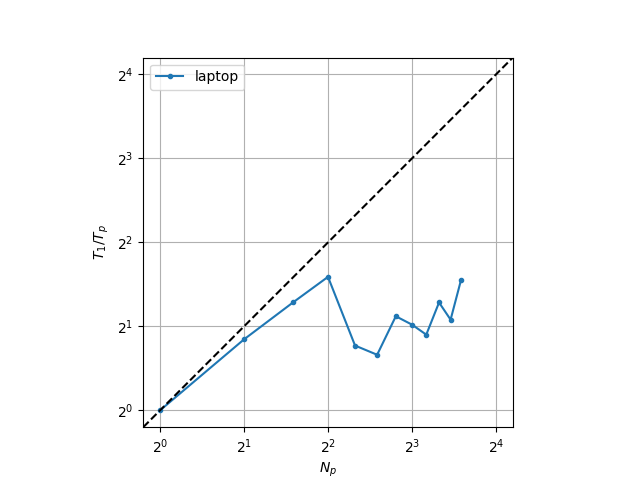
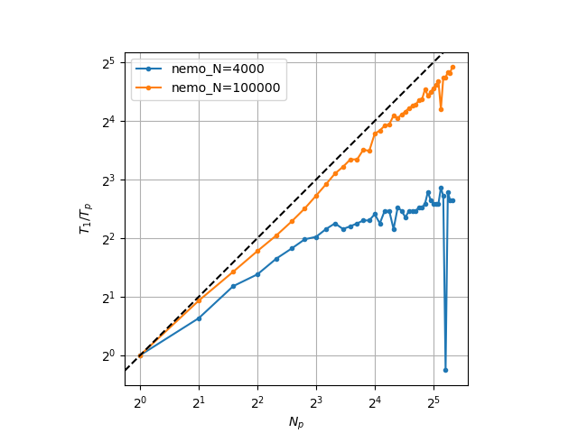
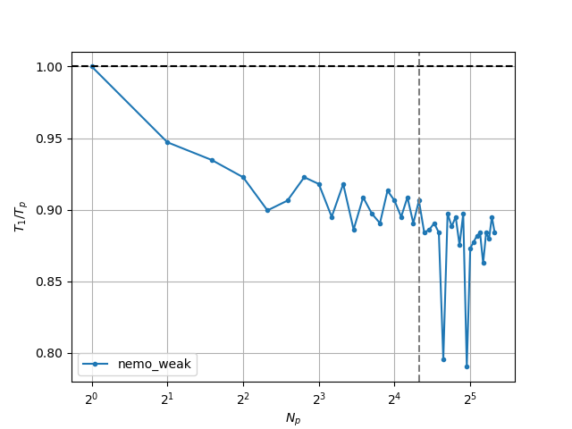
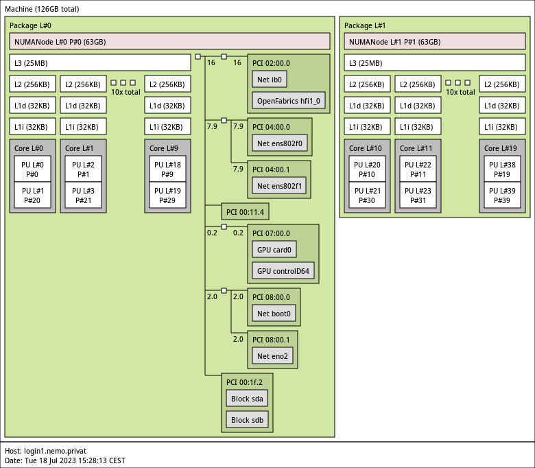

Here are the helper files for this section:

- [CMakeLists.txt](scaling/CMakeLists.txt)
- [wave_mpi.cpp](scaling/wave_mpi.cpp)

# Strong scaling

A typical scaling metric in HPC is *strong scaling*, or the reduction of
time-to-solution (TTS) when the number of processing units is increased, for a
fixed problem size. It is usually plotted as the *speedup* $$T_1 / T_p$$, where
$$ T_1 $$ is the TTS for a single process, and $$ T_p $$ for $$N_p$$ processes,
typically shown in base 2 log-scale. Below is an example of running the wave
program with 40000 points, 8000 time steps, on an i7-1260P laptop processor,
with up to 12 concurrent processes.

Here we can clearly see a fall off after 4 processes: this actually corresponds
to the architecture of the 12th-generation Intel processors, which have both
performance and efficiency cores (for the i7-1260P 4 and 8 respectively). When
running on heterogeneous processing units, the faster cores have to wait for the
slower ones, resulting in a loss of performance. This also shows that OpenMPI is
configured (by default) to use the performance cores first.

These particularities, however, mean that a scaling analysis performed on a
laptop, or a consumer computer, is unreliable: in addition to heterogeneity,
hyperthreading, shared cache, OS overhead, other processes can affect
performance measurement, particularily of multi-threaded applications. One needs
to use a dedicated supercomputer where these factors are mitigated. Here, we
show simulations on the Nemo supercomputer with up to 40 processes, 8000 time
steps, one with 100000 points and one with 4000 points (total).

One can notice a significant scaling difference with the size of the problem,
despite running the exact same code. The reason is that the finite difference
computation of the second order space derivative is not an embarassingly parallel
computation: communication, or data exchange, needs to occur between processes.
When a problem is large, communications take a negligeable time compared to
local computations, but a smaller problem, or more processors, means more
communications compared to local computations.

*Note:* in contrast, the Velocity-Verlet (despite also being a central finite
difference scheme) is embarassingly parallel: no communication needs to occur to
update the particle positions and velocities once the acceleration is known.

# Weak scaling

Strong scaling always suffers from the gradually increased cost of
communications, which is why in scientific computing it is also recommended to
look at *weak scaling*, or the time-to-solution evolution with a fixed workload
*per process*. This is easy to setup for $$O(N)$$ algorithms, since the workload
varies linearly with the problem size. For non-linear algorithms, an expected,
ideal, weak scaling curve can be derived. Our wave problem has $$O(N)$$ scaling.
Below is the curve for a workload of 10000 points per processor.

We can see our code hovering around 90% efficiency. One should aim to be as
close to the ideal scaling curve (in our case a flat line at 100% efficiency) as
possible.

# Hardware topology

Knowing what kind of hardware your code is running on can be valuable
information. On Linux, the `lscpu`, `lspci`, `lsmem`, `lsusb` and `lsblk`, `ip
address` are extremely useful to probe the hardware, respectively the CPU,
PCI(e) devices, RAM, USB devices, disks (block devices), and network interfaces.
To go further, the package `hwloc` can help show a digestable diagram of
computing resources. Here is for example Nemo's hardware topology for a single
node (the login node) extracted with the `lstopo` command:

