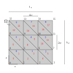
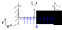

<h2 class='chapterHead'>Übungsblatt 4 Finite-Elemente in der Mechanik</h2>

<!-- l. 12 -->
Anmerkung: Die Abgabe von Arbeitsblatt 1 bis 4 ist verpflichtend und
konstituiert die Studienleistung der Veranstaltung Simulationstechniken.
Die Arbeitsblätter führen von der mathematischen Formulierung eines
Modellproblems hin zur numerischen Lösung dieses Problems und bauen
aufeinander auf. Zum Bestehen der Veranstaltung müssen auf jedem Blatt
mindestens 50% der erzielbaren Punkte erreicht werden.

<!-- l. 20 -->
 Geben Sie bei allen Aufgaben die Lösungswege und Zwischenergebnisse mit
an. Das Endergebnis alleine ist nicht ausreichend! Wir empfehlen Ihnen die
Nutzung von Python und Jupyter-Notebooks. Sollten Sie ein Jupyter-Notebook
verwenden, dann können Sie dieses einfach direkt als Lösung bei uns einreichen.
In allen anderen Fällen erzeugen Sie bitte ein PDF und legen die numerischen
Codes als separate Datei dazu.

<!-- l. 27 -->
 Sie werden durch die einzelnen Schritte der Modellimplementierung geleitet,
und wir geben Hinweise zur Implementierung. Es ist nicht zwingend notwendig,
diese 1-zu-1 zu verfolgen. Im Rahmen dieser Hinweise finden Sie Codeabschnitte,
die Sie verwenden können. Sie dürfen natürlich auch die Codebeispiele aus
dem Vorlesungsmaterial hier verwenden. 

<h3 class='sectionHead'>4.1  Herleitung der diskretisierten Gleichungen</h3>
<!-- l. 37 -->
In diesem Übungsblatt wollen wir das Verschiebungsfeld \(\vec {u}(\vec r)\) eines zweidimensionalen
Blocks im elastostatischen Gleichgewicht untersuchen, d.h. für die mechanische
Spannung \(\t {\sigma }\) gilt: \begin {equation} \nabla \cdot \t {\sigma } = \v {0} \label {eq:elastostaticeq_tensor} \end {equation}
bzw. unter Verwendung der Einsteinschen Summenkonvention und \(\partial _i\equiv \partial /\partial r_i\): \begin {equation} \partial _i \sigma _{ij} = 0 \label {eq:elastostaticeq_index} \end {equation}

<!-- l. 48 -->
Anmerkung: Beschränken Sie sich bitte der Einfachheit halber auf Systeme,
für die gilt: 

<ul class='itemize1'>
<li class='itemize'>Die Eigenspannung bzw. die Eigendehnung ist null.
</li>
<li class='itemize'>Das Materialverhalten ist isotrop und linear elastisch, d.h. es gilt:

\begin {equation} \sigma _{ij} = \lambda \delta _{ij} \varepsilon _{kk} + 2\mu \varepsilon _{ij} \label {eq:Hooke} \end {equation}
mit \(\t {\varepsilon } = \left [\nabla \vec u + (\nabla \vec u)^T \right ] / 2\) der Dehnung und \(\lambda \) und \(\mu \) den Lamé-Konstanten.
</li>
<li class='itemize'>Die Lamé-Konstanten sind konstant über das gesamte Simulationsgebiet.
</li>
<li class='itemize'>Das Simulationsgebiet besteht aus einem Rechteck.</li></ul>

<!-- l. 63 -->

<h4 class='subsectionHead'>4.1.1  Diskretisierung mithilfe der Methode der finiten Element</h4>
<!-- l. 64 -->
5 Punkte Wir wollen hier die Differenzialgleichung für das Verschiebungsfeld \(\vec {u}(\vec r)\) mit der
Finite-Elemente-Methode approximieren. Benutzen Sie dabei lineare finite
Elemente auf einem strukturierten Gitter mit rechteckigen Dreiecken, genau wie
auf Übungsblatt 3. Abb. <a href='#x1-3001r1'>4.1<!-- tex4ht:ref: fig:discretization --></a> zeigt z.B. ein Gitter mit jeweils vier Knoten in x-
und y-Richtung.

<!-- l. 68 -->
 Leiten Sie das Gleichungssystem für die Koeffizienten des diskretisierten
Verschiebungsfeldes her, und definieren Sie die Elementmatrix. Vernachlässigen
Sie dabei zunächst die Randbedingungen.

<figure class='figure'>

<!-- l. 73 -->
 

<figcaption class='caption'>Abbildung 4.1: Diskretisierung für jeweils vier Gitterpunkte in x- und
y-Richtung </figcaption><!-- tex4ht:label?: x1-3001r4.1 -->

</figure>
<h4 class='subsectionHead'>4.1.2  Randbedingungen</h4>
<!-- l. 184 -->
4 Punkte Wir wollen in diesem Übungsblatt drei verschiedene Lastfälle betrachten:

<ol class='enumerate1'>
<li class='enumerate' id='x1-4002x1'>Wie in Abb. <a href='#x1-4007r2'>4.2<!-- tex4ht:ref: fig:tensile_1D_displ --></a> dargestellt ist links eine feste Einspannung (die
Verschiebung dort muss also null sein) und rechts eine vorgegebene
Verschiebung \(\v {u}=(u_0, 0)^T\). Die Oberflächen unten und oben sind spannungsfrei,
d.h. für die Flächenlast gilt: \(\v {t} = \v {0}\).
</li>
<li class='enumerate' id='x1-4004x2'>Wie in Abb. <a href='#x1-4009r3'>4.3<!-- tex4ht:ref: fig:tensile_1D_trac --></a> dargestellt, ist links eine feste Einspannung und rechts
eine vorgegebene Flächenlast \(\v {t}=(t_0, 0)^T\). Die Oberflächen unten und oben sind
spannungsfrei.
</li>
<li class='enumerate' id='x1-4006x3'>Wie in Abb. <a href='#x1-4011r4'>4.4<!-- tex4ht:ref: fig:pressure_sensor --></a> dargestellt, sind links und rechts feste Einspannungen.
Von unten wird das System durch eine vorgegebene Flächenlast \(\v {t}=(0, p)^T\)
belastet. Die Oberfläche oben ist spannungsfrei.</li></ol>
<figure class='figure'>

<!-- l. 194 -->
 

<figcaption class='caption'>Abbildung 4.2: Zugversuch mit vorgegebener Verschiebung </figcaption><!-- tex4ht:label?: x1-4007r4.1 -->

</figure>
<figure class='figure'>

<!-- l. 201 -->
 

<figcaption class='caption'>Abbildung 4.3: Zugversuch mit vorgegebener Flächenlast </figcaption><!-- tex4ht:label?: x1-4009r4.1 -->

</figure>
<figure class='figure'>

<!-- l. 208 -->
 

<figcaption class='caption'>Abbildung 4.4: Modellierung des Drucksensors </figcaption><!-- tex4ht:label?: x1-4011r4.1 -->

</figure>
<!-- l. 213 -->
 Erläutern Sie, wie Sie das Gleichungssystem aus Aufgabe 1.1 verändern
müssen, um die Randbedingungen in diesen drei Fällen zu berücksichtigen?

<h3 class='sectionHead'>4.2  Implementierung</h3>
<!-- l. 251 -->

<h4 class='subsectionHead'>4.2.1  Implementierung der Systemmatrix</h4>
<!-- l. 252 -->
1 Punkte Nutzen Sie Ihre Ergebnisse aus Aufgabe 4.1.1 um eine Funktion zu implementieren,
die die Systemmatrix und den Lastvektor unter Vernachlässigung der
Randbedingung aufstellt. Wir schlagen dafür folgende Funktionen vor:

<!-- l. 255 -->

1def derivative_matrix(dx, dy):  
2    """  
3    Compute matrix of shape function derivatives  
4  
5    Parameters  
6    ----------  
7    dx : float  
8        Grid spacing in x-direction  
9    dy : float  
10        Grid spacing in y-direction  
11    """

<!-- l. 269 -->

1def assemble_system_matrix(lame1, lame2, nb_rectangles, lengths):  
2    """  
3    Assemble system matrix from the matrix of shape function  
4    derivatives.  
5  
6    Parameters  
7    ----------  
8    lame1 : float  
9        First Lame constant (constant over domain)  
10    lame2 : float  
11        Second Lame constant (constant over domain)  
12    nb_rectangles : tuple of ints  
13        Number of rectangles in the discretized domain in the     Cartesian directions  
14    lengths : tuple of float  
15        Physical lengths of the simulation cell  
16  
17    Returns  
18    -------  
19    system_matrix_gg : numpy.ndarray  
20        System matrix  
21    load_vector_g: numpy.ndarray  
22        Load vector.  
23    """

<!-- l. 295 -->
Anmerkung: 

<ul class='itemize1'>
<li class='itemize'>Die Beziehung zwischen dem Index für die Elementnummer, dem
Index für die lokale Knotennummer und dem Index für die
globale Knotennummer haben Sie in Übungbsblatt 3 schon in der
Funktion make_grid implementiert. Sie können diese Funktion gerne
wiederverwenden.
</li>
<li class='itemize'>Der Unterschied zum Übungsblatt 3 besteht in einem weiteren Index:
Einem Index für die Raumrichtung der Verschiebung. Machen Sie sich
klar, was das für den globalen Index bedeutet.</li></ul>

<!-- l. 310 -->

<h4 class='subsectionHead'>4.2.2  Implementierung der Randbedingungen</h4>
<!-- l. 311 -->
1 Punkte Nutzen Sie Ihre Ergebnisse aus Aufgabe 4.1.2 um vier Funktionen zu
implementieren, die die Systemmatrix und den Lastvektor so verändern, dass die
Randbedingungen berücksichtigt werden: Eine Funktion für die eine feste
Einspannung links (d.h. eine vorgegebene Verschiebung von \(0\) m), eine Funktion
für eine vorgegebene Verschiebung rechts, eine Funktion für eine vorgegebene
Flächenlast rechts und eine Funktion für eine vorgegebene Flächenlast
unten.

<!-- l. 321 -->

<h4 class='subsectionHead'>4.2.3  Darstellung der Ergebnisse</h4>
<!-- l. 322 -->
0 Punkte Für die Darstellung Ihrer Ergebnisse können Sie folgende Funktion verwenden:

<!-- l. 324 -->

1def plot_tri(nb_grid_pts, x_g=None, y_g=None, values_g=None,  
2             values_e=None, mesh_style=None, ax=None):  
3    """  
4    Plot results of a finite-element calculation on a  
5    two-dimensional structured grid using matplotlib.  
6  
7    Parameters  
8    ----------  
9    nb_grid_pts : tuple of ints  
10        Number of nodes in the Cartesian directions  
11    x_g : array_like  
12        x-positions of the nodes  
13    y_g : array_like  
14        y-positions of the nodes  
15    values_g : array_like  
16        Expansion coefficients (values of the field) on the  
17        global nodes  
18    values_e : array_like  
19        Values on elements  
20    mesh_style : str, optional  
21        Will show the underlying finite-element mesh with  
22        the given style if set, e.g. ’ko-’ to see edges  
23        and mark nodes by points  
24        (Default: None)  
25    ax : matplotlib.Axes, optional  
26        Axes object for plotting  
27        (Default: None)  
28  
29    Returns  
30    -------  
31    trim : matplotlib.collections.Trimesh  
32        Result of tripcolor  
33    """  
34  
35    Nx, Ny = nb_grid_pts  
36  
37    # These are the node positions on the full global grid.  
38    if x_g is None and y_g is None:  
39        y_g, x_g = np.mgrid[:Ny, :Nx]  
40        x_g.shape = (-1,)  
41        y_g.shape = (-1,)  
42    elif not (x_g is not None and y_g is not None):  
43        raise ValueError(’You need to specify both, x_g and y_g.’)  
44  
45    # Gouraud shading linearly interpolates the color between  
46    # the nodes  
47    if ax is None:  
48        ax = plt  
49    triangulation = matplotlib.tri.Triangulation(  
50        x_g, y_g, make_grid(nb_grid_pts))  
51    if values_e is not None:  
52        c = ax.tripcolor(triangulation, facecolors=values_e)  
53    elif values_g is not None:  
54        c = ax.tripcolor(triangulation, values_g,  
55                         shading=’gouraud’)  
56    else:  
57        c = ax.tripcolor(triangulation, np.zeros_like(x_g),  
58                         shading=’gouraud’)  
59    if mesh_style is not None:  
60        ax.triplot(triangulation, mesh_style)  
61    return c

<!-- l. 388 -->

<h3 class='sectionHead'>4.3  Modellvalidierung</h3>
<!-- l. 390 -->
In dieser Aufgabe wollen wir die Implementierung aus Aufgabe 4.2 überprüfen.

<!-- l. 392 -->

<h4 class='subsectionHead'>4.3.1  1D - Zugversuch mit vorgegebener Verschiebung</h4>
<!-- l. 393 -->
5 Punkte Als erstes wollen wir unser System unter Zug anschauen, wie in Abb. <a href='#x1-4007r2'>4.2<!-- tex4ht:ref: fig:tensile_1D_displ --></a>)
dargestellt. Für \(\lambda =0\)MPa vereinfacht sich das Problem zu einem eindimensionalen
Problem: \begin {equation} \partial _x \sigma _{xx} = \partial _x \left ( 2\mu \varepsilon _{xx}\right ) = 0 \label {eq:1D_tensile} \end {equation}

<!-- l. 400 -->
 Berechnen Sie die analytische Lösung und erstellen Sie einen Plot, der zeigt,
dass diese mit der Lösung Ihres Modells übereinstimmt.

<!-- l. 402 -->
 Verwenden Sie für die numerischen Berechnungen folgende Parameter:

<ul class='itemize1'>
<li class='itemize'>\(L_x \times L _y = 50\)cm \(\times 10\) cm
</li>
<li class='itemize'>\(\mu = 77\) GPa
</li>
<li class='itemize'>\(u_0 = 3\) mm
</li>
<li class='itemize'>\(10 \times 5\) Gitterpunkte in x- und y-Richtung</li></ul>
<!-- l. 427 -->

<h4 class='subsectionHead'>4.3.2  Zugversuch mit vorgegebener Verschiebung</h4>
<!-- l. 428 -->
4 Punkte 

<!-- l. 430 -->
 Zeigen Sie, dass für \(\lambda = 115\)GPa \(u_y \neq 0\) und dass das Problem nicht mehr eindimensional
ist. Plotten Sie dafür \(u_y(x, y)\). Zeigen Sie außerdem, dass die analytische Lösung aus
Aufgabe 3.1 trotzdem eine gute Näherung für die Verschiebung in x-Richtung
darstellt.

<!-- l. 443 -->

<h4 class='subsectionHead'>4.3.3  1D - Zugversuch mit vorgegebener Flächenlast</h4>
<!-- l. 444 -->
2 Punkte Um die Implementierung der Neumann - Randbedingungen zu testen wollen wir
den 1D-Zugversuch (d.h. \(\lambda = 0\)MPa) jetzt mit einer vorgegebenen Flächenlast rechts
berechnen (vgl. Abb. <a href='#x1-4009r3'>4.3<!-- tex4ht:ref: fig:tensile_1D_trac --></a>). Zeigen Sie, dass für \(\v {t}_{rechts}(y) = \left ( 2\mu u_0 / L_x, 0 \right )^T\) und den Parametern
aus Aufgabe 3.1 die Verschiebung mit der Verschiebung aus Aufgabe 3.1
übereinstimmt.

<!-- l. 455 -->

<h3 class='sectionHead'>4.4  Drucksensor</h3>
<!-- l. 457 -->
Als Anwendungsfall wollen wir einen Drucksensor betrachten. Dieser besteht aus
einer Membran, die an beiden Enden fest eingespannt ist und sich unter
Druckbelastung durchbiegt. Die Durchbiegung wird gemessen und erlaubt den
direkten Rückschluss auf die Belastung, d.h. den Druck.

<!-- l. 459 -->

<h4 class='subsectionHead'>4.4.1  Modellierung</h4>
<!-- l. 460 -->
1 Punkte Wir wollen den Drucksensor folgendermaßen modellieren (vgl. Abb. <a href='#x1-4011r4'>4.4<!-- tex4ht:ref: fig:pressure_sensor --></a>): Das
Simulationsgebiet besteht aus einem perfekten Rechteck. Das Material
ist im ganzen Gebiet konstant und folgt dem Hookeschen Gesetz. Als
Randbedingung verwenden wir eine feste Einspannung links und rechts,
eine spannungsfreie Oberfläche oben und eine konstante Flächenlast
unten.

<!-- l. 463 -->
 In dieser Modellierung stecken mehrere vereinfachende Annahmen. Zählen Sie
mindestens zwei davon auf.

<!-- l. 483 -->

<h4 class='subsectionHead'>4.4.2  Vergleich mit der Biegebalken-Differentialgleichung</h4>

<!-- l. 484 -->
6 Punkte Die Euler-Bernoulli-Gleichung \begin {equation} \frac {\dif ^2}{\dif x^2}\left ( EI(x) \frac {\dif ^2 w}{\dif x^2} \right ) = q(x) \end {equation}
beschreibt die Durchbiegung \(w\) eines Balkens. Dabei ist \(E\) das Elastizitätsmodul, \(I\)
das Flächenträgheitsmoment und \(q\) die Belastung in y-Richtung. Lösen Sie
diese Gleichung analytisch und vergleichen Sie die Lösung mit Ihrer numerischen
Lösung für verschiedene Längen \(L_x\).

<!-- l. 491 -->
 Verwenden Sie für die Simulation folgende Parameter: 

<ul class='itemize1'>
<li class='itemize'>\(L_x=50\)mm; \(75\)mm; \(100\)mm; \(125\)mm und \(150\)mm
</li>
<li class='itemize'>\(L_y = 10\)mm
</li>
<li class='itemize'>\(\mu = 77\)GPa und \(\lambda = 115\)GPa
</li>
<li class='itemize'>\(p=82.5\)MPa
</li>
<li class='itemize'>\(101\) x \(11\) Gitterpunkte in x- und y-Richtung</li></ul>

<!-- l. 500 -->
Anmerkung: 

<ul class='itemize1'>
<li class='itemize'>Das Elastizitätsmodul \(E\) und die Lamé-Konstanten sind durch
folgende Gleichung miteinander verknüpft: \(E = \mu (3\lambda + 2\mu ) / (\lambda + \mu )\)
</li>
<li class='itemize'>Sie können von einem rechteckigen Querschnitt ausgehen. In diesem
Fall ist das Flächenträgheitsmoment gegeben durch \(I = L_y^3 L_z / 12\) Verwenden Sie
\(L_z=10\)mm.

</li>
<li class='itemize'>Beachten Sie, dass der Druck \(p\) einer Kraft pro Fläche entspricht,
während die Belastung in der Euler-Bernoulli-Gleichung \(q\) einer Kraft
pro Länge entsprechen muss.
</li>
<li class='itemize'>Eine feste Einspannung bedeutet neben einer Durchbiegung von null
auch, dass die Ableitung der Durchbiegung null sein muss.</li></ul>

<!-- l. 529 -->

<h3 class='sectionHead'>4.5  Dünnbesetzte Algorithmik</h3>
<!-- l. 530 -->
0 Punkte Schreiben Sie Ihre Funktion so um, dass sie dünnbesetzte Arithmetik aus dem
Paket <a href='https://docs.scipy.org/doc/scipy/reference/sparse.html'>scipy.sparse</a> nutzt. Dies reduziert die Komplexität der Lösung eines
linearen Gleichungssystem von \(\mathcal {O}(N^2)\) auf \(\mathcal {O}(N)\). D.h. wenn Sie Ihre Gitterpunkte
verdoppeln, sollte der Code dann nur doppelt (und nicht viermal) so langsam
laufen.

<!-- l. 533 -->
Anmerkung: Nutzen Sie das “compressed sparse row (CSR)” Format
scipy.sparse.csr_matrix. Für die Lösung linearer Gleichungssysteme
müssen Sie dann <a href='https://docs.scipy.org/doc/scipy/reference/generated/scipy.sparse.linalg.spsolve.html'>scipy.sparse.linalg.spsolve</a> nutzen. 

<!-- l. 537 -->

<h4 class='likesubsectionHead'>Punkte</h4>
<!-- l. 537 -->
Sie können auf diesem Übungsblatt insgesamt 29 Punkte erzielen.

