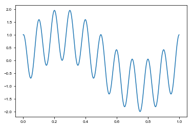
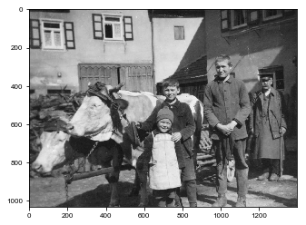

# Tutorial 1: Playing with the Fourier transform

Although we have (likely) not yet discussed details of the Fourier transform in the lecture, we would like to start playing a bit with it to get an intuitive understanding of what it does. The Fourier transform decomposes a function into contributions from different wavelength. The function is then given by the sum of sine and cosine contributions. When we talk about Fourier transform in the context of these exercise sheet, we mean the _discrete_ Fourier transform as typically compute using a fast-Fourier transforms (FFT) _algorithm_.

## One-dimensional transforms

We will here look at how the Fourier transform decomposes the signal into individual contributions. We will start with a function that is given by the sum of two sine waves:


```python
%matplotlib inline
import numpy as np
import matplotlib.pyplot as plt
x = np.linspace(0, 1, 1000)
f = np.sin(2*np.pi*x) + np.cos(2*np.pi*10*x)
plt.plot(x, f)
```


    [<matplotlib.lines.Line2D at 0x118d4f198>]


    

    


### Task 1

Check the documentation of the [`numpy.fft`](https://numpy.org/doc/stable/reference/routines.fft.html) module to understand what the FFT computes. Compute the transform of the above function. Note that the Fourier transform yields a complex number that has real and imaginary parts, or equivalently, an amplitude and a phase. Plot only the amplitude or the square of the amplitude of the above function as a function of wavevector. (What is a wavevector? You get hints at this by reading the documentation. Also look at the documentation of the helper function [`numpy.fft.fftfreq`](https://numpy.org/doc/stable/reference/generated/numpy.fft.fftfreq.html).) The square of the amplitude is also called the *power spectrum* of that function. What do you see?

### Task 2

Remove all wavelengths smaller than $0.3$. Compute and plot the _inverse_ transform the function. What do you see and why?

## Two-dimensional transforms

Use `opencv` to load the image `Picture.jpg` provided in this folder. An example on how to use `opencv` to load and display an image follows.

##### Hint:
* You may need to install `opencv` from the commandline using `python3 -m pip install --user opencv-python`.


```python
import cv2
img = cv2.imread('Picture.jpg', 0)
plt.imshow(img, cmap='gray')
```


    <matplotlib.image.AxesImage at 0x12155cc88>


    

    


### Task 1

Plot the _power spectrum_ of the above image. It can be useful to use the function `numpy.fftshift` and/or `numpy.ifftshift` to shift the zero wavevector components to the center of the image.

### Task 2

Successively remove the long wavelength contribution to the image. Compute the inverse FFT and display the image again. What do you see and why?
