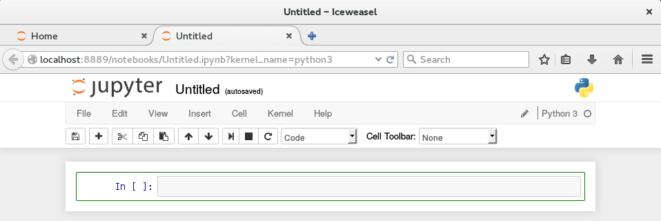

# Unix shell

## Learning goals
- Unix shell use
- Interactive Python notebook

## Unix shell - Introduction to the command line

The shell gives you access to the so-called _command-line interface_ (CLI) of Unix systems and Unix-like systems such as Linux and Mac OS. The CLI can be used to run programs or navigate through the file system. 

The shell can be accessed in terminal clients. There are is typically a variety of clients available on unix systems, they are usually called `Terminal` or similar and can be found in the start menu.

The shell should look something like this:


The first line shows the so-called _command prompt_,
``` shell
junge@cmsquad35:~$
```
It shows that the shell was opened by the user `junge` on the computer named `cmsquad35`. The tilde '`~`' indicates the current location in the filesystem's directory structure and will be explained later.

#### Tasks

Open a shell and type the command `whoami`, followed by the return key. You should see something like

```
pr2015ws_04@cmsquadx2:~> whoami
pr2015ws_04
```
The first line is the prompt followed by the command `whoami` you have typed. The shell has responded by printing your username. 
Do the same for the command `hostname`. What do you see?

#### Discussion
You have used the shell to execute two simple programs which responded by printing text back to the shell. Alteratively, a program could also open a window for a graphical response, write to a file, printer, etc, or not respond in any visible way at all.

### Paths and the Directory Structure

Space in the file system is organised in a structure of nested directories which could look something like this:


Windows users may notice that the top directory (called the root directory) has no drive letter. In fact, it has no name at all. Unix systems have only the one top directory, called the _root directory_. The structure varies from system to system, but typically, the root directory contains directories like `bin`, `lib`, `etc`, where the administators install programs that are used by all users or by the system itself. Regular users like you cannot modify the contents of those directories.

The `home` directory contains the directories where regular users (in this example the users `junge` and `pastewka`) can store and manipulate files or install software for themselves.

Within this structure, the location of every directory or file is given by a _path_ that describes the sequence of directories one needs to traverse in order to reach it, separated by forward-slash characters (`/`). For instance, the path of the file `hertz.pdf` is

```bash
/home/junge/Documents/hertz.pdf
```
where the leading slash indicates that the path begins at the top level (root) directory. However, paths can also begin anywhere else; the path from `Pictures` to `hertz.pdf` is, for instance
```
../Documents/hertz.pdf
```

The leading '`..`' is an abbreviation for the path to the parent of the current directory. The important abbreviations are listed below.

| path start | full path         |
|------------|-------------------|
|`/`         | top level domain  |
|`..`        | parent directory  |
|`.`         | current directory |
|`~`         | home directory    |

Now you can also understand the `~` in the command prompt of the shell.


#### Tasks

+ Find out your current working directory using the program '`pwd`' (<strong>p</strong>rint <strong>w</strong>orking <strong>d</strong>irectory).

+ View the content of you current directory using '`ls`' (<strong>l</strong>i<strong>s</strong>t directory contents) You should see something like this:

```shell
pr2015ws_04@cmsquadx2:~> ls
Desktop  Documents  Downloads  Music  Pictures  Public  Templates  Videos
```

+ So far, we have executed programs by using only their name. However, the behaviour of programs can be customized by specifying one or more so-called _command line arguments_. For instance, the command '`ls`' can also be used to view the content of other directories than the current one. 

    Use the command to view the content of your parent directory with '`ls ..`'. 
    
+ Use what you learned so far to list the dictories contained in the top root directory.

+ Create a directory to store the output of your exercises with the command '`mkdir "Python notebooks"`' (<strong>m</strong>a<strong>k</strong>e<strong>dir</strong>)

+ Change into the new directory using the '`cd`' command (<strong>c</strong>hange <strong>d</strong>irectory). For this, type '`cd K`' and the `Tab` key. Note that the shell completes the command for you. Remember this. Tab-completion is your new best friend.

+ Use what you learned so far to confirm that your new current working directory is in fact `Python notebooks`.

#### Discussion

You have learned the basics of navigating the file system on Unix systems and execute commands with and without command line arguments. If you want to learn more, you are highly encouraged to have a look at the first chapter of [Effective Computation in Physics](https://ebookcentral.proquest.com/lib/ubfreiburg/reader.action?docID=3564547), try [the shell tutorial of the software carpentry](http://swcarpentry.github.io/shell-novice/), or ask us.

## Jupyter Notebook

In the course of this class, you will solve multiple contact mechanics problems numerically using the Python programming language. You will use Jupyter notebooks to learn the basics of Python, run your computations, as well as to document your work.

#### Tasks
+ Launch the '`jupyter-notebook`' program from the `Python notebooks` directory. This should open a web browser on a page that looks like this:


+ Click on `New` and choose `Python 3` from the pull-down menu to create a new notebook.



+ Click on the menu `Help -> User Interface Tour` for an overview of the Jupyter Notebook App user interface.

+ Rename the notebook to "Python Tutorial - &lt;your name&gt;"

Jupyter notebooks consist of a sequence of _cells_. There are different types of cells, but the only two of interest to us are 
+ _code cells_ , where Python code can be written and executed
+ _markdown cells_, which you will use to document your code

The cell in your fresh notebook is a code cell. All new cells are code cells by default. 

Cells can be in one of two modes: edit mode and command mode.

### Edit mode 
Edit mode is indicated by a green cell border and a prompt showing in the editor area:

When a cell is in edit mode, you can type into the cell, like a normal text editor.

### Command mode

Command mode is indicated by a grey cell border:


When you are in command mode, you are able to edit the notebook as a whole, but not type into individual cells. Most importantly, in command mode, the keyboard is mapped to a set of shortcuts that let you perform notebook and cell actions efficiently. For example, if you are in command mode and you press c, you will copy the current cell - no modifier is needed.

#### Tasks
+ Change the cell to a markdown cell and write the following in it: 
```
    # Titles start with a hash sign
    __strongly emphasized words__ are lead and trailed by double underscores
    
    _emphasized words_ by single underscores
```
    Run the cell by using the toolbar or the keyboard shortcut &lt;Shift&gt;-&lt;Enter&gt;. You should see something like
    ># Titles start with a hash sign
    >__strongly emphasized words__ are lead and trailed by double underscores
    >
    >_emphasized words_ by single underscores

    Markdown cells provide a simple, yet powerful formatting syntax for creating rich text. If you want to know more, click on `Help -> Markdown`.

+ In the code cell at the bottom of the notebook, write `print(24)` and run the cell. As you can see, code cells react differently than markdown cells to being run.

+ click on `File -> Save and Checkpoint` to save the notebook.

+ click on `File -> Download as -> PDF via LaTeX (.pdf)`.

#### Discussion

You have learned the basics of Jupyter notebooks. If you wish to know more, we recommend the [Notebook Basics tutorial](http://nbviewer.jupyter.org/github/jupyter/notebook/blob/master/docs/source/examples/Notebook/Notebook%20Basics.ipynb) or [this video on youtube](https://youtu.be/Rc4JQWowG5I). The Jupyter project is hosted at [jupyter.org](http://jupyter.org).

A useful Python environment, which includes Jupyter, is provided by [Anaconda](https://anaconda.org/). Anaconda is available for Windows, Mac OS X and Linux environments.

