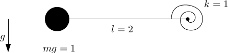
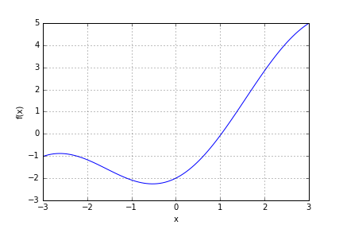

# *scipy*: Optimization and root finding

## Learning goals:
* Solving equations numerically

## SciPy
SciPy is a vast treasure trove of numerical methods for Python, for instance for optimisation ([`scipy.optimize`](http://docs.scipy.org/doc/scipy/reference/optimize.html)), spectral analysis ([`scipy.fftpack`](http://docs.scipy.org/doc/scipy/reference/fftpack.html)), further linear algebra ([`scipy.linalg`](http://docs.scipy.org/doc/scipy/reference/linalg.html)) and much more.

We will use SciPy extensively in the future exercise sessions, but we will not present a systematic overview over its capabilities, because they are too vast. However, the [documentation](http://docs.scipy.org/doc/scipy-0.14.0/reference/index.html) is very good should help you along the way. 

#### Example problem: Solving transcendental equations

Consider a pendulum with an angular spring that pulls the it towards a horizontal position. 



Its equlibrium position is given by the following  transcendental equation ($\varphi$ is the counter clock-wise angle between the pendulum and the horizon)
$$ \varphi = 2\, \cos \varphi$$

While this cannot be solved exactly, it is easily solved approximately using the SciPy optimisation module. First, we express the  equation as a function of which the root is to be computed
$$ f(x) = x-2\, \cos x,$$

and then we use `scipy.optmimize.root` with a suitable initial guess `x0` to find our solution.


```python
import numpy as np
import scipy.optimize as optim
def fun(x):
    return x - 2*np.cos(x)

sol = optim.root(fun, x0 = 0)
print("root of f(x): x =", sol.x)
```

    root of f(x): x = [1.02986653]


This example shows how simply even complicated problems (here the appriximative solution to a non-linear equation) can be solved without writing your own code by leveraging existing ScyPy functions.

#### Tasks
- Read the help for `root` to understand what parameters it takes, and what information can be retrieved from the result
- What happens if you set the initial guess $x_0 = -1.5$. Explain why the solver fails (Hint, look at the plot of the function).
- Have a look at the documentation of `scipy.optimize`. How can you find the minimum of $f(x)$? What minimum do you find exactly?
