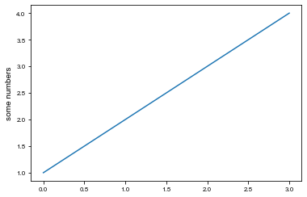
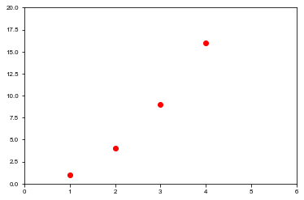
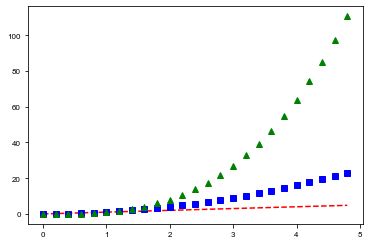

# *matplotlib*: Plotting results

## Learning goals:
* Plotting results

## Plotting results with matplotlib

Matplotlib is a powerful Python module for plotting results. We will be using the `pyplot` submodule of matplotlib extensively. The following is adapted from the official [pyplot tutorial](http://matplotlib.org/users/pyplot_tutorial.html)
Each `pyplot` function makes some change to a figure: e.g., creates a figure, creates a plotting area in a figure, plots some lines in a plotting area, decorates the plot with labels, etc. In `matplotlib.pyplot` various states are preserved across function calls, so that it keeps track of things like the current figure and plotting area, and the plotting functions are directed to the current axes (please note that “axes” here and in most places in the documentation refers to the axes part of a figure and not the strict mathematical term for more than one axis).


```python
%matplotlib inline
import matplotlib.pyplot as plt
plt.plot([1,2,3,4])

plt.ylabel('some numbers');
```


    

    


The first line `%matplotlib inline` is a so-called magic function for the notebook. It tells Jupyter that you wish to have the plots appear _in line_ with the rest of the notebook, and not to open a new window for each plot.

You may be wondering why the x-axis ranges from 0-3 and the y-axis from 1-4. If you provide a single list or array to the [`plot()`](http://matplotlib.org/api/pyplot_api.html#matplotlib.pyplot.plot) command, matplotlib assumes it is a sequence of y values, and automatically generates the x values for you. Since python ranges start with 0, the default x vector has the same length as y but starts with 0. Hence the x data are `[0,1,2,3]`.

[`plot()`](http://matplotlib.org/api/pyplot_api.html#matplotlib.pyplot.plot) is a versatile command, and will take an arbitrary number of arguments. For example, to plot x versus y, you can issue the command:

```python
plt.plot([1, 2, 3, 4], [1, 4, 9, 16])
```

For every x, y pair of arguments, there is an optional third argument which is the format string that indicates the color and line type of the plot. The letters and symbols of the format string are from MATLAB, and you concatenate a color string with a line style string. The default format string is ‘b-‘, which is a solid blue line. For example, to plot the above with red circles, you would issue


```python
plt.plot([1,2,3,4], [1,4,9,16], 'ro')
plt.axis([0, 6, 0, 20]);
```


    

    


See the `plot()` documentation for a complete list of line styles and format strings. The [`axis()`](http://matplotlib.org/api/pyplot_api.html#matplotlib.pyplot.axis) command in the example above takes a list of [xmin, xmax, ymin, ymax] and specifies the viewport of the axes.

If matplotlib were limited to working with lists, it would be fairly useless for numeric processing. Generally, you will use numpy arrays. In fact, all sequences are converted to numpy arrays internally. The example below illustrates a plotting several lines with different format styles in one command using arrays.


```python
import numpy as np

# evenly sampled time at 200ms intervals
t = np.arange(0., 5., 0.2)

# red dashes, blue squares and green triangles
plt.plot(t, t, 'r--', t, t**2, 'bs', t, t**3, 'g^');
```


    

    


Plots can easily be stored to a file using the `savefig` command. For rasterized graphics (e.g. [PNG](https://en.wikipedia.org/wiki/Portable_Network_Graphics)), you can use the `dpi` option to specify the output resolution. Note that the `savefig` command must be in the same cell as the `plot` command (if you use Jupyter).


```python
plt.plot(t, t, 'r--', t, t**2, 'bs', t, t**3, 'g^')
plt.savefig('myplot.pdf')
plt.savefig('myplot.png', dpi=300)
```


    

    


#### Tasks
- Have a look at the [matplotlib example gallery](http://matplotlib.org/gallery.html) to get a feeling for the capabilities of matplotlib.
- Choose an example with 
    1. labelled axes
    2. a legend.
    
    Read the source to understand how to they do it.
- Use SciPy to find the root of the function
    $$f(x) = x+\exp x + \frac{10}{1+x^2} - 5$$
    use matplotlib to find a good initial guess.
    What happens if you take a bad initial guess, say $x_0 = 1.5$? Why?
- A traction experiment on steel has yielded the following stress-strain data points in the linear regime:
    ```python
    stress = [4.99762687e+10, 5.00334074e+10,  5.00859578e+10,
              5.01265455e+10, 5.01975239e+10,  5.02073815e+10,
              5.02568815e+10, 5.02578512e+10,  5.03382411e+10,
              5.03809123e+10, 5.04067895e+10]
    strain = [0.    , 0.0002, 0.0004, 0.0006,
              0.0008, 0.001 , 0.0012, 0.0014,
              0.0016, 0.0018, 0.002 ]
    ```
    Compute the best linear fit to estimate the Young's Modulus using what you learned about `np.linalg`. (Hint: if you forgot how to calculate linear fits, [wikipedia](https://en.wikipedia.org/wiki/Linear_least_squares_%28mathematics%29#Derivation_directly_in_terms_of_matrices) can be your friend.) Visualise the result using matplotlib in a graph with labelled axes and a legend.
- Read about `np.polyfit` in the NumPy doc and use it to calculate the Young's modulus of the steel is a more compact way. 

